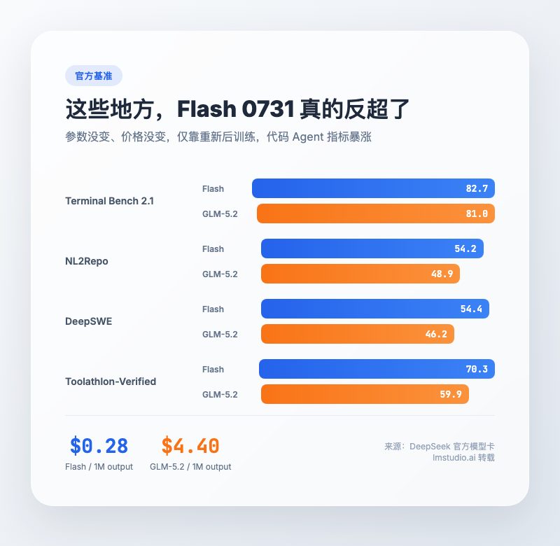
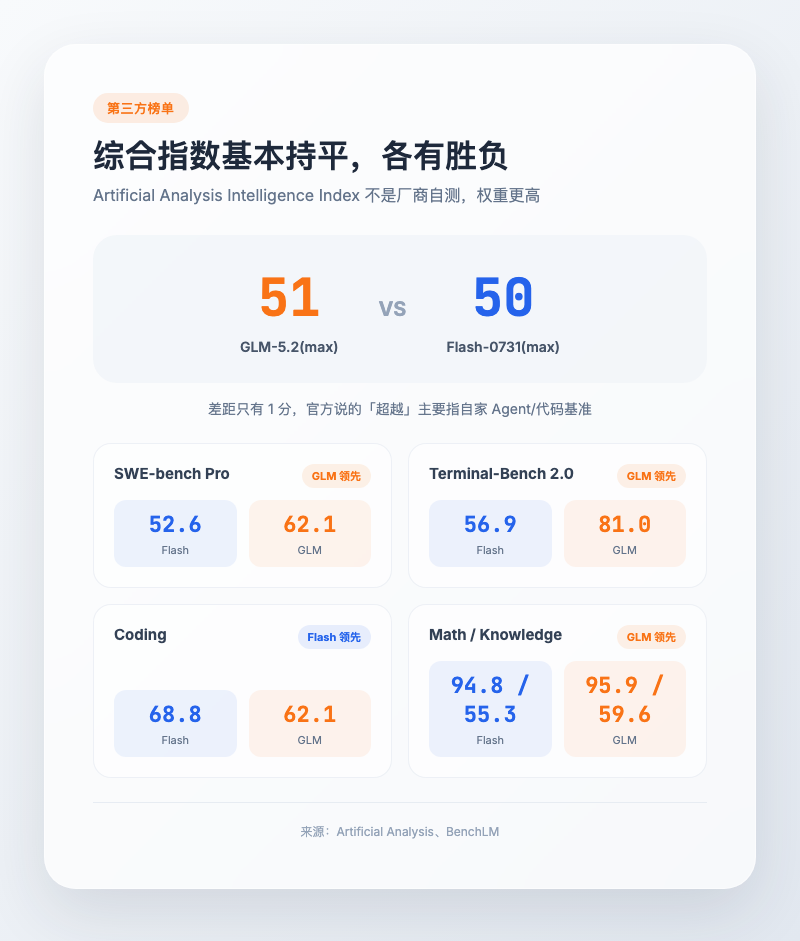
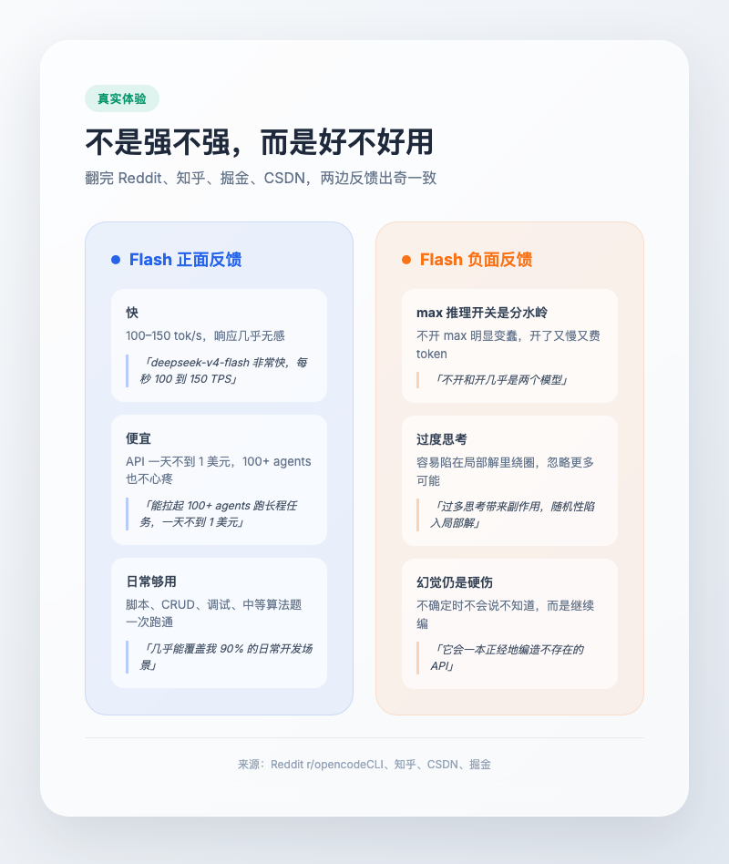
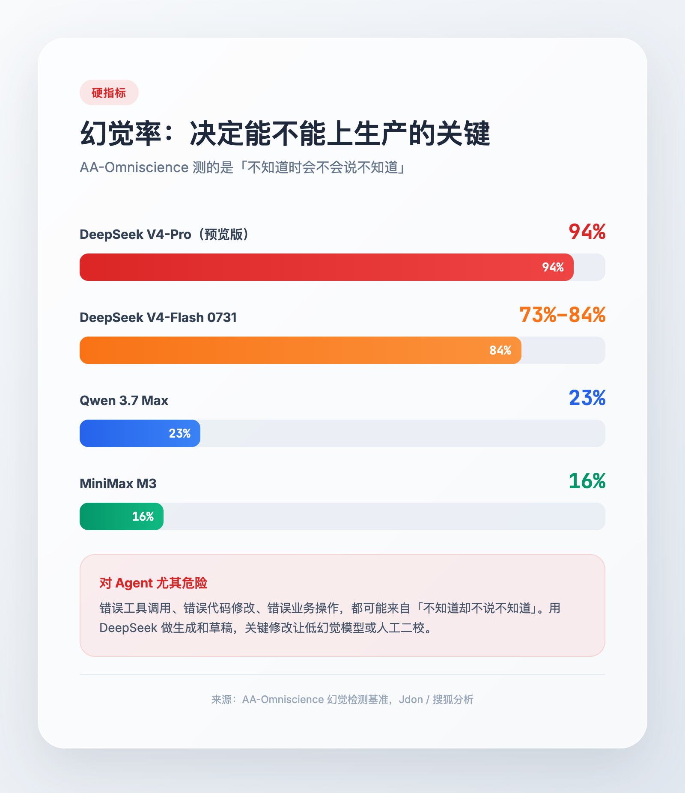
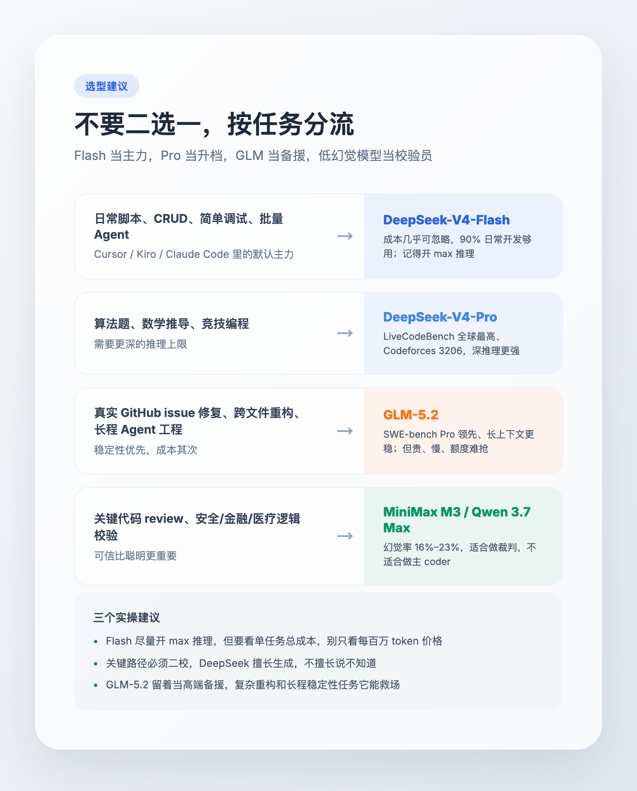

# DeepSeek-V4-Flash 真超 GLM-5.2 了？便宜是真的，幻觉也是真的

> 7 月 31 日 DeepSeek 扔出 V4-Flash 正式版，没改架构、没加参数，仅靠重新后训练就让 Terminal Bench、DeepSWE 这些代码 Agent 指标暴涨。网友瞬间嗨了，「超越 GLM-5.2」「逼近 Opus 4.8」「价格只有零头」。但我翻完官方数据、第三方榜单和一圈实测反馈后，只有一个感受，跑分是跑分，账单是账单，幻觉是幻觉。三者不是一回事。

---

## 一句话总结

DeepSeek-V4-Flash-0731 是「便宜大碗的 90% 场景主力」，GLM-5.2 是「长程工程任务的高端备援」。

**便宜是真的，部分反超是真的，全面超过是假的。** 真正决定你切不切过去的，不是榜单分数，而是你的任务会不会撞上那两个硬伤，**复杂工程稳定性不够，以及幻觉率偏高。**

---

## 一、先看官方数据，哪些地方真超过了

7 月 31 日这个版本有意思在哪？它没在模型架构上动刀。总参数还是 284B，激活参数还是 13B，上下文还是 1M tokens，价格也没涨。DeepSeek 自己说，只是做了「重新后训练」。

结果 Terminal Bench 2.1 从预览版的 61.8 直接跳到 **82.7**，超过 GLM-5.2 的 81.0。最离谱的是 DeepSWE，从 7.3 直接跳到 **54.4**。Toolathlon-Verified 也从 49.7 跳到 **70.3**。这几个都是代码 Agent 和终端工具调用类的基准，说明 Flash 在「模型被当成 coding agent 使唤」这条路上，突然开窍了。

更刺激的是价格。Flash 输入 $0.14/M tokens，缓存命中只要 $0.0028/M，输出 $0.28/M。GLM-5.2 这边，输入约 $1.40/M，输出约 $4.40/M。输入端 Flash 约是 GLM 的 **1/10**，输出端约是 **1/15**。

这种价格差放到真实开发里，体感会非常明显。CSDN 上有开发者说，充了 30 块钱测试，按每天写大量代码、频繁对话调试的用量，Flash 用了快两天还剩余额。Reddit 上也有人反馈，能无压力拉起上百个 agent 跑长程任务，一天 API 费用不到 1 美元。这些说法不一定能精确复刻，但方向是对的，Flash 的成本已经低到可以「随便用」。

> 来源，DeepSeek 官方模型卡，[lmstudio.ai 转载页](https://lmstudio.ai/models/deepseek-v4-flash)，[CSDN 实测](https://deepseek.csdn.net/69fa8d9654b52172bc71f5d5.html)

到这里，故事很完美。价格低一个数量级，代码 Agent 跑分还反超。如果不是我接着往下翻第三方榜单，我可能已经去改默认模型了。

---

## 二、第三方榜单，差距没有官方说的那么大

第一个让我冷静下来的数字来自 [Artificial Analysis Intelligence Index](https://artificialanalysis.ai/models/comparisons/glm-5-2-vs-deepseek-v4-flash)。这是一个独立第三方综合指数，不是厂商自测。

- GLM-5.2(max)，**51**
- DeepSeek-V4-Flash-0731(max)，**50**

基本打平，GLM 还略高 1 分。也就是说，如果只看综合智商，Flash 并没有「超越」。官方说的超越，更多是指在 DeepSeek 自己押注的那几个 Agent/代码基准上。

再看 [BenchLM 的分项对比](https://benchlm.ai/compare/deepseek-v4-flash-max-vs-glm-5-2)。这里的数字不是同一套考试分数，而是不同基准汇总后的方向性评分，只能参考趋势。

Flash-Max 在 Coding 类别平均上给出 68.8，GLM-5.2 是 62.1（但两者覆盖的具体 Coding 基准不同）。SWE-bench Verified 也有 79.0。但 GLM-5.2 在 Knowledge、Math、SWE-bench Pro、Terminal-Bench 2.0 上仍然领先。尤其是 SWE-bench Pro，GLM 62.1 对 Flash 52.6，差距接近 10 个百分点。

SWE-bench Pro 是什么？你可以把它理解为「真实 GitHub issue 修复」的高难度版本。它不像 Terminal Bench 那样考你调用工具写脚本，而是给你一个真实项目里的 bug 报告，让模型自己定位、修改、验证。这块 GLM-5.2 仍然是更强的那个。

[CodingFleet 的对比](https://codingfleet.com/blog/glm-5-2-vs-deepseek-v4-pro) 还提到，GLM-5.2 在 MCP Atlas 这种长程工程任务上也领先 V4-Pro，更不用说 Flash。所以结论是，日常开发和工具调用，Flash 已经够猛。但任务一旦变成跨文件重构，或者跟着一个 bug 死磕两小时，GLM-5.2 那种稳劲就显出来了。

这就好像一个短跑运动员突然练出了很好的折返跑成绩，但你不能因此说他能赢马拉松。

---

## 三、真实体验，不是强不强，而是好不好用

跑分之外，我更关心真实使用体验。我把 Reddit、知乎、掘金、CSDN 上关于 Flash 和 GLM-5.2 的反馈翻了一遍，发现两边用户的描述出奇一致。

**用 Flash 的人怎么说？**

提到最多的词是快、便宜、够用。Reddit 上有人测到 100 到 150 tokens/秒，说「便宜、疯狂快、而且好」。博主 @zhayujie 跑过一条完整链路，从拆解需求、调研场景、沉淀文档、生成 PPT 到更新知识库，一次跑通，35 次工具调用都很克制。跨 session 记忆也能用两次工具调用就把细节捞出来。

**但负面反馈同样集中。**

最被吐槽的是「max 推理档」这个开关。知乎上有用户说，max 档思考很长，做推理题擅长，但实际 coding 的感受并不稳定。更关键的是，不开 max 和开 max，几乎是两个模型。复杂任务不开 max 会明显变蠢，开了 max 又慢又费 token。

另一个常见问题是「用力过猛」。V4 系列在思维链里原本已经正确提取了信息，后续处理却会失真。max 档还容易过度思考，陷在局部解里绕圈，忽略更多可能性。

最严重的第三个问题，是幻觉。下一节专门说。

**用 GLM-5.2 的人怎么说？**

掘金一位开发者说，GLM-5.2 是他最近用下来最意外的国产模型，复杂任务里的稳定性印象最深。问题也很现实，限流、倍数、额度消耗，非官方渠道或自定义工具链接入时还有定向拦截。还有用户提到，同样一组复杂问题，GLM-5.2 跑了 100 分钟才出结果。

所以 GLM-5.2 不是完美的，它贵、慢、额度难抢。但在需要跟下去的长程工程任务里，它的确更稳。稳的代价是时间。

> 来源，[Reddit r/opencodeCLI](https://www.reddit.com/r/opencodeCLI/comments/1svmgla)，[知乎评论区](https://zhuanlan.zhihu.com/p/2031159463193920999)，[掘金实测](https://juejin.cn/post/7653847759125987368)

---

## 四、幻觉率，决定能不能上生产的硬指标

前面说的两个硬伤，第一个是复杂工程稳定性，第二个就是幻觉。

DeepSeek V4 系列的幻觉率，数字有点触目惊心。AA-Omniscience 这个幻觉检测基准上，V4-Pro 预览版达到 **94%**。V4-Flash 0731 改善到了 **84%**，仍然比大部分模型高出一截。作为对照，MiniMax M3 约 16%，Qwen 3.7 Max 约 23%。

这意味着什么？不是说你问它问题，它 94% 都在胡说。AA-Omniscience 测的是「模型在不知道答案时会怎么办」。DeepSeek V4 系列的表现是，它不太会说「我不知道」，而是会继续一本正经地编。

对写代码来说，这是最危险的。你让它改一个函数，它可能顺手把一个不存在的 API 也改了；让它查一个 bug，可能给出一条看起来合理、但仓库里根本没有的引用；让它调用 MCP 工具或操作数据库，甚至可能在幻觉的驱使下发起一次真实修改。

所以我现在用 Flash 有一个原则，让它做生成和草稿，不让它做最终校验。关键代码必须过 linter、type check、单元测试，或者让 MiniMax M3、Qwen 3.7 Max 这种低幻觉模型二校。

> 来源，[Jdon 分析](https://www.jdon.com/93125-deepseek-hallucination-rate-aa-omniscience-analysi.html)，[搜狐转载](https://www.sohu.com/a/1014551372_122074763)

---

## 五、怎么选？按场景分流，不要站队

看到这里，答案已经不是「选哪个模型」，而是「什么任务交给谁」。

**日常脚本、CRUD、简单调试、批量 Agent、AI 编辑器主力**，交给 DeepSeek-V4-Flash-0731。成本几乎可忽略，90% 的日常开发够用了。Cursor、Kiro、Claude Code 里配它当默认模型，毫不心疼。

**中等算法题、竞赛编程、数学推理**，交给 DeepSeek-V4-Pro。LiveCodeBench 全球最高、Codeforces 3206，深推理上限更高。

**真实 GitHub issue 修复、跨文件重构、长程 Agent 工程**，交给 GLM-5.2。长上下文更稳、SWE-bench Pro 领先。代价是贵、慢、额度可能难抢。

**关键代码 review、安全/金融/医疗逻辑校验**，交给 MiniMax M3 或 Qwen 3.7 Max。它们幻觉率 16% 到 23%，适合做裁判，不适合做主 coder。

还有三条建议，是我这段时间用下来的习惯。

Flash 尽量开 max 推理档。不开和开几乎是两个模型。但开了之后要看单任务总成本，别只看每百万 token 价格。

关键路径必须二校。DeepSeek 擅长生成，不擅长说不知道。生产环境里，关键修改让低幻觉模型或人工再确认一次。

GLM-5.2 留着当高端备援。不是天天用，但在复杂重构、跨文件 bug 修复、长程稳定性要求高的任务里，它能救场。

---

## 总结

DeepSeek-V4-Flash-0731 是国产开源模型里性价比最极致的一张牌。它让 AI 从「偶尔用」变成「水电一样随便用」这件事，突然变得真实可感。

但「跑分超过 GLM-5.2」只是局部胜利。第三方综合指数基本持平，真实工程任务和长程稳定性仍是 GLM-5.2 的强项，幻觉率更是 DeepSeek V4 系列还不能忽视的暗雷。

所以我的做法是，默认主力已经换成了 Flash，遇到啃不动的硬骨头再切 GLM-5.2。Pro 我自己用得不多，但如果你常刷算法题，它是上限更高的那个。低幻觉模型别当 coder，当校验员。与其纠结谁更强，不如把预算和任务类型分开，让每个模型做自己擅长的事。

你目前的主力模型是什么？有没有被幻觉坑过的经历？欢迎在评论区分享。

欢迎关注我的公众号「Chyris Tech Note」，获取更多 AI 技术解读与实践分享。
