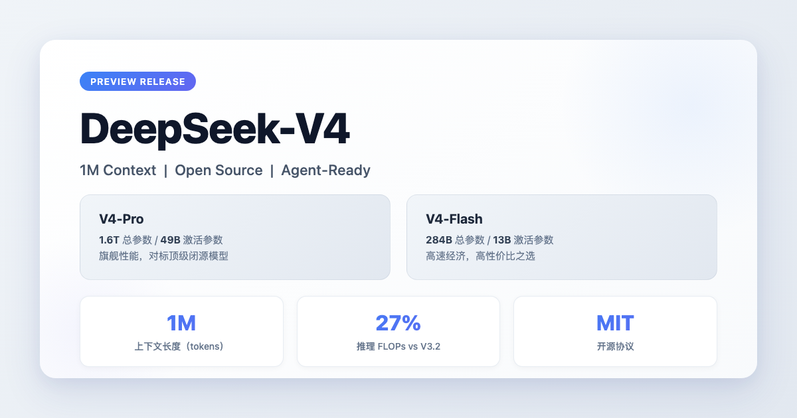
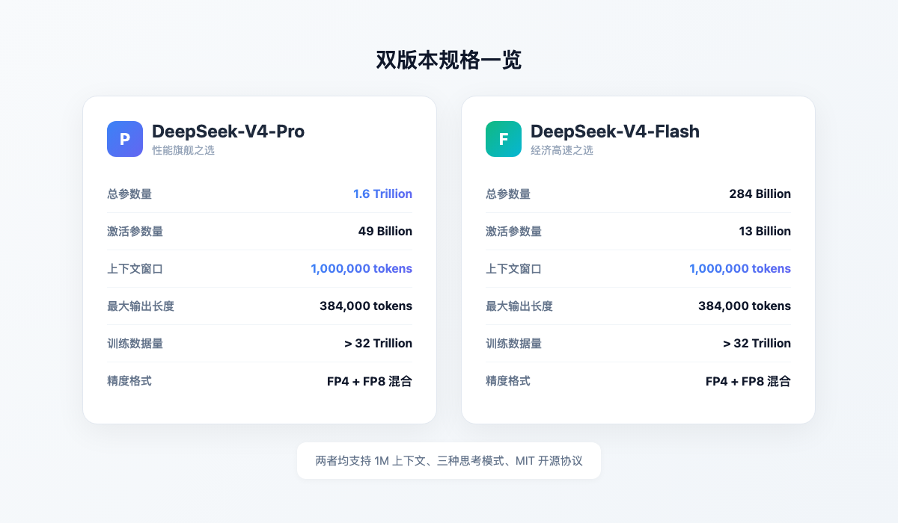
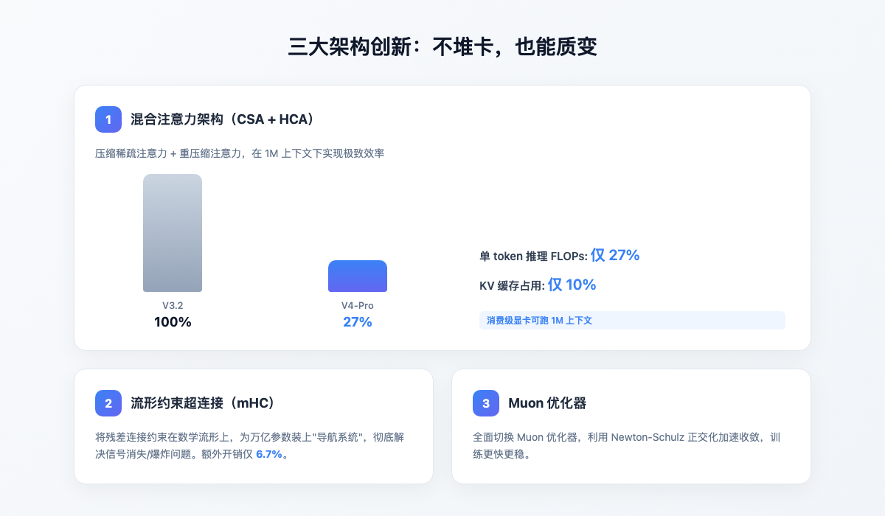
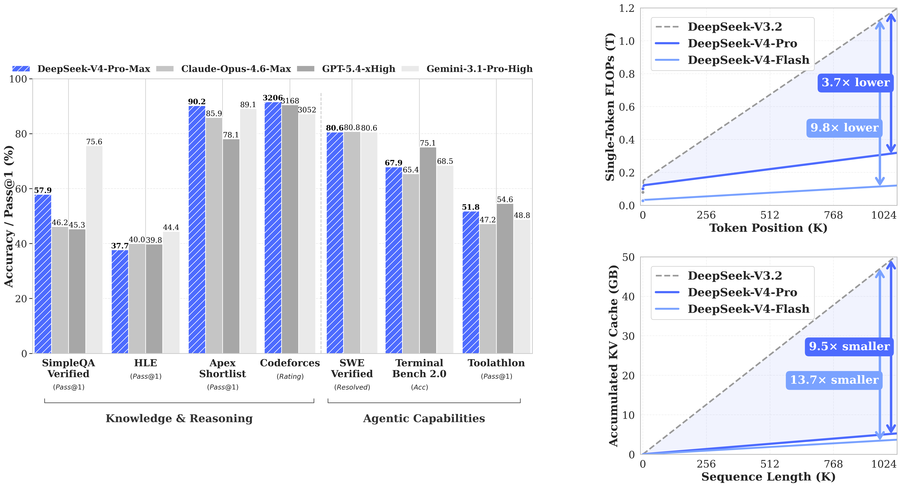
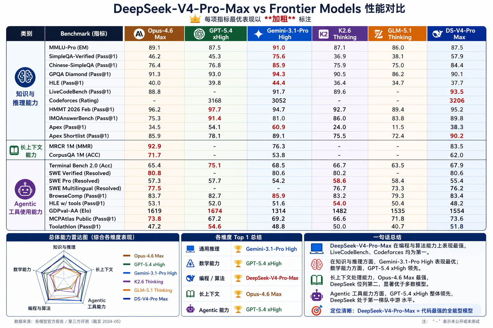
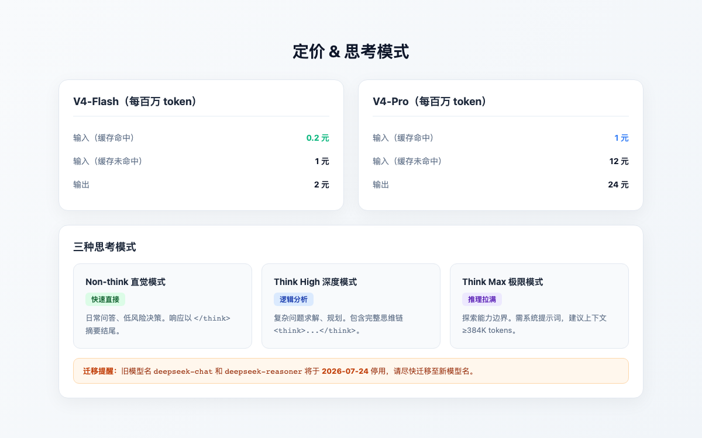

> 你把一整本《三体》三部曲丢给 AI，它不仅能读完，还能精准记住叶文洁在第几章按下了那个按钮。这不是什么未来畅想，是 DeepSeek-V4 今天就能干的事。



---

## 一句话总结

DeepSeek-V4：百万 token 上下文全系标配，1.6T 稀疏架构，开源免费，价格低到离谱。V3 的态度是"我开源但我也很强"，V4 换了个说法："我开源、我更强、我还便宜，你们闭源的自己想想怎么玩吧。"

---

## 01｜双版本登场：Pro 打巅峰赛，Flash 打排位赛

这次没搞"一款模型打天下"，直接给了两张入场券：

| 规格 | DeepSeek-V4-Flash | DeepSeek-V4-Pro |
|---|---|---|
| 总参数量 | 284B | 1.6T |
| 激活参数量 | 13B | 49B |
| 上下文窗口 | 1M | 1M |
| 最大输出长度 | 384K | 384K |
| 训练数据 | >32T Tokens | >32T Tokens |
| 精度格式 | FP4 + FP8 混合 | FP4 + FP8 混合 |
| 定位 | 经济高速之选 | 性能旗舰之选 |

Pro 是装备拉满的主 C，Flash 是高性价比的副 C。两者共享 1M 上下文，区别在知识储备量和极限场景的输出质量。

Agentic Coding 评测中，V4-Pro 已打到开源模型的天花板。内部反馈说体验优于 Claude Sonnet 4.5，交付质量接近 Opus 4.6 非思考模式。Flash 在简单任务上和 Pro 差不多，高难度任务才拉开差距。



---

## 02｜架构改动：不是堆参数，是换思路

V4 这次的重点不在参数量，而是底层架构动了刀子，让 1M 上下文从"土豪玩具"变成了"大众标配"。

### 混合注意力：把 1M token 的力气省到 27%

V4 搞了个混合注意力架构（CSA + HCA）。CSA 负责把长文本里不重要的信息"折叠"起来，HCA 在此基础上进一步压缩，只留关键线索。

在 1M 上下文下的效果：

| 指标 | V4-Pro vs V3.2 |
|---|---|
| 单 token 推理 FLOPs | 仅 27% |
| KV 缓存占用 | 仅 10% |

以前读一本字典要逐字背诵，现在学会了"看目录 + 跳读重点"，省脑又省内存。消费级显卡跑 1M 上下文不再是梦。

### mHC 流形约束：万亿参数的"安全带"

参数冲到 1.6T，训练信号很容易"走丢"。V4 引入了 mHC（流形约束超连接），把残差连接约束在特定的数学流形上。相当于给万亿参数装了套导航系统，信号不会消失也不会爆炸。代价？大概 6.7% 的额外计算开销。

### Muon 优化器：收敛更快

全面切换到 Muon 优化器，利用 Newton-Schulz 正交化技术，训练收敛更快更稳。



---

## 03｜数据说话

光说架构创新有点虚，直接看 V4-Pro-Max 和当前顶级闭源模型的正面 PK：



左图是 Knowledge & Reasoning 和 Agentic Capabilities 的基准测试。V4-Pro-Max 在 SimpleQA Verified、Apex Shortlist、Codeforces、SWE Verified、Terminal Bench 等多项评测中，跟 Claude Opus 4.6 Max、GPT-5.4 xHigh、Gemini 3.1 Pro High 打得有来有回，部分项目直接领先。

右图更直观：随着上下文变长，V4 的单 token FLOPs 和 KV 缓存增长曲线远低于 V3.2，Flash 版低得更夸张。上下文越长，V4 的相对优势越大，这也是 1M 上下文能做成标配的底气。

---

## 04｜硬刚细节：代码领先，中文紧咬 Gemini

上一张图是全景，下面这张是把 V4-Pro-Max 和 Claude Opus 4.6 / GPT-5.4 / Gemini 3.1 拉到同一个擂台上逐项掰手腕：



几个值得划重点的成绩：

- LiveCodeBench（93.5）直接登顶，领先 Gemini 3.1（91.7）和 Claude Opus（88.8），写代码这事 V4 是认真的
- Codeforces Rating（3206）同样第一，超过 GPT-5.4（3168）和 Gemini（3052）
- Apex Shortlist（90.2）再次第一，Gemini（89.1）和 Opus（85.9）被甩在身后
- Chinese-SimpleQA（84.4）虽然 Gemini（85.9）略高，但 V4 已远超 Opus（76.4）和 GPT-5.4（76.8），中文知识问答是 V4 的隐藏强项
- SWE Verified（80.6）与 Gemini 并列，仅落后 Opus（80.8）0.2 个百分点

在代码和数学领域，V4-Pro-Max 已经站到了开源模型的最顶端，部分项目甚至压过顶级闭源模型。中文知识问答也追到了第一梯队。剩下的差距主要在纯英文知识库和极少数极端复杂推理场景。

---

## 05｜1M 上下文全系标配

DeepSeek 放话：1M 上下文是所有官方服务的标配。不是 Pro 专属，Flash 也有。

几个真实场景：

- 代码审计：丢进去一整个大型项目的代码库，让 AI 跨文件找 bug
- 法律合同：上传一份 300 页的投资协议，问"第 147 页的竞业条款和第 89 页的股权条款有没有冲突"
- 小说创作：让 AI 记住你设定的 200 个人物关系，写到第 50 章还能问"这个角色和主角是什么关系"

在"大海捞针"测试中，V4 的准确率从 V3 的 84.2% 跃升到了 97.0%。丢一根针进大海，它真的能捞出来。

---

## 06｜Agent 能力专项优化

V4 针对 Claude Code、OpenClaw、CodeBuddy 等主流 Agent 框架做了专门适配。说白了，这模型更懂怎么当工具人了。

它能干嘛？

- 根据需求直接生成 PPT 内页，不是给大纲，是给完整页面
- 在代码仓库里自主导航、多文件联动修改
- 理解复杂任务流，自动拆解步骤并执行

官方建议 Agent 场景开启思考模式并拉满到 max，让模型"多想一会儿"再动手，输出质量会明显提升。

---

## 07｜思考模式：想快想慢你说了算

V4 全系支持不同推理力度，像相机的自动/专业/手动模式：

| 模式 | 特点 | 适用场景 | 响应格式 |
|---|---|---|---|
| Non-think（直觉模式） | 快、直接 | 日常问答、低风险决策 | `` ` `` 摘要 |
| Think High（深度模式） | 完整思维链 | 复杂问题、规划 | `` `思考过程` `` 回答 |
| Think Max（极限模式） | 推理拉满 | 探索能力边界 | 需系统提示 + 完整思维链 |

调用方式很简单：改一个 reasoning_effort 参数就行，可选 high 或 max。

最小调用示例：

```python
from openai import OpenAI

client = OpenAI(
    api_key="your-api-key",
    base_url="https://api.deepseek.com"
)

response = client.chat.completions.create(
    model="deepseek-v4-pro",  # 或 deepseek-v4-flash
    messages=[{"role": "user", "content": "写个快速排序"}],
    extra_body={
        "reasoning_effort": "max"  # high / max，不填就是非思考模式
    }
)
print(response.choices[0].message.content)
```

---

## 08｜定价：闭源模型的价格噩梦

看看 V4 的 API 定价（每百万 token）：

| 计费项 | V4-Flash | V4-Pro |
|---|---|---|
| 输入（缓存命中） | 0.2 元 | 1 元 |
| 输入（缓存未命中） | 1 元 | 12 元 |
| 输出 | 2 元 | 24 元 |

Flash 继续走 DeepSeek "价格屠夫"的老路，0.2 元/百万 token 缓存命中，放在整个 LLM 圈子里都是最低档。

旧模型名 deepseek-chat 和 deepseek-reasoner 将于 2026年7月24日 停用。过渡期内它们分别映射到 V4-Flash 的非思考模式和思考模式，建议尽快迁移到新的 deepseek-v4-pro / deepseek-v4-flash。



---

## 09｜开源 + 国产算力适配

V4 系列在 MIT License 下完全开源，模型权重、技术报告、推理代码全公开。DeepSeek 还搞了个"开源周"，把生产环境里验证过的 5 个核心基础设施库也开源了：

1. FlashMLA — Hopper 架构 MLA 解码加速
2. DeepEP — MoE 专家并行通信库
3. DeepGEMM — 低精度矩阵乘法优化
4. DualPipe & EPLB — 流水线调度与专家负载均衡
5. 3FS — AI 训练专用并行文件系统

另外，V4 是首个深度适配国产芯片（华为昇腾 910B/C、寒武纪 MLU）的万亿级模型，在非 NVIDIA 硬件上也能跑出不错的能效比。

---

## 总结

DeepSeek-V4 这次干了这么几件事：把 1M 上下文从炫技参数变成了基础标配，用混合注意力 + mHC + Muon 证明了模型进步不只能靠堆卡，然后把价格压到了一个让闭源厂商很难受的位置。

> 「不诱于誉，不恐于诽，率道而行，端然正己。」

不管外面怎么吹怎么黑，埋头干活就对了。想试试 1M 上下文的，直接去 chat.deepseek.com 或者改两行 API 代码就行。
