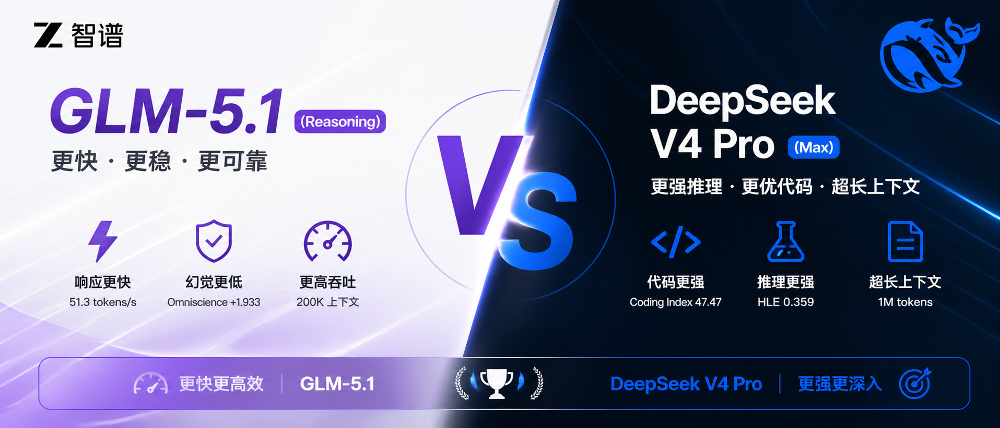
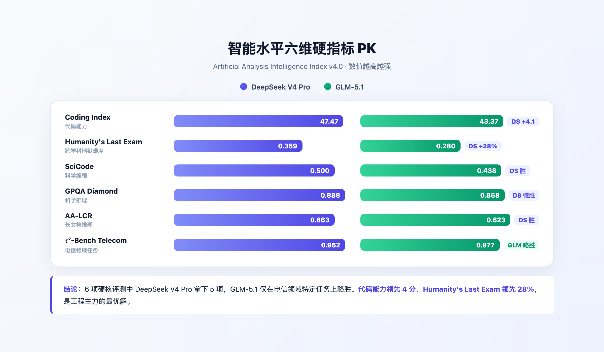
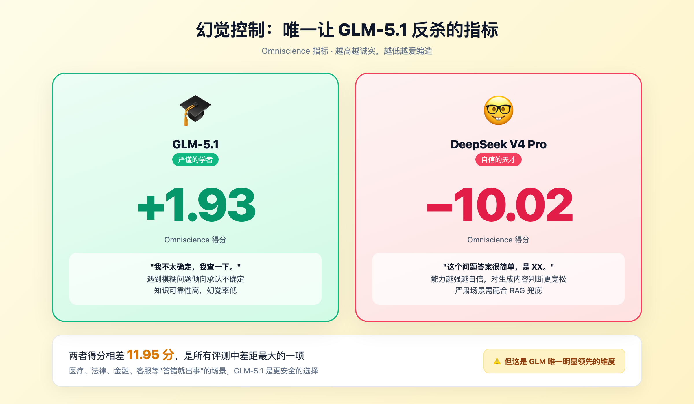
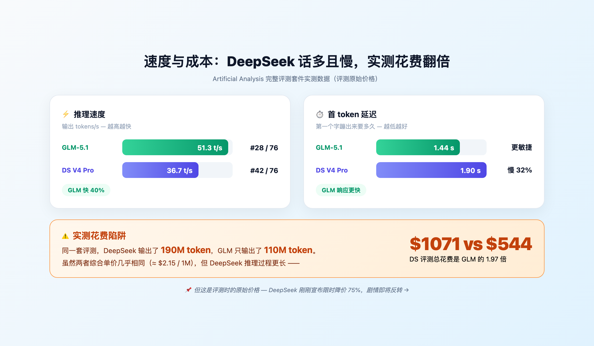
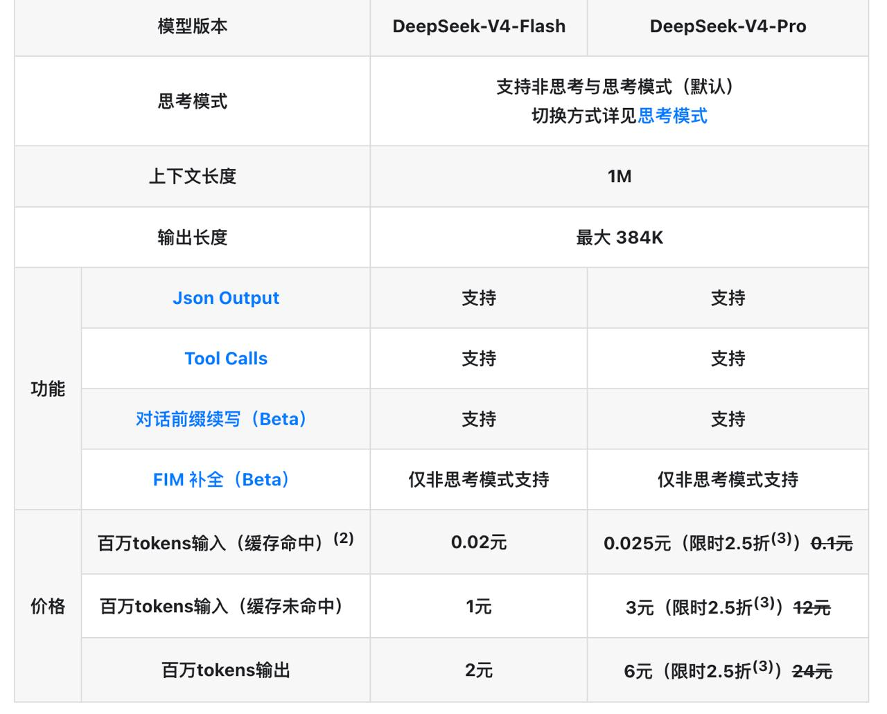
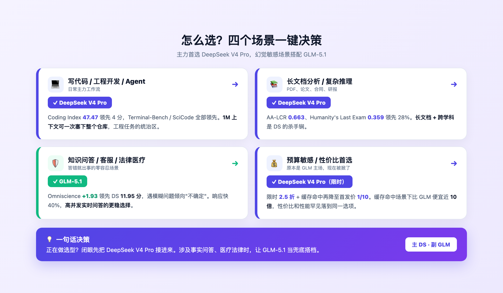
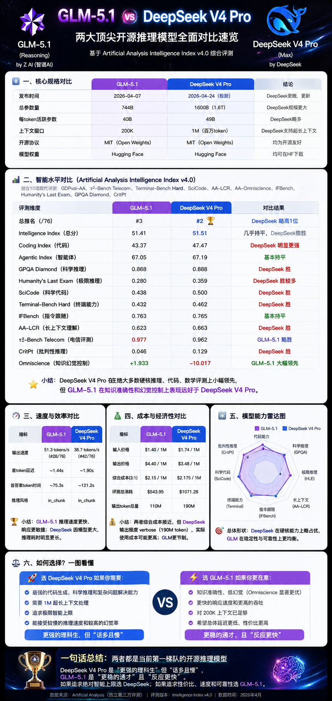

# DeepSeek V4 Pro vs GLM-5.1 实测对决：开源第一梯队，应该用哪个？

> 同一道编程题，DeepSeek V4 Pro 输出 1200 行带完整测试用例的工程方案，GLM-5.1 输出 700 行够跑、够交差的精简版。前者花你 2 分钟和两毛钱，后者花你 1 分钟和一毛钱。你选哪个？



---

## 一句话总结

第三方评测机构 Artificial Analysis 把全球 76 个顶级模型放在同一张榜单跑分，**DeepSeek V4 Pro 第 2，GLM-5.1 第 3**，综合得分相差 0.1 分。听起来打平，分项一拆开差异就出来了。

DeepSeek 是开源世界的理科状元，代码、推理、长文档全压制；GLM-5.1 反应快、幻觉低，是个稳健的工科生。我的建议：主力先上 DeepSeek V4 Pro，遇到怕模型胡说八道的场景，让 GLM-5.1 兜底。

---

## 01｜先看简历：两位选手的硬件参数

| 维度 | DeepSeek V4 Pro (Max) | GLM-5.1 (Reasoning) |
|---|---|---|
| 开发者 | DeepSeek | 智谱 AI（Z AI） |
| 发布时间 | 2026-04-24（极新） | 2026-04-07 |
| 总参数量 | **1.6T（1600B）** | 744B |
| 每 token 激活参数 | 49B | 40B |
| 上下文窗口 | **1M（百万 token）** | 200K |
| 开源协议 | MIT | MIT |
| 权重托管 | Hugging Face | Hugging Face |

DeepSeek V4 Pro 总参数量是 GLM 的两倍多，上下文 1M vs 200K 五倍差距，整本《三体》三部曲、整个中型代码库都能一次塞进去。两边都是 MIT 协议，商用零负担。

一开始就不是同一个量级，GLM-5.1 还能在第 3 名死死咬住，已经够硬核了。

---

## 02｜智能水平：DeepSeek 全线压制

Artificial Analysis 的 Intelligence Index v4.0 由 10 项现代评测合成，覆盖代码、推理、Agent、科学、长文档分析。直接看分项：

| 评测项 | DeepSeek V4 Pro | GLM-5.1 | 谁赢 |
|---|---|---|---|
| **Intelligence Index（综合）** | 51.51 | 51.41 | DS 微胜 |
| **Coding Index（代码）** | **47.47** | 43.37 | **DS 大胜 4 分** |
| Agentic Index（智能体） | 67.19 | 67.05 | 持平 |
| GPQA Diamond（科学推理） | 0.888 | 0.868 | DS 胜 |
| Humanity's Last Exam | **0.359** | 0.280 | **DS 大胜** |
| SciCode（科学编程） | 0.500 | 0.438 | DS 胜 |
| Terminal-Bench Hard | 0.462 | 0.432 | DS 胜 |
| AA-LCR（长文档推理） | 0.663 | 0.623 | DS 胜 |
| CritPt（批判性推理） | 0.129 | 0.046 | DS 胜 |
| IFBench（指令遵循） | 0.765 | 0.763 | 持平 |
| 𝜏²-Bench Telecom | 0.962 | 0.977 | GLM 略胜 |



代码差距最大，47.47 vs 43.37 差 4 分。Humanity's Last Exam 这种地狱难度评测，DeepSeek 高出 28%，跨学科高阶推理上限明显更高。11 项里 GLM 只赢 1 项电信领域评测。

---

## 03｜一个反直觉的发现：幻觉控制 GLM 反杀 12 分

这是 GLM-5.1 唯一的反杀时刻，分量很重。Omniscience 指标专门衡量模型面对不确定问题时**会不会一本正经地胡编**。分越高越诚实，越低越爱编。

| 模型 | Omniscience 得分 |
|---|---|
| **GLM-5.1** | **+1.93** |
| **DeepSeek V4 Pro** | **−10.02** |



差了 12 分。GLM 遇到不知道的问题倾向回答"不太确定"，DeepSeek 更可能编一个看似合理但错误的答案。

做知识问答、客服、医疗法律这种事实零容忍场景，GLM-5.1 更安全。要用 DeepSeek 跑严肃任务，必须配 RAG 或人工 review 兜底。

> DeepSeek 不是不好用。能力越强的模型越容易自信地犯错，对自己生成内容的合理性判断更宽松。但用的人得心里有数：DeepSeek 是敢说的天才，GLM 是严谨的学者。

---

## 04｜速度与成本：表面贵一倍，限时优惠后倒便宜 10 倍

代价总要付。1.6T 参数不是白拿的：

| 指标 | DeepSeek V4 Pro | GLM-5.1 |
|---|---|---|
| 输出速度 | 36.7 tokens/s | **51.3 tokens/s** |
| 首 token 延迟 | ~1.90s | **~1.44s** |
| 首答案 token 时间 | ~121.2s | **~75.3s** |
| 输入价格 | $1.74 / 1M tokens | $1.40 / 1M tokens |
| 输出价格 | **$3.48 / 1M tokens** | $4.40 / 1M tokens |
| 综合单价（3:1 输入输出） | $2.175 / 1M | $2.15 / 1M |



光看单价两者都在 $2.15 / 1M 附近。但有个隐藏陷阱：

> Artificial Analysis 跑完整套评测，DeepSeek V4 Pro **花了 1071.28 美元**，GLM-5.1 **花了 543.95 美元**。
>
> 同一套题，DeepSeek 输出 190M token，GLM 只输出 110M token。

DeepSeek V4 Pro 是话痨型选手，推理过程更长、思考更细致，token 消耗自然更多，实际付费大约是 GLM 的 1.7 到 2 倍。

——但这一节写到一半，DeepSeek 官方扔出价格调整公告，把上面的成本叙事直接掀了：

> 🤖 DeepSeek API 价格调整：全系列模型输入缓存命中价格降至首发价的 1/10，V4-Pro 限时 2.5 折



直接看官方价格表（人民币 / 百万 token）：

| 项目 | DeepSeek-V4-Flash | DeepSeek-V4-Pro（限时 2.5 折） |
|---|---|---|
| 输入（缓存命中） | 0.02 元 | **0.025 元**（原价 0.1 元） |
| 输入（缓存未命中） | 1 元 | **3 元**（原价 12 元） |
| 输出 | 2 元 | **6 元**（原价 24 元） |

按 7 元/美元换算后的综合单价：

| 综合单价（3:1 输入输出） | DS V4 Pro 限时优惠 | GLM-5.1 |
|---|---|---|
| 缓存未命中 | **≈ $0.54 / 1M** | $2.15 / 1M |
| 缓存命中 | **≈ $0.22 / 1M** | $2.15 / 1M |

限时优惠期内，缓存未命中场景 DeepSeek 比 GLM 便宜 4 倍；prompt 有重复结构（系统提示、长文档复用）触发缓存命中，便宜近 10 倍。

GLM-5.1 之前一直靠"性价比"卖点站住脚，DeepSeek 这一波直接把它打成"既最强又最便宜"。价格是限时的，长期可能回调。但正在做选型，趁这波优惠把 DeepSeek 接进项目，几乎没理由拒绝。

---

## 05｜怎么选？两类场景直接抄作业



### 选 DeepSeek V4 Pro：写代码、长文档、Agent、限时优惠期一切场景

代码、长文档推理、Agent、跨学科问题，DeepSeek 全面领先。1M 上下文能塞下整个代码仓库或一整篇研究论文。叠加限时 2.5 折加缓存命中 1/10 价，连"性价比"这个原本属于 GLM 的卖点也被抢走 — 缓存命中下便宜近 10 倍。趁优惠把项目切到 V4-Pro 上，几乎没理由拒绝。

### 选 GLM-5.1：怕模型胡说八道的场景

问答机器人、医疗咨询、财经资讯这类"答错就出事"的事实零容忍场景，GLM-5.1 在 Omniscience 上 12 分的领先值得认真考虑。响应也快 40%，做高并发实时问答更稳妥。

最佳搭配：复杂任务给 DS，事实问答给 GLM。

---

## 06｜最小 demo：一份代码两边跑

两个模型都用 OpenAI 兼容 SDK，切换成本几乎为零。

```python
from openai import OpenAI

client = OpenAI(
    api_key="your_deepseek_key",
    base_url="https://api.deepseek.com/v1"
)

response = client.chat.completions.create(
    model="deepseek-v4-pro",
    messages=[
        {"role": "user", "content": "用 Python 实现快速排序，要求带类型标注和单元测试"}
    ],
    max_tokens=4096
)
print(response.choices[0].message.content)
```

切换到 GLM-5.1 只改两行：`base_url="https://open.bigmodel.cn/api/paas/v4"`，`model="glm-5.1"`。同一个 prompt 两边各跑一次，比较输出质量、速度和 token 消耗，生产环境可以混用——简单任务给 GLM 省成本，复杂任务交 DeepSeek V4 Pro 保质量。

---

## 07｜评测全景速览



---

## 总结

DeepSeek V4 Pro 是 1.6T 参数堆出来的开源天花板。代码、推理、长文档全压制，叠加限时 2.5 折加缓存 1/10 价，性能和价格双拿。代价是响应慢一点、爱编一点，要 RAG 兜底。

GLM-5.1 智能上限只低 0.1 分，速度快 40%、幻觉低 12 分。怕胡说八道的场景，让它兜底。

正在做选型？闭眼先接 DeepSeek V4 Pro。涉及"答错就出事"的事实问答，再让 GLM-5.1 当搭档。

国产开源模型已经卷到既最强又最便宜的程度，闭源大厂们今晚估计又要加班了。

---

> 📊 数据来源：Artificial Analysis（独立第三方 AI 模型评测机构）
> - GLM-5.1：[https://artificialanalysis.ai/models/glm-5-1](https://artificialanalysis.ai/models/glm-5-1)
> - DeepSeek V4 Pro：[https://artificialanalysis.ai/models/deepseek-v4-pro](https://artificialanalysis.ai/models/deepseek-v4-pro)
