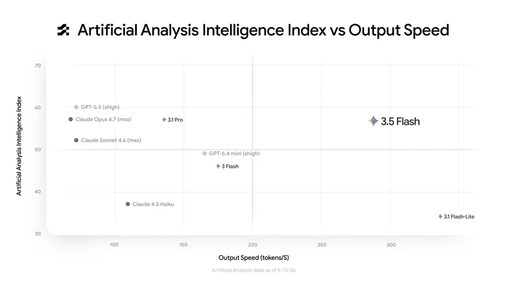
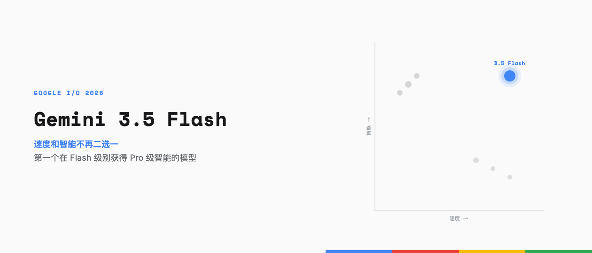
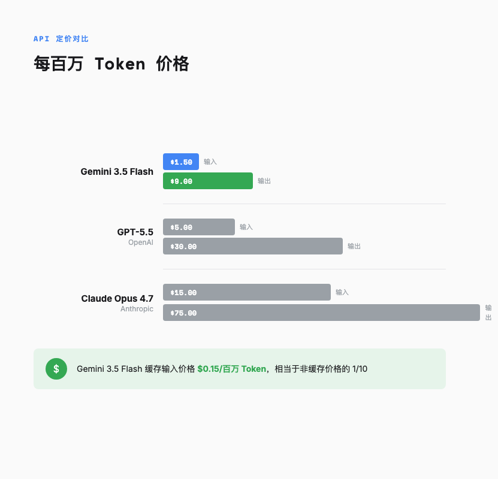
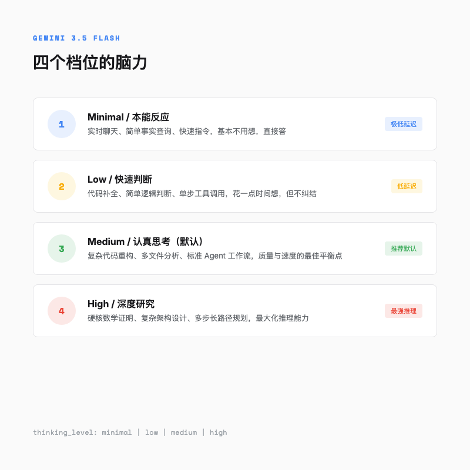
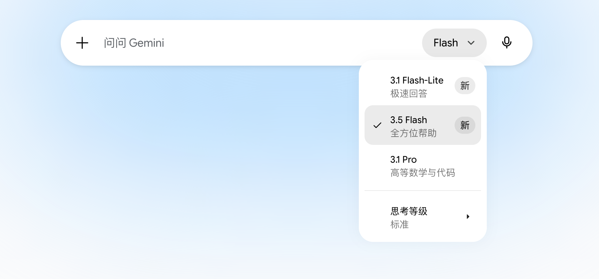

# Gemini 3.5 Flash，一个既快又聪明的模型到底意味着什么

> Google I/O 2026 上发布了一张散点图，所有 AI 模型都在「聪明但慢」和「快但笨」之间二选一，只有一个点待在了右上角。

---

2026 年 5 月 20 日，Google I/O 开幕。一堆产品更新轮番上阵，但对技术圈来说，真正炸场的是一张第三方评测机构 Artificial Analysis 做的散点图。

横轴是输出速度，纵轴是智能指数。Claude Opus 4.7、GPT-5.5 这些旗舰模型挤在左上角，聪明但慢。各种 Flash 和 Lite 模型散落在右下方，快但总差点意思。

右上角，只有一个孤零零的点。那是当天刚发布的 **Gemini 3.5 Flash**。





我记得前几年手机芯片市场有过类似的拐点。旗舰芯片越来越强，但功耗也跟着炸，中端芯片省电但干不了重活。直到某一天，一颗中端芯片突然跑出了接近旗舰的性能，功耗还控制住了。

Gemini 3.5 Flash 在大模型市场干的事差不多。说白了 ，以前那个「快模型一定笨」的常识，可能真的过时了。

---

## 凭什么同时要速度和智能

过去两年，大模型市场有一条不成文的铁律。想要聪明的模型就得忍受慢吞吞的响应，想要闪电般的速度就得接受降智的输出。Pro/Opus 级别贵且慢，Flash/Haiku 级别便宜快但不够聪明。

Gemini 3.5 Flash 不太按这个套路来。

输出速度方面，它每秒能吐出超过 280 个 token，是其他旗舰模型的 **4 倍**。什么概念呢，当你用 Claude Opus 4.7 等一个回复的时候，Gemini 3.5 Flash 已经生成完 4 个同等质量的回复了。

速度快的模型多了去了，关键看它是不是真的聪明。

Google 官方放出了一组跑分数据，跟 GPT-5.5、Claude Opus 4.7、Gemini 3.1 Pro 正面硬刚。最让我意外的两个：

- **MCP Atlas**（Agent 多步工作流），3.5 Flash 拿到 83.6%，高于 Claude Opus 4.7 的 79.1% 和 GPT-5.5 的 75.3%
- **CharXiv Reasoning**（复杂图表推理），84.2%，跟 GPT-5.5 的 84.1% 几乎并列，但 3.5 Flash 快了 4 倍

另外 Terminal-Bench 2.1（终端编码）76.2% 和 MMMU-Pro（多模态理解）83.6%，也都是数一数二的成绩。


这个模型在「帮人干活」这件事上，已经追平甚至超过了那些贵它好几倍的旗舰选手。

当然它不是全能的。比如 Humanity's Last Exam（一个号称「人类最后的考试」的超难基准），3.5 Flash 得分 40.2%，低于 Gemini 3.1 Pro 的 44.4% 和 Claude Opus 4.7 的 46.9%。抽象逻辑推理（ARC-AGI-2）也是 72.1%，打不过 Pro 的 77.1%，跟 GPT-5.5 的 84.6% 差距更大。

所以它的定位很清楚，不是替你解数学竞赛题的，是替你干活的。

---

## 跟 GPT-5.5 和 Claude Opus 4.7 正面刚

横向对比才是重头戏。不列大表格，只说几个最关心的维度。

### 编码

Claude Opus 4.7 在 SWE-Bench Pro 上拿到了 64.3%，是目前编码能力的工业最高标准。GPT-5.5 也拿到了 58.6%。Gemini 3.5 Flash 是 55.1%，看起来差了一截。

但别急。3.5 Flash 的编码速度是这两位的将近 4 倍。在真实的软件开发场景里，你需要的不是一次就写出完美代码，而是快速迭代、频繁试错。**速度本身就是编码能力的一部分**。一个 3 秒给出 80 分答案的模型，往往比一个 30 秒给出 85 分答案的模型更实用。

### Agent 能力

这是 3.5 Flash 拉开差距的地方。MCP Atlas 测试的是模型在多步工具调用、跨系统协作等真实工作流中的表现。83.6% 的得分意味着什么？意味着你让这个模型去帮你「读一份 50 页的财报，提取关键财务数据，生成可视化图表，然后把分析结果写入 Google Sheets」，它大概率能一次性完成，中间不需要你插手。

相比之下，GPT-5.5 在这个维度是 75.3%，Claude Opus 4.7 是 79.1%。

还有一个数据让我愣了一下。Finance Agent v2（金融分析基准），3.5 Flash 拿到 57.9%，而 Gemini 3.1 Pro 只有 43.0%，差了将近 15 个百分点。一个轻量级模型在金融分析任务上把自家旗舰 Pro 打了。

### 多模态与上下文

3.5 Flash 原生支持文本、图像、视频、音频、PDF 输入，上下文窗口 100 万 token。在多模态理解和图表推理两个基准上都是全场最高分。GPT-5.5 的上下文窗口据第三方分析约为 400k token，在处理超长文档时这个差距会被放大。

### 性价比

这可能是最刺激的维度。



- Gemini 3.5 Flash，输入 $1.50/百万 token，输出 $9/百万 token
- GPT-5.5，输入 $5/百万 token，输出 $30/百万 token
- Claude Opus 4.7，输入 $15/百万 token，输出 $75/百万 token

Claude Opus 4.7 的综合价格是 3.5 Flash 的 **8-10 倍**。GPT-5.5 也贵了 3 倍以上。

换算一下，你花 1 块钱用 3.5 Flash 能干完的活，用 Claude Opus 4.7 得花 10 块。而 3.5 Flash 在大多数实际任务上的表现，并没有差 10 倍。

当然，3.5 Flash 比上一代 Gemini 3 Flash 贵了 3 倍（后者是 $0.50/$3.00）。Google 的逻辑是，能力提升远超 3 倍，所以贵得有道理。至于这个账划不划算，取决于你的具体使用场景。

还有一个对开发者特别友好的隐藏设计，缓存机制。3.5 Flash 的缓存输入价格只要 $0.15/百万 token，相当于非缓存价格的 1/10。对于 Agent 场景（频繁读取大型代码库或知识库），这个缓存价格能让长路径任务的边际成本大幅下降。

如果你不想直接对接 Google API，OpenRouter 也已经接入了 3.5 Flash，走 Google Vertex 通道实际均价大约 $0.57 输入 / $8.96 输出每百万 token，吞吐量约 170 token/s，而且缓存命中率接近 70%。相当于在官方定价的基础上又打了个折。对不想折腾 Google Cloud 账号的开发者来说，OpenRouter 是个很方便的入口。

---

## 四个档位的脑力

Gemini 3.5 Flash 有一个很特别的设计，叫 **Thinking Levels**（思维分级）。以前控制模型的推理深度只能靠调 temperature 之类的参数，很粗糙。3.5 Flash 的做法是直接给你四个档位。

**Minimal**，本能反应。聊天、简单查询、快速指令，基本不用想，直接答。

**Low**，快速判断。代码补全、简单逻辑这种，花一点时间想，但不纠结。

**Medium**，认真思考。这是默认档位，也是 Google 推荐大多数任务用的。复杂代码重构、多文件分析、标准 Agent 工作流，用这个就够。我实际用下来，这个档位覆盖了大概 80% 的日常需求。

**High**，深度研究。硬核数学证明、复杂架构设计这种，模型会做更多的中间推理和工具调用。代价是速度会明显慢下来，token 消耗也更高。



打个比方，就像一个人面对不同难度的问题时，自己调节「想多深」。问今天天气，不用想；问怎么重构一个微服务架构，得认真想。

这个设计背后有一个更大的趋势，Google 官方建议开发者**不要再手动调 temperature、top_p、top_k 这些参数了**。原因是 3.5 Flash 的推理引擎已经针对默认设置做了全局强化学习优化，手动调随机性参数反而会干扰模型的推理路径。

从「调概率参数」到「选思维档位」，背后是整个推理方式的转变。你不需要告诉它「输出更随机一点」，而是告诉它「这个问题多想想」。

3.5 Flash 还会自动在多轮对话中保留中间推理过程，叫「思维保留（Thought Preservation）」。意思是你在第一轮让它分析一个代码库的架构，它生成的架构思考、依赖分析、风险评估，会自动带到后续的对话中。你不需要做任何额外操作，SDK 自动处理。对于迭代编码和长路径调试来说，这个功能非常实用。

---

## 不只是聊天模型

Gemini 3.5 Flash 不只是一个性价比更好的聊天机器人。Google 对它的定位是 Agent 引擎。你给它一个目标，它自己规划步骤、调用工具、执行任务、汇报结果，而不是你问一句它答一句。

3.5 Flash 在 Agent 方面有几个关键能力。

**并行子代理**。在 Google 的 Antigravity 平台上，你可以同时启动多个 3.5 Flash 子代理，各干各的活。比如一个负责生成代码，一个负责生成视觉资产，一个负责写部署脚本。Shopify 已经在用这种方式并行分析数据，做商家增长预测。

**长路径任务**。3.5 Flash 能处理需要几十个步骤才能完成的复杂任务。Google 官方展示了一个案例，让 3.5 Flash 读完 AlphaGo 论文，然后自己从零构建一个棋类游戏。这种「读完论文就动手」的能力，以前只有旗舰 Pro 模型能做到。

**Gemini Spark**。这是一个基于 3.5 Flash 的个人 AI 助手，24/7 在线，可以帮你在数字世界里执行各种任务。目前还在早期测试阶段，计划先面向 Google AI Ultra 订阅用户开放。

---

## 怎么用起来

说了这么多，普通人怎么上手？

### 普通用户

你可能已经在用了。3.5 Flash 现在是 Gemini App 和 Google 搜索 AI Mode 的默认模型。如果你用过 Google 的 AI 搜索，你已经在用 3.5 Flash 了。


### 开发者

通过 Google AI Studio、Vertex AI 或 OpenRouter 调用 API。最小 demo 长这样：

```python
from google import genai

client = genai.Client()

interaction = client.interactions.create(
    model="gemini-3.5-flash",
    input="用三句话解释并行代理执行是怎么工作的"
)
print(interaction.output_text)
```

需要调整思维档位的话，加一个参数就行：

```python
interaction = client.interactions.create(
    model="gemini-3.5-flash",
    input="证明根号2是无理数",
    generation_config={"thinking_level": "high"},
)
```

如果你之前在用 Gemini 3 Flash，迁移主要注意三件事，把模型名改成 `gemini-3.5-flash`，删掉 temperature/top_p/top_k 参数，用 `thinking_level` 替换 `thinking_budget`。

---

## 还有一个月

回到开头那张散点图。

我现在日常的编码和文档分析任务已经切到 3.5 Flash 了。它不是最强的模型，纯学术推理打不过 Pro 级别，编码上限也不如 GPT-5.5，但对于实际工作来说，它的综合效能是我用过最均衡的。

**Gemini 3.5 Pro 下个月就到**。不过说实话，我现在有点好奇，Flash 都已经这样了，Pro 出来之后我还能找到什么理由用它。

欢迎关注我的公众号「Chyris Tech Note」，获取更多 AI 技术解读与实践分享。
