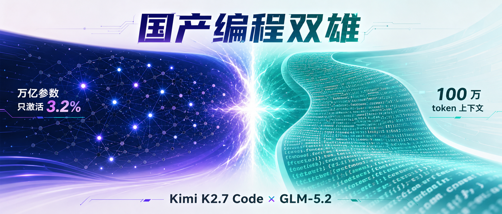
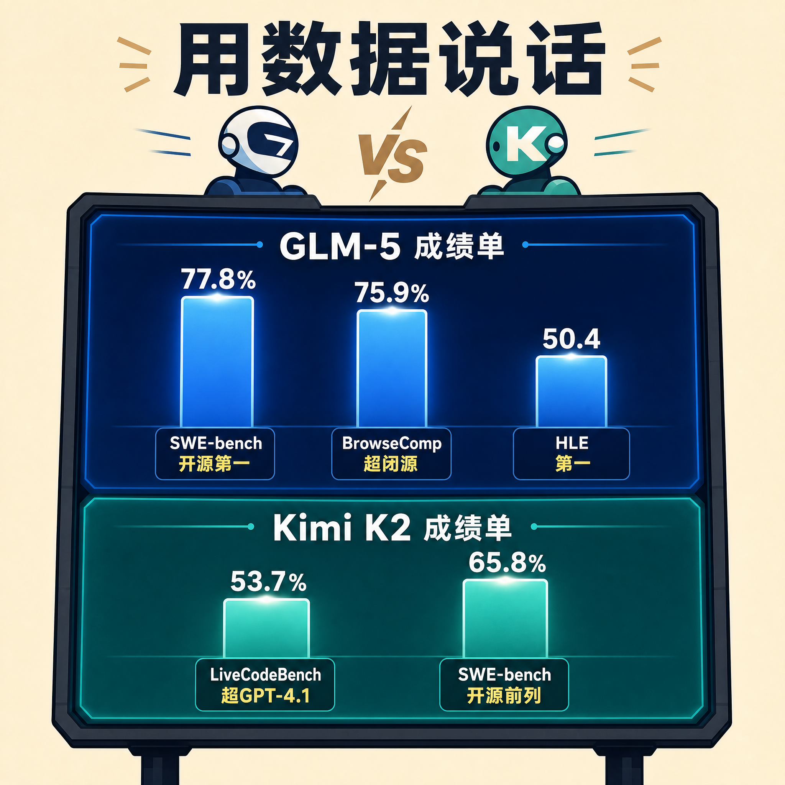
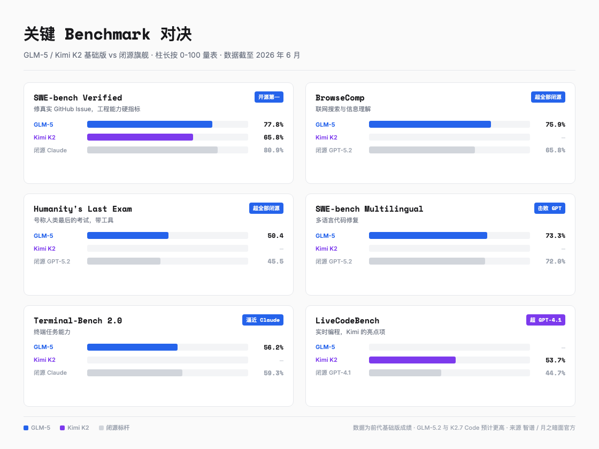
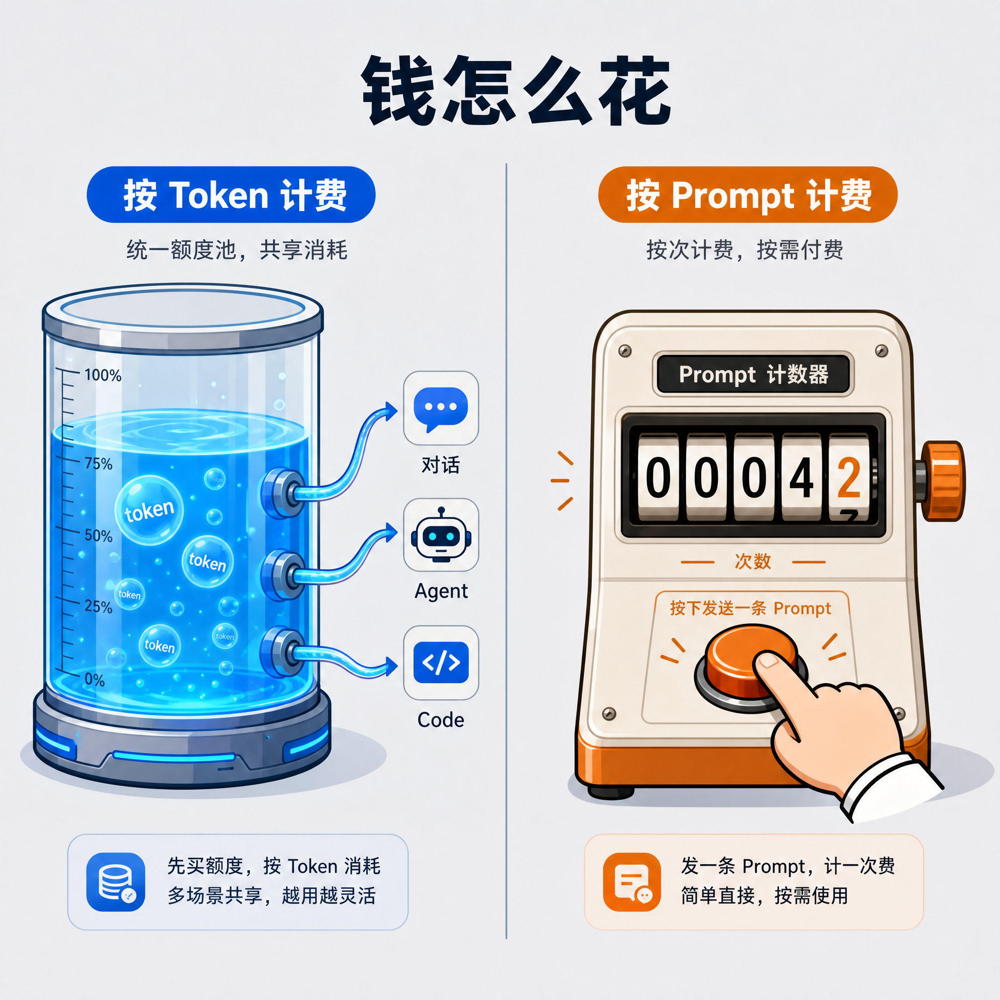

# 1T 万亿参数 vs 1M 百万上下文，Kimi K2.7 Code 与 GLM-5.2 怎么选

> 国产编程模型的两条路线在 2026 年 6 月正面撞上了，这次不是谁碾压谁，而是两种工程哲学分头押注。

---

## 一句话总结

这两个模型很难简单分高下。Kimi 把万亿参数压成只用 **3.2%** 的稀疏大脑，追求单位算力的极致效率；GLM 把上下文窗口顶到 **100 万 token**，追求一个模型能装下多大的代码库。一个是短跑选手，一个是马拉松选手。

---

## 站在两个订阅页面前

打开月之暗面的 Kimi 会员页，最顶配的 Allegro 档写着 699 元一个月，60 倍 Code 额度，还能同时跑 4 个子任务。再切到智谱的 GLM Coding Plan，顶配 Max 是 469 元一个月，大约每 5 小时 1600 次 Prompt，号称适配 20 多款主流编程工具。

两个页面都把自己标成国产最强编程模型。价格差出小一半，技术路线也几乎反着来，订阅费到底该交给谁？

这不是一篇简单的产品横评。2026 年的国产编程赛道上，月之暗面和智谱几乎同时亮出底牌，一个押万亿稀疏，一个押百万上下文，两套思路正面撞上。对开发者来说，问题早就从「国产哪个能用」变成了「国产哪个更适合我」。

---

## 两种工程哲学，一个短跑一个马拉松

先说 Kimi K2.7 Code。它的账面参数很唬人，**1 万亿总参数**。但真正干活的时候，它只激活其中 320 亿，大约 3.2%。这个设计叫混合专家（MoE），原理不复杂，可以想象成医院里 384 个专科医生，你挂号进来，系统根据症状现场抽 8 个最对口的来会诊，另外 376 个这次用不上，就歇着。这样总账上挂着 384 个专家的知识储备，单次看病只占用 8 个人的算力。

那 GLM 呢？路子其实差不多，挂号大厅小一点，256 个专家里挑 8 个，激活比例 5.9%。两边真正的分歧在另外两个地方。

第一是上下文窗口。Kimi 给到 256K，大概能塞进一本中等厚度的技术书或者几万行代码。GLM 直接顶到 **1M，100 万 token**，这大约相当于把整个 Linux 内核源码吞进去还有富余。这是两者最直观的分水岭。

第二是训练数据量。Kimi 喂了 **15.5 万亿 token**，GLM 喂了 **28.5 万亿**。GLM 多出来的这接近一倍数据，换的是知识广度。

所以一个把单次出诊的效率拉满，Kimi 的高速版 API 能跑到每秒 60 到 100 个 token 的输出，交互体感很顺；一个把能读多少病历的容量拉满，GLM 号称能在单个任务里连续工作 **8 小时**不掉链子。一个要爆发力，一个要耐力，干脆不在一条赛道上跑。

---

## 用数据说话，但要诚实

光看参数没有意义，得看考卷成绩。这里必须先说一句实话，目前公开的 benchmark 跑分，GLM 这边主要是前代 GLM-5 的成绩，5.2 作为升级版，官方口径是预计会保持或超越；Kimi 这边是基础版 K2 系列的成绩，K2.7 Code 是 Coding 特化版。所以下面这些数字，当成两个家族当前的实力坐标看就好，不是两款具体型号的精确对撞。

知道这个前提，数字才不会误读。

先看 GLM-5 这份成绩单。在 SWE-bench Verified 这个最能体现工程能力的测试（修真实 GitHub Issue）上，GLM-5 拿了 **77.8%**，开源模型第一，把 DeepSeek-V3.2 的 73.1% 甩在身后，压在它头顶的只有 Claude Opus 4.5 和 GPT-5.2 两个闭源旗舰。

更扎眼的是 BrowseComp，也就是联网搜索和信息理解测试，GLM-5 拿了 **75.9%**，这个分数按智谱公布的数据直接超越了所有闭源模型，包括 Claude Opus 4.5 和 GPT-5.2。一个开源模型在信息搜索上把闭源全挑了，这事放在两年前不可想象。

还有号称「人类最后的考试」的 Humanity's Last Exam（HLE，带工具），GLM-5 拿了 50.4 分，又是反超 Claude Opus 4.5 的 43.4 和 GPT-5.2 的 45.5。

Kimi 这边的故事是另一种讲法。Kimi K2 基础版在 SWE-bench Verified 拿了 65.8%，比 GLM-5 低，但仍是开源第一梯队。它真正的差异化在别处，LiveCodeBench 上 53.7%，超越了 GPT-4.1；情商和创意写作榜单双双榜首，意味着它写东西更自然、更懂人话。再加上 Kimi K2.7 Code 原生支持文本、图片、视频多模态输入，你截一张 UI 图或者录一段操作视频丢过去，它能看懂，这是 GLM 目前相对薄弱的地方。还有个细节，Kimi K2.7 Code 强制开启思考模式，没有关闭选项，每次回答都先过一遍推理过程，这点在需要深度分析的任务上更稳。

把六项关键成绩摆一张表里，差距一目了然。

读完这些表，我对 GLM 是有点刮目相看的。门门功课都往 90 分线顶，工程、工具、推理全面压上来，个别科目还反超闭源。Kimi 没有那么均衡，但在创意、跨语言、多模态这几条偏科的赛道上留了自己的位置。所以选谁，不光看分数高低，还得看你这条赛道更看重哪门课。

---

## 钱怎么花才是重点

对大多数开发者来说，benchmark 是谈资，订阅费才是真金白银。这一章是全文最该细看的地方，两个平台的定价哲学从根上就不一样。

**Kimi Code 按 token 计费**。你买的不是固定使用次数，而是一个额度池，对话、Agent、Kimi Code 共享这一个池子，按实际消耗的 token 扣。缓存命中时还打折，每百万 token 只算 0.7 元。好处是灵活，今天纯聊天、明天猛写代码，额度自由调配。但按 token 计费有个绕不开的点，256K 上下文一旦拉满，输入的 token 量本身就很大，长任务烧额度会比想象中快。还有个隐藏设定，Kimi Code 明确禁止企业场景，只能个人开发用。

**GLM Coding Plan 按 Prompt 次数计费**，另一套逻辑。你买的是「每 5 小时能发多少条 Prompt」的配额，不管这条 Prompt 后面跑了多少 token。按公开实测参考，跑完一个复杂任务约消耗 8% 的 GLM Pro 额度，半天约 10%。计费可预期，但 GLM-5 系列高峰期按 3 倍、非高峰 2 倍抵扣额度，忙时段缩水明显。GLM 另一个硬优势是工具适配，Claude Code、Cline、Cursor、Roo Code 等 20 多款主流工具通吃，还支持团队版和企业场景。

下面用三档预算，把两个平台摆一起看。

月预算 50 元以内，入门对入门。Kimi 的 Andante 档 49 元一个月，给 1 倍 Code 额度和 30 个 Agent，适合写写短代码片段。GLM 的 Lite 档同样 49 元一个月，每 5 小时约 80 次 Prompt，一周约 320 次，适合小型项目迭代。要是我主要在 Cursor 里写写脚本、任务又轻，GLM 的次数制更省心；但要是任务长短不一、还常顺手跑几个 Agent，Kimi 的统一池更顶用。

月预算 100 到 200 元，这是大多数人会停下的档位。Kimi 这边 Moderato 99 元一个月，4 倍 Code 额度，60 个 Agent，日常开发够用，再往上加 100 块就是 Allegretto 199 元，20 倍额度加 4 个子任务并行的 Agent 集群。GLM 对应 Pro 档 149 元一个月，每 5 小时约 400 次，约是 Lite 的 5 倍配额。这一档我会更倾向 GLM，400 次 Prompt 撑得住一个完整的日常开发节奏，次数翻得猛，钱花得见。

月预算 400 元以上，顶配互搏。Kimi 的 Allegro 699 元一个月，60 倍额度，360 个 Agent，已经是个人订阅里很贵的档位了，额度和 Agent 数量给到顶。GLM 的 Max 469 元一个月，每 5 小时约 1600 次，约是 Lite 的 20 倍，还能用上最新的 GLM-5 旗舰模型，便宜了 230 块。这一档分水岭很清楚，个人重度开发选 Kimi，团队或企业场景选 GLM。

还有个容易被忽略的点，海外用户。GLM Coding Plan 海外版月费折算下来是国内版的 2 到 3 倍，国内用户买明显划算，这个细节海外朋友尤其要看。Kimi 这边海外定价没有明确区分。

说到底，如果你是个人开发者、任务长短不一、还想要多模态，Kimi 的 token 池更灵活；如果你是团队、重度依赖某个特定 IDE、想要可预期的次数计费，GLM 的 Prompt 制和企业支持更对路。

---

## 什么人选什么

说了这么多，落到最实际的，到底什么人该选 Kimi，什么人该选 GLM。

选 Kimi K2.7 Code 的人，需求通常很具体。需要多模态辅助编程，你会丢 UI 截图、丢操作视频让它看懂；做跨语言开发，Rust、Go、Python 来回切，希望各语言都稳；搞前端和可视化，想要它写出有设计感的粒子系统、3D 场景；在意 API 响应速度，Kimi 高速版每秒 60 到 100 个 token 的输出，交互体感很顺。说穿了，要的是一个聪明、反应快、看得懂图的搭子。

选 GLM-5.2 的理由更偏工程现实。如果你手上的代码库大到连自己都翻不全，几十万行指望一个人脑根本记不住，这时候 1M 上下文就是刚需，不是什么花架子。或者你得让模型自主跑完一个完整工程，规划、执行、交付一气呵成，中途不用人盯着，这种长程活 GLM 能顶 8 小时。再就是部署环境，国产昇腾芯片深度适配，团队还要正式商业授权，这些 Kimi 目前给不了。

素材里有句话把两者概括得很准，Kimi 是「更聪明的程序员」，GLM 是「更持久的工程师」，这两个词基本把两边定位说清楚了。

---

## 从追赶到并跑

回到开头那个问题，钱花给谁。

坦白说，到了 2026 年，这事已经谈不上非此即彼，剩下的只是「国产哪个更适合我」。

放在一两年前，国产编程模型和闭源旗舰之间还隔着明显的代差，开源模型在 SWE-bench 这种硬核工程测试上很难够到闭源的边。现在 GLM-5 拿了 77.8%，离 Claude Opus 4.5 的 80.9% 只差 3 个百分点，在 BrowseComp 上甚至直接反超了所有闭源。Kimi 在 LiveCodeBench 上超越了 GPT-4.1。代差填上了。

更让我感兴趣的是，这两条路是分头打通的。Kimi 用 MuonClip 这种自研优化器解决了万亿参数训练的稳定性，15.5 万亿 token 训练无损失；GLM 用 DSA 稀疏注意力，拿 200 亿 token 的适配量追上了 DeepSeek 9400 多亿 token 的注意效果，还把上下文顶到了 100 万。GLM 深度适配华为昇腾等国产芯片，单节点性能媲美双 GPU 集群，开源协议是最宽松的 MIT，商用几乎没有限制，对想二次开发或私有部署的团队是个实在的利好。

把这些放一起看，意义已经超出两个产品谁强谁弱这件事。国产大模型在编程这个最硬核的赛道上，从「追赶」走到了「并跑」，局部还反超成「领跑」。对开发者来说，第一次有了一套不绑死闭源、也不卡在进口算力上的完整选项。

所以开头那个两难，答案可能不是二选一。预算够，两个都试，各有所长；预算只够一个，就照着上面那两类画像对号入座。

国产编程模型这一局，已经站稳了牌桌。

---

> 本文数据截至 2026 年 6 月，模型持续迭代中，请以官方最新信息为准。文中 benchmark 数据主要来自智谱与月之暗面公布的官方评测，GLM-5.2 与 Kimi K2.7 Code 的精确跑分以官方发布为准。

---

欢迎关注我的公众号「Chyris Tech Note」，获取更多 AI 技术解读与实践分享。
