# GPT-image-2 实测：会思考的 AI 画图，中文海报终于不翻车了

> "以前用 AI 画图就像开盲盒——提示词写得再详细，出来的图不是手指多一根，就是中文写成鬼画符。直到 GPT-image-2 出现，我第一次觉得，这玩意儿是真的能干活了。"

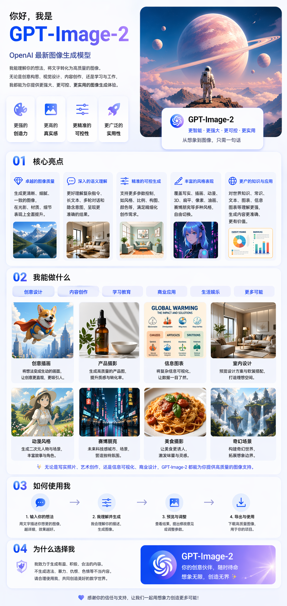

> **提示词**：用一张长图，介绍一下你自己的模型：GPT-Image-2。

这两张海报更能说明问题——**全是 GPT-image-2 生成的中文海报**，山西的古韵和重庆的魔幻，文字排版精准到可以直接印刷：

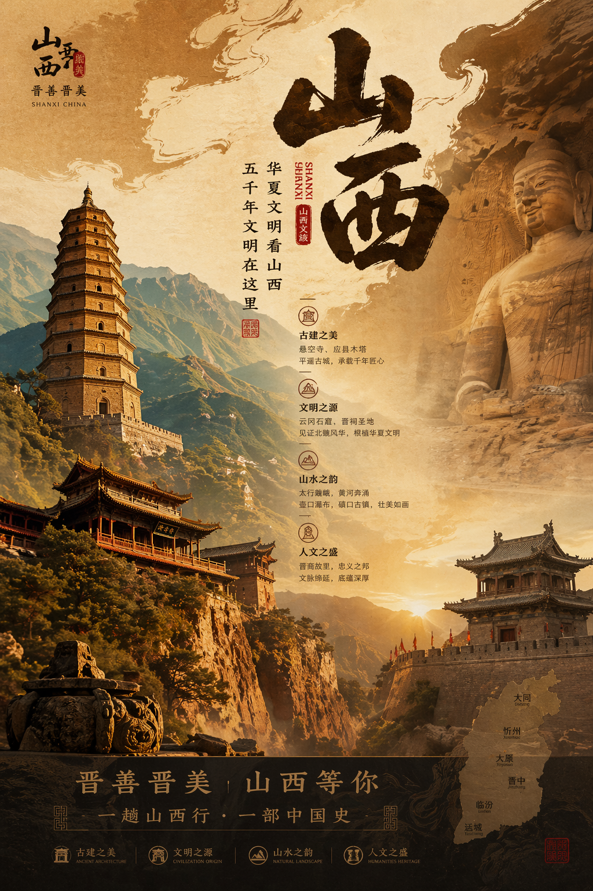

> **提示词**：生成一个山西文旅宣传的海报，要求风格大气、古朴，符合山西的风格。

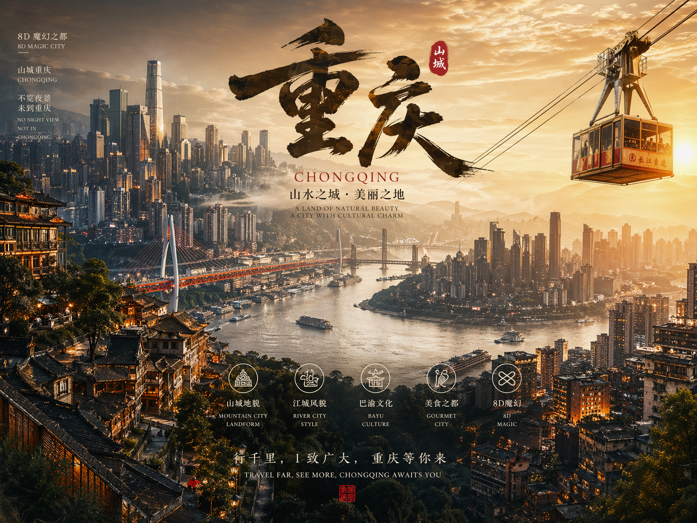

> **提示词**：再来一张重庆的城市宣传海报，符合重庆山城、魔幻8D城市的风格。

---

## 一句话总结

**GPT-image-2 不是换皮版的 DALL-E，而是一个会"先思考、再画画"的视觉推理引擎。** 它把 O 系列模型的逻辑能力注入了图像生成，解决了文本渲染、空间关系、物理规律三大历史顽疾，让 AI 出图从"玩具"变成了"工具"。

---

## 从 DALL-E 到 GPT-image-2：三代演进，扩散模型正式退休

如果你还记得 2023 年的 DALL-E 3，那时候 AI 画图的关键词是**"审美"**——画面好看，但细节全靠运气。文字？惨不忍睹。复杂场景？物体之间经常"穿模"。

OpenAI 内部其实也意识到了：**扩散模型（Diffusion）这条路，到头了。**

2025 年 3 月，GPT-image-1 发布，标志着 OpenAI 正式转向**自回归架构**（Autoregressive）。简单来说，就是像 GPT 生成文字一样，一个像素一个像素地"写"出图像，而不是像扩散模型那样从噪声里"搓"出来。

| 阶段 | 代表模型 | 核心特征 | 发布时间 |
|---|---|---|---|
| 扩散时代 | DALL-E 3 | 审美驱动，文本理解力受限 | 2023 年 |
| 自回归探索 | GPT-image-1 | 原生集成，开始支持复杂文本 | 2025 年 3 月 |
| 性能优化 | GPT-image-1.5 | 速度提升 4 倍，支持局部编辑 | 2025 年 12 月 |
| **推理时代** | **GPT-image-2** | **逻辑推理，2K/4K 分辨率，实时搜索** | **2026 年 4 月** |

> 2026 年 5 月，DALL-E 系列正式退役。这意味着扩散模型在 OpenAI 的版图里，彻底成为了历史。

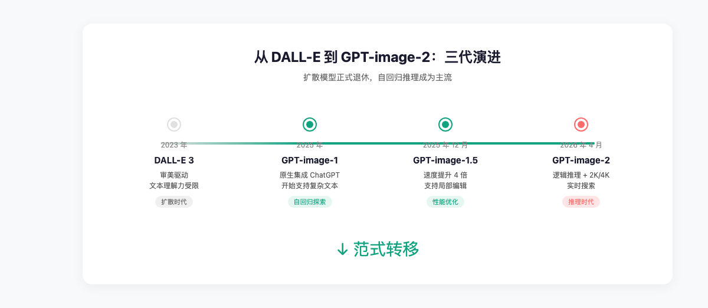

---

## "先思考、后绘画"：O 系列推理能力是什么体验？

GPT-image-2 最狠的升级，不是分辨率，不是速度，而是**它学会了"想"**。

传统的 AI 画图，你把提示词丢进去，模型直接开始生成——就像让一个人闭着眼睛画画，画到哪算哪。GPT-image-2 则完全不同：

**它在渲染第一个像素之前，会先启动一个 10-30 秒的"思考阶段"（Thinking Phase）。**

在这个阶段，模型会做什么？
- 分析提示词的深层含义
- 规划构图布局
- 检索必要的实时信息（比如最新的品牌 Logo、时事背景）
- 预先解决物体间的遮挡、物理互动关系

> 打个比方：以前的 AI 是"想到哪画到哪"，现在的 AI 是"先打草稿、再上色"。

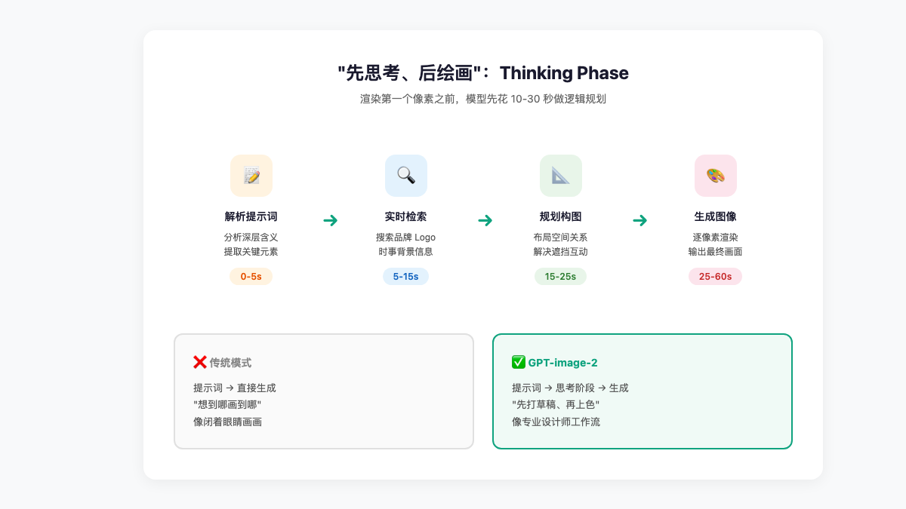

这种**"先思考、后绘画"**的模式，让 GPT-image-2 在处理复杂信息图表、多层嵌套指令的营销物料时，表现出前所未有的确定性。你让它画一张"2026 年波士顿马拉松的宣传海报，包含赞助商 Logo 和路线图"，它真的会去搜路线图的形状，而不是瞎编一个。

---

## 中文终于能看了！工业级文本渲染实测

如果说以前的 AI 生图有一个"阿喀琉斯之踵"，那一定是**文字**。

英文还好，一到中文、日文、韩文，那就是灾难现场——笔画缺失、字形扭曲、凭空造字，活像外星文。这也是为什么 AI 生成的海报、电商图，最后还得设计师手动 P 字。

GPT-image-2 彻底改写了这个局面。

### 99% 的文本准确率

在英文及主流西方语言的测试中，GPT-image-2 不仅能渲染清晰的大号标题，还能处理极小尺寸的 UI 标签、产品说明书上的细微文字。这种**"工业级"**的文本能力，意味着 AI 生成的图片可以直接进入生产流程，无需后期修补。

### 非拉丁语系的突破

更重要的是，GPT-image-2 是**首个在非拉丁语系中实现重大突破**的视觉模型。

| 语系/脚本 | 渲染能力描述 | 典型场景 |
|---|---|---|
| **中文（简体/繁体）** | 字形结构精准，无错别字或笔画缺失 | 电商海报、包装设计 |
| **日语（平假/片假/汉字）** | 支持各种字体风格，排版符合当地审美 | 漫画推文、街头招牌 |
| **韩语（谚文）** | 空间布局合理，文字与图形结合自然 | UI 原型、社交媒体图 |
| **印地语/孟加拉语** | 成功处理复杂的连字规则与变音符号 | 区域性公益海报、说明图 |

> 对于做跨境电商、本地化营销的同学来说，这意味着什么？**以前需要请本地设计师做的图，现在 AI 能直接出。**

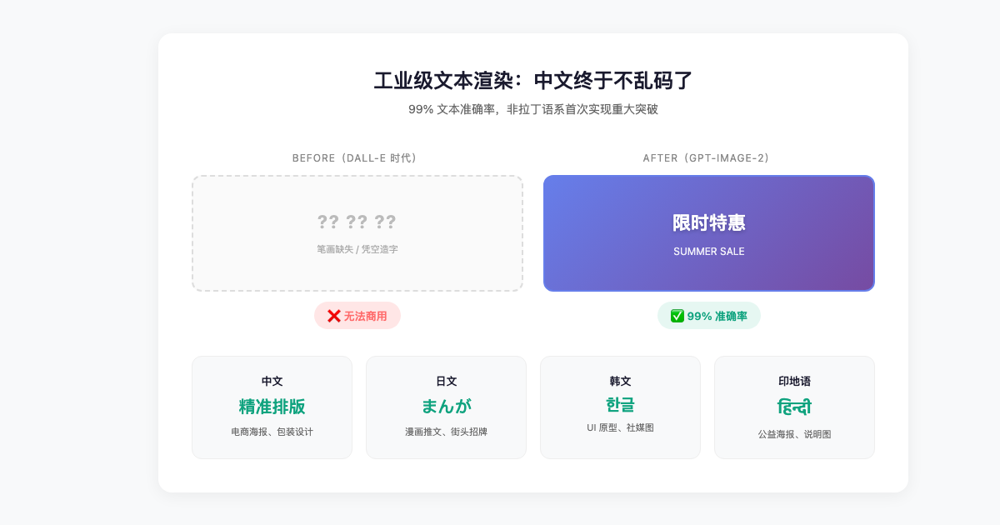

---

## 双模式工作流：3 秒出图 vs 30 秒精修

GPT-image-2 设计了一套**"双模式"**工作流，本质上是在效率与质量之间做取舍，把选择权交给了用户。

### 即时模式（Instant Mode）

- **响应时间**：3 秒以内
- **适用场景**：社交媒体配图、快速灵感探索、草图验证
- **特点**：快，但不做深度推理

### 思考模式（Thinking Mode）

- **响应时间**：30-60 秒
- **适用场景**：复杂商业海报、品牌物料、需要角色一致性的系列图
- **特点**：
  - 分析上传的参考图
  - 检索网络实时信息
  - 多轮自我博弈与逻辑检查
  - 支持生成多达 8 张图的连贯序列，确保角色、风格、物体在不同画面间的一致性

> 类比一下：即时模式是"微波炉热饭"，思考模式是"明火慢炖"。赶时间用前者，要品质用后者。

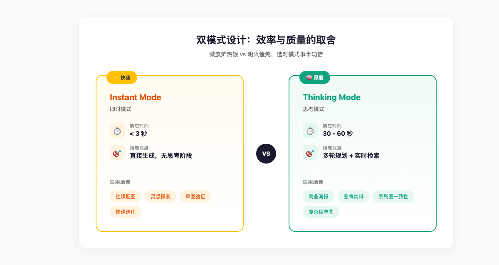

---

## API 定价：Token 计费，一张图多少钱？

对于开发者来说，GPT-image-2 的定价模型也变了——从"按张计费"变成了**"按 Token 计费"**。

| 计费项（每百万 Token） | 标准模式 | 批处理（Batch）模式 |
|---|---|---|
| 文本输入 | $5.00 | $2.50 |
| 图像输入（参考图） | $8.00 | $4.00 |
| 缓存图像输入 | $2.00 | $1.00 |
| 图像输出 | $30.00 | $15.00 |

以标准的 1024x1024 高质量渲染为例，**单张图片的综合成本约在 $0.21 左右**，较前代产品上涨约 60%。涨价的主要原因是推理步骤消耗的额外算力。

> 算笔账：如果你一天出 100 张图，成本大概是 21 美元（约 150 元人民币）。对于中小团队来说，不算便宜，但相比请一个全职设计师，还是划算得多。

另外，GPT-image-2 提供了**智能路由层**（Intelligent Routing Layer），开发者可以选择：
1. **传统模式**：自动适配 sm/image/xl 尺寸等级
2. **Token 模式**：从 6 个不同的 Token 桶（16 至 96）中选择，精细控制质量与速度

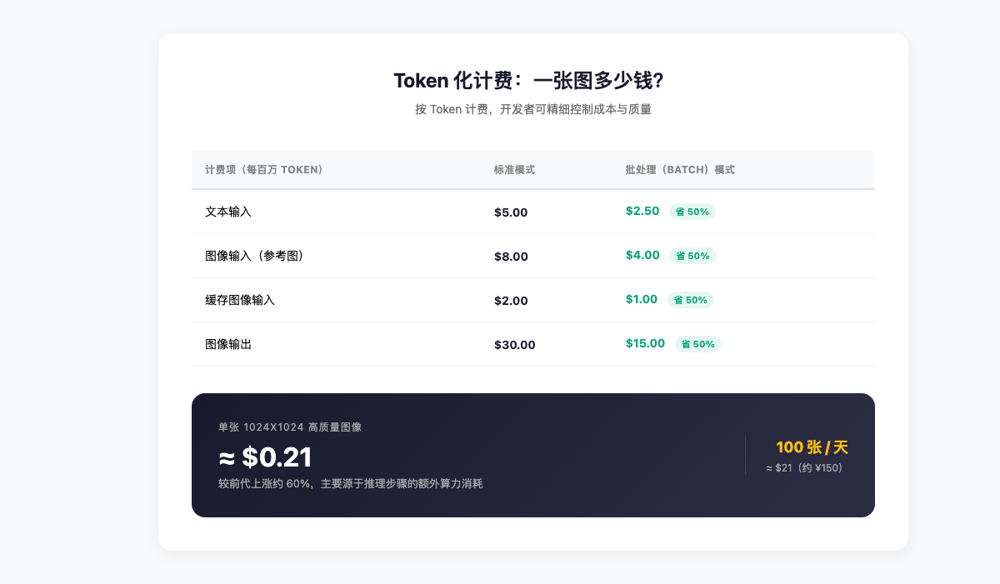

---

## 安全与溯源：C2PA 数字封泥 + "安全补全"机制

AI 画图越逼真，深度伪造（Deepfake）的风险就越大。OpenAI 在 GPT-image-2 中集成了全套安全防护机制。

### 多层安全栈

不是单一过滤器，而是**三层防御**：
- **上游拦截**：提示词进入前，识别并拒绝暴力、色情、针对真实政治人物的请求
- **输入监控**：评估上传的参考图，防止绕过安全限制
- **下游阻断**：像素渲染完成后、显示给用户前，再次分析画面内容

### C2PA 协议与数字水印

每一张生成的图像都强制嵌入了符合 **C2PA 标准**的元数据，记录了生成工具、时间、是否经过 AI 编辑。即使图像经过截图、裁剪或再加工，专业工具依然能溯源其真实出身。

### "安全补全"机制（Safe Completions）

这是 GPT-image-2 在内容治理上的一个创新。面对具有**双重用途**（Dual-use）的灰色地带提示词时，模型不会简单粗暴地拒绝，而是尝试将其转化为一个有益且安全的创意方案。

> 例如：用户请求生成"危险化学品实验"的示意图，模型可能会自动将其转化为"标准实验室安全规程演示图"，在满足视觉需求的同时剔除有害细节。

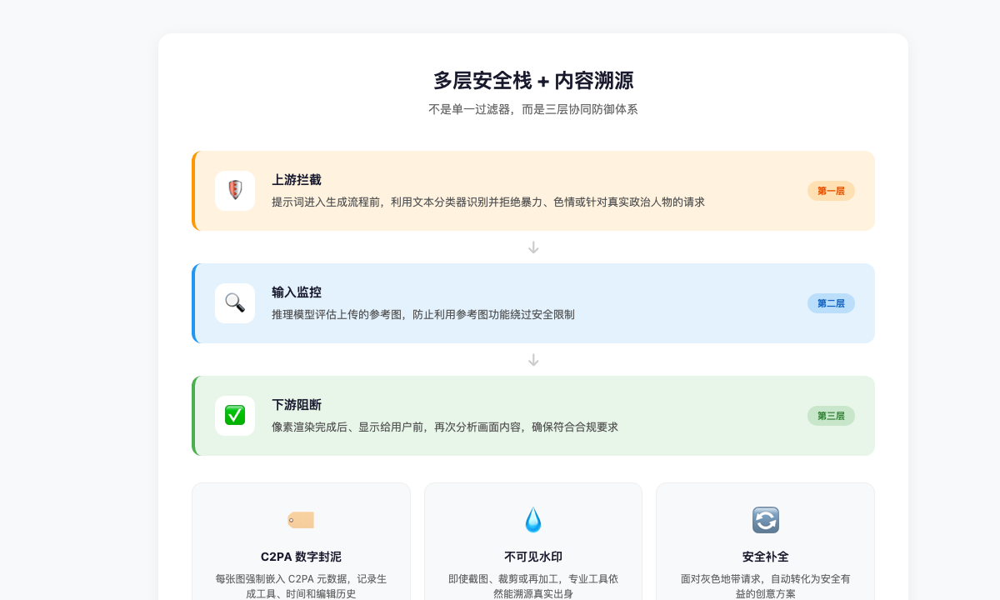

---

## 对比竞品：Midjourney、Flux、Nano Banana

2026 年中期的 AI 视觉市场，已经分化为三个阵营：

| 维度 | GPT-image-2 | Midjourney v7 | Nano Banana 2 | Flux 2 Pro |
|---|---|---|---|---|
| **LM Arena ELO** | **1512（第一）** | ~1200（估计） | 1265（第二） | 1265（并列第二） |
| **文本渲染** | 卓越，多语言 | 较好，仅限拉丁语 | 强，尤其东亚语 | 适中 |
| **推理能力** | 原生 O-系列 | 无 | 基础逻辑 | 无 |
| **生成速度** | 较慢（30-60s） | 中等（15-30s） | 极快（3-5s） | 快速（5-10s） |
| **API 灵活性** | 极高，Token 化 | 无官方 API | 高 | 开源/可自建 |

**结论很清晰**：
- 如果你追求**艺术表现力**，Midjourney 仍有微弱优势
- 如果你追求**速度**，Nano Banana 2 是王者
- 但如果你需要**精准排版、多语言文本、逻辑一致性、合规安全**，GPT-image-2 是目前唯一的**工业级解决方案**

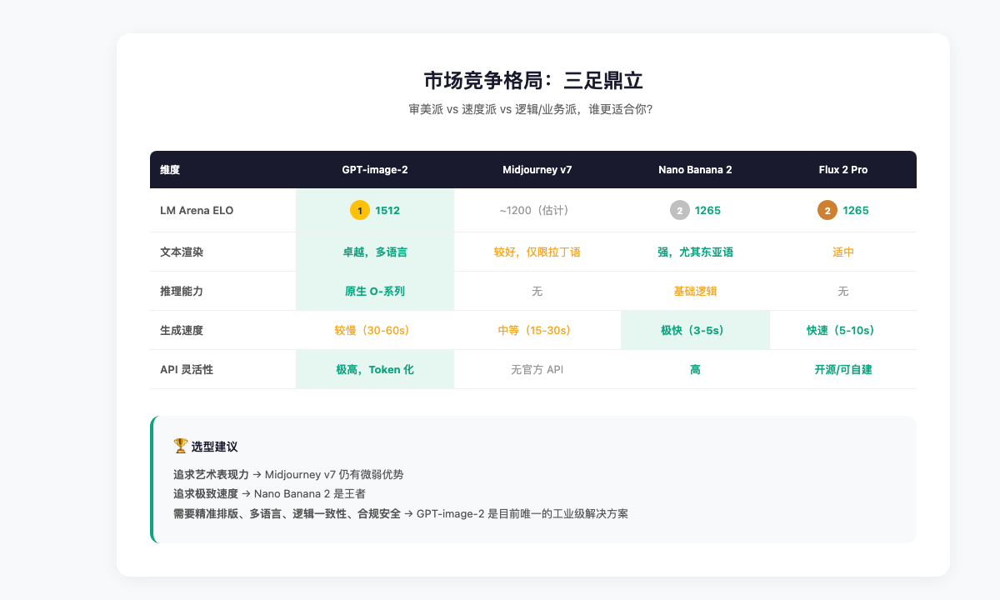

---

## 最小 Demo：5 个专业提示词技巧

想要充分发挥 GPT-image-2 的潜力，提示词策略需要升级。以下是 5 个实测有效的技巧：

### 1. 锚定物理参数

用摄影术语锚定视觉基调，比通俗的"Professional photo"有效得多：

```
Hasselblad, 90mm, f/2.8, studio lighting...
```

### 2. 用引号强制渲染文字

将需要准确显示的文字置于双引号内，可以显著提高多语言渲染的权重：

```
A promotional poster with the text "限时特惠" in bold red font...
```

### 3. 首句明确纵横比

提示词的首句应包含具体的纵横比指令，帮助推理阶段预先优化构图：

```
16:9 banner for a tech conference...
```

### 4. 启用人像锁

进行肖像编辑时，必须添加锁定指令，否则模型倾向于过度美化（AI-fication），导致身份特征丢失：

```
Keep my facial features exactly, do not change my identity...
```

### 5. 分步描述复杂场景

对于多层嵌套指令，用分号或编号拆解，降低模型的理解成本：

```
1. Background: modern office interior
2. Foreground: person holding a tablet
3. Text overlay: "Q3 Report" in the top right corner
```

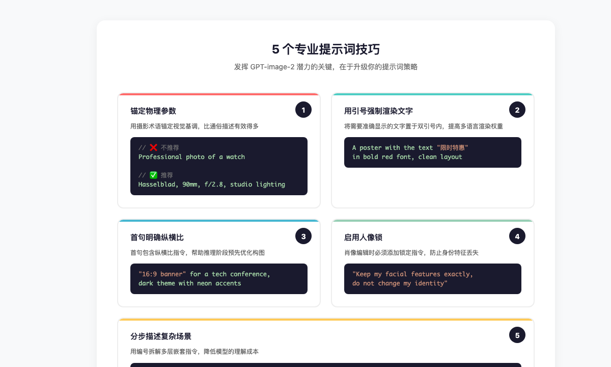

---

## 总结：从"像素合成"到"视觉智能体"

GPT-image-2 的诞生，不只是 OpenAI 图像模型的升级，更是其整体**"Agent 化"**战略的重要一环。

随着 DALL-E 系列正式退役，视觉生成将不再是一个独立的孤岛，而是与逻辑推理、实时搜索、代码执行深度融合的一站式工作流。

我们可以预见，在接下来的版本中，GPT-image-2 将进一步加强与 Sora 等视频生成模型的联动，实现从**"静态精准图像"到"动态连贯叙事"**的跨越。

对于企业而言，当前的 GPT-image-2 已经跨越了"娱乐用途"到"商用基石"的门槛。随着 C2PA 等溯源标准的普及和推理成本的进一步下行，这项技术将深刻改写广告、电商、传媒及软件工程等行业的视觉资产生产逻辑。

**2026 年，AI 画图不再是开盲盒。它开始像一位真正的设计师一样思考、推理、交付。**

---

> **参考来源**：OpenAI 官方技术文档、LM Arena 评测数据、GPT-image-2 API 定价页
