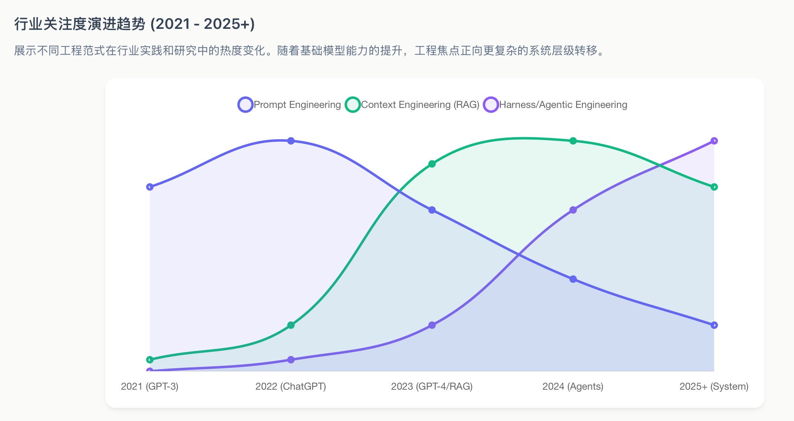
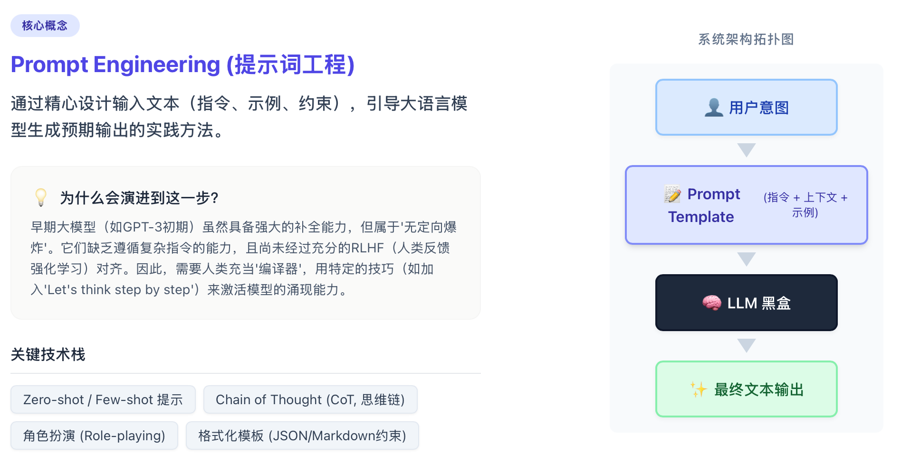
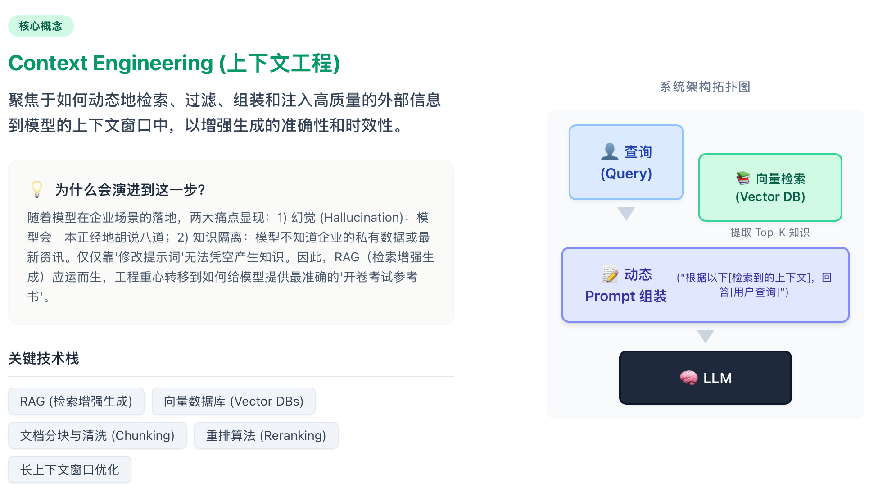
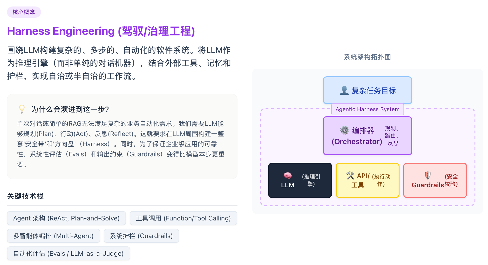
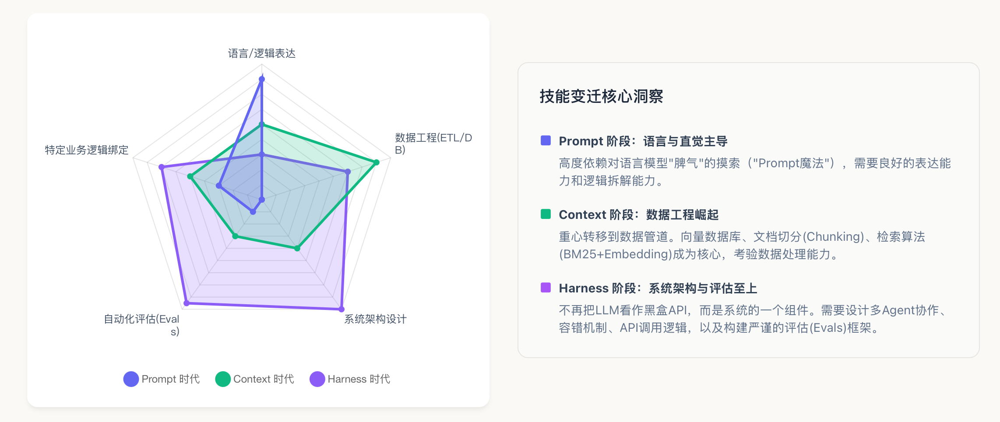

# 从大模型 Prompt 到 Harness 工程：一个工程师的三年进化史



> **一句话总结**：2022年我们研究怎么跟AI"好好说话"，2025年我们研究怎么给AI"喂对资料"，2026年我们研究怎么给AI"套上缰绳"。

---

## 写在前面

如果你是从2022年就开始玩ChatGPT的那波人，你一定经历过这样的心路历程：

- 刚开始："哇，这模型好强，我得学点Prompt技巧让它更听话"
- 过了一年："Prompt不够用了，得接向量数据库，搞RAG"
- 到了现在："模型能写代码了，但我不敢让它直接跑生产环境啊..."

这三年，不只是模型在变，我们工程师的"打法"也在变。

今天这篇文章，聊聊大模型工程化的三次"范式转移"——从Prompt工程，到Context工程，再到Harness工程。

---

## 第一阶段：Prompt工程——学会跟AI"好好说话"



### 那时候我们在折腾什么？

2022-2024年，Prompt工程是显学。

大家发现，同样的模型，换个说法问，结果天差地别。于是各种"Prompt技巧"层出不穷：

- **角色扮演**："你是一位资深Python工程师..."
- **思维链（CoT）**："Let's think step by step"
- **Few-shot示例**：给模型举几个例子，让它照着做

### 但Prompt工程有个"天花板"

玩久了你会发现几个问题：

**第一，太脆弱。**

研究表明，仅仅是调整示例的顺序，模型准确率能波动40%以上。你写"严格输出JSON"和"始终输出JSON"，结果可能完全不一样——后者说不定就给你加个尾随逗号，直接把下游程序干崩。

**第二，没记忆。**

模型不知道昨天跟你聊了什么，也不知道你公司内部的业务规则。每次对话都是"初见"。

**第三，难维护。**

Prompt没法版本化、难测试、难协作。一个人调好的Prompt，换个人就不知道怎么用了。

> **一句话**：Prompt工程优化的是"怎么说"，而不是"说什么"。当任务复杂到一定程度，光靠"说话技巧"是不够的。

---

## 第二阶段：Context工程——给AI配个"资料员"



### RAG来了

2025年，Context工程成为主流。

Andrej Karpathy（前OpenAI大神）说过一句话："单一的Prompt永远不足以支撑复杂的专业决策。"

这时候，**RAG（检索增强生成）**火了。

简单说，就是不让模型硬背答案，而是给它配个"资料员"——每次回答问题前，先从向量数据库里检索相关资料，塞进上下文里，让模型"开卷考试"。

### 我们在忙什么？

这个阶段，工程师的工作变成了：

- **搭向量数据库**（Pinecone、Milvus、Qdrant...）
- **做文档切片**（Chunking），把长文档切成合适的大小
- **搞重排序**（Reranking），让最相关的片段排在前面
- **算Token预算**，因为上下文窗口是有限的稀缺资源

```
可用上下文 = 模型上限 - 系统Prompt - 用户问题 - 预留输出
```

### 新问题："上下文腐烂"

但Context工程也有坑。

Transformer架构的计算复杂度是O(n²)，上下文越长，模型越"健忘"。虽然厂商宣称支持百万Token，但实测超过3.2万Token后，模型找关键信息的精度就断崖式下跌。

于是大家又开始搞：
- **层级记忆**：短期记忆 + 会话记忆 + 长期记忆
- **Context折叠**：把历史对话压缩成摘要，腾出空间

> **一句话**：Context工程解决了"信息从哪来"的问题，但没解决"模型乱来"的问题。

---

## 第三阶段：Harness工程——给AI造个"笼子"



### 为什么需要Harness？

2026年，AI Agent开始真正跑在生产环境里，一跑就是几小时甚至几天。

这时候，Prompt和Context工程彻底不够用了：

- 你Prompt写得再好，能阻止模型误删生产数据库吗？**不能。**
- 你Context给得再全，能在模型写崩CI/CD时自动回滚吗？**不能。**

**Harness工程**应运而生。

Harness本意是"马具"——用缰绳和鞍具把马的野性力量转化为可控的动力。在AI工程里，Harness就是环绕在模型周围的"笼子"，负责：
- 工具执行管理
- 状态持久化
- 错误恢复
- 权限控制
- 验证循环

### Harness的核心信条

> **大模型是不可信的随机引擎，必须把它关在确定性代码构建的笼子里运行。**

Mitchell Hashimoto（HashiCorp创始人）说得好：

> "每当智能体犯错，不要指望它下次变好，而要修改它的操作环境，让它物理上不可能再犯同样的错。"

### Harness的三层架构（CAR模型）

#### 1. 控制层（Control）：定规矩

- **AGENTS.md**：项目的"唯一事实来源"，定义架构规则、命名规范、执行禁忌
- **Linter规则**：硬性约束代码结构，比Prompt里写"请遵循分层设计"有效100倍
- **权限清单**：明确模型能访问哪些文件、能执行哪些命令

#### 2. 代理层（Agency）：给工具

- **MCP服务器**：标准化的工具连接协议，带身份验证的读写操作
- **沙箱环境**：每个任务在隔离容器里跑，错了也能回滚

#### 3. 运行时层（Runtime）：保平安

- **检查点/回滚**：任务卡住或陷入死循环时，自动回到上一个安全点
- **验证循环**：模型生成的代码先跑一遍测试，失败就把错误信息喂回去让它自修复

**一个真实案例**：LangChain在Harness里加了自验证循环，代码生成准确率从52.8%提升到66.5%——**没换模型，纯靠工程**。

---

## 我们工程师，变成了"环境设计师"



### OpenAI Codex实验的启示

2026年2月，OpenAI公布了一个案例：

3个工程师，5个月，交付100万行生产代码，**人类一行代码没写**。

他们做了什么？
- 拆解需求，变成智能体能消化的小任务
- 写端到端测试（Playwright脚本），智能体必须通过才能合并代码
- 监控产出质量，发现模式化缺陷就更新`AGENTS.md`或加Linter规则

结果：平均每天合并3.5个PR，而且项目越大效率不降。

**结论**：AI时代，工程师的核心竞争力不再是打字速度，而是"设计确定性环境"的能力。

### "Vibe Coding" vs "工业级Harness"

现在行业里有两个流派：

| | Vibe Coding | 工业级Harness |
|---|---|---|
| **风格** | 感觉驱动，接受-迭代循环 | 规则驱动，机械执行 |
| **适用** | 原型开发、个人项目 | 生产环境、企业级应用 |
| **问题** | 复杂业务逻辑下迅速崩溃 | 前期投入大，但可规模化 |

---

## 三代范式对比：一张图看懂

| 维度 | Prompt工程<br>（2022-2024） | Context工程<br>（2025） | Harness工程<br>（2026+） |
|---|---|---|---|
| **核心问题** | 怎么问？ | 喂什么？ | 怎么管？ |
| **工程隐喻** | 给新员工下指令 | 给研究员配资料 | 给野马套缰绳 |
| **关键技术** | CoT、Few-shot、角色扮演 | RAG、向量DB、Token预算 | MCP、沙箱、验证循环 |
| **信任基础** | "求求你好好答" | "有据可查" | "物理上不可能出错" |
| **代表工具** | LangChain Prompts | Pinecone、LlamaIndex | Claude Code、Harness AI |

---

## 2026年：行业标准正在形成

### 两个关键协议

- **MCP（Model Context Protocol）**：Anthropic推动，标准化工具连接
- **ADK（Agent Development Kit）**：谷歌发布，多智能体协作框架

### 平台级产品

- **Harness.io**：推出"Human-Aware Change Agent"，深度集成Jenkins/GitHub Actions，能自动关联Slack里的故障对话，生成修复PR并在沙箱里验证

### "AI友好"的代码风格

越来越多的团队开始：
- 用TypeScript + Zod（强类型、自文档化）
- 写极简、高内聚的模块

**逻辑很简单**：代码越清晰，Harness越强；Harness越强，AI生成的代码质量越高——正反馈循环。

---

## 写在最后

三年时间，我们从"学会沟通"到"学会赋能"，再到"学会统御"。

这不是术语游戏，而是AI从"聊天机器人"进化到"自主智能体"的必经之路。

未来的工程师，可能不需要写太多业务代码，但必须会设计Harness——

**把人类经验、直觉和治理意图，转化为机器可执行的约束。**

代码将由智能体大规模生成，而文明的稳定性，将由Harness工程来守护。
