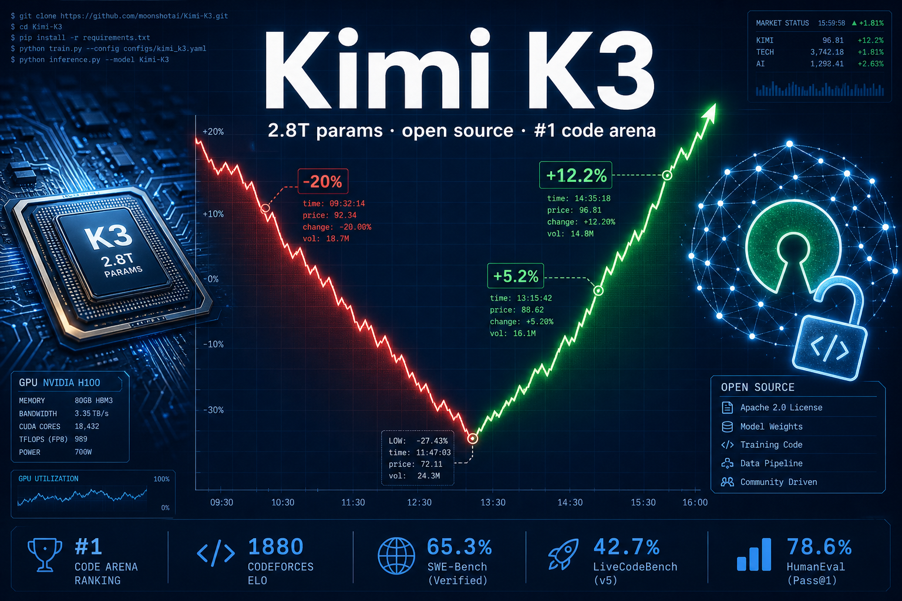
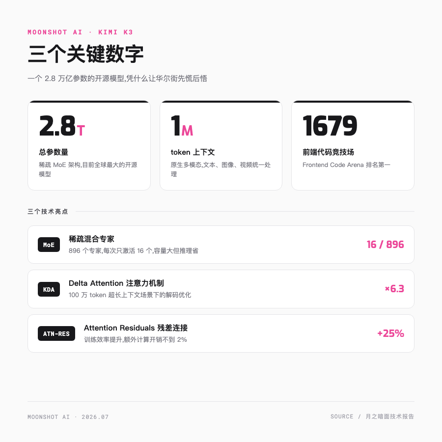
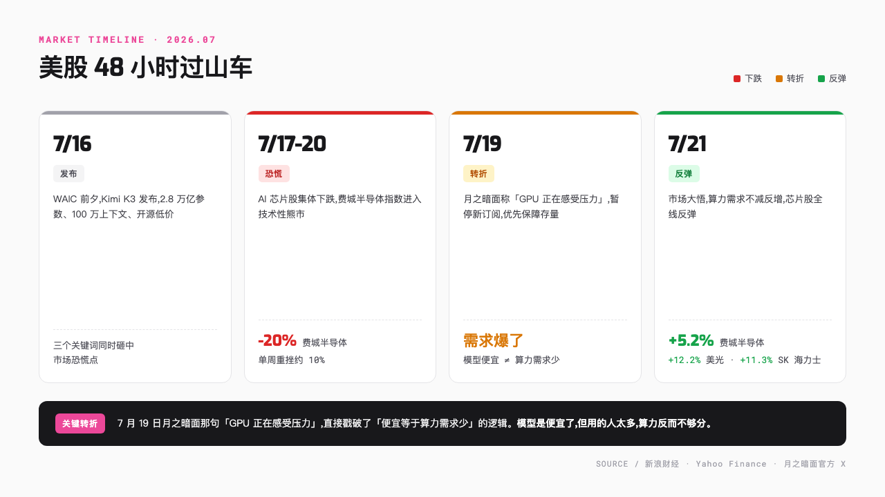
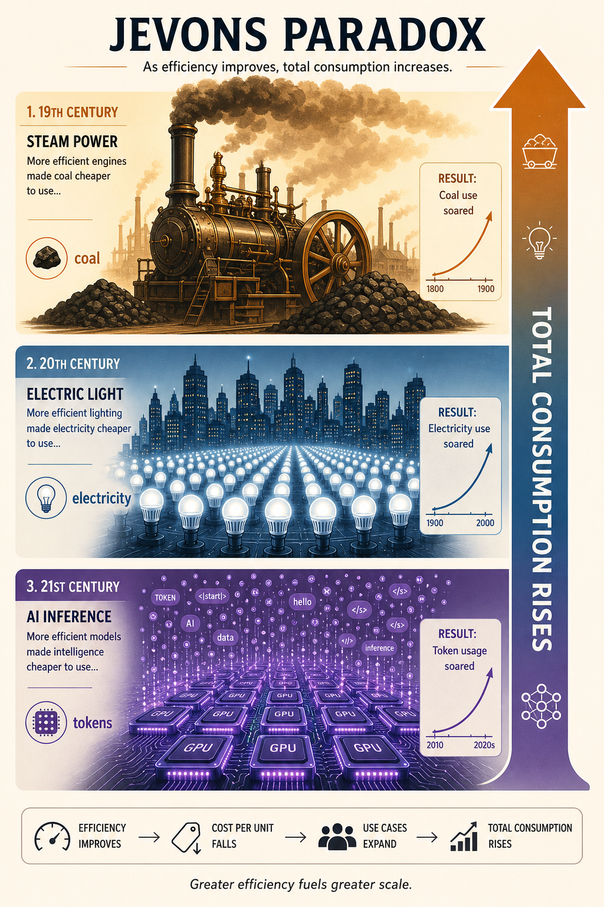
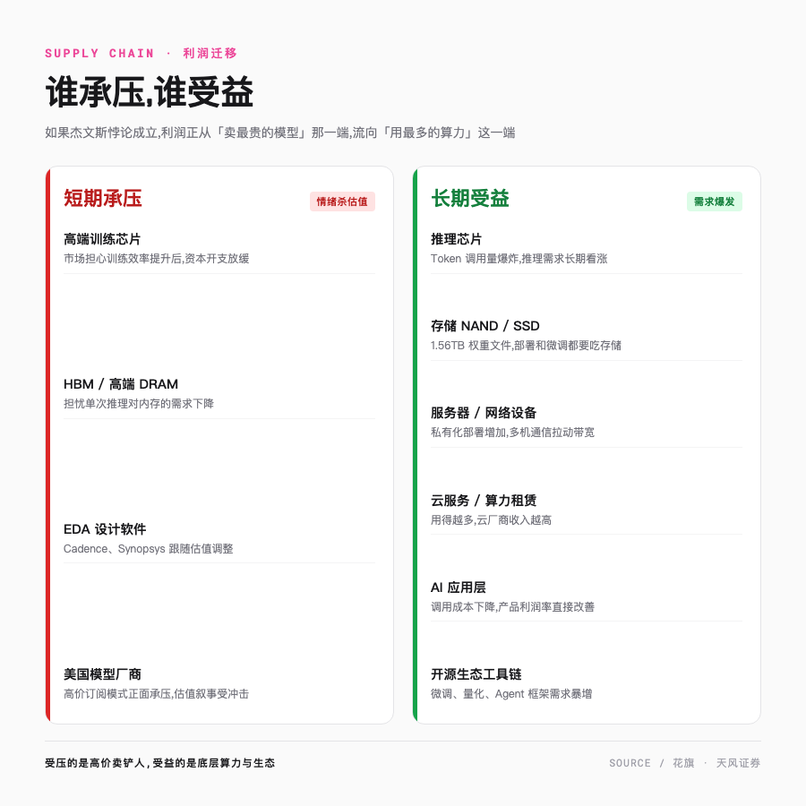

# 2.8 万亿参数、登顶代码榜,Kimi K3 把美股芯片股打崩后,它们怎么又涨回来了

> 一个中国 AI 公司发了款新模型,华尔街先崩为敬,四天后又排队买回来。

---

2026 年 7 月 17 日,美股开盘,AI 芯片股集体跳水的画面,熟悉得让人有点恍惚。

英伟达在跌,美光在跌,连 Cadence 这种卖 EDA 设计软件的都在跌。费城半导体指数从 6 月的高点一路摔下来,跌幅超过 20%,正式滑进技术性熊市。单周重挫约 10%,是 2025 年 4 月以来最惨的一周。

亚洲市场的存储芯片龙头也跟着大幅回调。媒体的标题写得整齐划一,DeepSeek 2.0 来了,中国低价开源模型又要瓦解美国算力信仰。

引发这场地震的,是月之暗面前一天在世界人工智能大会前夕发布的 Kimi K3。

但故事没按套路走。四天后,剧情整个反转。7 月 21 日,费城半导体指数单日反弹 5.2%,美光一口气涨了 12.2%,闪迪、西部数据、SK 海力士 ADR 涨幅都在 11% 到 14%,AMD、台积电这些大块头也都涨了 5% 上下。前一周还在恐慌性抛售的人,这一周又在排队买回来。

**模型更便宜了,卖芯片的反而更值钱了。**

按常理,便宜的模型该让算力贬值,开源该砸碎闭源的护城河。可华尔街一帮最精明的人,凭什么四天里被同一个事实教育了两遍?

要讲清楚这件反常识的事,得先看看 Kimi K3 到底是个什么来头。

---

## 一个 2.8 万亿参数的「瘦子」

先把 Kimi K3 是什么,用三组数字说清楚。**2.8 万亿**的总参数,是目前全球最大的开源模型;上下文窗口拉到 **100 万 token**,原生支持文本、图像、视频;前端代码竞技场 Frontend Code Arena 拿到 **1679 分**,排名第一。

第一组数字最唬人,但也最容易误导。

Kimi K3 用的是稀疏 MoE 架构,中文叫混合专家模型。打个比方,它像一家有 896 位专科医生的超级医院。但每个病人进门,挂号系统不会把全部医生都叫来会诊,而是精准地挑出 16 位最对口的,其余 880 位在休息。

结果是,模型的总「脑容量」做到了 2.8 万亿,但每次回答问题时真正在干活的激活参数,只有几百亿这个量级。不同第三方评测给出的有效激活参数在 500 亿到 1040 亿之间,说法还没完全统一。容量和成本两头占,这是当下大模型最主流的省钱套路。所以与其说它是个 2.8 万亿的胖子,不如说是个看着壮、实际很精瘦的家伙。

Kimi K3 在工程上能立住,靠的是两个自研的注意力机制优化,这俩是月之暗面技术报告里的硬货。

一个叫 KDA(Kimi Delta Attention)。注意力机制是大模型处理长文本的核心瓶颈,文本越长,计算量越像雪球一样往下滚。KDA 这个改良,在 100 万 token 的超长上下文场景下,把解码速度提了 6.3 倍。以前读一本长篇会卡顿的地方,现在能基本顺滑读完。

100 万 token 也不是堆上去就行的。月之暗面用的是渐进式上下文训练,模型在训练里一步步把上下文拉长,没搞一刀切塞到 100 万。配套的还有一批合成的超长任务,这些任务必须真正读完全局 100 万 token 才解得出来,逼着模型去学全局推理,堵死了局部取巧的路。

另一个叫 Attention Residuals,用在训练阶段,把训练效率提了 25%,额外只多花不到 2% 的算力。花很小的代价,就能让模型学得更快。

还有量化。Kimi K3 的权重用 MXFP4 格式存储,激活用 MXFP8。量化通俗讲,就是把模型里那些精度很高的数字,从小数点后七八位压到两三位,用一点精度损失换大幅省内存、省算力。这也是为什么一个 2.8 万亿参数的模型,权重文件「只」有 1.56 TB。

注意这个「只」字。不量化的话,这个数字还得翻好几倍。但对个人玩家来说,1.56 TB 依然是道劝退的门槛。

---

## 登顶代码榜,还顺手做了颗芯片

技术规格吹得再漂亮,最后还是得看战绩。Kimi K3 这次的成绩单,确实有点东西。

在 Frontend Code Arena 这个前端代码竞技场上,Kimi K3 拿了 1679 分,直接冲到第一,超过了 Claude Fable 5 的 1631 分和 GPT-5.6 Sol 的 1618 分。要知道,上一代 Kimi K2.6 还只排第 18 名,这一代一口气跃升了 17 位。连马斯克都在相关报道下留了句「令人印象深刻」。

还有一个背景容易被分数盖过去。Kimi K3 是在美国芯片出口管制下训练的,用的不是最顶配的卡,性能却摸到了前沿模型的门槛。手里牌没那么好,打成这样,马斯克那句话算说到点子上了。

月之暗面自己的表态倒是很克制。他们说,整体上仍然落后于最强的闭源模型 Claude Fable 5 和 GPT-5.6 Sol,但稳定超过其他所有模型。在 Artificial Analysis 的第三方综合评测里,它的智能水平已经接近全球前沿闭源模型。

但比起榜单分数,有两个 Agent 案例更让我多看两眼,确实有点离谱。

在 48 小时的连续 Agent 运行里,Kimi K3 独立完成了一款芯片的构建、优化与验证,几乎不需要人工监督。它在大型代码库里来回穿梭,自己协调终端工具,把活儿干完。48 小时,一颗芯片,中间没人怎么插手。

还有一个更离谱的。Kimi K3 大约花了 2 小时,复现了计算天体物理学里著名的 I-Love-Q 普适关系。这是一条描述中子星转动惯量、Love 数和四极矩之间关系的规律,正常情况下,资深研究者要花一到两周才能完成。模型没去翻文献抄答案,是自己一步步推出来的。

以前 Agent 一直落不了地,缺的不是聪明,是这种能坐下来连干 48 小时的耐心。长上下文加上默认开启的推理模式,正好补上了这一块。

一个有意思的细节是,Kimi K3 推理模式默认开启。也就是说,它不等你切换到「深度思考」,默认就会先把问题想一遍再回答。这在当前这批大模型里,算是个相当激进的选择。

---

## 48 小时,市场坐了一趟过山车

技术归技术,但把这把火烧到全球的,是接下来这趟过山车。

16 号发布当天,2.8 万亿参数、100 万上下文、原生多模态,再加上开源和低价,三个关键词同时砸中市场的恐慌点。

接下来三天,恐慌蔓延。美股 AI 芯片股集体下跌,费城半导体指数从高点回落超过 20%,进入技术性熊市。市场的逻辑很朴素,模型效率提升了,训练和推理是不是就不需要那么多高端芯片了?

真正的转折出现在 19 号。月之暗面在官方 X 上说了一句很关键的话,Kimi K3 收到的喜爱远超预期,GPU 正在感受到压力。然后暂停了新订阅,优先保障现有用户体验。

这句话分量很重。它直接戳破了前面那套「便宜等于算力需求少」的逻辑。模型是便宜了,但用的人太多了,算力反而不够分。

到了 21 号周一,市场大悟。同一天,Alphabet 发财报,把 2026 年的资本开支指引提高到了 1950 到 2050 亿美元,谷歌云依然受制于算力不足,还在到处向外租用算力。芯片股全线反弹,费城半导体指数涨 5.2%,美光涨 12.2%。

看上去最不缺算力的谷歌,都要满世界找卡。这个信号,比任何研报都有说服力。

---

## 一个 150 年前的悖论,解释了这一切

到这里,问题来了。为什么模型更便宜、更高效,算力需求反而更大?

答案藏在一个 150 多年前的经济学悖论里。

1865 年,英国经济学家威廉·斯坦利·杰文斯研究煤炭问题时发现了一个反直觉的现象。瓦特改良的蒸汽机效率大幅提高,烧同样多的煤能干更多的活,按理说英国应该省下大量煤炭。结果恰恰相反,因为用煤的成本降了,蒸汽机被装到了越来越多原来用不起的场合,英国的煤炭总消耗量不降反升,翻了好几倍。

效率提升,反而带来总消耗的增加。这就是后来以他名字命名的**杰文斯悖论**。

这个悖论在生活里其实随处可见。汽车油耗降了,开车的人就多了,石油总消耗上升。LED 灯比白炽灯省电得多,结果人类把灯装到了以前根本不会发光的地方,楼宇亮化、景观照明、屏幕背光,总用电量也没见少。

**AI 正在重演同样的剧本。**

单次推理的成本已经降了大约 95%。按「便宜等于需求少」的逻辑,算力总需求早该萎缩。实际情况是,模型越便宜,企业越舍得把 AI 塞进越来越多的流程里。客服、写作、编程、搜索、数据分析,以前算不过来的账,现在都算得过来了。Token 的总调用量呈指数级增长。

**增长的速度,远远盖过了单次成本下降的速度。**

这就是花旗那份报告标题的意思,More Tokens, More Chips。Token 越多,需要的芯片越多。天风证券的分析师说得更直白,连看上去最不缺算力的谷歌都要向外租用算力,说明基础层已经是一个彻底的卖方市场。

真正被压的不是卖铲子的人,而是高价卖铲子的人。所以受冲击最直接的,是 OpenAI、Anthropic 这种靠高价订阅和 API 赚钱的模型服务商。而底层卖算力的英伟达、美光、台积电,需求没缩,反而被添了把柴。

当然,这套逻辑也有反方。说实话,我也没法把这些人完全驳倒。他们担心的是,如果 AI 应用的增长慢于效率提升的速度,半导体需求可能提前见顶,美国科技巨头每年几千亿美元的数据中心投资,会不会砸过头了。这是个还没定论的问题。但至少从 7 月 21 日那根大阳线看,市场当下押的是「没砸过头」。

---

## 谁受伤,谁躺赚

如果杰文斯悖论成立,那么 AI 产业链的利润,正在发生一次静悄悄的迁移。

短期被情绪杀的,主要是那些「高价卖铲子」的环节。Cadence、Synopsys 这种 EDA 厂商跟着估值一起抖;HBM 和高端 DRAM 被担心单次推理不再那么吃内存;压力最大的还是 OpenAI、Anthropic 这种靠高价订阅吃饭的模型厂商。它们计划上市的时间点都不算巧,OpenAI 盯着 2027 年初,Anthropic 盯着 2026 年秋天,叙事正好承压。

但把时间拉长,受益的那一头,逻辑要扎实得多。

最直接的是推理芯片。Token 调用量爆炸,推理需求长期看涨,这是杰文斯悖论最直白的兑现。

让我意外的是存储。Kimi K3 的权重文件 1.56 TB,部署、微调、缓存,每一步都在吃存储。前面那个让我调侃「只」有 1.56 TB 的数字,在这里变成了真金白银的硬盘订单,NAND 和数据中心 SSD 的需求跟着水涨船高。

还有 AI 应用层。这正是开头那个反常识的另一面,调用成本下来了,以前算不过来的账,现在都算得过来了,做应用的利润率直接改善。云服务、服务器、开源工具链,逻辑都类似,模型越便宜,用的人越多,底层卖算力和卖工具的就越忙。

说到底,利润正从「卖最贵的模型」那一端,流向「用最多的算力」这一端。

---

## 不是价格战,是基础设施化

回到开头那个问题。为什么模型更便宜,卖芯片的反而更值钱?

因为 Kimi K3 们并没有把算力变得不值钱,反而把它变得人人用得起。当一个东西便宜到可以随手调用,它就从「稀缺商品」变成了「水电气」一样的基础设施。

水电气,从来都不是小生意。

7 月 27 日,月之暗面兑现承诺,把完整的 Kimi K3 权重放上了 Hugging Face,1.56 TB,96 个分片文件。从这一天起,任何一个有足够硬件的团队,都可以在自家机房里跑起一个接近 GPT-5.6 和 Claude Fable 5 水平的模型。开源,把「能不能用上」这个问题,变成了「买多少卡」的工程问题。

而只要这个问题变成工程问题,卖卡的人,就永远不愁生意。

Kimi K3 不是又一个 DeepSeek。它证明的是一件更长远的事,当模型足够便宜、足够开放,算力会从少数巨头圈起来的围墙,变成所有人脚下共同的地基。

围墙推倒之后,能盖多高的楼,现在谁也算不准。但有一点是确定的,想在地基上盖楼的人越多,打地基的人就越忙。

---

欢迎关注我的公众号「Chyris Tech Note」,获取更多 AI 技术解读与实践分享。

