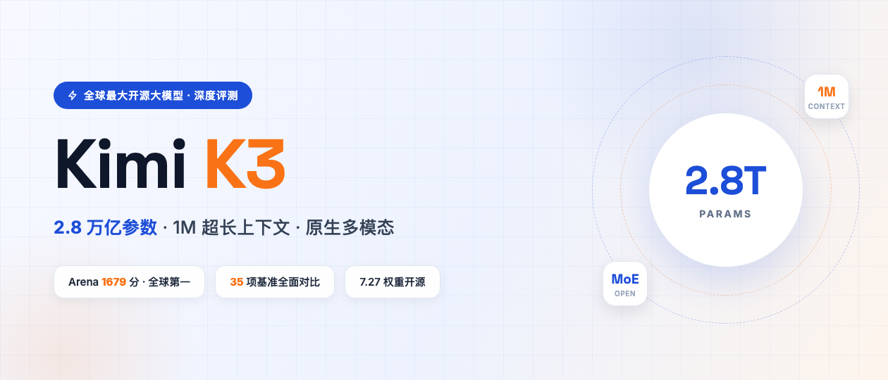
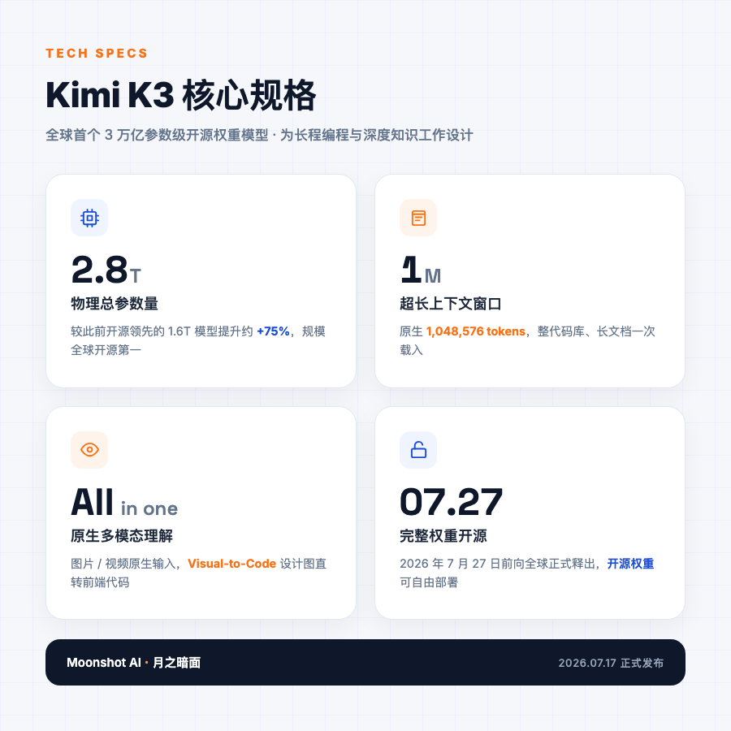
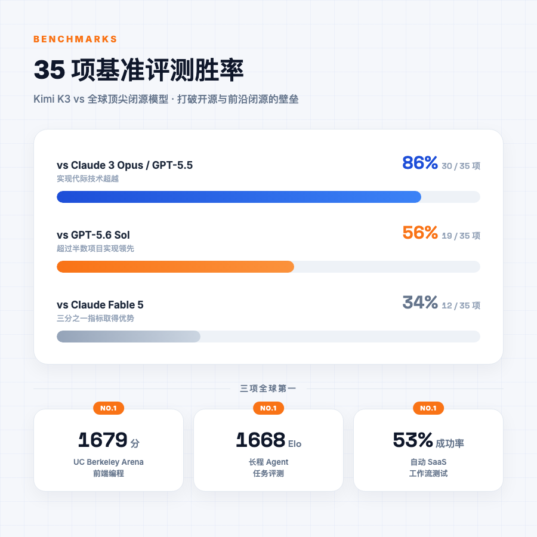
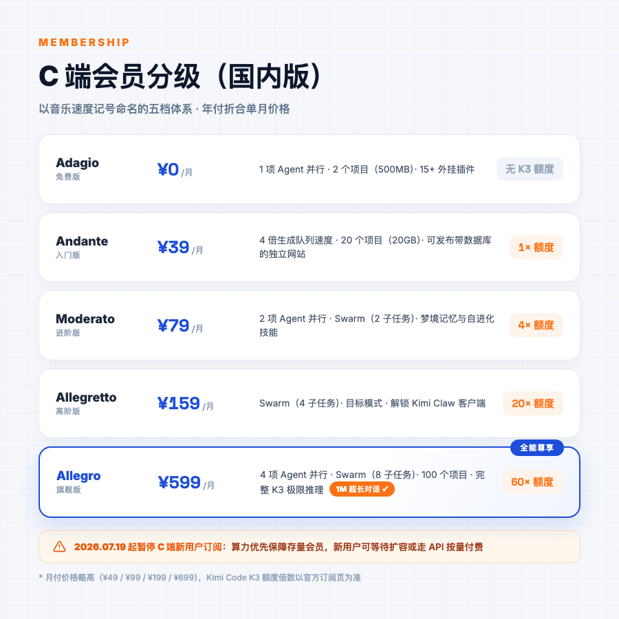
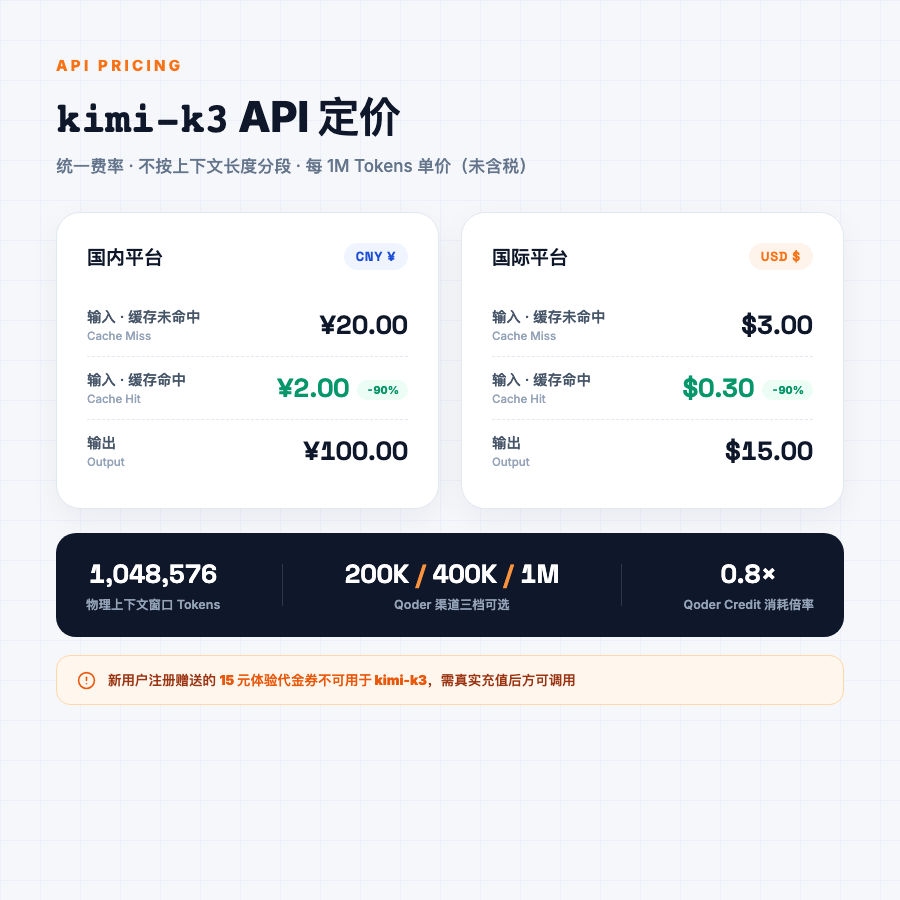
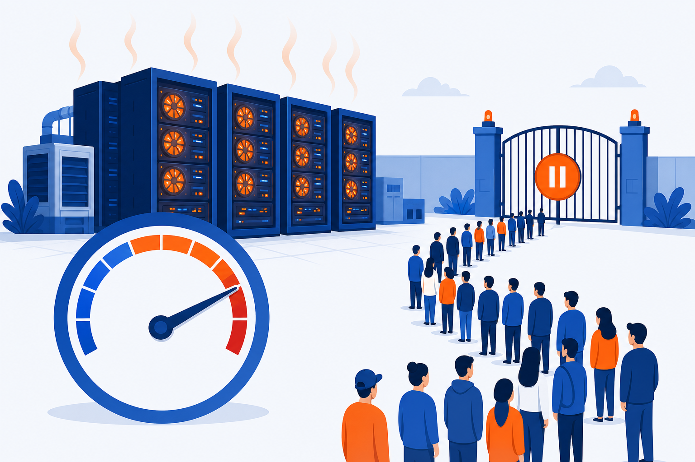

# 全球最大开源大模型 Kimi K3：2.8T 参数深度评测与订阅机制全景调研

## Kimi K3 技术架构设计与硬件部署要求

月之暗面（Moonshot AI）于 2026 年 7 月 17 日正式发布了其最新一代旗舰大模型 Kimi K3。作为全球首个参数量达到 3 万亿级别的开源权重模型，其物理总参数量达到了 2.8 万亿（2.8T），规模较此前处于开源领先地位的 1.6 万亿参数模型提升了约 75%。该模型原生支持多模态视觉理解，并具备 100 万个 Token（1M）的超长上下文检索窗口，专为长程编程、深度知识工作和复杂推理场景而设计。月之暗面宣布，Kimi K3 的完整模型权重将于 2026 年 7 月 27 日前向全球正式开源释出。

## 性能测试评估：基准数据与真实生产力实测

在综合智能与任务表现层面上，来自全球的多家学术机构、工业界评测平台以及社区真实场景的评测数据，为 Kimi K3 的性能提供了全方位的画像。整体而言，Kimi K3 在综合智能水平上已极度逼近当前最顶尖的闭源大模型，但受限于单模态推理速度及默认的高强度思考模式，其在响应延迟上仍存在一定的局限。

### 主流评测基准与多维度 Elo 表现

在汇总的 35 项核心主流学术及工程评测基准中，Kimi K3 展现出了强大的竞争力，打破了开源模型与前沿闭源模型之间的壁垒：

| **评估维度 / 测试平台**          | **Kimi K3 成绩与表现**               | **对比模型及行业基准表现**                  | **数据结论与核心技术定位**                                   |
| -------------------------------- | ------------------------------------ | ------------------------------------------- | ------------------------------------------------------------ |
| **聚合基准评测 (35项测试)**      | 赢下 12 项 (胜率 34%)                | 对比 Anthropic Claude Fable 5               | 虽未整体超越，但在三分之一的指标上取得了优势。               |
| **聚合基准评测 (35项测试)**      | 赢下 19 项 (胜率 56%)                | 对比 OpenAI GPT-5.6 Sol                     | 在超过半数的项目上实现了领先。                               |
| **聚合基准评测 (35项测试)**      | 赢下 30 项 (胜率 86%-88%)            | 对比 Claude 3 Opus / GPT-5.5                | 实现了代际的技术超越。                                       |
| **UC Berkeley Arena 前端编程**   | **1679 分 (全球第一)**      | Fable 5 (1631 分)、Sol (1618 分)            | 首次亮相便登顶。在数据分析、游戏开发、网页设计等 6 个子类别中拿下第一。 |
| **Vals AI 综合性评测**           | 全球第二                             | 介于 Fable 5 与 GPT-5.6 Sol 之间            | 确立了全球顶级的通用推理与代码生成能力。                     |
| **Artificial Analysis 智商指数** | 57 分                                | 与 GPT-5.5、Claude Opus 4.8 相当            | 指数评估相对审慎，但在多轮长程对话中仍处于领先梯队。         |
| **AA-Briefcase 长程知识工作**    | **1547 / 1527 Elo**      | 仅次于 Fable 5，超越 GPT-5.6 Sol Max (1495) | 显示出在超长上下文处理上的逻辑连续性优势。                   |
| **长程 Agent 任务评测**          | **1668 Elo**                | 排名第一，领先于 Opus 4.8 和 GLM-5.2        | 能够支撑在极少人工干预下的超长跨度复杂工作流。               |
| **自动 SaaS 工作流测试**         | **53% 的成功率 (全球第一)** | 处于开源及闭源模型的绝对领先地位            | 证实了其执行复杂应用逻辑与工具调用的可靠性。                 |

### Kimi K3 核心能力矩阵

基于官方 API 文档、第三方评测以及社区实测，Kimi K3 对开发者的核心价值可从以下七个维度概括：

| **能力维度**       | **具体表现**                                                                 | **典型开发者场景**                                                   |
| ------------------ | ---------------------------------------------------------------------------- | -------------------------------------------------------------------- |
| **超长上下文**     | 原生 1,048,576 tokens（1M）上下文窗口，整代码库、长文档、多轮对话可一次载入。 | 代码库全局分析、长篇技术文档问答、长程 Agent 记忆。                 |
| **代码与软件工程** | Frontend Code Arena 1679 分登顶；Terminal Bench 2.1 88.3 分；支持复杂多文件工程。 | 前端页面生成、全栈项目搭建、代码重构、Bug 修复、单元测试生成。      |
| **原生视觉理解**   | 支持图片、视频作为输入；Visual-to-Code 能力强；可生成详细 Alt Text。         | UI 设计图还原为代码、截图 Bug 定位、视频内容摘要、前端动效生成。   |
| **工具调用与 Agent** | 支持 ToolCalls、`tool_choice`、动态加载工具；可执行多轮外部工具调用。         | 自动化研究、SaaS 工作流、数据库/搜索引擎集成、CI/CD 自动化。         |
| **结构化输出**     | 支持 `json_schema` / `response_format`、JSON Mode、Partial Mode。               | API 返回格式化、数据抽取、表单生成、配置文件产出。                  |
| **长程自主性**     | 可持续数小时甚至数天运行，在 120+ 轮自我改进中完成万字研报级别任务。           | 行业深度研报、科学研究复现、复杂数据处理流水线、长期监控任务。      |
| **推理能力**       | 默认 always-on max 推理；后续将开放 low / high 档位。                         | 数学证明、复杂逻辑推理、算法设计、高难度问题分析。                   |

> **API 能力补充**：Kimi K3 官方 API 支持文本、图片、视频输入；输出流式返回时同时提供 `reasoning_content`（推理过程）和 `content`（最终答案）。开发者可据此构建“展示思考过程”的交互体验。视觉输入不支持公网图片 URL，需使用 base64 或 `ms://` 文件引用。

### 真实多模态交互与审美直觉对比

得益于在预训练阶段就将视觉数据与文本数据融合训练的“All in one”设计，Kimi K3 在“Visual-to-Code”（视觉动效转代码）和审美直觉上展现出了独特的优势：

- **动态图形生成（鹈鹕测试与动态模拟）**：在 Simon Willison 著名的“自行车上的鹈鹕”测试中，Kimi K3 生成了带有红围巾、蹼状橙色脚踩踏板等极具动感与细节的 SVG 图像，并能通过内置的视觉能力生成极为详细的替代文本（Alt Text）。在樱花盆景和水流物理动态模拟中，Kimi K3 的代码在树干扭曲、分层树冠和物理连贯性的模拟上甚至超越了 Fable 5。
- **视觉到代码（Visual-to-Code）**：Kimi K3 可将 UI 设计图、手绘草图、产品截图直接转化为可运行的前端代码（HTML/CSS/JS、SVG、Canvas 等），并保留原图的视觉风格与交互意图。该能力在快速原型、设计还原、组件化开发中极具实用价值。
- **视频理解**：Kimi K3 支持将视频作为原生视觉输入，模型可直接理解视频中的动作、事件、屏幕图形与连续性，无需先转录为文本或手动抽帧。适用于视频摘要、教程解析、监控事件检测、广告素材分析等场景。
- **审美 vs 效率（Kimi K3 对抗 GPT-5.6 Sol）**：在 3D 迷宫游戏的即时生成任务中，GPT-5.6 Sol 表现出极高的生成速度与稳定性，快速提供了一个中规中矩的可用成品。而 Kimi K3 的生成速度显著落后（耗时接近 Sol 的 2 至 3 倍），但其交付的迷宫带有独特的像素风艺术感，火炬墙面纹理更具设计感，光影效果的可玩性也更高。
- **物理规律理解的硬伤与幻觉控制**：尽管多模态表现惊艳，但实测表明，Kimi K3 在复杂的物理仿真和一次性准确率上仍有瑕疵。例如在莫奈《睡莲》动态场景渲染中，偶发莲花穿过船体的物理贴图错位；在杯子倒水的仿真实验中，首次生成的物理规律不正确，需要人类提示进行二次修正。此外，随着模型参数规模的急剧扩大，Kimi K3 的幻觉率从上一代的 39% 上升到了 51%。这意味着虽然其“懂得更多、更敢编”，但其中有超过一半的生成内容依然需要人工的严密核验。
- **推理耗时与思考模式的制约**：Kimi K3 目前默认且仅提供最高推理强度的“max”思考模式（低档 low 和高档 high 推理模式尚在开发中），这导致即使是极其简单的“hello world”式问答，模型也必须强制消耗数倍于输出 Token 的思维链进行前向计算，导致了严重的推理延迟和计算赤字。

## 个人订阅服务：C 端会员体系与算力紧缺应对机制

在 2026 年 7 月 16 日 Kimi K3 正式上线后的 48 小时内，由于大量用户与开发者疯狂涌入进行多模态、长文本和智能体（Agent）的重度调用，导致其推理算力面临极其严峻的挑战。单次 Agent 任务或代码生成往往需要模型长时间持续保持上下文寄存、多轮调用工具并执行推理，其对 GPU 资源的占用时间远超传统的聊天场景。

由于请求量逼近现有服务器集群的物理承载极限，为防止排队堵塞和整体崩溃，月之暗面于 2026 年 7 月 19 日深夜紧急发布公告，宣布**即日起暂停 C 端新用户购买会员订阅服务**，将现有的全部物理算力优先保障已经订阅的存量会员用户。目前，尚未“上车”的新用户只能等待算力扩容分批开放，或通过 API 开发者控制台使用按量付费服务。

### C 端个人会员分级方案与功能矩阵（国内版）

在订阅功能正常开放期间，Kimi 针对国内个人用户提供了多层级的会员计划（套餐通常按年计费，亦可选择价格略高的按月计费方式）：

| **会员档位 (Membership Tiers)** | **年付折合单月价格** | **月付单月价格** | **Kimi K3 1M 超长对话** | **Kimi Code K3 额度**  | **核心权益、项目空间与智能体控制矩阵**                       |
| ------------------------------- | -------------------- | ---------------- | ----------------------- | ---------------------- | ------------------------------------------------------------ |
| **Adagio**                      | ¥0                   | ¥0               | ×                       | ×                      | 1 项 Agent 并行任务，2 个定时任务/小组件任务，2 个项目（500MB 存储空间），支持 15+ 种外挂插件。 |
| **Andante**                     | ¥39 / 月             | ¥49 / 月         | ×                       | 1 倍额度               | 1 项 Agent 并行，4 倍生成队列速度，20 个项目（20GB 存储），**支持发布带有数据库的独立网站**。 |
| **Moderato**                    | ¥79 / 月             | ¥99 / 月         | ×                       | 4 倍额度               | 2 项 Agent 并行，4 倍队列速度，支持 Swarm（2 个子任务）、梦境记忆与自进化技能，**可在 Kimi Code 中使用 K3**。 |
| **Allegretto**                  | ¥159 / 月            | ¥199 / 月        | ×                       | 20 倍额度              | 2 项 Agent 并行，支持 Swarm（4 个子任务），支持目标模式，**解锁 Kimi Claw 客户端及 10 个群聊管理**。 |
| **Allegro**                     | **¥599 / 月**        | **¥699 / 月**    | **✓ (原生百万 Tokens)** | **60 倍额度** | **全能尊享包**：支持 4 项 Agent 并行，Swarm（8 个子任务），100 个项目（50GB 存储空间），完整解锁 K3 极限推理能力。 |

> 注：国内官方帮助中心目前列出的月付价格为 Andante ¥49、Moderato ¥99、Allegretto ¥199、Allegro ¥699；年付价格更优惠。高档位解锁 1M 超长对话与更多 Kimi Code 额度。具体额度倍数以官方订阅页为准。

## API 开发者接口定价与成本控制策略

由于 C 端新用户订阅服务暂时关停，对于希望立即体验 Kimi K3 2.8 万亿参数性能的用户和软件集成商而言，通过 Kimi 开放平台（Platform）调用 API 接口成为了目前最直接的准入路径。此外，第三方开发者工具 Qoder 也已内置 Kimi K3，提供另一种低门槛接入方式。

Kimi K3 的 API 计费模式简单直观，不按上下文窗口的物理长度进行梯级分段计费，而是对输入和输出 Token 实施统一费率，同时结合前置缓存机制提供大幅度的成本减免。需要特别注意的是，**新用户注册时系统赠送的 15 元体验代金券，不可用于调用旗舰级 kimi-k3 模型**，用户必须进行真实资金的充值方可进行调用。

### API 模型计费与定价对照表

国内平台与国际平台针对 `kimi-k3` 模型的 API 资费明细如下（以 1M = 1,000,000 Tokens 为单位计算，所有价格均不含账单所在地的法定税费）：

| **结算区域与币种**                   | **API 模型名称** | **输入单价：缓存未命中 (Cache Miss / 1M Tokens)** | **输入单价：缓存命中 (Cache Hit / 1M Tokens)** | **输出单价 (Output / 1M Tokens)** | **物理上下文窗口** |
| ------------------------------------ | ---------------- | ------------------------------------------------- | ---------------------------------------------- | --------------------------------- | ------------------ |
| **国内平台 (CNY / 人民币)** | `kimi-k3`        | ¥20.00                                            | ¥2.00 (直降 90%)                               | ¥100.00                           | 1,048,576 Tokens   |
| **国际平台 (USD / 美元)**  | `kimi-k3`        | $3.00                                             | $0.30 (直降 90%)                               | $15.00                            | 1,048,576 Tokens   |

### Qoder

[Qoder](https://docs.qoder.com/zh/cli/model) 是一款面向开发者的 AI 编程助手 CLI，内置了全球 SOTA 级别模型，其中包括 Kimi K3。对于已经使用 Qoder 的开发者，可直接在其模型选择器中切换至 Kimi-K3，无需单独管理 Moonshot API Key。

| **参数**           | **说明**                                                              |
| ------------------ | --------------------------------------------------------------------- |
| 模型名称           | `Kimi-K3`                                                             |
| Credit 消耗倍率    | **0.8×**                                                              |
| 上下文窗口         | **200K / 400K / 1M** 三档可选                                       |
| 可调整参数         | 仅上下文窗口（Kimi K3 官方目前仅支持 max 推理档位）                   |
| 使用方式           | `/model` 切换至 New Models 标签页选择 `Kimi-K3`，再用 `/context-window` 设置长度 |
| 命令行             | `qodercli --model kimi-k3 --context-window 400000`                    |

**Qoder 渠道的特点**：
- **优势**：无需 Kimi 开放平台实名认证与充值；上下文窗口 200K/400K/1M 三档灵活切换；适合已在 Qoder 生态中的开发者快速尝鲜。
- **注意**：Credit 0.8× 是 Qoder 自身 Credits 体系的消耗倍率，非直接人民币/美元价格；高级功能（自定义工具、vision 参数精细控制、结构化输出等）可能受 Qoder 封装限制，具体以 Qoder 参数面板为准。

## 行业宏观影响与未来演进趋势

Kimi K3 的发布以及其后引发的算力供求熔断现象，在整个人工智能行业乃至资本市场均掀起了巨大的涟漪，其释放的多维信号预示着大模型产业进入了全新的深水区。

### 算力短缺引发估值修正与资本理性回归

由于 Kimi K3 的 2.8 万亿级参数在推理端表现出对高质量算力的“无底洞”般吞噬，国内其他处于第一梯队的大模型独角兽（如智谱、Minimax）在 Kimi 宣布算力告急、暂停订阅的周一，均在资本市场和估值层面上承受了不同程度的下调。

这一事件引发了硅谷和华尔街科技投资界对 AI 资本开支（CAPEX）与商业化回报率（ROI）的重新评估。业界清醒地认识到，高精度的推理算力已成为一种稀缺且昂贵的物理资源，即使拥有最先进的 MoE 和线性注意力算法设计，如果不具备强大的资金优势和由电网、冷却系统、高密度机架等组成的强大物理基建实力，大模型应用将难以真正走通大规模商业落地（To-Scale）的路径。

### 软件工程向“Visual Debug”与“FDE”交付模式的跨越

在与字节跳动的 Trae 协作上线 “Visual Debug” 之后，Kimi K3 展现了大模型将代码上下文与动态屏幕录屏/截图相结合，进行全自动 Bug 定位与修复的能力。这标志着软件工程正在从“纯文本代码对话”向“视觉多模态人机协作”演进。

在企业端落地的“最后一公里”上，月之暗面明确表示其不会走向传统的、背负繁重定制化开发负担的系统集成商模式。而是选择通过与亚马逊云科技（AWS）等全球大型云服务厂商建立深度合作，引入前线部署工程师（FDE）模式来补齐垂直行业理解与复杂系统集成的端到端交付。Kimi 自身则将继续保持对大模型前沿智能上限的纯粹追求。

在可预见的未来，Kimi K3 的高幻觉率和高推理延迟依然是急需通过底层微调、强化学习（RL）以及开放 low / high 思考力度档位来克服的核心技术瓶颈。但毋庸置疑的是，Kimi K3 作为全球最大规模的开源权重模型，其展现出的长程自主性与审美直觉，证明了国产大模型已然具备了与海外科技巨头同台竞技、甚至在特定垂直工程领域实现反超的深厚底蕴。
