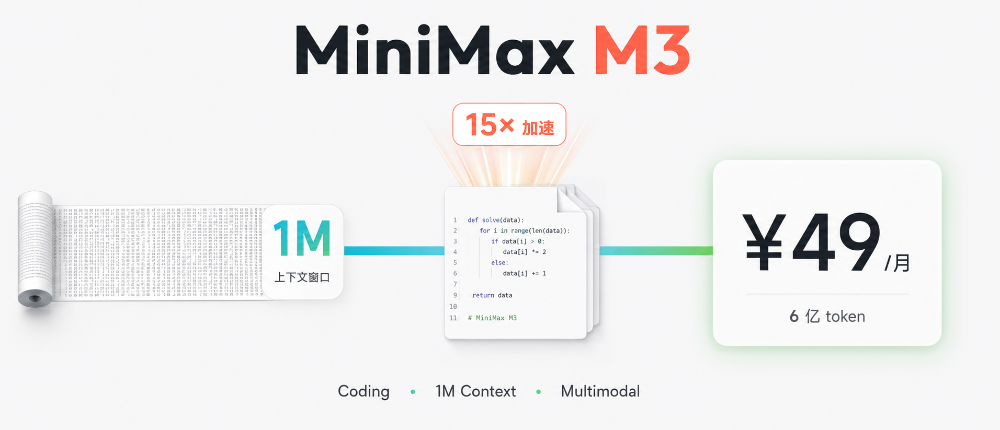
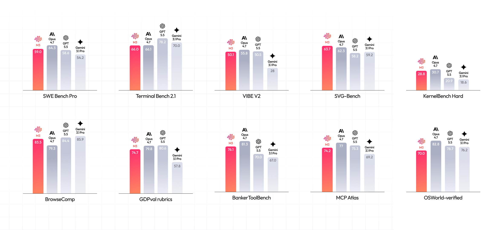
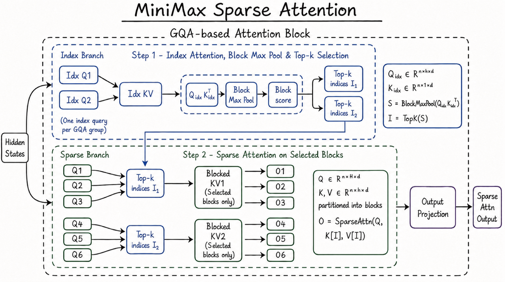
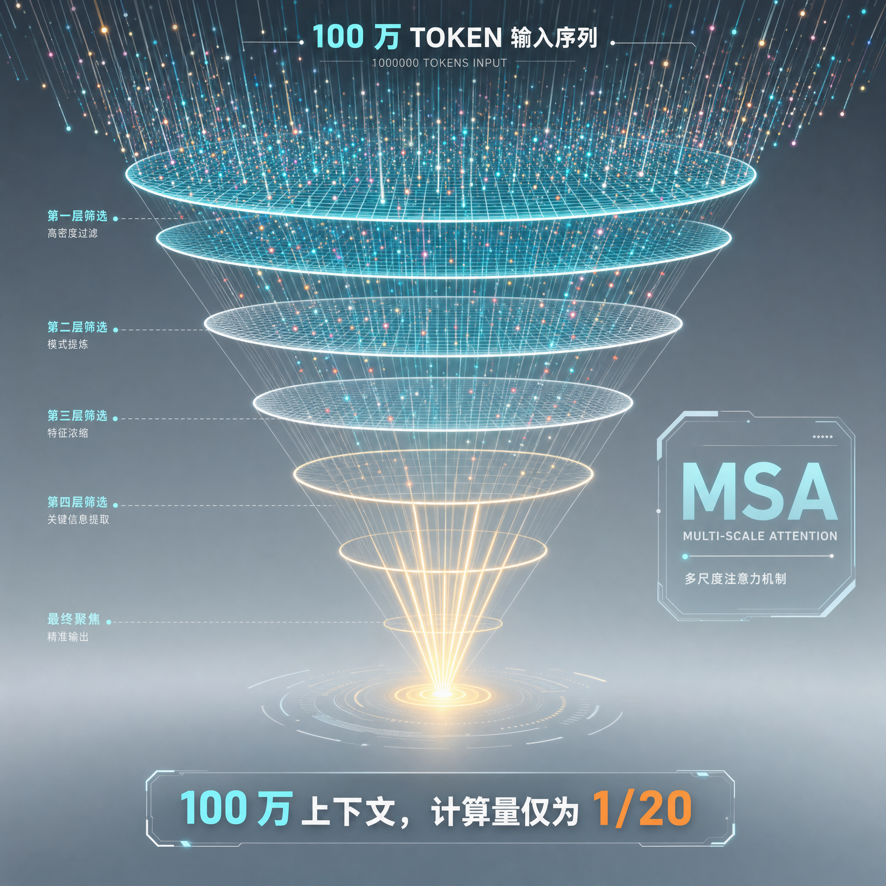
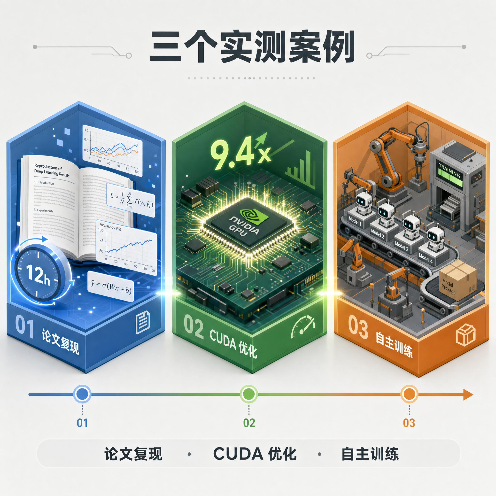
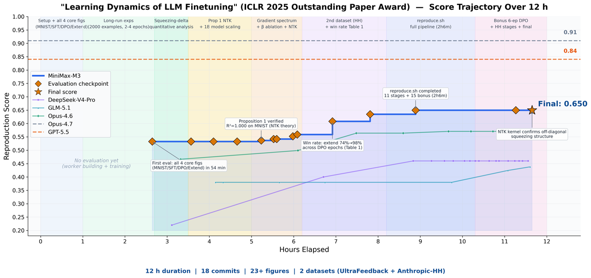
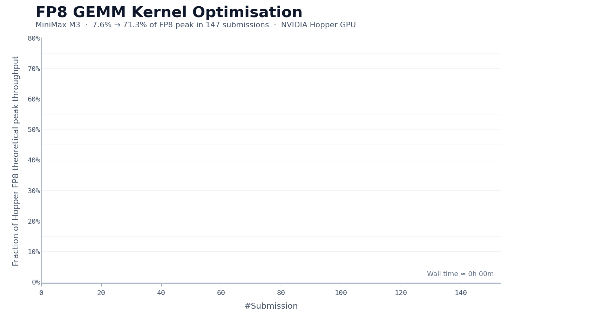
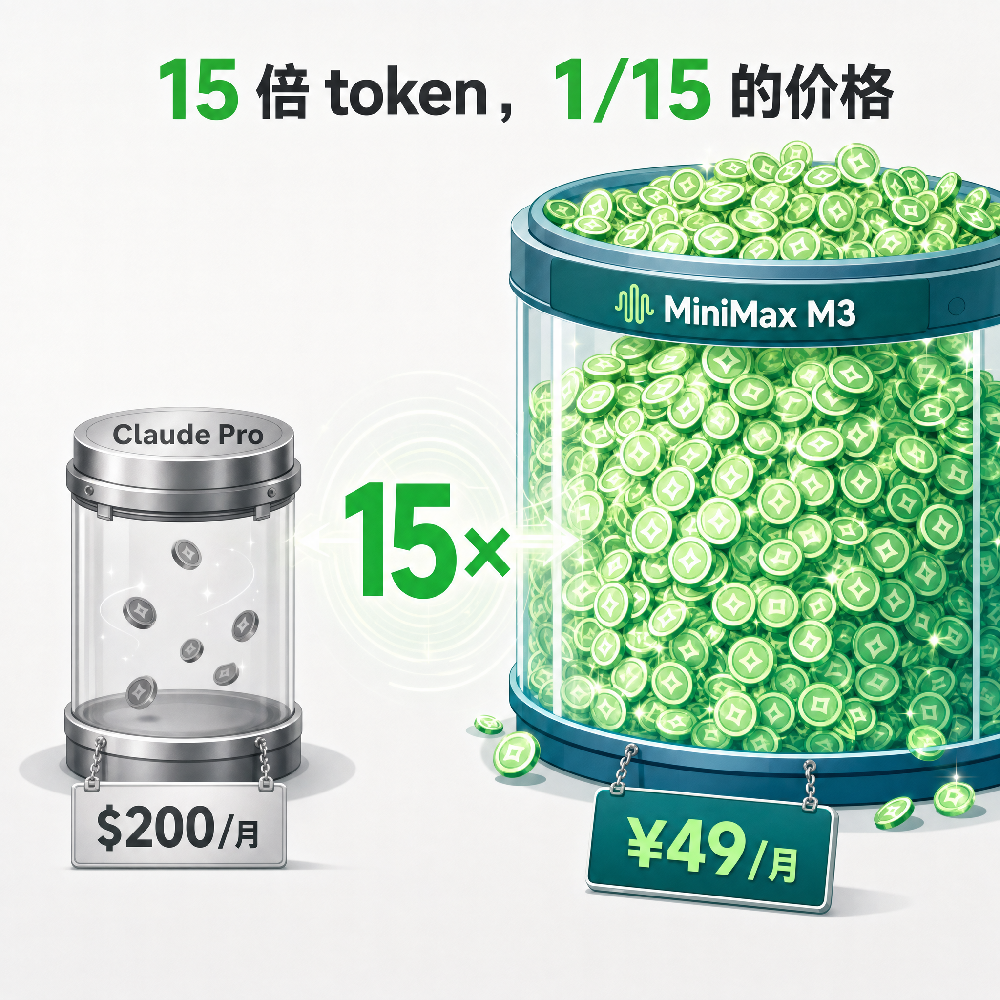
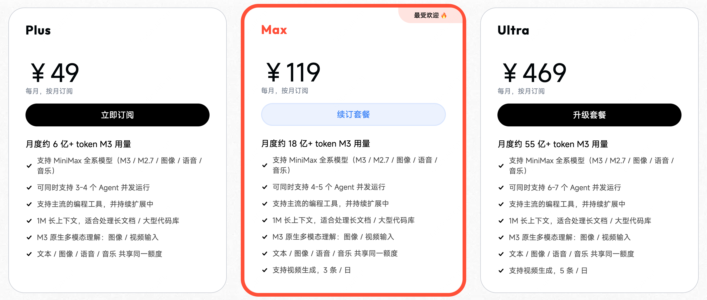
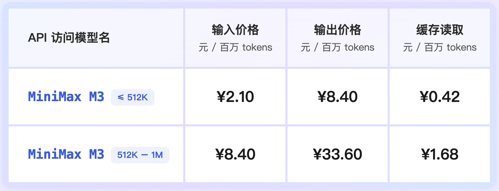

# MiniMax M3 开源实测：1M 上下文，价格是 Claude 的 1/15

---

## 一句话总结

**MiniMax M3 是国产第一个把 frontier 三件套全部拉满并且开源的模型。** Coding/Agent 能力、1M 上下文、原生多模态，自研的 MSA 稀疏注意力架构让 1M 上下文的计算成本降到上代的 1/20，Token Plan 定价把使用门槛直接砍到了 ¥49/月。

---

## 先看懂 M3 到底是什么

今年 6 月 1 日，MiniMax 发布了 M3，直接扔出三个硬指标。

第一个，Coding 与 Agent 能力达到了行业前沿。最吓到我的是 SWE-Bench Pro 的 59.0%，超过 GPT-5.5 和 Gemini 3.1 Pro，接近 Claude Opus 4.7。这个测试是拿真实 GitHub issue 让模型修 bug，不是刷题。在 BrowseComp 信息检索评测中以 83.5 分超越 Opus 4.7 的 79.3 分，在 SVG-Bench 和 Claw-Eval 上也排在第一梯队。这意味着 M3 写的代码目标不是「能跑但需人改」，而是直接可交付。

第二个，原生支持 1M Token 上下文窗口。这不是简单的窗口拉长，而是基于自研 MSA 架构从底层重新设计注意力机制。在 100 万 token 的极端场景下，M3 的每 token 计算量仅为上代 M2 的 1/20，实际用起来，一次性塞进去 100 万字的长文档，处理速度比上一代快了 9 倍，生成回复的速度快了 15 倍。而且 MSA 绝大部分能力与全注意力打平。

第三个，原生多模态，从 step 0 开始训练。M3 不是后期给文本模型「贴」一个视觉模块，而是从头就用文本、图像、视频交织的数据一起训练。重构的数据管线把训练规模提升到百 T 量级。在 OmniDocBench 多模态文档理解测试上得分超过 Gemini 3.1 Pro，Video-MME 视频理解得分 84.6。图片单张最高 10MB，视频最高 512MB，一次 API 请求体最高 64MB，长视频分析可以直接扔进去。

能同时跑通这三项的，此前我只在 Claude 和 GPT 身上见过。M3 是第一个把它们全部带进开放世界的模型。

---

## MSA 架构，1M 上下文是怎么做到的

我之前试过让 Claude 处理一本 30 万字的 PDF，上下文一拉长，响应慢得让我以为网络断了。这不是 Claude 的错，是 Transformer 注意力机制的老毛病，计算复杂度随序列长度呈平方增长。上下文拉到 1M，KV Cache 会膨胀到 GPU 显存根本装不下的程度。这是所有长上下文模型必须面对的物理天花板。

MiniMax 没选择硬撑，而是换了一条路。他们自研了 MSA（MiniMax Sparse Attention）。

稀疏注意力的思路，是在正式计算前加一个「初筛」阶段，让模型不必跟序列中每个 token 都打交道，只挑真正相关的那些。MSA 比现有的开源稀疏注意力方案分块更准，覆盖的有效上下文更多。工程上也做了优化，比开源实现快 4 倍以上。

说实话，这段技术细节我反复看了三遍才完全理解。核心就一句话：**MSA 把「该看哪里」这个判断提前做了，后面就不用全看一遍。**

结果是，100 万 token 下 M3 每 token 计算量仅为上代的 1/20。prefill 阶段加速超过 9 倍，decoding 阶段超过 15 倍。而且 MSA 在多个对照实验中绝大部分能力与全注意力打平。MiniMax 没有为了快而牺牲质量，是真的找到了一条更聪明的路。

---

## 三个让我停下来的实测

benchmark 是实验室成绩，真实任务才是验金石。MiniMax 公布了三个实测，每个都让我停下来多看两眼。

### 让它复现一篇顶会论文

测试团队给 M3 丢了一篇 ICLR 2025 Outstanding Paper，主题是 LLM 微调过程中的学习动力学。要求是独立复现，全程无人工干预。

M3 连续跑了近 12 小时，自己交了 18 次代码、画了 23 张图，最后跑出来的结果和论文对上了。包括论文里提到一个很细的现象——模型微调时会出现的 squeezing 效应——它也独立观测到了。

这个过程同时调用了 M3 的三项核心能力。多模态能力用来读懂论文里的曲线图和数据，1M 长上下文把论文 + 代码 + 实验日志一次性塞进窗口，Coding + Agent 能力驱动长线程执行。缺任何一项，这个任务都完不成。

### 手写 CUDA kernel，把利用率从 7% 拉到 71%

FP8 矩阵乘是大模型推理里计算最密集、优化难度最高的环节之一。在 NVIDIA Hopper 架构上手写一个生产级的 FP8 GEMM kernel，通常需要资深团队 1 到 2 周。

M3 的起点只有一份任务描述、一个 benchmark 脚本、一个无法直接运行的 Triton 骨架。没有参考实现可以模仿，必须从基本原理出发自主探索。

24 小时里它自己试了 147 个版本，调了快 2000 次工具，从完全跑不动一路优化到生产级水平。中间没人帮它。

最终，硬件峰值利用率从首版的 7.6% 推进到 71.3%，实现 9.4 倍加速。

一个让我意外的细节是，除 Opus 4.7 和 M3 外，其他模型大多在前 30 次提交后就主动退出了。而 M3 的最优解出现在第 145 次提交，中间经历了多个平台期，但模型仍在继续尝试不同方向。这种「不放弃」的迭代韧性，超出了常规代码生成的能力范畴。

### 让它自己训练一个模型

PostTrainBench 是最开放的测试。给 M3 四个只完成预训练、没有任何下游能力的 Base 模型，让它在 12 小时内自主完成数据合成、训练、评测、迭代的全部流程。

全程无人干预，Agent 要自己决定合成什么数据、选什么训练策略、怎么根据评测结果调整下一轮。M3 最终得分 0.37，略低于 Opus 4.7（0.42）和 GPT-5.5（0.39），但明显领先其余模型。

这个任务没有 CUDA 优化那种明确的反馈信号，需要模型自主判断。M3 的表现说明它不只是「会写代码」，而是具备了在开放问题上自主规划和迭代的研究能力。

---

## 定价，这才是让我坐直身体的部分

看完三个测试，我的感受是，M3 确实能干活。但能干活的模型多了，Claude Opus 也能。真正让我坐直身体的，是发布会最后公布的定价。

MiniMax 同期推出了 Token Plan 三档订阅。

- Plus，¥49/月，6 亿 token
- Max，¥119/月，18 亿 token
- Ultra，¥469/月，55 亿 token

¥49 的 6 亿 token 是什么概念？相当于每天写 20 篇 5000 字的长文，连续写一个月。我上个月 Claude 的账单是 ¥200 出头，处理的量大概只有这个的 1/5。按相同价格换算，M3 约是 Claude 订阅容量的 15 倍。

API 定价也分两档，按上下文长度计价。标准通道和优先通道共享同一套价格，thinking 模式和 non-thinking 模式随时切换。自动 Cache 无需设置，自动生效。

如果你也被 ¥49 打动了，现在就能用。三种方式：直接调 API（兼容 OpenAI 和 Anthropic 格式）、用 MiniMax Code（配套的 Agent 产品，能自动操作电脑）、等开源权重自己部署。

---

## 总结

我不是想说「国产崛起」那种话。我就是觉得，一个能把 1M 上下文做到 ¥49 的团队，手里一定还有牌没打完。这个定价不是慈善，是他们对成本结构的自信。

MSA 解决的是真问题，不是简单把窗口拉长，而是让长上下文的计算成本真的可控。多模态也不是贴个眼睛上去，是从头就一起训练的。Coding 能力更不是写个 demo，是能交付的代码。然后这三样打包到 ¥49 的月费里。

MiniMax 成立之初的口号是 Intelligence with Everyone。以前我觉得这是愿景，现在看起来，它正在变成账面上的现实。

欢迎关注我的公众号「Chyris Tech Note」，获取更多 AI 技术解读与实践分享。
