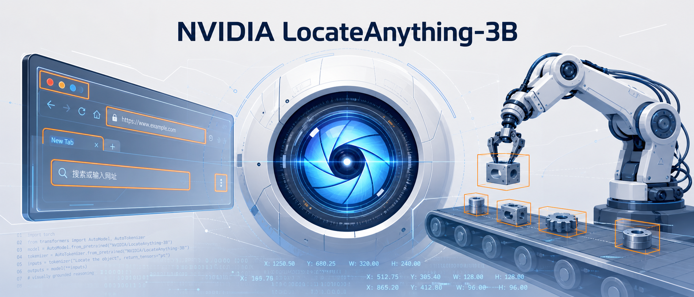
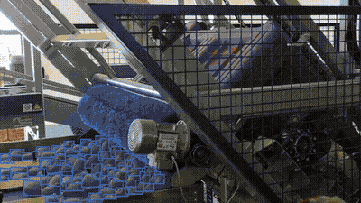
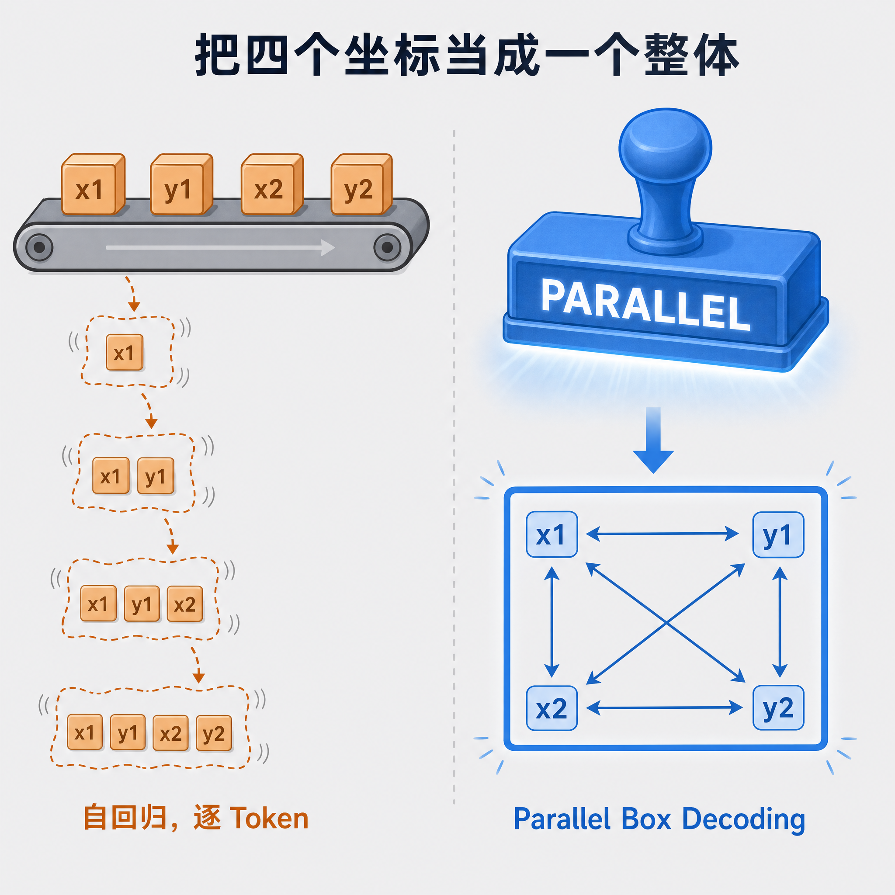
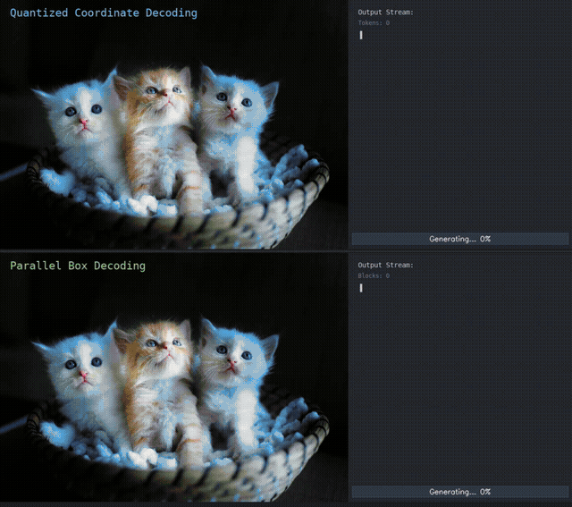
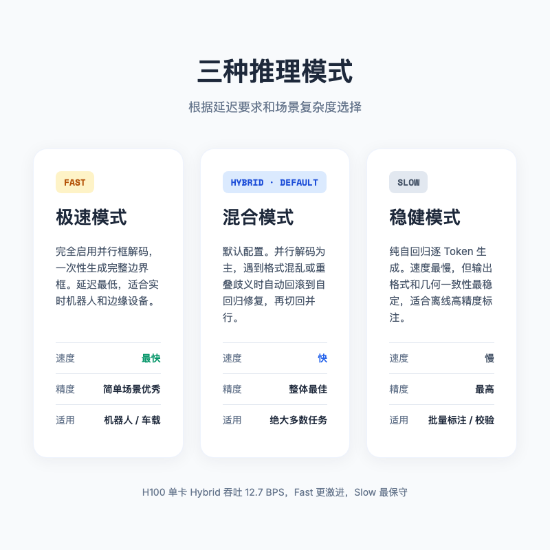

# 还在逐 Token 画框？NVIDIA LocateAnything-3B 把边界框一次画准

> 当 AI Agent 看到屏幕上的「提交」按钮时，它真正需要的不是一段华丽描述，而是精确的像素坐标。



---

## 一句话总结

NVIDIA LocateAnything-3B 是一个只有 30 亿参数的开源视觉定位模型。它用 **Parallel Box Decoding（并行框解码）** 技术，把传统模型里逐 Token 生成坐标的过程，改成了一步并行输出完整边界框。结果是，在 H100 单卡上，它的默认 Hybrid 模式能跑到 **12.7 BPS**，LVIS 高精度 F1 也拉到了 **31.1%**。

简单说，它想让 AI 不仅能「看懂」图，还能「指对」位置。

---

## 视觉定位，为什么是 Agent 的瓶颈

过去一年，多模态大模型已经能对着一张图侃侃而谈。你丢给它一张桌面截图，它能告诉你图里有浏览器、有文档、有聊天窗口。但如果你说，「帮我点一下右上角那个红色的关闭按钮」，事情就开始变味了。

描述按钮和定位按钮，是两件完全不同的事。

前者是语言模型的老本行，把视觉信息翻译成文本就行。后者需要把语言指令映射到二维图像上的精确坐标，误差超过几十个像素，Agent 就可能点到旁边的「最小化」上去。对机器人、自动驾驶、GUI 自动化这些场景来说，这种误差会直接变成动作失败。

这个难题目前没有标准答案，实际落地时一般只能二选一。

一条是 YOLO 这类闭集检测器，速度快、精度高，但只能识别预定义好的类别。你想让它找「发票里总金额那一栏」，它大概率摇头。

另一条是把坐标当成文本 Token，让多模态语言模型自回归地一个一个生成。比如先预测左上角的 x，再预测 y，然后是右下角的 x 和 y。这种方法灵活，开放词汇，但速度慢，而且四个坐标被拆成独立步骤生成，几何一致性容易崩。你经常会看到模型画出一个歪歪扭扭、和物体边缘对不上的框。

LocateAnything-3B 的打法是同时做到这三点，开放词汇、高精度、足够快。

---

## 这个模型到底是什么

LocateAnything-3B 是 NVIDIA 今年 5 月底放出来的一个视觉语言定位模型，托管在 Hugging Face 和 GitHub 上。它属于 Eagle VLM 家族，也被整合进了 NVIDIA 自己的 Nemotron 3 Nano Omni 和 Cosmos 的 Computer Use 能力里。

它的底子很轻。

- 语言模型用的是 **Qwen2.5-3B-Instruct**
- 视觉编码器用的是 **MoonViT-SO-400M**
- 中间用一个两层的 MLP 投影器把视觉特征和文本特征对齐

整体参数量控制在 3B，目的很明确，既要能在服务器上跑，也要能往边缘设备和机器人控制器上塞。

输入就是一张图加一段自然语言指令。比如「找到所有穿红衣服的人」「定位发票里的总金额」「指出屏幕右上角的关闭按钮」。输出是一组结构化的边界框坐标，格式类似这样。

```
<ref>person</ref><box><x1><y1><x2><y2></box>
```

坐标被量化到 0 到 1000 的整数空间，解析时再按图像尺寸缩放回真实像素。

听起来和常见的视觉定位模型差不多，真正的差异在解码方式上。



---

## Parallel Box Decoding，把四个坐标当成一个整体

传统方法把边界框的四个坐标拆成四个 Token，按顺序生成。LocateAnything-3B 的做法是，把这四个坐标打包成一个固定长度为 6 的「块」，一次性并行输出。

这个技术叫 **Parallel Box Decoding，PBD**。

你可以把它想象成画一个矩形。自回归方式像是闭着眼睛摸象，先猜一个角，再猜下一个角，四个角凑完才敢确定框在哪。PBD 则像是直接用一个矩形印章盖上去，一次成型。

块内部用了双向注意力。说白了，生成 x1 的时候，y1、x2、y2 的信息都能被看到。四个坐标互相牵制，框的几何一致性自然更好。块与块之间保留因果注意力，多个目标之间不会乱套。

每个块除了坐标，还可以携带其他信息。比如有没有找到目标、目标的类别标签、以及这段定位输出是不是结束了。这样整套输出既是结构化的，又能被模型一次性生成。因为坐标是一次成型的，模型不需要在四个 Token 之间反复猜测，高密度场景下不容易出现那种「幽灵框」或者框体漂移。

NVIDIA 官方在 Hugging Face 上给出的数据是，LocateAnything-3B 在默认 Hybrid 模式下，H100 单卡的框生成吞吐达到了 **12.7 boxes per second**，比 Qwen3-VL 快了 10 倍以上，比 Rex-Omni 也快了 2.5 倍。

当然，这个数字是在特定 batch 和分辨率下测的。但它至少说明，PBD 不是在纸面上漂亮，而是真的把推理延迟压下来了。





---

## 三种模式，按需切换

LocateAnything-3B 提供了三种推理模式，不是每种场景都需要冲到最快。

**Fast 模式** 完全走 PBD 并行解码。速度最快，延迟最低，适合实时性要求高的场景，比如机器人控制或者车载边缘设备。代价是极度复杂的密集场景下，鲁棒性会稍微退化。

**Slow 模式** 回到传统的自回归生成。速度最慢，但稳定性最高，适合离线批量标注或者对精度极度敏感的任务。

**Hybrid 模式** 是默认选项。它先用 Fast 模式并行跑，同时监控输出格式和坐标合理性。一旦发现某个块不对劲，比如标记格式乱了，或者框之间严重重叠导致歧义，就回滚到自回归模式把这个局部修完，然后再切回 Fast 模式。

这有点像开车。Fast 模式是高速巡航，Slow 模式是堵车时慢慢挪，Hybrid 模式则是巡航为主，遇到复杂路况自动降速，过完再加速。

大多数情况用 Hybrid 就够了。只有当延迟真的不能妥协，或者任务特别简单时，才值得切 Fast。



---

## 它能做什么，比性能数字更关键

LocateAnything-3B 的主战场是那些「需要把语言指令变成像素坐标」的地方。

### 屏幕和文档，先看懂结构

让 AI 操作电脑界面，最大的痛点之一就是元素定位。传统做法依赖 HTML DOM 或者系统无障碍 API，遇到自定义渲染、游戏界面、远程桌面，基本抓瞎。

LocateAnything-3B 直接看屏幕截图。你说「点搜索框」，它返回搜索框的坐标；你说「找到右上角的关闭按钮」，它返回那个 x 和 y。在 ScreenSpot-Pro 这个专门测 GUI 定位的 benchmark 上，它的 F1 分数是 **60.3%**。

文档场景也一样。处理合同、发票、论文 PDF 时，传统 OCR 只能把文字读出来，但不知道「这段文字属于哪个表格」「签名在哪里」。用自然语言查询「定位发票里的总金额数字」「找到第三页的签字区域」，它就能直接返回对应边界框。在 DocLayNet 上，F1 达到了 **76.8%**。

这两件事其实是一个能力，把人类描述和图像上的具体位置对应起来。

### 仓库和工业现场，用嘴找东西

仓库盘点、农业监测、工业质检里，经常有成百上千个目标挤在一起，而且目标种类可能是长尾的。传统 YOLO 需要预先定义类别，训练成本高。

LocateAnything-3B 作为开放词汇模型，可以直接用语言描述来找。比如「货架上第三层所有红色包装」「这片叶子上发黄的位置」。不用重新训练，换个提示词就行。

### 机器人和数据流水线，把定位变成输入

机器人抓取物体时，定位延迟直接影响控制稳定性。延迟超过几百毫秒，机械臂轨迹就可能抖动。LocateAnything-3B 的高吞吐让它能在 Cosmos 这类物理 AI 系统里提供像素级的抓取定位。对具身智能来说，感知速度跟上物理世界的运动节奏，是能用和不能用的分界线。

另外，如果你要训练自己的 YOLO 模型，手工标注成千上万张图片很痛苦。LocateAnything-3B 可以充当自动标注器，对大量图片批量生成边界框。配合 ComfyUI-LocateAnything 节点，还能在可视化工作流里直接跑。


---

## 最小 demo，五行代码让它开始画框

LocateAnything-3B 的接入方式比较友好。最轻量的是用 Transformers 的 pipeline。

```python
from transformers import pipeline

pipe = pipeline(
    "image-text-to-text",
    model="nvidia/LocateAnything-3B",
    trust_remote_code=True
)

messages = [
    {
        "role": "user",
        "content": [
            {"type": "image", "url": "warehouse.jpg"},
            {"type": "text", "text": "Locate all cardboard boxes."}
        ]
    }
]

outputs = pipe(text=messages)
print(outputs)
```

实际生产环境里，更推荐用官方提供的 `LocateAnythingWorker`（仓库里有一个自包含的实现，把模型加载、任务提示模板和坐标解析都封装好了）。加载一次就能反复调用。

```python
from PIL import Image
from locateanything_worker import LocateAnythingWorker

worker = LocateAnythingWorker("nvidia/LocateAnything-3B")
img = Image.open("screen.png").convert("RGB")

# 检测指定类别
result = worker.detect(img, ["button", "input field"])

# 自然语言定位
result = worker.ground_multi(img, "red notification badges")

# 全图 OCR
result = worker.detect_text(img)
```

坐标解析也很直接。模型输出的是 0 到 1000 的归一化整数，按比例乘回图像宽高就行。

```python
boxes = LocateAnythingWorker.parse_boxes(result, image_width=w, image_height=h)
```

如果你习惯用 vLLM 搭服务，也可以一行命令拉起 OpenAI 兼容接口。

```bash
vllm serve "nvidia/LocateAnything-3B" \
  --port 8000 \
  --trust-remote_code
```

---

## 数据、训练与性能

LocateAnything-3B 的训练数据叫 **LocateAnything-Data**，规模在同级别模型里算大的。

- 1200 万张跨领域图像
- 1.38 亿条自然语言定位查询
- 7.85 亿个高精度边界框

数据覆盖自然场景、道路交通、工业现场、文档界面、网页截图、科研插图等。标签生成用到了 Qwen3-VL、Molmo、SAM 3、Rex-Omni 这些模型做辅助标注，再经过自动过滤和人类标注融合清洗。

训练也不是一次性喂完，而是分四个阶段。前两个阶段先喂大量图像描述、VQA、OCR 和通用知识数据，让模型建立跨模态理解；第三阶段才加入检测和定位数据；第四阶段专门用密集场景数据强化多目标重叠情况下的表现。这个顺序很重要，先让模型学会「看图说话」，再教它「看图指位置」。

性能方面，除了前面提到的 H100 吞吐和 LVIS、ScreenSpot-Pro、DocLayNet 数字，另一个值得注意的点是 **LVIS F1 @ IoU=0.95 达到了 31.1%**。IoU 0.95 意味着预测框和真实框几乎完全贴合，比 0.5 那种只要求大致重叠严格得多。这个指标比单纯的速度数字更说明问题。PBD 不仅快，还真的把框画准了。

当然，benchmark 数字要看测试条件。不同分辨率、不同提示词、不同 batch 设置都会影响结果。但它至少证明，3B 参数模型在这个任务上不是凑数的。

---

## 它还没那么完美

LocateAnything-3B 并不是万能的，落地前有几个坑值得提前知道。

多分类场景容易乱。当一张图里同时出现很多不同类别时，比如十几类常见物品混在一起，模型输出的英文类别标签可能出现乱码，边界框也会偏移。社区里的反馈认为这是 MTP 策略和视觉骨干集成上的对齐问题，目前的工程 workaround 是按类别分批推理，而不是一次丢给模型太多类别。

密集场景下 Hybrid 模式可能退化。如果图里有几百个高度重叠的目标，Fast 模式会频繁触发回滚和自回归修复，实际速度可能反而比 Slow 模式还慢。这种时候不如直接切 Slow 模式。

没有原生置信度分数。传统检测器会输出每个框的置信度，方便你设置阈值过滤。LocateAnything-3B 是基于生成式语言模型的，输出的是结构化 Token，不自带置信度。下游要做过滤，需要自己设计后处理，比如用重复采样或者语言模型本身的 logit 来近似。

视频时序会抖动。它其实是单图定位模型，没有跨帧建模能力。直接逐帧跑视频，框会在帧之间抖动，需要额外加卡尔曼滤波之类的时序平滑。

授权是非商业的。LocateAnything-3B 目前采用 NVIDIA 的非商业研究授权，不能直接用进商用产品里。企业使用需要单独谈授权，或者用它的输出作为训练数据，去训练自己可商用的下游模型。

---

## 总结

AI Agent 要能真正做事，「看懂」只是第一步，「指对」才是更难也更重要的一步。

LocateAnything-3B 用 Parallel Box Decoding 把边界框生成从串行改成并行，在 3B 参数的规模下实现了不错的速度和精度。它不太适合替代 YOLO 做通用检测，更适合作为 Agent 的「空间感知层」，把自然语言指令翻译成像素坐标。

GUI 自动化、文档解析、机器人控制、自动标注，这些场景它都能试试。但多分类、密集场景、商用授权这几条边界，落地前得先掂量清楚。

如果未来 Agent 真的要学会像人一样看屏幕、指东西、动手指，LocateAnything-3B 可能就是那双眼睛的早期版本。
