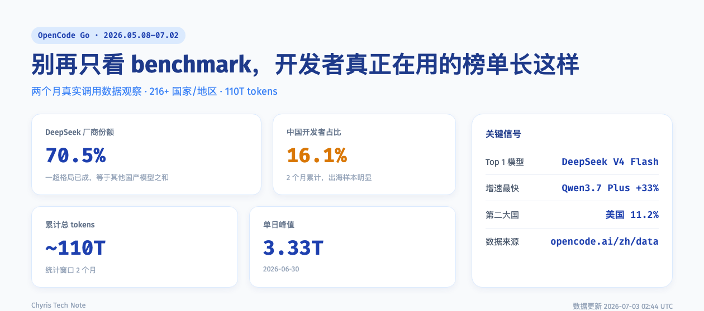
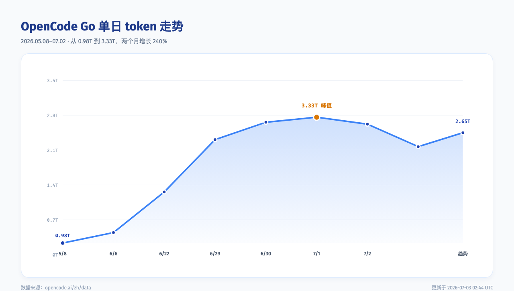
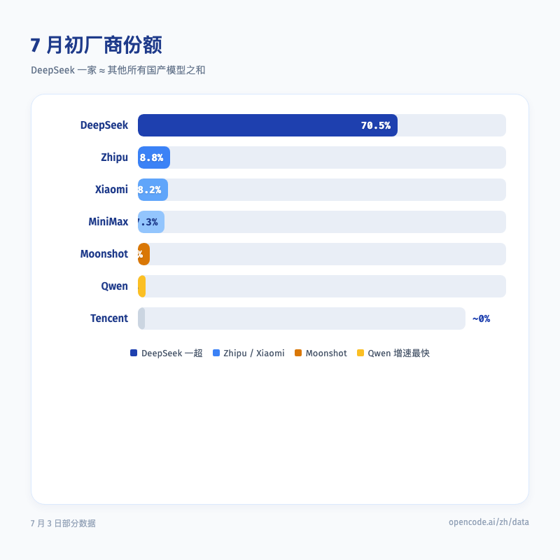
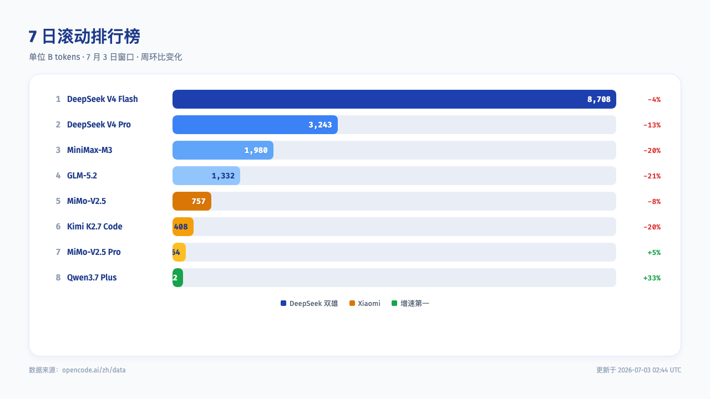
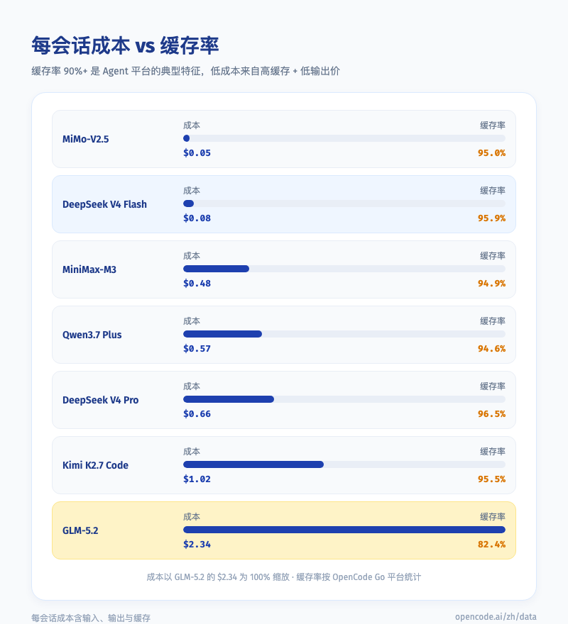
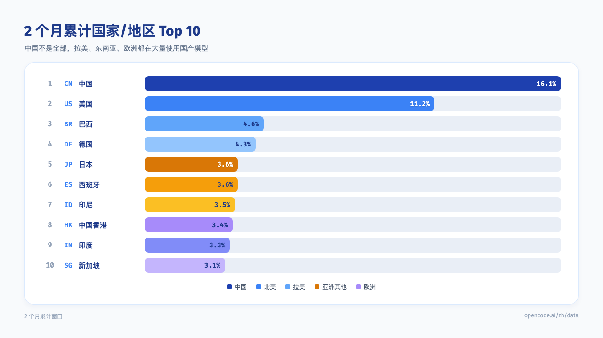

# 大模型选择别再只看 benchmark，开发者真正在用的榜单长这样

> 数据不是来自实验室，而是来自开发者真金白银的调用。

---

## 一句话总结

OpenCode Go 两个月的真实调用数据显示，DeepSeek 在 Agent/代码场景中吃掉约七成份额，中国开发者仅占 16%，而拉美、东南亚、欧洲、印度都在大规模使用国产模型。

---

## 一、榜单看多了，不妨看看真金白银的投票

每隔几天，就会有一款新模型宣布自己在某个 benchmark 上拿了第一。分数一个比一个高，口水仗一场接一场。但问题是，分数高不等于用得多。

说实话，我以前也习惯先看 benchmark。直到最近翻了两个月 OpenCode Go 的调用数据，才发现开发者真正在用什么，跟媒体上的排名完全是两回事。

OpenCode Go 的数据页不跑标准测试集，只记录开发者每天实际调用了多少 token。截至 7 月初，这份数据已经攒了整整两个月。统计窗口从 2026 年 5 月 8 日到 7 月 2 日，累计 tokens 约 110T，覆盖 216+ 个国家/地区，单日峰值出现在 6 月 30 日，达到 3.33T。

有些模型在 benchmark 上名次很漂亮，但在调用榜上连前十都进不了。反过来，调用榜前排的模型，也未必是每张榜单的冠军。这两种数据之间的差距，恰好说明实验室分数和真实使用不是一回事。

这不是评测报告，这是开发者的投票箱。

---

## 二、两个月，调用量翻了两倍多

5 月初，OpenCode Go 的单日总调用量还不到 1T。到了 6 月底，平台已经连续多日站在 3T 以上。6 月 30 日冲到 3.33T，比 5 月 8 日增长了 240%。

后面几天哪怕回调，也没掉回 2.5T 以下。

3.33T 是个什么概念？如果按一次普通对话消耗 1K tokens 来算，那一天就相当于 33 亿次交互。Agent 和代码助手的真实需求正在快速放大。榜单上的分数可能还停留在某一时刻，但调用曲线不会说谎。

---

## 三、DeepSeek 吃掉七成，一超格局已定

看模型排名，前三名在过去十多天里几乎没有变化。DeepSeek V4 Flash 和 DeepSeek V4 Pro 稳稳占据前二，MiniMax-M3 位居第三。7 月 2 日 GLM-5.2 一度反超 MiniMax-M3，但整体来看，第二梯队的竞争才刚刚开始。

按厂商份额来看，DeepSeek 的单日占比在 67% 到 72% 之间波动。它一家的调用量，等于其他所有国产模型之和。

7 日滚动数据里，DeepSeek V4 Flash 独占 8,708B tokens。后面三家加在一起，才差不多追平它一个模型。

这种格局不是某一天突然形成的。DeepSeek 能赢，不是因为它每一项都最强，而是因为它在「足够好」和「足够便宜」之间找到了甜点。Flash 负责日常搬砖，Pro 负责复杂推理，两个版本把大部分需求都覆盖了。对开发者来说，这意味着默认调用时几乎不用多想。

Zhipu 和 Xiaomi 的份额都在 8% 左右，咬得很紧。Zhipu 靠 GLM-5.2 稳住，Xiaomi 靠 MiMo-V2.5 双模型支撑。但两者距离挑战 DeepSeek 还有量级差距。

---

## 四、MiniMax 守住老三，Qwen 正在快速逼近

MiniMax-M3 是目前最稳的「老三」。它每会话 token 量高达 782 万，是全平台最高之一。用户愿意拿它处理长上下文任务，说明它在复杂对话和代码场景里有自己的位置。

但 MiniMax 的周环比在下滑，M3 下滑 20%，老型号 M2.7 也下滑 21%。

MiniMax 的下滑可能跟长上下文任务的单日波动有关。一旦某天出现大量超长对话，它的 token 量会暴涨，第二天又回落。这种波动让它守住第三，但也很难再往上冲。

与此同时，Qwen3.7 Plus 的周环比是 +33%，Qwen3.7 Max +30%，Qwen3.6 Plus +24%。这是头部模型里唯一一组在全线上涨的家族。

如果 Qwen3.7 系列保持这个增速，未来一到两个月很可能改写第二梯队格局。阿里的通义系列一直在闷声爬坡，虽然总量还不大，但增速是头部里唯一全线上涨的。这种势头比一时的排名更值得关注。

而 Moonshot 的 Kimi K2.7 Code 虽然代码场景有爆发力，但周环比也下滑 20%，尝鲜期之后能不能留住用户，是它最大的挑战。

---

## 五、成本才是真实账单

模型之间的竞争，最终也会落到成本上。

OpenCode Go 的数据里，缓存率普遍在 90% 以上。这是 Agent 平台的典型特征。长上下文、重复调用、重复 prompt，谁能把缓存价格打下来，谁就掌握成本优势。说白了，Agent 平台就像一台复读机，上下文里大量重复的内容被缓存复用，才是真正的省钱来源。

每会话成本最低的是 MiMo-V2.5，约 $0.05。DeepSeek V4 Flash 约 $0.08，这解释了为什么 Flash 能成为绝对主力。DeepSeek V4 Pro 每会话约 $0.66，比 Flash 贵近八倍，但仍占 DeepSeek 内部约 27% 的份额，说明复杂任务和长代码场景愿意为性能买单。

真正让我意外的是 GLM-5.2。它的缓存率只有 82.4%，是头部模型里最低的，导致每会话实际成本高达 $2.34，是 DeepSeek V4 Flash 的 27 倍。在长上下文场景里，这个价格差基本就是能不能用的分水岭。换句话说，同样处理一次会话，GLM-5.2 能喝掉三杯奶茶，Flash 只够买瓶水。

一个每天处理 1000 次会话的小团队，用 Flash 和用 GLM-5.2，一个月差价可能是一台 MacBook Pro。这不是模型能力的差距，这是账单的差距。

Kimi K2.7 Code 虽然代码能力强，但输出价 $3.50/1M，每会话成本 $1.02，榜单中最高。尝鲜期之后能不能留住用户，压力不小。

对普通开发者来说，成本直接决定你能不能把 AI 能力默认打开。如果一次会话要烧掉一两美元，你的功能就只能留给少数高端场景。如果一次会话只要几分钱，你就可以把它做成默认行为。这就是为什么缓存率和输出价比模型标价更重要。

---

## 六、中国只占 16%，出海比想象中快

最耐人寻味的是地域分布。两个月累计数据里，中国开发者仅占 16.1%，美国占 11.2% 位居第二。

让我意外的是，前十里能看到巴西、德国、西班牙、印尼、印度、新加坡。这基本是一份新兴市场地图。

拉美国家的活跃度尤其突出。巴西、哥伦比亚、阿根廷、秘鲁、墨西哥、智利全部进入 Top 25。这些市场对性价比模型非常敏感，是中国模型出海的优质切口。

新兴市场的活跃不是偶然。很多国家的开发者买不起最贵的模型，也不愿意为了一次调用承担美元级别的成本。DeepSeek V4 Flash 这种每会话几分钱的模型，对他们来说刚好够用。这种「够用且便宜」的模型，往往比榜单冠军更有渗透力。

欧洲则以德国、西班牙、法国、英国、俄罗斯、意大利为主。德国高于日本，西班牙与日本基本持平，欧洲开发者对 Agent/代码助手的需求也在快速增长。

中国香港、新加坡、中国台湾三个地区合计约 8%，加上越南、马来西亚、泰国，形成了一个活跃的中文/英语开发者生态圈。

按大洲聚合，亚洲合计约 45%，欧洲约 22%，北美约 15%，南美约 12%，非洲约 2.5%，大洋洲约 1.4%。AI 应用的调用量，早已不是中美两国的独角戏。

单日数据里中国占比会更高一些，达到 25%，但绝非压倒性多数。这说明 OpenCode Go 已经是一个真正的全球化平台，而国产模型正在被全球开发者真实采用。

中国开发者不是不用国产模型，而是国产模型的用户已经遍布全球。这对做 AI 应用的人来说是个好消息，你不再只盯着国内用户，你的产品模型选型可以跟着全球开发者的共识走。比如你现在做一个面向巴西开发者的 AI 编程工具，默认选 DeepSeek V4 Flash 大概率不会错。

---

## 七、调用数据为什么比 benchmark 诚实

benchmark 有它的价值，但它衡量的是理想条件下的能力上限。调用数据衡量的则是真实环境下的综合性价比。一个是开卷考试，一个是闭卷月考。

一个模型可能在某张榜单上拿第一，但如果它的输出价格贵、缓存率低、上下文窗口虚标，开发者很快就会用脚投票。反过来，一个分数不是最高的模型，如果足够便宜、足够稳定、足够快，它就可能成为默认选项。

DeepSeek V4 Flash 就是这样的例子。它在很多榜单上不是最强，但在 OpenCode Go 上它是绝对主力。因为开发者每天重复做的事情，不是跑分，而是让 Agent 稳定地完成任务。

所以，benchmark 分数高不等于开发者真在用。真金白银的调用数据，往往比评测分数更能说明问题。

---

## 八、三条核心结论

**第一，DeepSeek 已经成为 Agent 平台的默认选项。** 便宜、好用、缓存率高，Flash 处理日常任务，Pro 处理复杂推理和长代码，分工已经形成。

**第二，中国模型的出海空间比想象中大。** 中国仅占 16%，美国、巴西、德国、日本、印尼、印度、西班牙都在用。拉美和东南亚新兴市场的活跃度尤其突出。

**第三，第二梯队别只盯着 MiniMax，Qwen 的增速很吓人。** MiniMax-M3 已经冲到第三，但周环比在下滑；Qwen3.7 Plus 增速最快。未来一两个月，这两家可能会重塑第二梯队排名。

---

## 总结

OpenCode Go 这份数据最有价值的地方，是让你看到开发者真正在用什么、愿意为哪种能力付费、以及这些用户来自哪里。

从全球分布来看，AI 应用已经变成多极市场。对普通开发者来说，选对模型、用好缓存、盯紧成本，就是这一轮 Agent 浪潮里最朴素的生存法则。

这份数据也让我重新理解了一件事，模型战争不是谁分数高，而是谁能成为默认调用。默认调用意味着生态位、意味着习惯、意味着赢家通吃。

下次再看到谁家模型宣布「全面超越 GPT-4」，我不会急着转发，而是先打开 OpenCode Go 的数据页。真金白银比分数诚实得多。
