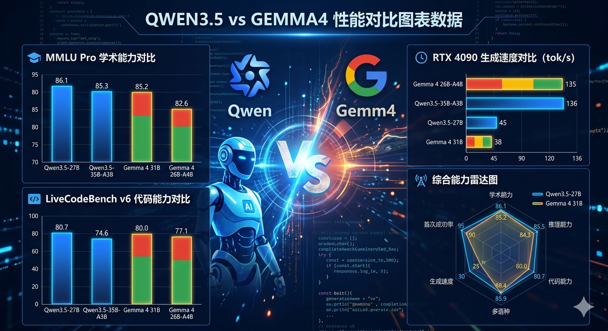
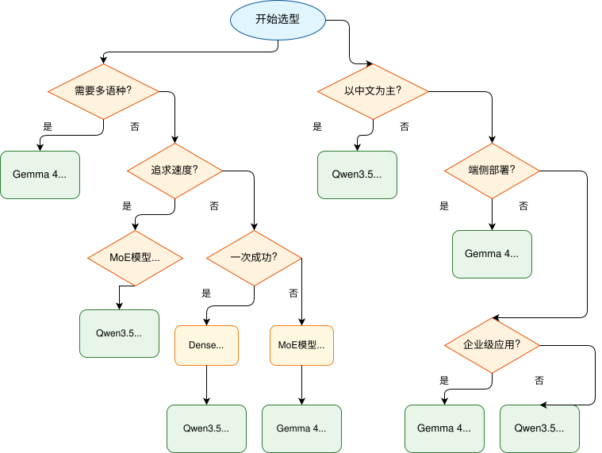

# Qwen3.5 vs Gemma4 双雄对决：2026开源AI选型指南

> 2026年4月，开源大模型领域迎来历史性时刻——阿里巴巴 Qwen3.5 与 Google Gemma 4 正面交锋，究竟谁才是你的最佳选择？

---



---

## 一句话总结

| 维度 | 结论 |
|------|------|
| **系列综合实力** | Qwen3.5 > Gemma 4 |
| **单型号王者** | Qwen3.5-27B（最均衡） |
| **多语种冠军** | Gemma 4 31B |
| **端侧部署首选** | Gemma 4 E4B/E2B |
| **许可证开放性** | Gemma 4（Apache 2.0） |

---

## 核心基准测试对比

### 学术能力大比拼

| 模型 | MMLU Pro | GPQA Diamond | LiveCodeBench | MMMLU |
|------|----------|--------------|---------------|-------|
| **Qwen3.5-27B** | **86.1** | **85.5** | **80.7** | 85.9 |
| **Qwen3.5-35B-A3B** | 85.3 | 84.2 | 74.6 | 85.2 |
| **Gemma 4 31B** | 85.2 | 84.3 | 80.0 | **88.4** |
| **Gemma 4 26B-A4B** | 82.6 | 82.3 | 77.1 | 86.3 |
| **Qwen3.5-9B** | 82.5 | 81.7 | 65.6 | 81.2 |
| **Gemma 4 E4B** | 69.4 | 58.6 | 52.0 | 76.6 |

> **关键发现**：Qwen3.5-27B 在通用知识、专家推理、代码生成三项核心指标上全面领先；Gemma 4 31B 则在多语言能力上独树一帜。

---

## 本地部署实测数据

**测试环境：RTX 4090 24GB（Q4_K_XL量化）**

| 模型                  | 预填充速度            | 生成速度           | VRAM占用 | 最大上下文    | 首次成功率        |
| ------------------- | ---------------- | -------------- | ------ | -------- | ------------ |
| **Gemma 4 26B-A4B** | **~4,300 tok/s** | **~135 tok/s** | ~21 GB | **256K** | 需3次尝试        |
| **Qwen3.5-35B-A3B** | ~3,100 tok/s     | ~136 tok/s     | ~23 GB | 200K     | 需2次尝试        |
| **Qwen3.5-27B**     | ~2,400 tok/s     | ~45 tok/s      | ~21 GB | 130K     | **第1次** [OK] |
| **Gemma 4 31B**     | ~1,400 tok/s     | ~38 tok/s      | ~24 GB | 65K      | **第1次** [OK] |

### 速度 vs 质量的权衡

```
速度优先 → Gemma 4 26B-A4B / Qwen3.5-35B-A3B（MoE架构）
   [OK] 生成速度快3倍
   [!] 复杂任务需要多次尝试

质量优先 → Qwen3.5-27B / Gemma 4 31B（Dense架构）  
   [OK] 一次成功率更高
   [OK] 代码质量更干净
   [!] 生成速度较慢
```

---

## 架构技术解析

### Qwen3.5 混合架构

```
┌─────────────────────────────────────────────────┐
│           Qwen3.5 架构亮点                       │
├─────────────────────────────────────────────────┤
│  • Gated DeltaNet（线性注意力）                   │
│  • Gated Attention（全注意力）                    │
│  • 64层中仅16层需要KV Cache                      │
│  • 原生262K上下文，可扩展至百万级                  │
│  • 中文优化原生支持                              │
└─────────────────────────────────────────────────┘
```

### Gemma 4 混合注意力

```
┌─────────────────────────────────────────────────┐
│           Gemma 4 架构亮点                        │
├─────────────────────────────────────────────────┤
│  • 50层滑动窗口（1024）+ 10层全局注意力            │
│  • Apache 2.0 完全开源许可证                     │
│  • 原生256K上下文窗口                            │
│  • E系列端侧优化（支持音频输入）                   │
│  • 数据截止时间透明（2025年1月）                   │
└─────────────────────────────────────────────────┘
```

---

## 实际场景表现

### 编程与Agent能力

| 场景 | Qwen3.5-27B | Gemma 4 31B |
|------|-------------|-------------|
| 代码整洁度 | 5/5 | 4/5 |
| API调用效率 | 5/5 | 4/5 |
| Debug能力 | 5/5 | 4/5 |
| 算法题优化 | 4/5 | 5/5 |
| 长代码生成 | 5/5 | 4/5 |

### 多模态能力

| 能力 | Gemma 4 | Qwen3.5 |
|------|---------|---------|
| 截图转HTML | 10.7 tok/s（快） | 2.05 tok/s（精） |
| 视觉还原度 | 4/5 | 5/5 |
| 原生支持 | 文本/图像/视频/音频 | 文本/图像 |

### 多语种能力

**Gemma 4 31B 在以下语言上超越 Qwen3.5：**
- 德语
- 阿拉伯语  
- 越南语
- 法语

> **翻译能力**：Gemma 4 独占一档

---

## 选型决策树



---

## 快速选型指南

### 选择 Qwen3.5-27B 如果你：

- [OK] 需要最均衡的通用能力、推理、代码能力
- [OK] 追求复杂任务一次成功率
- [OK] 中文场景为主
- [OK] 有 24GB 显存（RTX 3090/4090）

### 选择 Qwen3.5-35B-A3B 如果你：

- [OK] 追求极致生成速度（136 tok/s）
- [OK] 能接受更高 VRAM 占用和更多迭代次数

### 选择 Gemma 4 31B 如果你：

- [OK] 需要更强的多语种能力
- [OK] 重视人类偏好（对话体验更讨喜）
- [OK] 需要完全开源的 Apache 2.0 许可证
- [OK] 企业级工程治理要求高

### 选择 Gemma 4 26B-A4B 如果你：

- [OK] 追求 MoE 高效率和低推理成本
- [OK] 需要 256K 长上下文支持

### 选择 Gemma 4 E4B/E2B 如果你：

- [OK] 端侧部署（移动设备/嵌入式）
- [OK] 需要原生音频处理能力
- [OK] 超轻量级应用（2.3B-4.5B 有效参数）

---

## 总结

2026年的开源大模型已进入**"双雄时代"**：

| | Qwen3.5 | Gemma 4 |
|--|---------|---------|
| **定位** | 全能型选手 | 多语种专家 |
| **优势** | 性能均衡、中文强 | 许可证开放、工程规范 |
| **适合** | 开发者、企业应用 | 全球化产品、学术研究 |

> **好消息是**：两者都已达到可以真正替代闭源模型进行生产级开发的水平！

无论选择哪一方，开源 AI 的未来都令人期待！

---

## 参考来源

- [Gemma 4 VS Qwen 3.5 本地部署测评](https://gugesay.com/archives/5456)
- [Qwen3.5 vs Gemma 4：谁才是2026年开源模型第一？](https://gitcode.csdn.net/69d20c7f54b52172bc671330.html)
- [Notes on Qwen3.5 vs Gemma4 for Local Agentic Coding](https://aayushgarg.dev/posts/2026-04-05-qwen35-vs-gemma4/)
- [Gemma 4 全面解读 - DataLearner](https://www.datalearner.com/blog/1051775467624824)
- [Google Gemma 4 官方页面](https://deepmind.google/models/gemma/gemma-4/)
- [Qwen3.5 Technical Report](https://www.datacamp.com/blog/qwen3-5)

---

> **讨论时间**：你会选择 Qwen3.5 还是 Gemma 4？欢迎在评论区分享你的选择理由！
