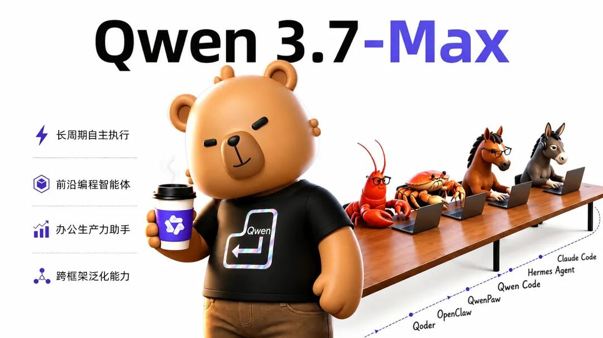
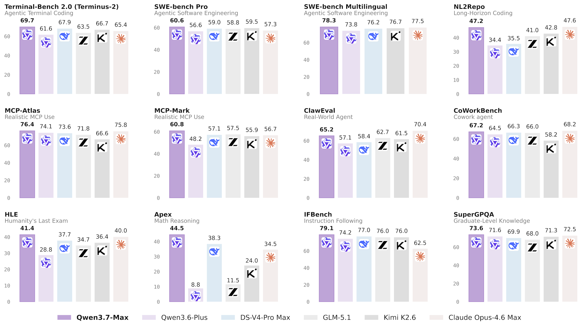
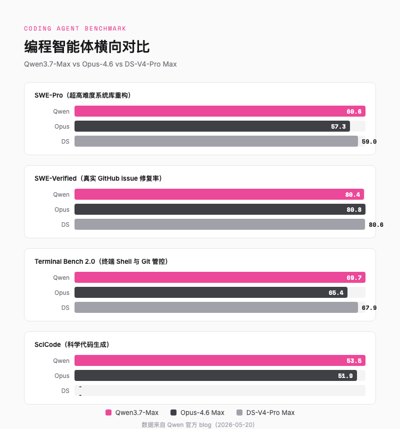
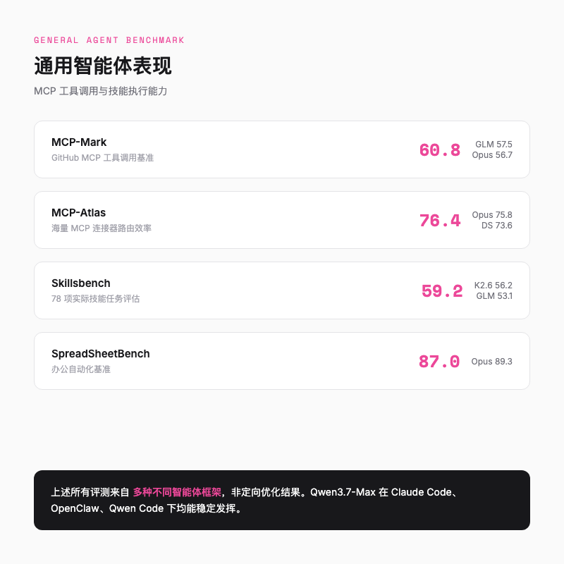
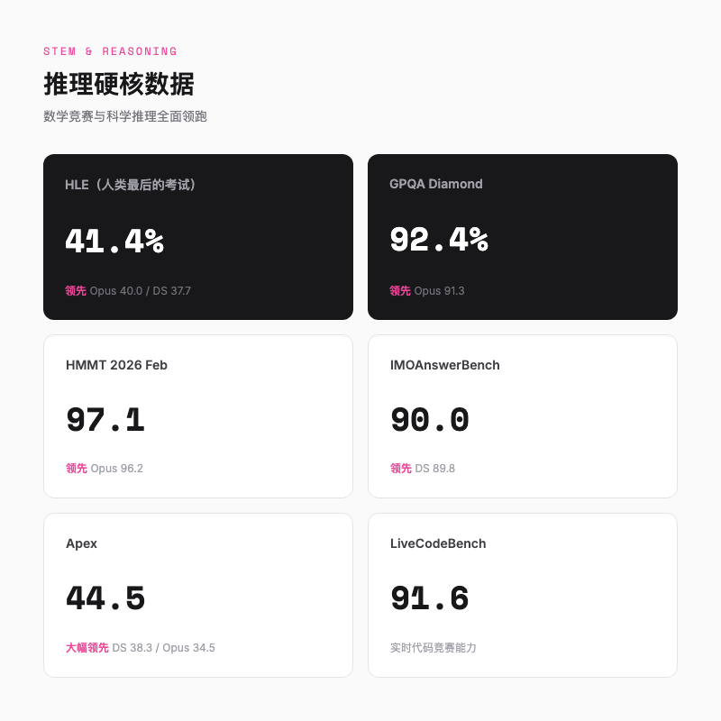
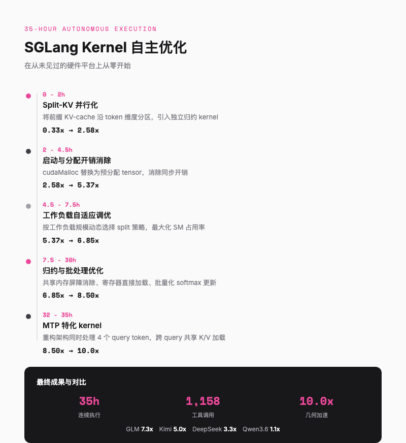
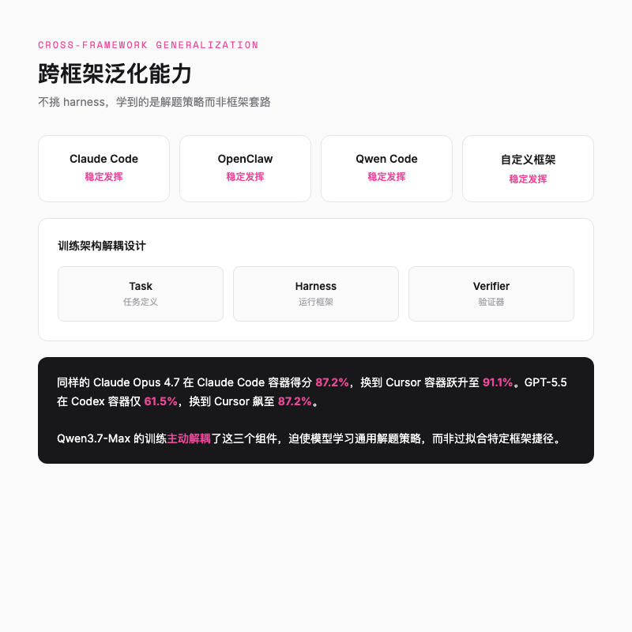
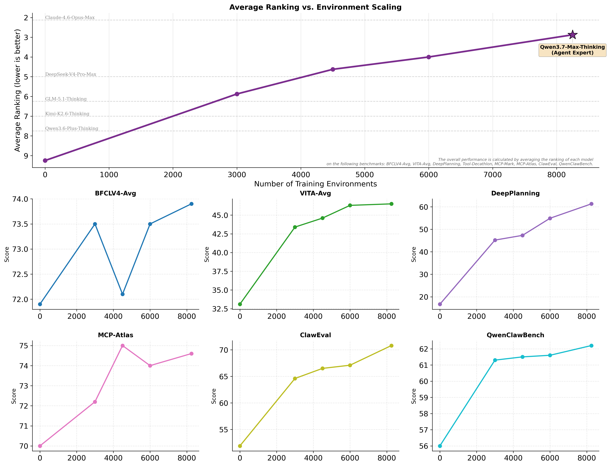
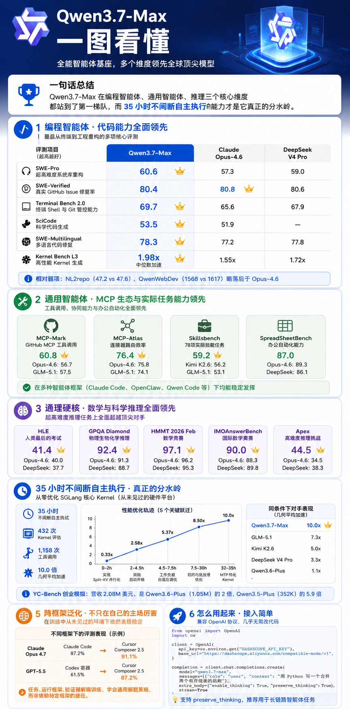

# 阿里千问 Qwen3.7-Max 发布，国产 Agent 基座第一次站上全球第一梯队

> 5 月 20 日阿里千问正式发布 Qwen3.7-Max，一张图里密密麻麻的数字让我停下来认真看了几分钟，这不是又一家国产模型在发新闻通稿，而是一张真正敢跟 Claude Opus 和 DeepSeek 正面刚的成绩单。



---

## 一句话总结

Qwen3.7-Max 在编程智能体、通用智能体、推理三个核心维度都站到了第一梯队，而 35 小时不间断自主执行的能力才是它真正的分水岭。



---

## Agent 基座，为什么比聊天模型更值得关注

如果你还在用「谁更会聊天」来评判大模型，可能已经掉队了。

我自己用 Claude Code 写代码这一年，越来越觉得「聊天」只是表面，真正值钱的是 Agent 能独立干完一个 feature。2026 年的赛道已经悄悄换了一条，能写代码、能调用工具、能在数百步任务里保持连贯的 Agent 基座模型，才是产业真正在买单的东西。

Qwen3.7-Max 的定位很直接，全能的智能体基座。不是做最好的聊天机器人，而是做那个你能放心丢给它一个复杂任务、让它自己跑 35 小时不崩的底层模型。

这个定位决定了它的 benchmark 必须看 Agent 维度，而不是单纯看 MMLU 或者聊天流畅度。

---

## 编程智能体，代码不是写出来就算

官方 benchmark 覆盖了从终端操控到多文件工程重构的多个维度。我把关键数字挑出来跟对手比了一下，发现 Qwen3.7-Max 不是「某一项突前、其他拉胯」的偏科生，而是难得的全能型。

**SWE-Pro**，超高难度系统库重构，Qwen3.7-Max 刷了 **60.6**，高于 Opus-4.6 Max 的 57.3，也高于 DS-V4-Pro Max 的 59.0。**SWE-Verified** 更胶着，Qwen3.7-Max 是 **80.4**，Opus-4.6 80.8，DS-V4-Pro Max 80.6，三家差距不到一个点，基本算打平。

真正让我意外的是 **Terminal Bench 2.0**，这个测终端 Shell 和 Git 管控能力，Qwen3.7-Max 冲到 **69.7**，超越了 DS-V4-Pro Max 的 67.9，也甩开 Opus-4.6 的 65.4 一段距离。你的 Agent 在终端里执行命令、管理代码版本时，Qwen3.7-Max 的可靠性更强。

再补几个亮点。**SciCode** 科学代码生成拿下 **53.5**，领先 Opus-4.6 的 51.9。**SWE-Multilingual** 多语言代码修复录得 **78.3**，同样领先。**Kernel Bench L3** 更夸张，1.98 倍中位数加速，96% 的问题都写出了比 torch.compile 更快的 kernel。这已经不是「能写代码」的层面了，是「能写高性能代码」的层面。



不过也有相对弱项。NL2repo（从自然语言生成完整仓库）47.2 略低于 Opus-4.6 的 47.6，差距很小。QwenWebDev 前端代码生成 1568 也落后于 Opus-4.6 的 1617。如果你主要做前端原型开发，Opus 目前还是略胜一筹。

---

## 通用智能体，MCP 才是新战场

如果说编程智能体测的是「写代码的能力」，通用智能体测的就是「调用工具、协同工作的能力」。这个维度在 2026 年变得越来越重要，因为 Agent 不再是一个孤岛，而是通过 MCP 连接器接入整个工具生态。

MCP 相关的两个 benchmark，Qwen3.7-Max 都拿了第一。**MCP-Mark**（GitHub MCP 工具调用）60.8，高于 GLM-5.1 的 57.5 和 Opus-4.6 的 56.7。**MCP-Atlas**（海量连接器路由效率）76.4，领先 Opus-4.6 的 75.8。

**Skillsbench** 这个 benchmark 我特别在意，因为它测的不是「模型会不会」，而是「模型能不能帮我干完一件杂事」。78 项实际任务里 Qwen3.7-Max 拿了 **59.2**，领先 Kimi K2.6 的 56.2 和 GLM-5.1 的 53.1。

办公自动化 **SpreadSheetBench** 拿了 **87.0**，接近 Opus-4.6 的 89.3。这个维度对于企业场景特别重要，大量的真实工作流不是写代码，而是处理表格、文档、邮件。



一个关键细节，上述所有评测分数来自多种不同的智能体框架。Qwen3.7-Max 不是针对某一特定框架做的定向优化，而是在 Claude Code、OpenClaw、Qwen Code 和各类自定义框架下都能稳定发挥。这一点比单个高分更重要。

---

## 推理硬核，数学和科学也没掉链子

一种常见的观点是，国产模型「工程能力还行，推理是硬伤」。Qwen3.7-Max 在这块拿出的数据可以直接回应这个偏见。

**HLE（Humanity's Last Exam）**，这个号称「人类最后的考试」的超高难度基准，Qwen3.7-Max 拿了 **41.4**，超越了 Opus-4.6 的 40.0 和 DS-V4-Pro Max 的 37.7。单这一个数字就足够说明问题。HLE 的出题者是各领域专家专门设计来刁难大模型的，41.4 的意义不是「及格」，而是「在最难的题上跑得最快」。

**Apex** 也是一个值得关注的指标，高难度推理挑战，Qwen3.7-Max **44.5**，大幅领先 DS-V4-Pro Max 的 38.3 和 Opus-4.6 的 34.5。这个差距比 HLE 更大。

数学竞赛方面同样全面占优。**GPQA Diamond** 92.4，超越 Opus-4.6 的 91.3。**HMMT 2026 Feb** 97.1，超越 Opus-4.6 的 96.2。**IMOAnswerBench** 90.0，超越 DS-V4-Pro Max 的 89.8。



说白了，说 Qwen3.7-Max「推理够用」已经不够了，它在最难的题上就是跑得最快的那个。

---

## 35 小时的含金量

跑分好看是一回事，能不能在真实场景中连续工作 35 小时不崩，是另一回事。这也是我觉得 Qwen3.7-Max 最值得关注的地方。

官方做了一个非常硬核的测试。他们把 Qwen3.7-Max 放到一台搭载平头哥真武 M890 PPU 的阿里云 ECS 上，任务是优化 SGLang 里的一个核心 kernel（Extend Attention）。注意，这个硬件平台是**训练过程中从未见过的**，模型没有任何该架构的性能分析数据或硬件文档。

起点只有一个任务描述、一段现有实现和一个评估脚本。剩下的全靠自己。

在随后的 **35 小时**里，模型完成了 **432 次 kernel 评估**，跨越 **1,158 次工具调用**。它完全自主地编写、编译、性能分析、迭代改进，诊断编译错误、修复正确性 bug、定位性能瓶颈，并多次重新设计 kernel 架构。

最终结果是 **10.0 倍几何平均加速**。

读到这的时候我停下来想了一下，35 小时，相当于一个实习生连续工作四天半不休息，而且没人给它派活，全靠自己摸索。

这个测试最震撼我的不是 10x 这个数字，而是优化轨迹。模型在最初几小时后仍然持续取得实质性进展，30 小时后还在发现有意义的改进。这说明它的长程推理能力不是「前面新鲜后面乱来」，而是真正保持了策略一致性。



对比其他模型在相同条件下的表现，更有说服力。GLM 5.1 达到 7.3x，Kimi K2.6 达到 5.0x，DS-V4-Pro Max 只有 3.3x，Qwen3.6-Plus 只有 1.1x。提前停止的模型是因为连续五轮未发出任何工具调用，判断自己已无法继续取得进展，主动结束了任务。

另一个实战案例也很有代表性。YC-Bench 模拟创业公司一年的经营，涉及数百轮决策，包括员工管理、合同筛选、恶意客户识别。Qwen3.7-Max 最终营收 **2.08M 美元**，是 Qwen3.6-Plus（1.05M）的 2 倍，是 Qwen3.5-Plus（352K）的 5.9 倍。更值得关注的是它展现出的策略进化能力，主动探索客户、识别并拉黑恶意陷阱、聚焦可靠收入来源、从中期危机中自主恢复。

---

## 跨框架泛化，不只在自己的主场厉害

前面提到一个关键细节，Qwen3.7-Max 的 benchmark 不是用自家框架跑的。官方明确说明，评测使用了 Claude Code、OpenClaw、Qwen Code 和各类自定义框架。

这为什么重要？

因为 2026 年有一个被越来越多人讨论的现象，**harness gap**。同样的模型，在不同的智能体容器中表现可以差很远。很多模型会在特定 harness 里被过度优化，换个环境就露馅。有些模型换个容器分数能差 20% 以上。

Qwen3.7-Max 的跨框架表现说明，它学到的不是「某个框架的套路」，而是**解决任务本身的通用策略**。官方的做法是，训练时故意把任务、框架、验证器这三样东西拆开，不让它们绑定。模型得在不同框架里解决同一个问题，没法靠「记住某套框架的套路」偷懒，只能去学真正通用的解题思路。





上图来自官方博客，展示了不同训练环境扩展量下的性能曲线。注意所有评测使用的都是训练中从未见过的全新环境，这说明扩展带来的是真正的能力泛化，而非针对特定 benchmark 的 overfit。

---

## 怎么用起来

Qwen3.7-Max 即将通过阿里云百炼提供 API，兼容 OpenAI 协议。如果你用过 OpenAI SDK，几乎不需要改代码。

```python
from openai import OpenAI
import os

client = OpenAI(
    api_key=os.environ.get("DASHSCOPE_API_KEY"),
    base_url="https://dashscope.aliyuncs.com/compatible-mode/v1",
)

completion = client.chat.completions.create(
    model="qwen3.7-max",
    messages=[{"role": "user", "content": "用 Python 写一个合并两个有序链表的函数"}],
    extra_body={"enable_thinking": True},
    stream=True
)
```

`preserve_thinking` 这个功能值得注意，它在消息中保留所有前序轮次的思维内容，**推荐用于智能体任务**。这对长链路 Agent 场景很重要，因为推理过程中的中间思考本身就是上下文的一部分。

Claude Code 用户可以直接把后端切到 Qwen3.7-Max，把环境变量指向百炼的 Anthropic 兼容接口就行。

```bash
export ANTHROPIC_MODEL="qwen3.7-max"
export ANTHROPIC_BASE_URL=https://dashscope.aliyuncs.com/apps/anthropic
export ANTHROPIC_AUTH_TOKEN=<your_api_key>
claude
```

---

## 总结

把 Qwen3.7-Max 的 benchmark 摊开看，它不是那种「某一个单项冠军」的模型，而是**多个维度均衡且都在第一梯队**的模型。

但这些跑分还不是最让我意外的。35 小时不间断自主优化、在从未见过的硬件平台上从零写出 10x 加速的 kernel、YC-Bench 里展现出的策略进化能力，这些才是「Agent 基座」这个词的真正含义。

国产大模型走到今天，在智能体这个最难的赛道上，Qwen3.7-Max 已经具备了跟全球最顶尖对手正面竞争的实力。

当然，跑分不等于体验，benchmark 上的领先能不能转化为真实工作流里的生产力提升，还需要更多人实际用起来验证。但至少这张成绩单，值得你认真看一眼。



---

欢迎关注我的公众号「Chyris Tech Note」，获取更多 AI 技术解读与实践分享。
