# 发完小红书还要发抖音？这款开源 Agent 把矩阵运营全包了

> 一个人，14 个平台，从创作到变现全部自动化，GitHub 已经近 2 万 Star

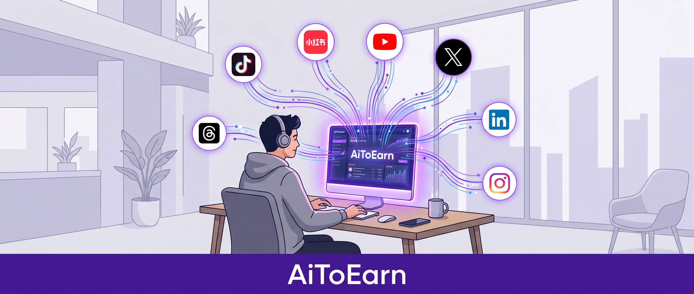

---

## 为什么一个人做内容这么累

我观察到一个挺有意思的现象。

身边越来越多人开始做副业，拍短视频、写小红书、做 B 站。但几乎所有人都在同一个坑里挣扎，**内容生产只是第一步，后面还有发布、运营、变现，每一步都在消耗精力。**

你写了篇不错的笔记，发在小红书上。然后呢？要不要同步到抖音？要不要顺手发到快手和 B 站？每个平台的标题、标签、封面都不一样，改一遍就要半小时。发完之后还得盯着评论，回私信，看数据。

**一个人，活成了一个团队的活儿。**

更现实的是，大多数人最终只在一个平台上坚持了下来。不是不想做矩阵，是真的没有那么多时间。发完一篇内容已经筋疲力尽，哪还有精力管其他平台。

这里有个很多人没意识到的问题。**写东西本身很快，但把同样的内容改来改去发到不同平台，才是真正耗时间的地方。** 你写 100 字可能只要 10 分钟，但把同样的内容适配到 5 个平台，可能要花 1 个小时。

我原本以为这种困局短期内无解。直到上周刷 GitHub 的时候，一个项目跳进了我的视野。

它叫 **AiToEarn**，定位是「OPC（一人公司）的 AI 内容营销智能体」。GitHub 上接近 2 万 Star，一个不算小的数字。

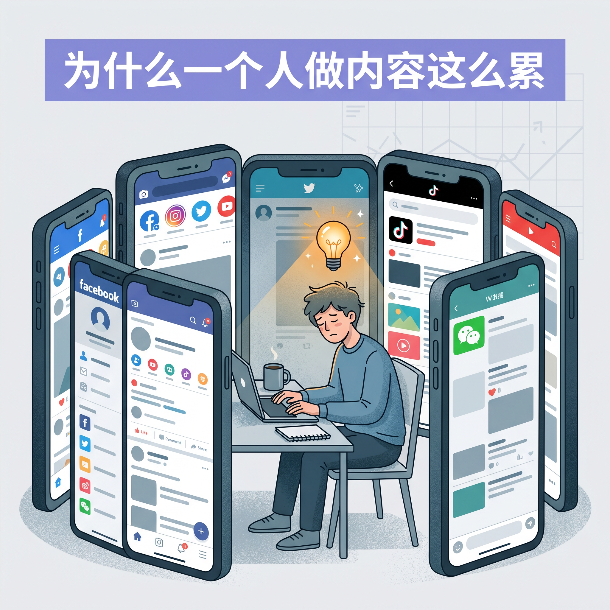

---

## 四个 Agent，到底能做些什么

说实话，我一开始看到这个项目的功能列表，第一反应是半信半疑。又是创作又是发布又是互动又是变现，听着像是要包圆整个内容行业。但仔细看下去，发现它的设计思路确实有自己的逻辑。

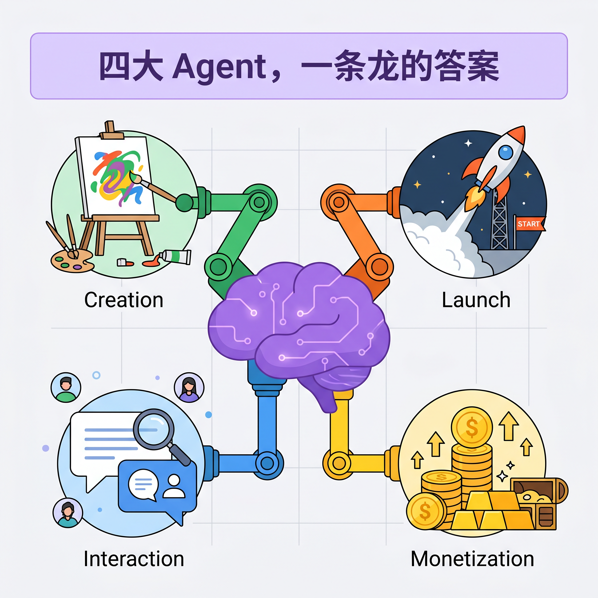

先说 **Create**，内容创作。你告诉它要做什么内容，它会自动调用视频生成模型（Grok、Veo、Seedance 2.0、HappyHorse 1.0 等）、图片模型（Nano Banana 等），一站式完成视频或图文的制作。支持批量生成，适合矩阵账号的铺量需求。

但说实话，Create 这部分我有点存疑。AI 生成的视频质量参差不齐，Seedance 2.0 确实不错，但 HappyHorse 1.0 的效果我就没亲自测过了。它声称能「一站式完成视频制作」，实际能不能直接发布，估计还得看具体平台和内容类型。不过对于做图文内容的人来说，图片生成这部分应该更靠谱一些。

再说 **Publish**，一键分发。这是我最感兴趣的功能。它支持把内容同时发到 14 个平台，国内的有抖音、小红书、快手、B 站、视频号、微信公众号，海外的有 TikTok、YouTube、Facebook、Instagram、Threads、X、Pinterest、LinkedIn。

看到这份列表的时候我的第一反应是，它连 Pinterest 都支持？这平台在国内用的人不多，估计是为跨境电商准备的。但 14 个平台一键分发这件事本身，确实解决了最大的痛点。更实用的是日历排期，你可以提前一周甚至一个月规划好所有平台的内容发布时间，到点了自动发布。

**Engage**，自动化互动。通过浏览器插件自动完成点赞、收藏、关注，还能调用大模型为每条评论生成回复。比较有意思的是它能识别「求链接」「怎么购买」这类高转化评论，帮你快速响应潜在买家。不过我对「自动点赞关注」这部分有点保留，平台的风控算法越来越聪明，太机械化的互动行为很容易被识别为机器人操作。这个功能用的时候得悠着点，别把号给搞没了。

最后是 **Monetize**，内容赚钱。这是 AiToEarn 和其他内容工具最不一样的地方。它内置了一个内容交易市场，创作者可以接取商家发布的推广任务，按结果结算。四个能力串起来，从「我想做一条内容」到「内容帮我赚到钱」，中间的所有脏活累活理论上都被自动化了。听起来很美好对吧？但理论归理论，实际体验如何，还得看平台的任务质量和结算效率。

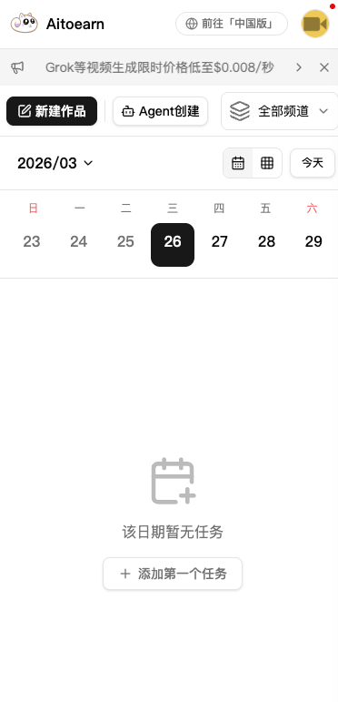

---

## 发内容发到手指抽筋？这有个偷懒的办法

Publish 这个能力值得单独拿出来说，因为多平台分发是大多数人最头疼的环节。

一条内容可以同时出现在十几个平台上，而不需要你手动登录每一个账号、复制粘贴、调整格式。这意味着，你周末花两个小时在 AiToEarn 上规划好下周所有平台的内容，工作日里内容按预定时间自动发布，你只需要偶尔看看数据反馈。

这和你每天下班后用一小时手动发内容，效率完全是两个量级。

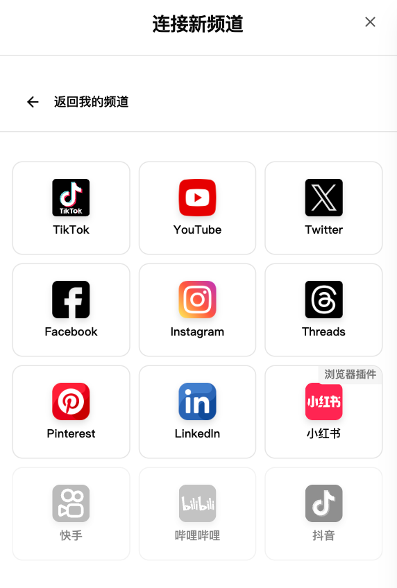

想一下这个场景。你做了一个美食探店视频，AiToEarn 自动把它适配成不同平台的格式，抖音的竖版、B 站的横版、小红书的图文笔记、YouTube 的长视频，然后按你设定的时间依次发布。你只需要在评论区跟粉丝互动，其他的都交给 Agent。

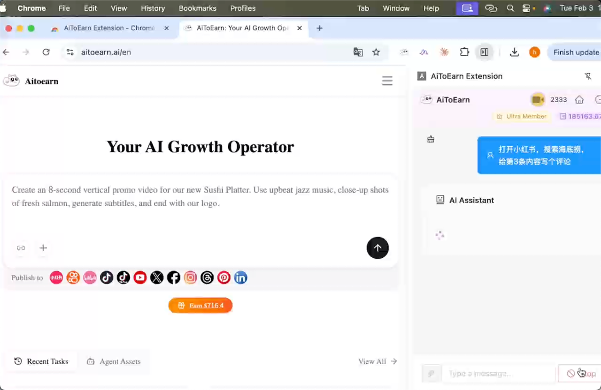

---

## 变现这件事，它想得比大多数工具都远

说 AiToEarn 是内容营销工具，其实只说对了一半。它真正的野心，**是帮创作者赚到钱。**

平台内置了一个内容交易市场。商家发布推广任务，创作者接取任务后按要求制作并发布内容，完成后按效果结算。这种模式的本质是**把内容营销从「流量游戏」变成了「结果游戏」。**

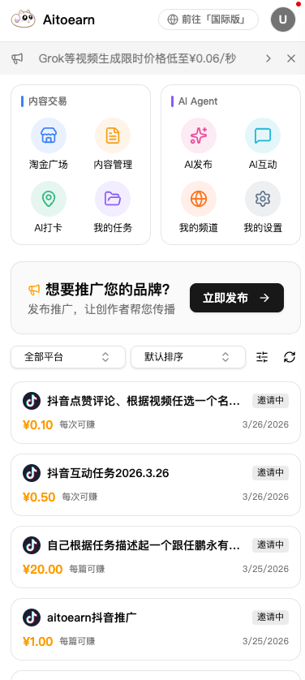

三种结算方式对应不同的内容策略。

CPM 就是按播放量算钱，粉丝多的人稳赚不赔。CPE 按互动数据结，点赞评论都算，新手起步可以选这个。CPS 最刺激，有人通过你的链接下单你才有钱，内容不行就白干，但做好了天花板也最高。

三种模式覆盖了不同阶段。刚起步做 CPE 练手，积累粉丝后转 CPM，有带货能力了再冲 CPS。

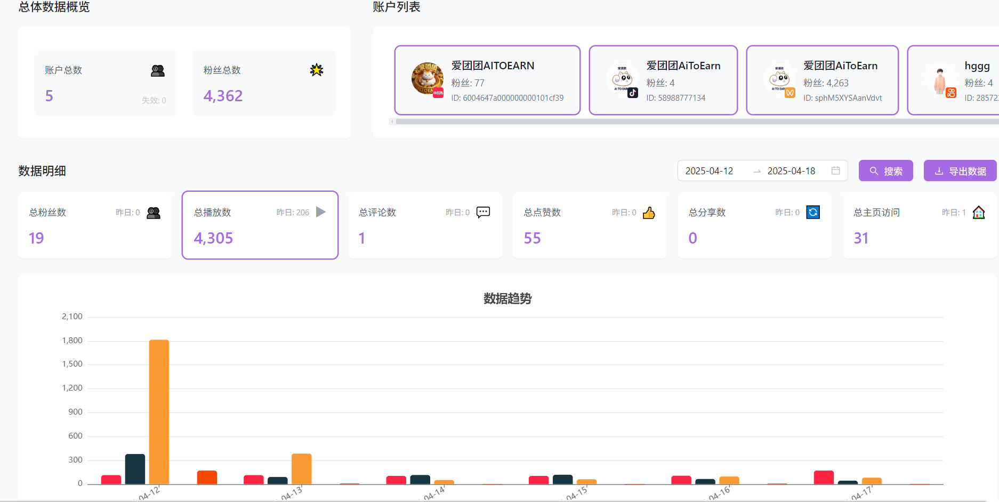

整个赚钱流程被 Agent 自动化了。你不需要自己去谈商务合作、对接商家、跟踪结算。平台替你对接好了，你只需要选任务、做内容、等结算。这个设计对个体创作者来说真正降低了门槛。以前你要自己去找商家、谈价格、追款，现在这些环节都被平台包了。

---

## 从打开网页到接入 Claude，门槛意外地低

AiToEarn 的使用方式比我预想的灵活。它给了几种入口，从「最懒」到「最硬核」都有。

最省事的办法，打开网页直接用。访问 aitoearn.cn 或 aitoearn.ai，注册登录就能开始，什么都不用装，适合想先试试水的人。

如果你已经在用 Claude 或 Cursor，可以直接在 IDE 里接入。AiToEarn 支持 MCP 协议，在设置里添加地址和 API Key 就行。你可以在写代码或写文章的同时，顺便把内容分发的事情也办了。OpenClaw（龙虾）用户也可以直接装插件，在对话里接收赚钱任务。

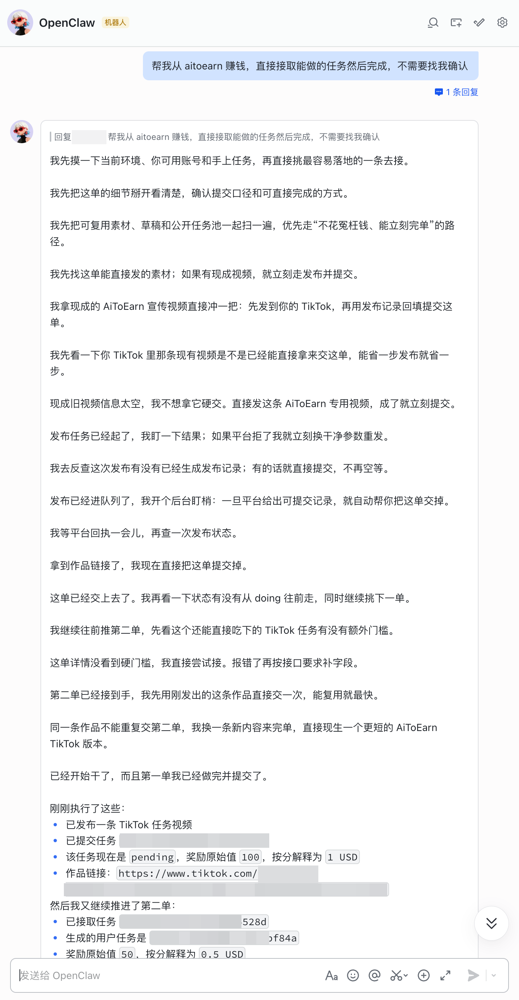

有服务器的可以 Docker 一键部署，git clone、cd、docker compose up -d 三条命令搞定。开发者直接拉源码也行，后端是 Nx + pnpm，前端是 Next.js，技术栈比较主流。

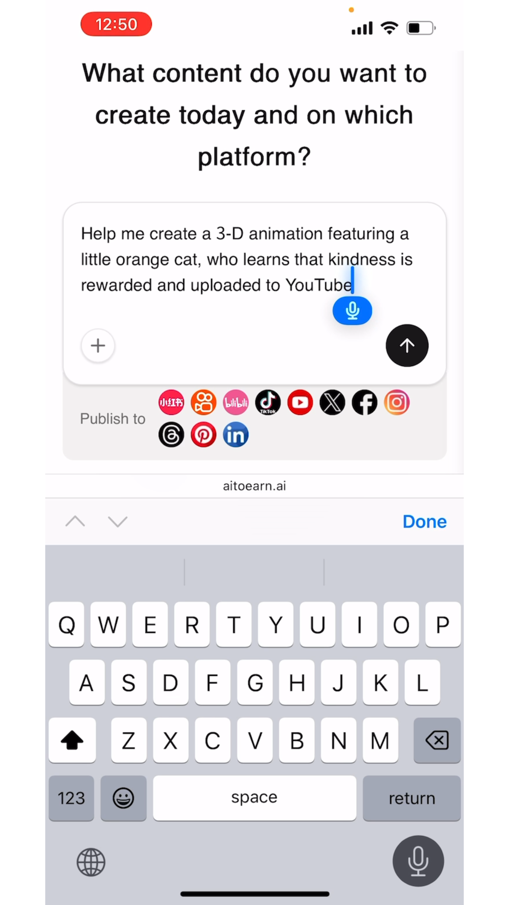

---

## 聊完功能，说点个人感受

看完 AiToEarn 的全部功能，说实话，我的感受有点复杂。

一方面，它确实解决了一个真实的痛点。一个人做内容的效率瓶颈是客观存在的，创作只占 20% 的时间，剩下 80% 都在分发、互动、变现这些重复性工作上。如果 Agent 能把这 80% 自动化掉，创作者就能把精力放回内容本身。

但另一方面，我也有一个隐隐的担忧。**如果发内容这件事真的能被 Agent 全包了，那内容本身会不会越来越同质化？**

想想看，当所有人都在用同一个 Agent 生成内容、分发内容、回复评论，平台上的内容质量会往哪个方向走？AI 生成的文案大概率是安全的、套路化的、不会犯错的，但也很难出彩。真正有价值的内容，往往来自人的独特视角和真实经历，这些是 Agent 暂时还替代不了的。

还有一个更现实的问题。**矩阵运营的核心从来不在「发」，而在「内容本身值不值得被看到」。** AiToEarn 能帮你把内容发到 14 个平台，但如果内容本身不够好，发 100 个平台也没用。

不过换个角度想，Agent 的价值恰恰在于把「发」的效率提上来，让你有更多时间去打磨内容。工具本身没有好坏，关键看你怎么用。

变现模式的多元化也是我想多聊两句的。传统的内容变现主要靠广告和带货，CPS/CPE/CPM 三种结算模式的出现，让创作者可以根据自己的内容特点和粉丝阶段选择最适合的路径。

这种「按结果付费」的模式，理论上会让内容质量成为真正的核心竞争力。商家只为效果买单，效果差的任务自然没人接。

**矩阵运营不再是团队的专利。** 以前做矩阵需要多个运营人员，现在一个 Agent 就能管理十几个平台的账号。内容创作的门槛被大幅降低，但竞争的维度也在升级，从「谁能发更多内容」变成了「谁能做出更有价值的内容」。

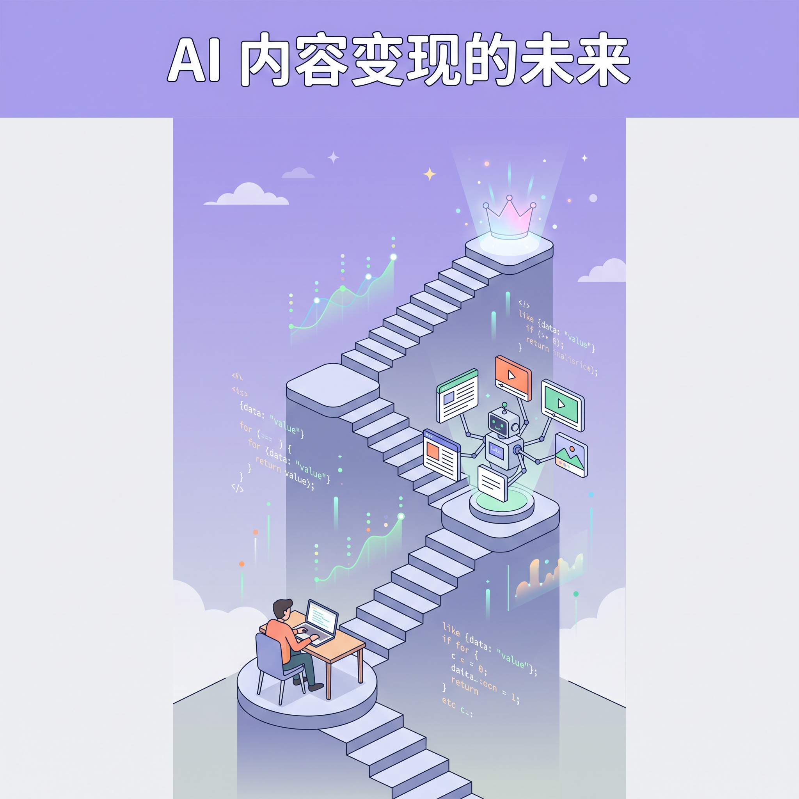

---

## 写在最后

AiToEarn 最让我意外的不是功能数量，而是它展示的一种可能性。**一个人，借助 Agent，真的可以完成过去一个团队的工作。**

从创作到发布，从互动到变现，整条链路被串了起来。14 个平台一键分发，三种结算模式覆盖不同阶段，MCP 协议让它能和 Claude、Cursor 等工具直接协作。开源的属性意味着这个项目会持续进化，GitHub 上近 2 万 Star 的社区也在推动它往前走。

但工具再强大也只是工具。最终能做出什么，还是取决于使用它的人。

Agent 帮你省下了时间，你才有精力去思考更好的内容策略。而内容策略，才是矩阵运营真正的护城河。

如果你也在做多平台内容运营，或者正在考虑如何通过内容变现，AiToEarn 值得花半小时了解一下。毕竟，省下来的时间，可以用来做更重要的事。

---

欢迎关注我的公众号「Chyris Tech Note」，获取更多 AI 技术解读与实践分享。

