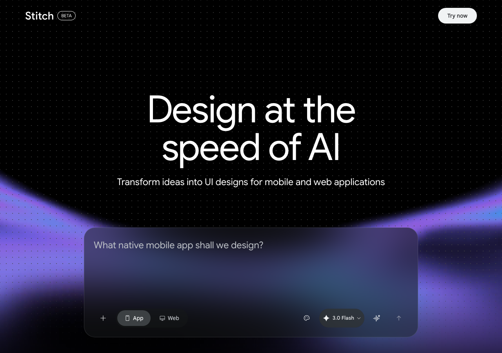
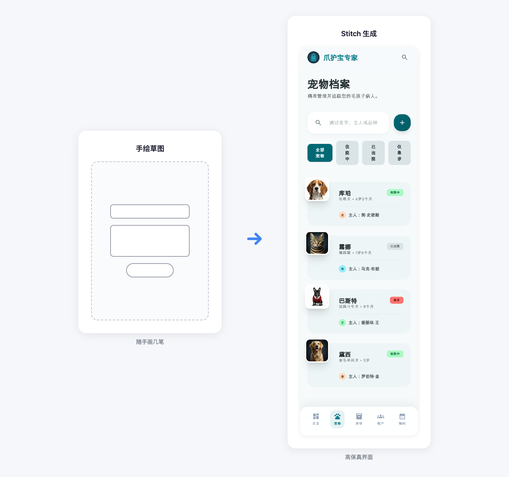
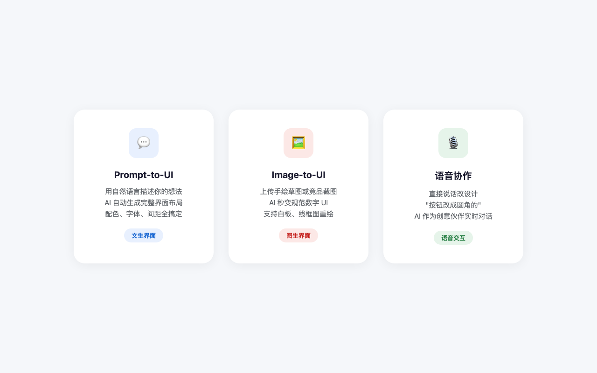
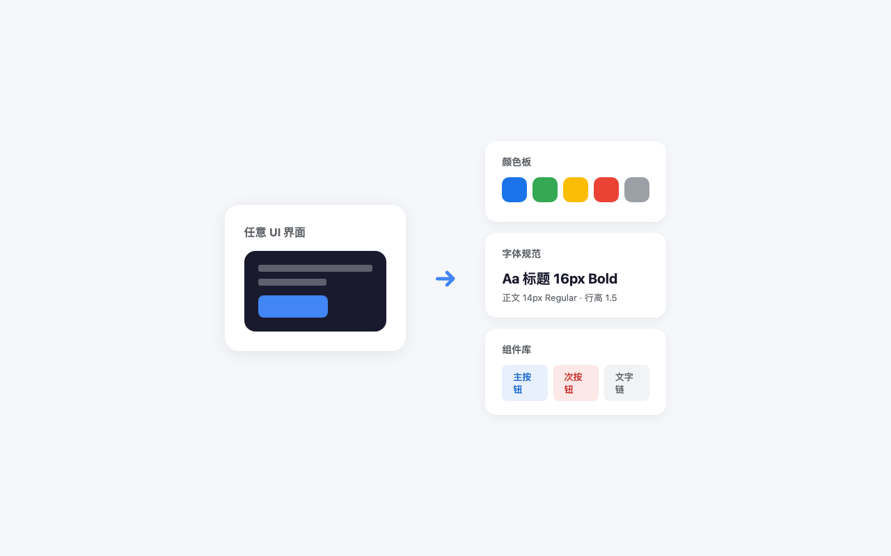
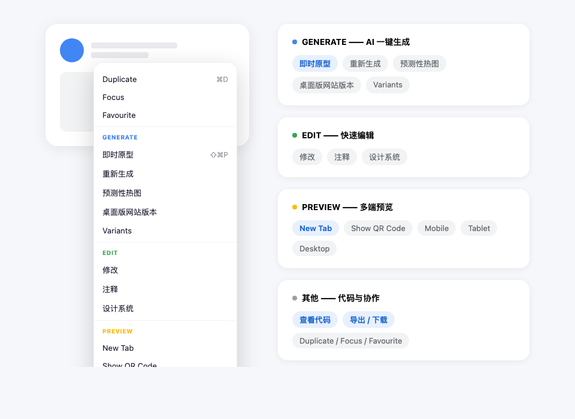
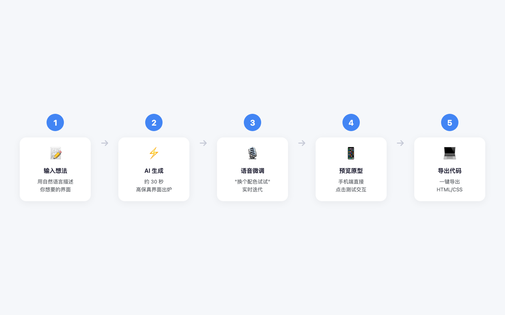
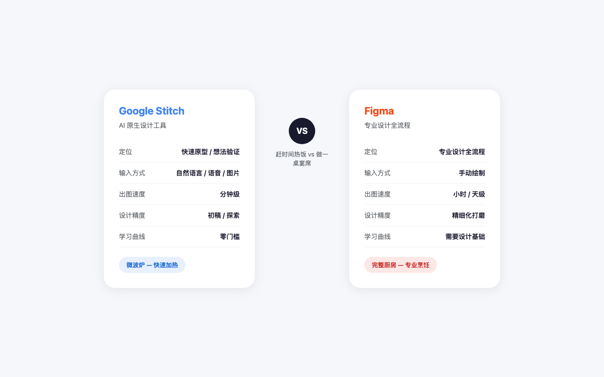
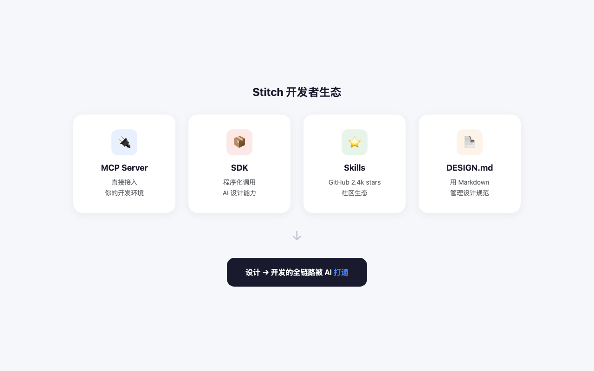

# Figma 慌了？Google 祭出 AI 设计神器 Stitch，动动嘴就能出 UI

> "一个做后端的同学跑来问我：哥，我想做个 App，但不会用 Figma，怎么办？"
> 以前我会让他去 B 站学三天 UI 基础。现在我只回一句话：**去试试 Google Stitch。**

---

## 一句话总结

**Google Stitch** 是 Google Labs 推出的 AI 原生 UI 设计工具。你不需要会画线框图、不需要懂配色、不需要拉矩形——**用自然语言描述你的想法，AI 就能在几分钟内生成高保真的移动端或网页界面。**

它甚至支持**语音指令**和**手绘草图转数字 UI**，堪称设计界的"微波炉"。

---

## 01｜这不是又一个 AI 画图工具

先泼一盆冷水：Stitch 不是 Midjourney，也不是 DALL-E。

它生成的不是一张"看起来像 UI 的图片"，而是**具有层级结构、可交互、可导出代码的真正的 UI 设计**。底层由 Google 最强的多模态大模型 **Gemini 2.5 Pro** 驱动。

官网的标语很直接：**"Design at the speed of AI"**——用 AI 的速度做设计。

> 一张手绘草图上传后，Stitch 生成的高保真宠物档案管理界面

---

## 02｜核心功能：从"动嘴"到"出图"只需三步

Stitch 的核心能力可以概括为三个"to-UI"：

### Prompt-to-UI（文生界面）

输入一句话，比如：

> "一个深色调的 SaaS 仪表盘，带有数据图表、侧边栏导航和用户头像区域"

AI 会自动生成完整的页面布局、配色方案、字体层级和间距系统。**不需要你告诉它按钮应该多大、标题用什么字号**——它都懂。

### Image-to-UI（图生界面）

这个功能对产品经理和开发者极度友好：

- 拍一张手绘草图丢进去，AI 帮你"重绘"成规范的数字 UI
- 截图竞品 App 的界面，AI 帮你重新设计成符合你品牌风格的版本
- 甚至支持上传线框图、白板照片

### 语音协作

是的，**你可以直接跟 AI 说话**来改设计：

> "把这三个按钮改成圆角的"
> "给我生成三个不同的配色方案"
> "这个页面太复杂了，简化一下"

AI 不是被动执行命令，而是会**作为创意伙伴**跟你对话，帮你挖掘更好的设计方向。

---

## 03｜AI 不止生成，还会"思考"

Stitch 有几个让我眼前一亮的**智能特性**：

| 特性 | 说明 |
|------|------|
| **AI 迭代与分支探索** | 选中某个元素说"换个风格"，AI 会生成多个版本供你对比，而不是直接覆盖原稿 |
| **自动生成设计系统** | 从任意 UI 中提取整套规范：颜色板、组件库、字体规则，跨项目复用 |
| **静态设计秒变交互原型** | AI 理解页面逻辑，自动连接页面跳转，手机端直接预览点击效果 |
| **从 URL 提取设计系统** | 输入任意网站地址，AI 自动分析其设计语言 |

> 最狠的是这个：**Stitch 支持导出 DESIGN.md 格式的设计规则文件**，可以像写代码一样管理设计规范。

---

## 04｜右键一下，藏着一整个设计工作室

Stitch 的界面极其简洁，但**右键菜单**里藏着它的全部野心。

我截取了一张右键菜单的完整展开图，功能被分成了四大块：

| 分组 | 核心功能 | 说明 |
|------|---------|------|
| **GENERATE** | 即时原型、重新生成、预测性热图、Variants | AI 生成相关能力的一站式入口 |
| **EDIT** | 修改、注释、设计系统 | 快速编辑和协作 |
| **PREVIEW** | New Tab、二维码、Mobile/Tablet/Desktop | 一键切换多端预览尺寸 |
| **其他** | 查看代码、导出/下载、Duplicate | 开发交付和项目管理 |

重点说两个：**「即时原型」**和**「预测性热图」**。

**即时原型**（快捷键 ⇧⌘P）能把你的静态设计秒变可点击的交互原型，不用手动画连线。AI 会自动理解页面逻辑，把按钮和对应页面串起来。

**预测性热图**更狠——它用 AI 预测用户点击行为的分布，帮你判断哪个按钮太偏、哪个 CTA 不够醒目。以前这是专业 UX 团队用眼球追踪仪才能做的事，现在右键点一下就有了。

> 从生成、编辑、预览到导出代码，Stitch 把「设计→原型→交付」整条链路压缩到了一个右键菜单里。

---

## 05｜最小 Demo：3 分钟出一个 App 界面

假设你是个后端开发者，想快速验证一个"健身打卡 App"的想法：

1. 打开 [stitch.withgoogle.com](https://stitch.withgoogle.com)，用 Google 账号登录（**目前免费**）
2. 在输入框里写：**"一个健身打卡 App 的首页，深色主题，有今日训练计划卡片、卡路里消耗环形图和底部导航栏"**
3. 等待约 30 秒——AI 生成高保真界面
4. 点击某个元素，语音或文字说：**"把环形图换成柱状图试试"**
5. 满意后，**一键导出 HTML/CSS 代码**，直接丢给前端同事

全程不需要打开 Figma，不需要画一个矩形。

---

## 06｜Stitch vs Figma：微波炉和完整厨房

很多人问：Stitch 会取代 Figma 吗？

我的答案是：**不会，但会改变设计工作的分工。**

| 维度 | Google Stitch | Figma |
|------|--------------|-------|
| **定位** | 快速原型 / 想法验证 | 专业设计全流程 |
| **输入方式** | 自然语言 / 语音 / 图片 | 手动绘制 |
| **出图速度** | 分钟级 | 小时 / 天级 |
| **设计精度** | 初稿 / 探索 | 精细化打磨 |
| **协作方式** | AI 作为创意伙伴 | 多人实时协作 |
| **代码导出** | HTML/CSS + SDK | 需插件 |
| **学习曲线** | 零门槛 | 需要设计基础 |

> 类比一下：**Stitch 是微波炉，Figma 是完整厨房。** 你赶时间热个饭，用微波炉；你要做一桌宴席，还是得进厨房。

设计师不会被淘汰，但**"从 0 到 1 画初稿"这个环节**，以后可能大部分交给 AI 了。

---

## 07｜文档生态：不止是个设计工具

Stitch 的野心不止于"生成 UI"。它正在构建一套完整的开发者生态：

- **MCP Server**：可以直接接入你的开发环境
- **SDK**：支持程序化调用 AI 设计能力
- **Skills 生态**：GitHub 上已有 2.4k stars 的 stitch-skills 项目
- **DESIGN.md 规范**：一种用 Markdown 描述设计系统的标准格式

这意味着未来你的 AI 编码助手（比如 Claude Code）可以直接调用 Stitch 来生成界面，**设计→开发的全链路可能会被 AI 打通。**

---

## 总结

Google Stitch 代表了一个明确的趋势：**AI 正在从"辅助设计"走向"原生设计"**。

传统的设计工具是在 Photoshop 和 Sketch 的基础上加 AI 功能，而 Stitch 从第一天起就是围绕 AI 的思维方式来构建的——它不理解"图层"，它理解的是"意图"。

对于以下人群，我建议你现在就去试试：

- **产品经理**：快速把想法变成可点击的原型，跟老板演示
- **后端/全栈开发者**：自己出高保真 mockup，不再依赖设计师排期
- **创业者**：低成本验证产品概念，比雇设计师便宜 100 倍
- **设计师**：用 AI 做初稿探索，把精力留给真正有创造力的环节

> 访问地址：[stitch.withgoogle.com](https://stitch.withgoogle.com)
> 费用：**目前 Google Labs 阶段，免费使用**

---

*你觉得 Stitch 会改变设计行业吗？欢迎在评论区聊聊。*
