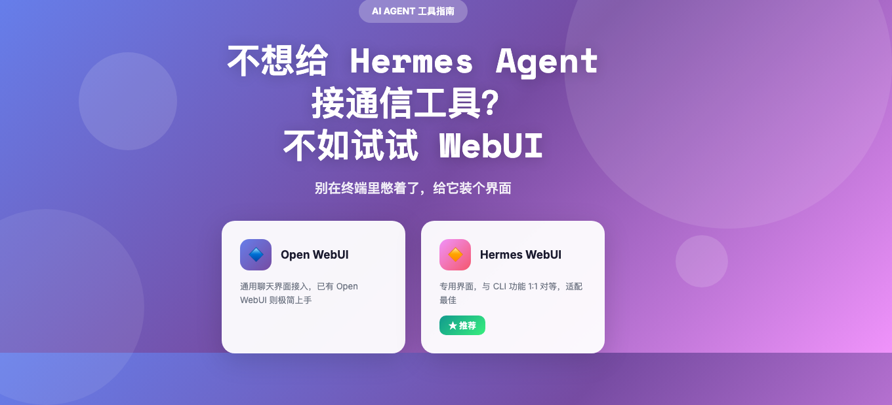
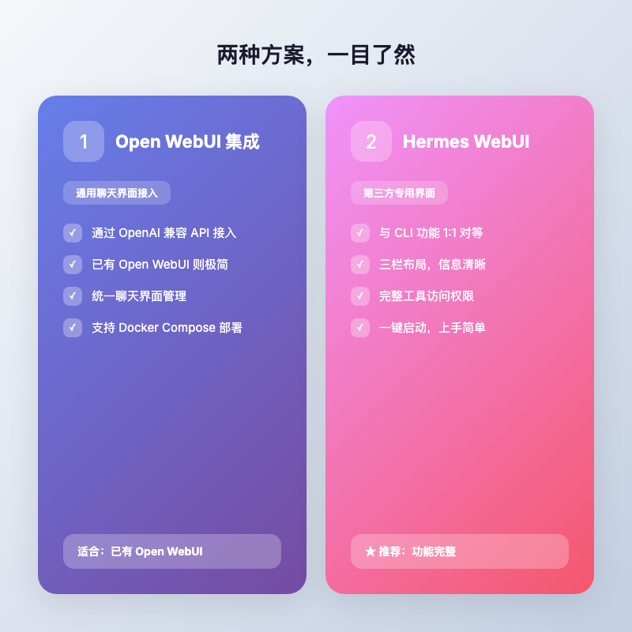
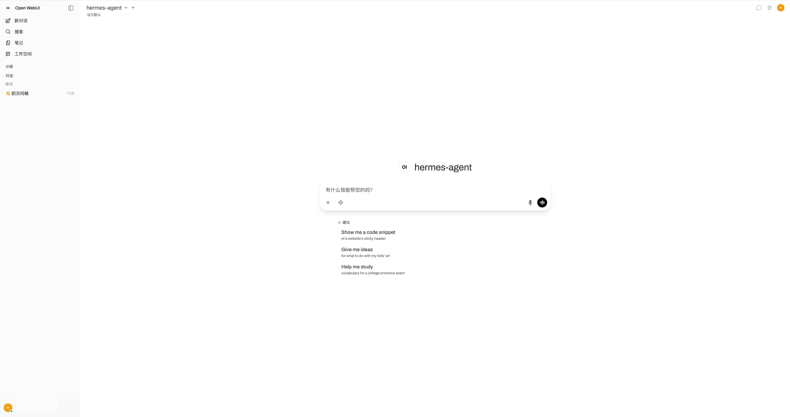
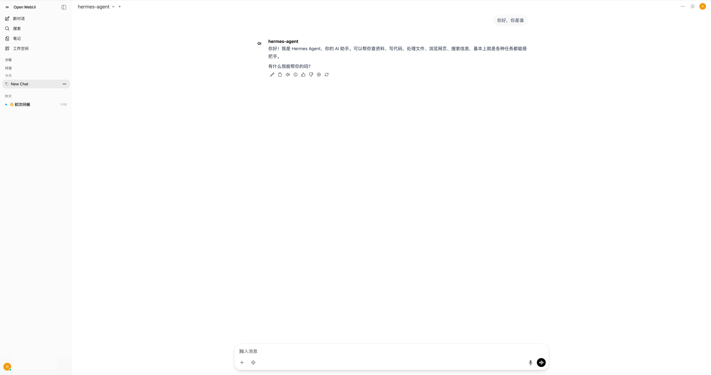
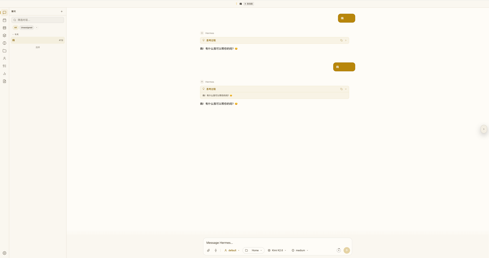
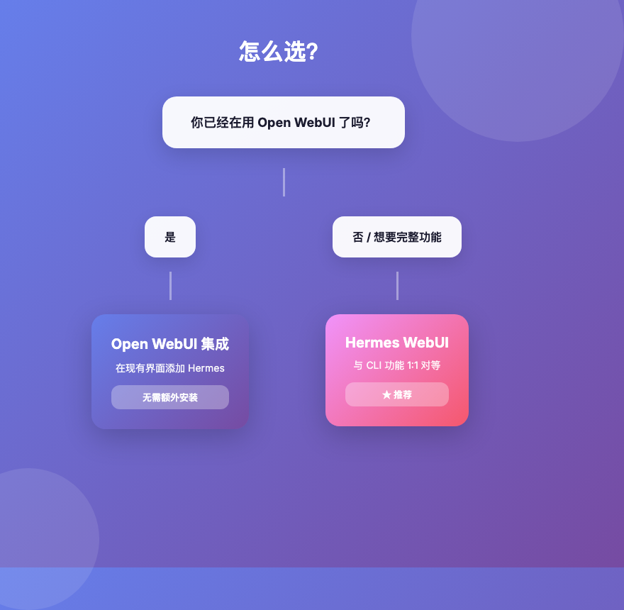

> 这几天在用 Hermes Agent 写点小工具，但每次都要切到终端、敲命令，总感觉打断思路。琢磨着给它加个 Web 界面，一查发现还真有两个路子。



---

## 一句话总结

Hermes Agent 有两种 Web 界面可用，如果追求功能完整度，**推荐 Hermes WebUI**，它能做到与 CLI 1:1 的功能对等。

---

## 两种方案，一目了然

| 方案 | 性质 | 功能完整度 | 上手难度 |
|---|---|---|---|
| Open WebUI 集成 | 通用聊天界面接入 | 基础对话 | 已有 Open WebUI 则极简 |
| Hermes WebUI | 第三方专用界面 | 与 CLI 1:1 对等 | 一键启动 |

**方案一**适合已经在用 Open WebUI 的用户，不想折腾太多，只是想让 Hermes 在一个统一的聊天界面里出现。

**方案二**适合想要完整体验 Hermes 能力的人，终端能做的事情，Web 界面里基本都能做。



---

## 方案一，把 Hermes 接入 Open WebUI

Open WebUI 是个开源聊天界面，原本用来接各种大模型。Hermes Agent 暴露了 OpenAI 兼容的 API，所以可以「假装」成一个模型被 Open WebUI 调用。

### 启用 Hermes API Server

先在 Hermes 的环境配置里开一下 API 服务。

编辑 `~/.hermes/.env`，加入两行：

```bash
API_SERVER_ENABLED=true
API_SERVER_KEY=your-secret-key
```

把 `your-secret-key` 换成你自己的随机字符串，这就是等会儿要填的 API Key。

可选配置，想改端口或绑定地址的话：

| 变量 | 默认值 | 说明 |
|---|---|---|
| `API_SERVER_PORT` | `8642` | API 服务监听端口 |
| `API_SERVER_HOST` | `127.0.0.1` | 绑定地址，默认只允许本机访问 |

### 启动 Gateway

在终端里跑：

```bash
hermes gateway
```

看到这行就说明跑起来了：

```
[API Server] API server listening on http://127.0.0.1:8642
```

**这个终端不能关**，Gateway 一停，Web 界面就找不到 Hermes 了。长期跑的话建议用 tmux 或 systemd 托管。

### 在 Open WebUI 添加连接

1. 打开 Open WebUI
2. 进 ⚙️ Admin Settings → Connections → OpenAI
3. 点 ➕ Add Connection
4. 填入：

| 设置 | 值 |
|---|---|
| URL | `http://localhost:8642/v1` |
| API Key | 刚才设的 `API_SERVER_KEY` |

5. 点 ✅ 验证，通过后保存



> 如果你用 Docker 跑 Open WebUI，URL 要换成 `http://host.docker.internal:8642/v1`，Docker 内部访问不到 localhost。

### Docker Compose 一键部署

双容器方案（Hermes Agent + Open WebUI）更省心，一个 compose 文件搞定：

```yaml
services:
  open-webui-hermes-agent:
    image: nousresearch/hermes-agent:latest
    container_name: open-webui-hermes-agent
    command: gateway run
    ports:
      - "127.0.0.1:8643:8642"
    volumes:
      - openweb-hermes-home:/home/hermes/.hermes
      - openweb-uploads:/workspace/openwebui_upload
    environment:
      - HERMES_HOME=/home/hermes/.hermes
      - HERMES_UID=${UID:-1000}
      - HERMES_GID=${GID:-1000}
      - API_SERVER_ENABLED=true
      - API_SERVER_KEY=your-secret-key
      - API_SERVER_HOST=0.0.0.0
    restart: unless-stopped
    networks:
      - openweb-hermes-net

  open-webui:
    image: ghcr.io/open-webui/open-webui:main
    container_name: open-webui
    depends_on:
      - open-webui-hermes-agent
    ports:
      - "3000:8080"
    volumes:
      - open-webui:/app/backend/data
      - openweb-uploads:/app/backend/data/uploads
    environment:
      - OPENAI_API_BASE_URL=http://open-webui-hermes-agent:8642/v1
      - OPENAI_API_KEY=your-secret-key
    extra_hosts:
      - "host.docker.internal:host-gateway"
    restart: always
    networks:
      - openweb-hermes-net

networks:
  openweb-hermes-net:
    driver: bridge

volumes:
  openweb-hermes-home:
  open-webui:
  openweb-uploads:
```

> 两个容器通过 `openweb-uploads` 共享上传目录。这样你在 Open WebUI 上传的文件，Hermes Agent 可以直接访问，进行完整的文件分析。

跑起来：

```bash
docker compose up -d
```

然后打开 http://localhost:3000，创建管理员账户就能用了。



### 常见坑

**模型下拉列表是空的**

大概率是 URL 忘了加 `/v1`。应该是 `http://localhost:8642/v1`，不是 `http://localhost:8642`。

检查 Gateway 状态：
```bash
curl http://localhost:8642/health
# 应该返回 {"status": "ok"}

curl http://localhost:8642/v1/models
# 应该列出 hermes-agent
```

**连接测试通过了，但还是没有模型**

Open WebUI 的连接测试只检查基本连通性，不检查模型发现。大部分情况是 `/v1` 的问题。

**Docker 里连不上 Hermes**

`host.docker.internal` 在 Linux 上默认不解析。三个办法：

1. 加 host 映射：`docker run --add-host=host.docker.internal:host-gateway ...`
2. 用 host 网络：`docker run --network=host ...`
3. 用 Docker bridge IP：`docker run -e OPENAI_API_BASE_URL=http://172.17.0.1:8642/v1 ...`

---

坦白说，Open WebUI 集成跑是能跑，但用着总觉得隔了一层。Hermes 的终端操作、文件浏览、技能调用这些特性，在通用聊天界面里根本体现不出来。

后来我发现了 Hermes WebUI，这个就不一样了。

## 方案二，用 Hermes WebUI（推荐）

这是专门为 Hermes 打造的 Web 界面，虽然不是官方原生的，但**适配得最好**。

README 原话是「gives you nearly 1:1 parity with Hermes CLI from a convenient web UI」，实际用起来确实如此。

### 一键启动

最简单的启动方式：

```bash
git clone https://github.com/nesquena/hermes-webui.git
cd hermes-webui
python3 bootstrap.py
```

bootstrap 脚本会自动做几件事：
1. 检测 Hermes Agent 是否安装，没有就帮你装
2. 找或创建 Python 环境
3. 启动 Web 服务器
4. 自动打开浏览器

如果不想要自动打开浏览器，加个 `--no-browser` 参数。

### 三栏布局

Hermes WebUI 的界面用起来很顺手：

- **左侧栏**：会话列表和导航
- **中间**：聊天区域
- **右侧**：工作区文件浏览器

模型、Profile、工作区控制都放在底部的 **composer footer** 里，随时可见。还有个圆环形的上下文指示器，一眼就能看出 Token 用了多少。

所有设置和会话工具都在左下角的 **Hermes Control Center** 里。



### 功能对等

终端里能做的事情，Web 界面里基本都能做。完整的聊天对话、终端命令、文件操作、网页搜索，还有记忆、技能、定时任务和会话管理，该有的都有。

### Docker 部署

预编译镜像已经发布到 GHCR，支持 amd64 和 arm64。

单容器快速启动：

```bash
git clone https://github.com/nesquena/hermes-webui
cd hermes-webui
cp .env.docker.example .env
# 如果你的主机 UID 不是 1000（比如 macOS 从 501 开始），编辑 .env
docker compose up -d
# 打开 http://localhost:8787
```

如果想要 Hermes Agent 和 WebUI 分离，用双容器模式：

```bash
docker compose -f docker-compose.two-container.yml up -d
```

要加密码保护的话：

```bash
echo "HERMES_WEBUI_PASSWORD=change-me-to-something-strong" >> .env
docker compose up -d --force-recreate
```

### 踩坑记录

Docker 跑起来之后，Hermes 可能还没有配置模型。

进入容器：
```bash
docker exec -it <container-id> bash
```

运行配置：
```bash
/opt/hermes/.venv/bin/hermes setup
```

然后按提示配置你的模型提供商（OpenAI、Anthropic、本地模型等）。配置完退出容器，Web 界面就能正常工作了。

---

## 怎么选？

我自己现在是两个都在用，但场景不一样：

- 快速问个问题、测试一下想法 → Open WebUI，因为已经打开着了
- 认真写工具、需要用到终端和文件 → Hermes WebUI

如果只让我留一个，我会毫不犹豫选 Hermes WebUI。毕竟用 Hermes 就是为了它的那些高级能力，用一个阉割版的界面，有点买椟还珠了。



---

## 总结

Hermes Agent 很强大，但终端门槛劝退了不少人。给它装个 Web 界面，就能让更多人方便地用上它的能力。

两种方案各有适用场景，但如果要推荐，**选 Hermes WebUI**。它的功能完整度和对 Hermes 的适配程度，都是目前最好的选择。

---

欢迎关注我的公众号「Chyris Tech Note」，获取更多 AI 技术解读与实践分享。

