# 从 RAG 到 LLM Wiki：Karpathy 的新范式正在被 2800+ 开发者验证

> 你把50篇论文丢给AI，问了100个问题。AI翻了100次书，但什么都没记住。这就是当下几乎所有"AI知识库"的真相。

---

## 一句话总结

RAG让AI每次考试都临时翻书，LLM Wiki让AI读完书后自己写一本笔记。这本笔记会越写越厚、越连越密。

---

## 一、RAG的根本困境：知识从未被"消化"

先别急着关掉页面。我知道"RAG已死"这种标题很标题党，但听完这个类比，你可能会认同。

想象两个学生走进考场。

RAG模式的那位，背着一书包原书。考官问什么，他就当场翻目录、找章节，把答案拼出来。问完一题，合上书；再问一题，重新翻。考了100次，书还是那堆书，他什么都没记住。

人类模式的那位，读书时做了笔记，画了思维导图，在知识点之间建立了联系。他带进考场的是自己整理的笔记。越到后期，这本笔记越值钱。

现在的 ChatGPT 文件上传、NotebookLM、各种AI阅读助手，本质上都是第一种学生。

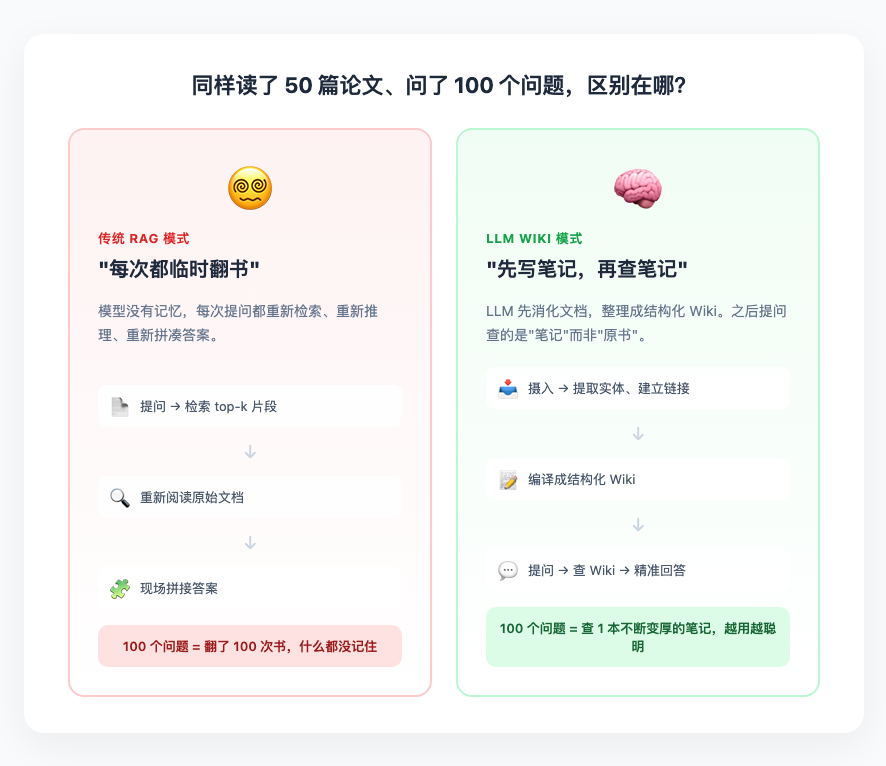

Andrej Karpathy（前Tesla AI总监、OpenAI创始成员）在最近发布的设计文档里，直接点出了问题：

> "RAG让LLM每次都在重新发现知识。没有积累。如果你问一个需要综合5份文档的微妙问题，LLM每次都要从头找起、重新拼凑。没有任何东西被建立起来。"

RAG只做了"搬运"，没做"消化"。

---

## 二、Karpathy的解法：让AI当"终身图书管理员"

Karpathy的方案，思想其实一句话就能说完：

让AI先把文档"吃进去"，消化成一本结构化、交叉引用的个人维基百科。以后你提问，问的是这本维基，而不是那堆原始PDF。

他把这套系统比作软件编译：

| 软件工程 | 知识管理 |
|---------|---------|
| 源代码 | 原始文档（PDF、论文、笔记） |
| 编译器 | LLM（阅读、提取、整合） |
| 编译后的可执行文件 | 结构化Wiki页面 |

架构分三层：

**第一层：Raw Sources（原始资料）**

你上传的论文、文章、PDF。这一层是只读的。它是你的"信源底线"，AI不能改。

**第二层：The Wiki（维基本体）**

AI生成的markdown页面：实体页、概念页、对比分析、查询记录。AI负责创建、更新、交叉引用，还要保持一致性。

**第三层：Schema + Purpose（规则与灵魂）**

`schema.md`告诉AI Wiki怎么组织、怎么命名、怎么分类；`purpose.md`定义你的研究目标、关键问题、核心论点。AI每次干活前先读这两份文件，确保不跑偏。

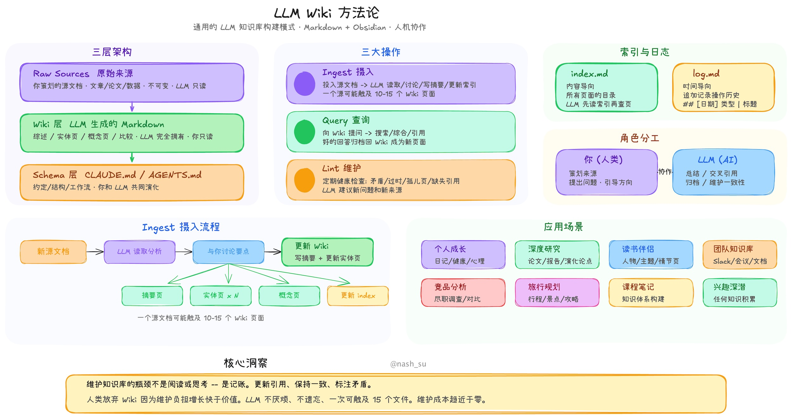

三个操作贯穿始终：

Ingest（摄入）：丢进去一篇论文，AI不是建个索引就完事。它要读完、提取实体、更新相关页面、记录矛盾、改写综述、追加日志。一篇论文可能触发10-15个wiki页面的更新。

Query（查询）：你问问题，AI先翻 `index.md` 找到相关页面，再深入读取，给出带引用来源的回答。好答案会被归档回wiki，你的探索也在复利积累。

Lint（检查）：定期让AI审计整个wiki。找矛盾、孤立页面、过时论断和知识缺口。相当于给知识库做体检。

Karpathy的比喻很精练：

> "Obsidian是IDE，LLM是程序员，Wiki是代码库。"

---

## 三、从设计文档到桌面应用：nashsu/llm_wiki

Karpathy的原文是一个"复制粘贴给AI Agent的设计模式"。它告诉你应该怎么做，但没有给你一套能双击打开的软件。

这就是 nashsu/llm_wiki 的价值。

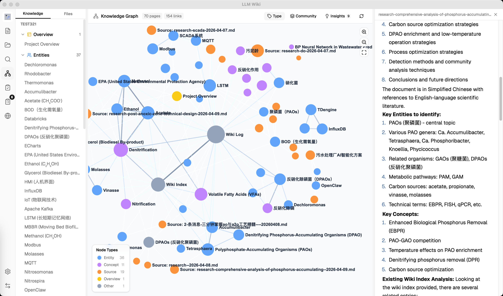

这个项目在2026年4月8日开源，16天内涨到2800+ Star、319个 Fork。它把Karpathy的想法做成了一个完整的跨平台桌面应用（Tauri + React + Rust后端），并且做了不少工程增强。

### 技术栈一览

| 层级 | 技术 | 作用 |
|-----|------|------|
| 桌面框架 | Tauri v2 (Rust核心) | 跨平台、体积小、本地文件访问 |
| 前端 | React 19 + TypeScript + Vite | 响应式UI、复杂状态管理 |
| UI组件 | shadcn/ui + Tailwind CSS v4 | 现代化界面 |
| 编辑器 | Milkdown (ProseMirror) | 所见即所得Markdown编辑 |
| 图谱可视化 | sigma.js + graphology + ForceAtlas2 | 实时渲染数千节点知识图谱 |
| 搜索 | 分词搜索 + 图谱关联度 + 可选向量(LanceDB) | 多阶段召回 |
| LLM接口 | 流式fetch | 支持OpenAI、Anthropic、Google、Ollama、自定义 |

设计上本地优先。所有Markdown文件和图谱数据都存储在本地设备上，保证隐私，也符合Karpathy对知识"所有权"和"持久性"的强调。

---

## 四、六大核心增强：这个项目做了什么进化？

真正让这个工具脱离"玩具"范畴的，是开发团队在工程层面的思考。

### 1. 两步思维链摄入（Two-Step CoT Ingest）

Karpathy原设计是单步：AI边读边写。nashsu拆成了两步：

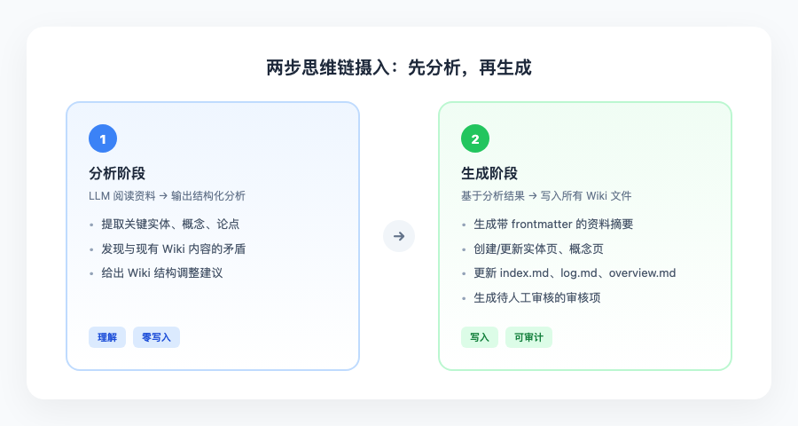

让AI先打草稿再动笔，质量明显提升。再加上 SHA256增量缓存，文件没改就跳过，不浪费token。

### 2. 四信号知识图谱 + Louvain社区检测

原始设计只提了 `[[wikilink]]` 链接。nashsu构建了完整的图引擎，用四种信号量化页面关联度：

| 信号类型 | 权重 | 含义 |
|---------|------|------|
| 来源重叠 | ×4.0 | 两个概念来自同一篇原始文档，关联更强 |
| 直接链接 | ×3.0 | 显式的 `[[wikilink]]` 链接，人类或AI确认的逻辑联系 |
| Adamic-Adar指数 | ×1.5 | 基于共同邻居的结构相似性，稀有邻居比高频邻居更"珍贵" |
| 类型亲和 | ×1.0 | 同类页面（如两个"实体"）在分类学上更接近 |

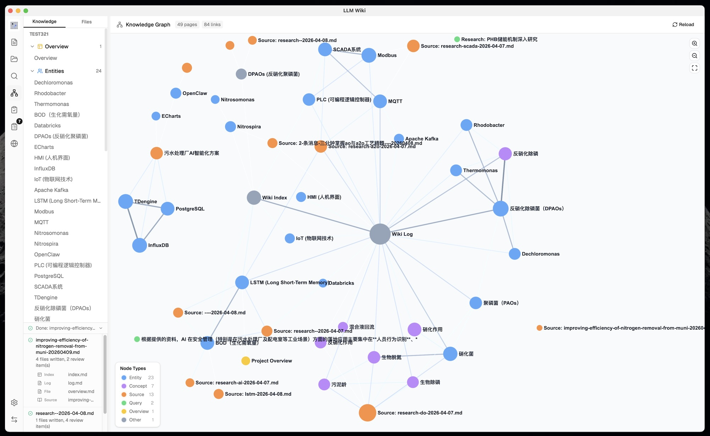

在此基础上运行 Louvain社区检测算法，自动发现你的知识有哪些"隐形的圈子"。

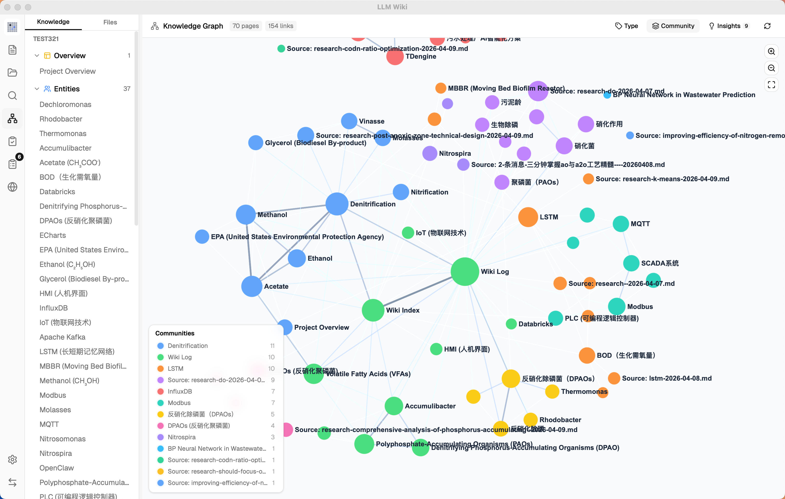

比如你可能没意识到，那8篇关于"能量存储"的论文和5篇关于"电网调度"的论文，其实已经在你的知识库里形成了一个紧密的聚类。

### 3. 图谱洞察：AI主动发现"知识裂缝"

系统会自动分析图谱结构，向你汇报三类洞察：

孤立页面：度数≤1的节点，代表这个知识点还没和整体建立联系。
稀疏社区：内聚力分数<0.15的群体，预示该领域知识碎片化严重。
桥接节点：连接3个以上不同集群的页面，通常是跨学科交叉的枢纽。

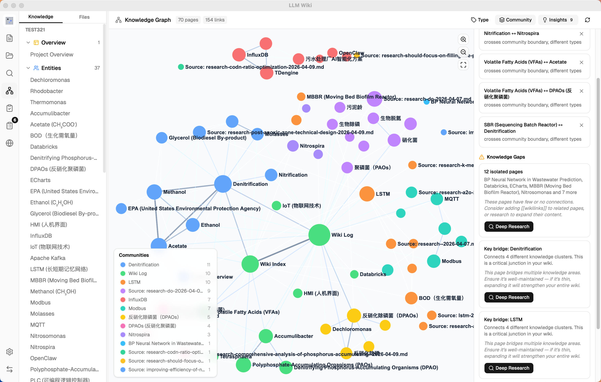

发现知识空白后，一键触发Deep Research。AI自动生成搜索主题，调用Tavily搜索网络资料，合成研究报告，再自动摄入wiki。闭环了。

### 4. 四级查询检索管道

查询不是简单关键词匹配，而是四阶段pipeline：

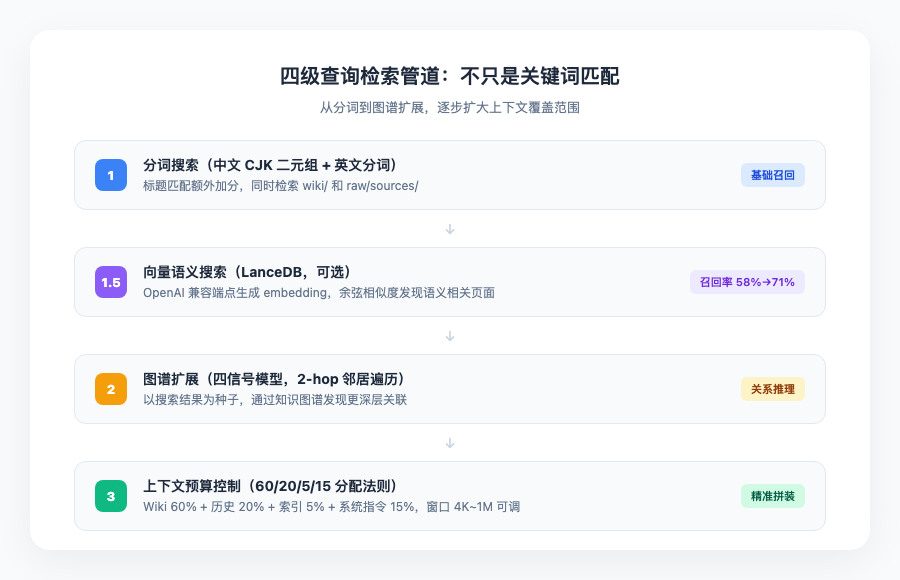

这里有个很精细的设计，60/20/5/15预算分配。LLM处理超长文本时有"lost-in-the-middle"问题，对中间部分关注度会下降，所以必须对输入进行精细化管理。系统确保模型始终看到的是压缩过的高密度信息，而不是原始的长文档片段。

### 5. Chrome网页剪藏插件

一键捕获任意网页，Readability.js提取正文，Turndown.js转markdown，自动触发摄入管道。相当于给你的浏览器装了一个"知识收割机"。

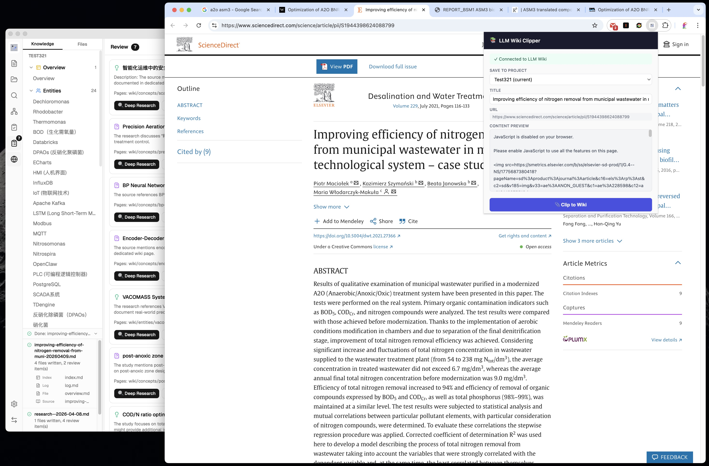

### 6. 异步审核系统

AI在摄入过程中遇到不确定的内容，不会瞎编，而是把它挂进审核队列，等你空闲时处理。

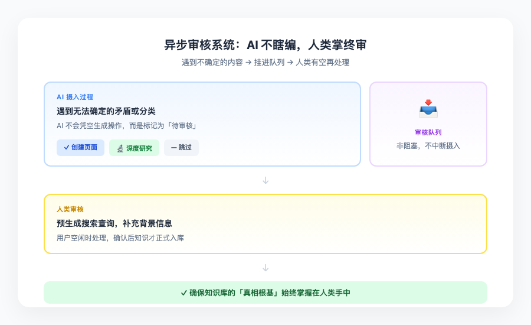

预定义动作只有三种：创建页面、深度研究、跳过。不给AI幻觉的空间。

---

## 五、RAG vs LLM Wiki：一张表看懂差异

好了，到了你们最关心的环节。硬碰硬对比一下。

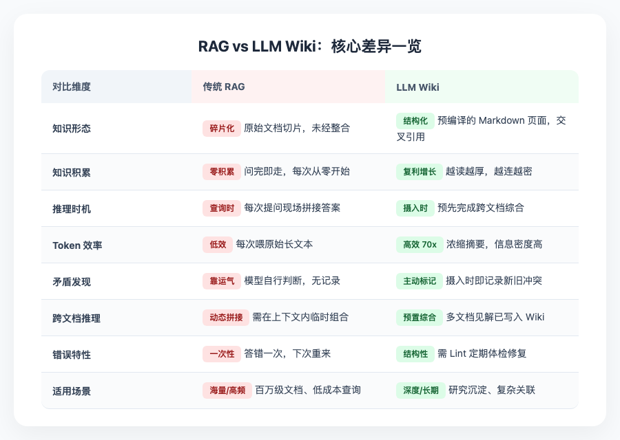

核心差异一句话：RAG把推理负担放在查询时，LLM Wiki把推理负担放在摄入时。

对于中等规模（5万~10万词）的知识库，一个2万token的原始文档可以被压缩成2,000token的高密度维基页面。这意味着在相同上下文窗口内，维基架构可以让模型看到十倍于RAG的信息覆盖面。

---

## 六、写在最后：不是取代，而是分层

nashsu/llm_wiki目前2834+ Star，对于一个诞生不到三周的项目来说，这个增长速度说明了一件事：大家苦RAG久矣。

人们已经厌倦了"把文件丢进去、问几个问题、然后一切归零"的体验。真正有价值的是那种越用越聪明、越读越连通的知识系统。

但这不意味着RAG要被扫进历史垃圾堆。未来的先进系统更可能是一种"分层记忆模型"：

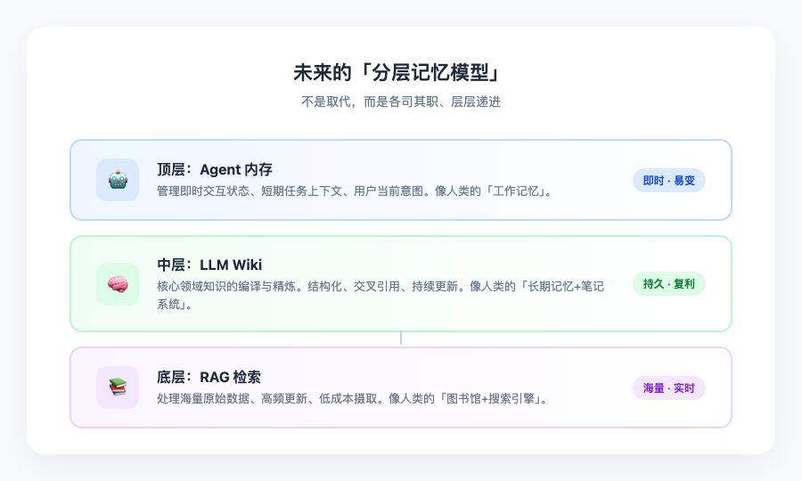

RAG在百万级文档、高频更新、低成本摄取方面仍有不可替代的优势。LLM Wiki填补了"知识沉淀与复利积累"这一块空白。

Karpathy给了思想，nashsu给了工具。

如果你也在用AI处理大量文档，读论文、做研究、整理笔记、管理团队知识，也许该试试这个范式了。

让AI当你的图书管理员，比你每次亲自翻书要靠谱得多。

---

参考链接：
- Karpathy LLM Wiki设计模式：https://gist.github.com/karpathy/442a6bf555914893e9891c11519de94f
- nashsu/llm_wiki开源项目：https://github.com/nashsu/llm_wiki
