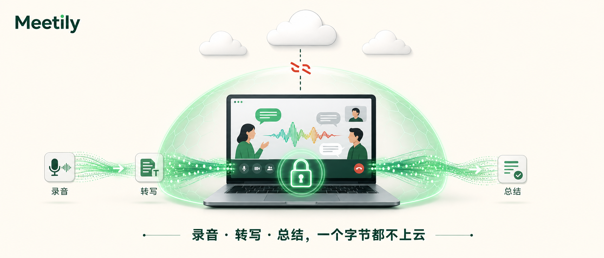
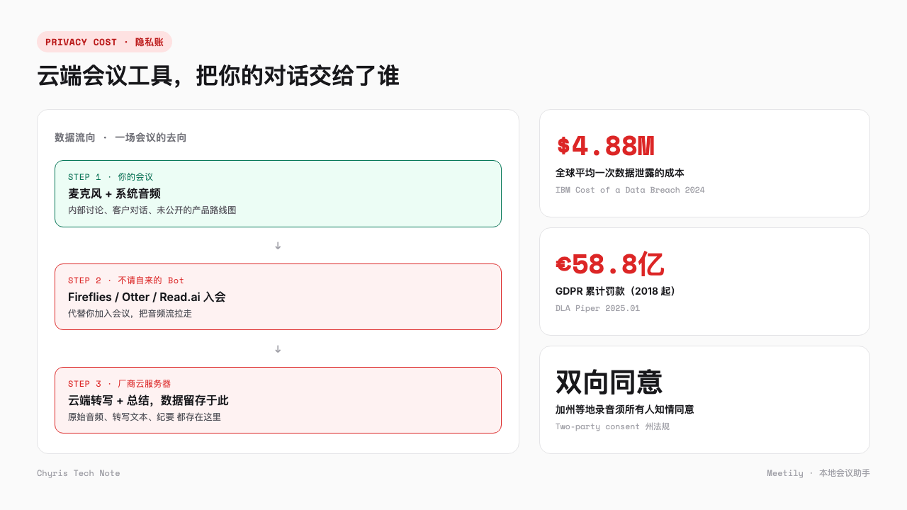
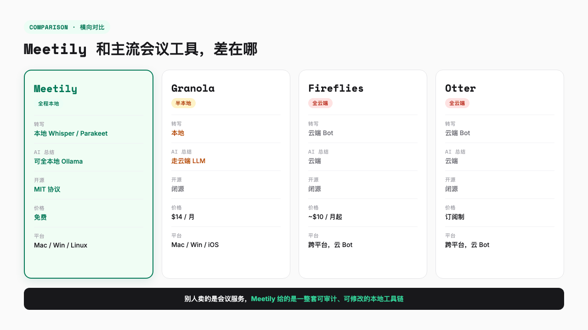
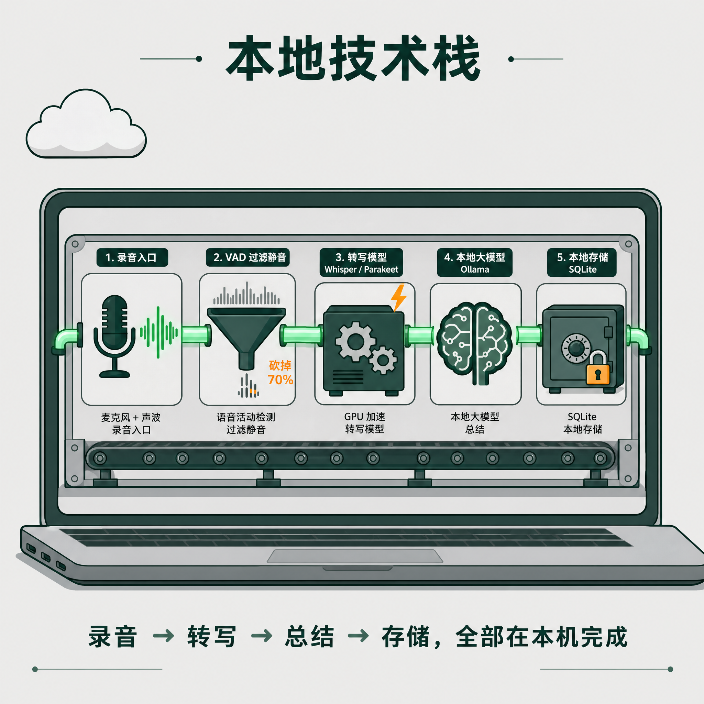
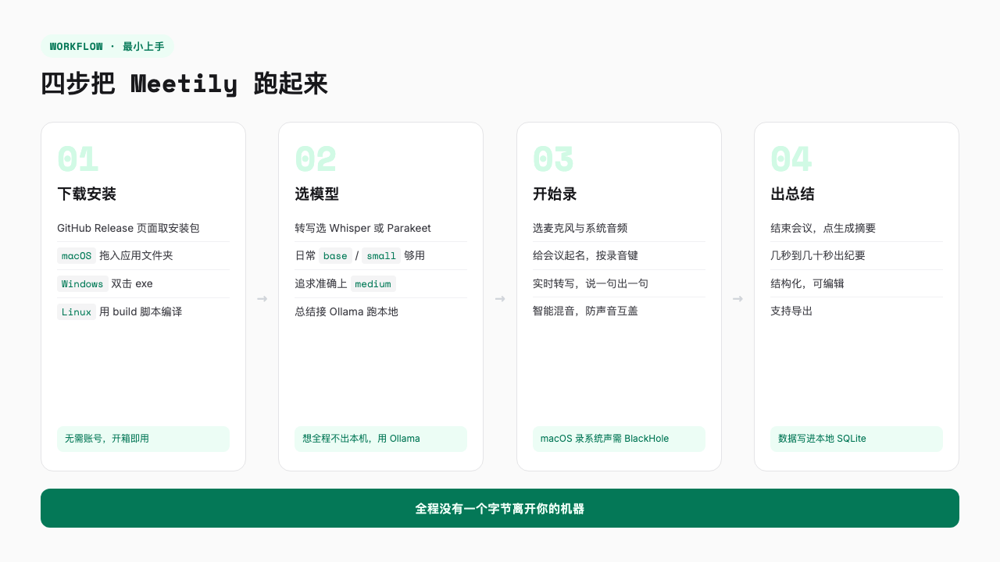

# GitHub 热门开源 AI 会议助手 Meetily，录音和总结一个字节都不上云

> 现在开线上会，参会人列表里经常多出一个不属于任何同事的「参会者」，名字叫 Fireflies、Otter 或者 Read.ai。它不说话，静静挂着，把整场会议从头录到尾。

---

最近一两年，只要开线上会，我几乎一定会遇到这么个场景。

刚进 Zoom 或者 Google Meet，参会人列表里多出一个不属于任何同事的「参会者」，头像是个机器人，名字叫 Fireflies.ai、Otter.ai 或者 Read.ai。它不说话，也不举手，就静静挂着，把整场会议从头录到尾。会后没多久，我还收到一封整理好的邮件，里面是结构化的会议纪要，谁说了什么、待办落在谁头上，清清楚楚。

挺方便的。

但很少有人追问下一句，这段录音存在哪、谁能看到、留多久。直到有一天，一个律师朋友跟我吐槽，他们和客户的保密沟通，因为对方用了某个云端会议记录工具，整段录音可能留在了第三方服务器上，合规部门连夜开会排查。

这事让我心里咯噔一下。之后我翻了不少开源项目，大多数要么是半成品，要么只做了转写这一环，直到撞上 Meetily。

Meetily 是一个开源的 AI 会议助手，把录音、转写、AI 总结全部搬回你自己的电脑，一个字节都不上云。GitHub 上超过 2 万 Star，MIT 协议，macOS、Windows、Linux 都能装。

---

## 云端会议工具的隐私账

主流的 AI 会议记录工具，Otter、Fireflies、tl;dv、Read.ai，几乎都是云端方案。工作方式大同小异，通常派一个 bot 代替你加入会议，把音频流拉回它自己的服务器，在云端做转写和总结。你拿到的是结果，原始音频和转写文本留在它的基础设施上。

对个人来说，这事通常无所谓。一个产品经理复盘用户访谈，一个创业者整理投资人对话，方便远比隐私重要。

可一旦对话里涉及的是未发布的财务数据、客户的医疗记录、律师和当事人的保密沟通，性质就变了。

这事不是我瞎紧张。IBM《Cost of a Data Breach》2024 年的报告里，全球平均一次数据泄露的成本到了 488 万美元，第一次逼近 500 万关口。GDPR 自 2018 年生效以来累计罚款已经接近 60 亿欧元。加州这类双向同意州更直白，录音前得让在场所有人都点头同意，否则就是民事甚至刑事责任，我那个律师朋友紧张的就是这一条。

看到这些数字，我第一反应是去翻自己常用那几个会议工具的隐私条款，结果一个比一个含糊，基本全是「数据存储于我们信任的第三方」这类车轱辘话。说白了，对话一旦出了你的机器，就不再是你能管的事了。

数据合规已经不是只有大公司才需要操心的事了。任何一个把客户对话、内部机密往外送的动作，背后都拖着一条看不见的责任链。

---

## Meetily 把会议记录搬回本机

Meetily 的定位很直接，privacy-first，隐私优先。

它装起来就像个普通的桌面应用，双击就能跑，不用配环境，也不用注册账号。底下用 Tauri 包了一层 Rust 内核，前端是 Next.js，但这是它的事，你不用管。Windows 下是个 exe，macOS 下是个 dmg，Linux 从源码编译，都有现成脚本。

关键在于，从你按下录音键那一刻起，麦克风采到的声音、对方说话的音频、实时转写出来的文字，全都在你这台机器上跑完。最后那份 AI 总结，也是在本地生成的。没有 bot 加入会议，没有音频上传到某个你不认识的服务器，连会议的元数据都写进本地的 SQLite 文件里。

转写这一环，它支持 OpenAI 的 Whisper 或者 NVIDIA 的 Parakeet，两个都是开源语音模型，都跑在本地。AI 总结这一步给你留了选择，想全程不出本机，接 Ollama 跑本地大模型就行，不在意总结上云的，接 Claude、Groq、OpenRouter 或者任何 OpenAI 兼容的接口都行。

**转写一定在本地，总结要不要上云由你决定。**

除了实时录会议，它还能导入已有的音频文件重新转写，换模型、换语言都行。音频录制做得也比较讲究，麦克风和系统声音同时录，还做了智能降噪和削峰，避免对方声音盖过你这边说话。

---

## 和主流工具差在哪

Otter 和 Fireflies 是典型的云端方案，音频拉到它们的服务器处理，按月订阅，Fireflies 大约 10 美元一个月起步，Read.ai 的 Pro 档要 19.75 美元。我之前用过一段时间 Otter 的免费版，确实省心，但每次开会有个机器人挂在参会列表里，心里总有点不踏实。

Granola 是个有意思的对照。它也强调本地，转写这一步在用户自己的机器上完成，不往会议里塞 bot，体验做得相当精致。但它闭源、月费 14 美元，更关键的是它的 AI 总结走云端大模型，转写文本得送到服务器才能生成纪要。也就是说，它的本地只做了一半。

Meetily 走得更彻底。开源、免费、三平台通吃，转写和总结都可以完全不离开本机。Otter 卖的是省心，Meetily 卖的是控制权，你能审一遍代码、改一行配置、部署给自己团队用。

这不是说云端工具不好。对大多数人，Otter 和 Fireflies 的体验更省心，集成日历、自动入会、团队共享这些云端功能做得成熟。Meetily 适合的，是那些「不能让对话出门」的场景。

---

## 本地真的跑得动吗

第一个反应通常是，在我这台笔记本上跑语音转写，不会卡死吗。我也担心过自己的 M1 Air 会不会当场起飞。

答案是不会，但有前提。Whisper 和 Parakeet 都是开源语音模型，单独跑对算力确实有要求。Meetily 在几个地方做了优化，让它变得轻量。

先说转写。它先把整段音频过一道 VAD（语音活动检测），判断哪些片段是真的人声，只把有语音的部分送去做转写，而不是无脑整段塞给模型。静音、停顿、长时间的无人发言，全都在这一步被过滤掉。根据项目自己的工程文档，这一步能砍掉大约 **70%** 的无效算力。一场一小时的会议，真正进模型的可能只有十几分钟的有效语音。

再说算力，GPU 加速是另一条腿。macOS 上自动启用 Metal，Apple Silicon 跑起来很快，基本无感。Windows 和 Linux 上，有 N 卡就走 CUDA，A 卡或者 Intel 核显走 Vulkan。项目给出的参考数据，CUDA 相比纯 CPU 能快 **5 到 10 倍**。哪怕是完全没 GPU 的纯 CPU 模式，开会这种实时场景也跟得上，只是占的资源多一些。

存储这一环也很干脆。会议的元数据、转写文本、AI 总结，统统写进本地一个 SQLite 文件。你想迁移就拷这个文件，想销毁就删掉它。没有云端那种「数据保留 30 天」「企业版可申请导出」的弯弯绕，数据的生杀大权从头到尾都在你手里。

---

## 怎么用起来

最小路径就四步。

下载安装。去 GitHub 的 release 页面，macOS 拿 dmg，Windows 拿 exe，拖进应用文件夹就能用。Linux 用户从源码编译，项目提供了现成的 build 脚本，照着敲就行。

然后是选模型。第一次打开会让你选转写模型，日常用 base 或 small 就够，追求准确率可以上 medium。再选总结用的大模型，想全程不出本机，装一个 Ollama，在 Meetily 里选本地模型即可，不在意总结上云的，填 Claude 或者 Groq 的 API key 也行。

装好之后，录的方法很简单。选好麦克风和你电脑的系统音频，给会议起个名字，按下录音键。转写是实时的，对方说一句，屏幕上跟着出一句。macOS 上录系统声音需要装一个 BlackHole 之类的虚拟声卡，第一次配置可能要折腾半小时，但配完就不用管了。

会议一结束，点一下生成摘要就行。几秒到几十秒后给你一份结构化的会议纪要，可以编辑、可以导出。

整个过程，没有一个字节离开过你这台机器。这也是 Meetily 最值得说的地方，**它的隐私不是写在隐私政策里的承诺，是写在代码结构里的**。

---

## 谁该装，谁不必

该装的，是那些对话本身就敏感的人。

做尽职调查的投资机构，处理客户保密信息的律所，要遵守 HIPAA 的医疗机构，或者就是单纯不想让第三方听到自己团队讨论的中小企业。对这些人来说，装 Meetily 与其说是换个工具，不如说是把合规和信任攥回自己手里。一份能拍在法务面前说「数据全程不出本机」的方案，价值远超它省下的那点订阅费。

反过来，如果你一周就两三个内部站会，对内容没什么保密要求，Otter 和 Fireflies 的免费版用起来更顺手。集成日历、自动入会、团队共享、跨会议搜索这些云端体验，Meetily 现在还比不上。

局限也要讲清楚。社区版目前不支持说话人分离，也就是分不清「这句话到底是哪一位说的」，这个能力官方放在了 PRO 版的规划里。第一次配置本地模型对非技术读者有一点门槛，需要装 Ollama、下载几个 G 的模型文件。项目虽然有 PRO 版（早鸟 10 美元一个月）走商业化，但社区版承诺永久免费开源，核心的本地转写和总结能力不会锁进付费档。

---

## 写在最后

回到开头那个场景。

下次开会，参会列表里再冒出一个 Fireflies 或者 Otter 的机器人，你可以多想一秒，这场对话的内容，是不是真的可以放心交给一个你不知道在哪的服务器。

过去隐私是被锁在企业版里的功能，加钱、签合同、走一整套合规流程才能拿到。Meetily 把这条线往下拉了一截，开源、免费、跑在你自己的电脑上，任何一个普通开发者都可以拿过去审一遍代码、改一行配置、部署给自己团队用。

它不是最精致的会议工具，体验上比不过那些拿了几千万融资的云端产品。但它至少证明了一点，**会议记录这件事，不一定要拿你的对话去换**。

如果你正在找一个不上云的会议记录方案，值得花一个下午把 Meetily 装起来试试。项目地址在 GitHub 搜 Zackriya-Solutions/meeting-minutes，release 页面就有各平台安装包。

---
