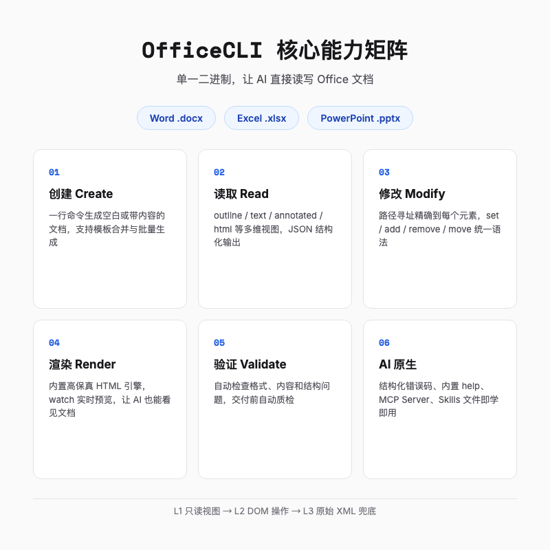
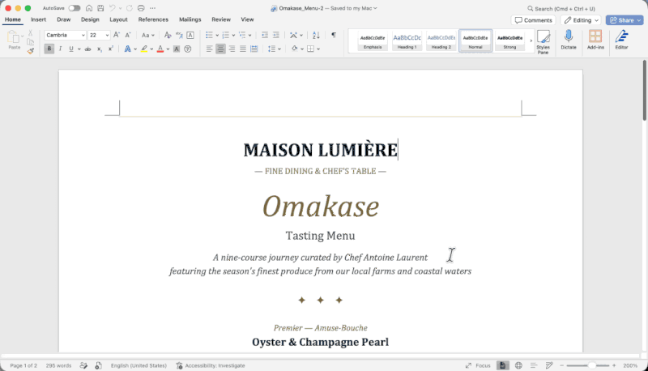

# OfficeCLI 开源，首个专为 AI 智能体设计的 Office 套件来了

> AI 能写代码、能画图、能剪视频，但让它「按上季度的版式做一份 PPT」，它多半扔给你一段 Markdown 或者一张图片。你想改个字？请重新生成。


---

## 一句话总结

**OfficeCLI 是一个开源 CLI 工具，让 AI 智能体直接用命令行创建、读取、修改 Word、Excel 和 PowerPoint 文件。** 它不需要安装 Office，不依赖 Python 运行时，单个二进制文件就能跑在 macOS、Linux、Windows 甚至 CI 容器里。

---

## 01 AI 做 Office 文档，最后一公里卡在哪

让 AI 做 PPT，已经不是什么新鲜事。

你扔给它一份财报，它能吐出大纲、分段、甚至每一页的标题。但当你说「请输出成 .pptx，我要在会议上改几个字」时，体验往往断崖式下跌。

常见结局不外乎三类。

第一种，AI 给你 Markdown 或者纯文本，格式全靠你手动粘贴。第二种，AI 生成一张长图，看着漂亮，但改不了。第三种，AI 调用某个 Python 库生成 .pptx，结果打开后发现字体跑版、图表缺失、动画没了。

**问题不是 AI 不会写内容，而是 AI 没法像人一样「看见」并「操作」Office 文件。**

人能打开 PPT，扫一眼发现标题溢出了，拖动文本框就能改。AI 没有眼睛，也没有鼠标。它只能根据概率推测下一步该输出什么，至于输出之后在 Office 里长什么样，它一无所知。

这就是 Office 自动化的最后一公里。前面九十九步由大模型走完，最后一步却卡在了文件格式上。

OfficeCLI 想做的，就是把这最后一步补上。

---

## 02 OfficeCLI 是什么

OfficeCLI 的定位很明确，README 第一句话就写清楚了。

> **全球首个、也是最好的专为 AI 智能体设计的 Office 套件。**

这句话听起来有点狂，但它的核心卖点确实切中了上面那个痛点。

它是一个命令行工具，支持 .docx、.xlsx、.pptx 三种格式，覆盖创建、读取、修改、渲染、验证等完整操作。最吸引我的地方是「不挑环境」，单个二进制文件内置 .NET 运行时，macOS、Linux、Windows 甚至 CI 容器都能跑，不用装 Office，也不用配 Python。而且所有命令都能输出 JSON，明显是照着 AI 调用去设计的。

安装也很简单，一条命令就行。

```bash
curl -fsSL https://raw.githubusercontent.com/iOfficeAI/OfficeCLI/main/install.sh | bash
```

Windows 用户换 PowerShell 版本。

```powershell
irm https://raw.githubusercontent.com/iOfficeAI/OfficeCLI/main/install.ps1 | iex
```

装完之后，`officecli install` 会自动把 skill 文件写进 Claude Code、Cursor、Windsurf、GitHub Copilot 等工具的目录。你的 AI 编程助手立刻就能调用它，不需要额外配置。

---

## 03 为什么 AI 需要一双「眼睛」和一双手

传统 Office 自动化方案，比如 python-pptx、openpyxl、python-docx，已经存在很多年了。开发者用它们生成报表、批量改格式，问题不大。

但把这些库交给 AI 智能体，最头疼的是它写完代码后根本不知道自己写得怎么样。标题有没有溢出、两个形状是不是叠在一起、配色是不是太丑，它全看不见，只能等你打开文件骂一句再返工。几个回合下来，token 烧了不少，PPT 还是丑。

而且 Word、Excel、PowerPoint 各有一个 Python 库，API 风格差别大到像是三个不同星球的语言。再算上 Python 环境、依赖冲突、CI 镜像体积，有些功能比如高保真渲染或者复杂动画还得调用 Office COM 接口，到头来得在 Windows 上装 Office。本来想让 AI 省点事，结果它先被环境劝退了。

OfficeCLI 的解法可以概括为两点，**给 AI 装上眼睛和手**。

眼睛，是它内置的 HTML 渲染引擎。`officecli view deck.pptx html` 可以直接生成 HTML 文件，`officecli watch deck.pptx` 会起一个本地服务，每次修改后浏览器自动刷新。AI 或者多模态模型可以读取渲染后的截图，判断布局问题。

手，是它提供的命令行操作接口。`officecli add`、`officecli set`、`officecli remove` 这些命令，让 AI 能精确控制文档里的每一个元素。


---

## 04 核心能力，一条命令做到什么程度

OfficeCLI 的命令设计很符合程序员的直觉。它把文档当成一棵树，每个元素都有一个路径。

创建空白 PPT，一行。

```bash
officecli create deck.pptx
```

加一页幻灯片，也是一行。

```bash
officecli add deck.pptx / --type slide --prop title="Q4 Report"
```

到了第三行命令，我已经不太想回去写 python-pptx 了。指定位置、字体、颜色，全在一条命令里。

```bash
officecli add deck.pptx '/slide[1]' --type shape \
  --prop text="Revenue grew 25%" --prop x=2cm --prop y=5cm \
  --prop font=Arial --prop size=24 --prop color=FFFFFF
```

README 里那个对比很直观。以前用 python-pptx 做同样的事，差不多要 50 行代码和三个库。现在一条命令就够了。



不只是创建，读取和修改也同样简单。

```bash
officecli view deck.pptx outline
officecli get deck.pptx '/slide[1]/shape[1]' --json
officecli set deck.pptx '/slide[1]/shape[1]' --prop fill=FF0000
```

`view` 看结构，`get` 取元素，`set` 改属性。路径语法用 1-based 索引和元素本地名，不是 XPath，也不用记 XML 命名空间。

Excel 和 Word 也是类似的路子。

```bash
officecli create data.xlsx
officecli set data.xlsx /Sheet1/A1 --prop value="Name" --prop bold=true
officecli set data.xlsx /Sheet1/A2 --prop value="Alice"
```

```bash
officecli create report.docx
officecli add report.docx /body --type paragraph --prop text="Executive Summary" --prop style=Heading1
officecli add report.docx /body --type paragraph --prop text="Revenue increased by 25% year-over-year."
```

**三种格式，同一套命令哲学。**

---

## 05 三层架构，从入门到兜底

OfficeCLI 把能力分成三层，这个分层让我挺有好感。

**L1 只读层**提供高维语义视图。`view` 命令可以输出 outline、text、annotated、stats、issues、html 等多种模式，适合先摸清文档结构。AI 刚接触一个文件时，不需要直接动它，先看看它长什么样。

**L2 DOM 层**做结构化元素操作。`get`、`query`、`set`、`add`、`remove`、`move`、`swap` 这些命令，让 AI 像操作网页 DOM 一样操作 Office 文档。大部分实际工作都在这里完成。

**L3 原始 XML 层**是万能兜底。`raw`、`raw-set`、`add-part` 可以直接改 OOXML，遇到什么刁钻需求都不怕。这个层存在的意义不是让你天天用，而是让你知道「实在搞不定还有条路」。

这种由浅入深的设计，和大模型解决问题的节奏很像。先读，再改，改不了再钻底层。

`query` 命令也很有意思。它支持 CSS 风格的选择器，还能写布尔条件。

```bash
officecli query report.docx 'paragraph[style=Heading1] > run[font!=Arial]'
officecli query slides.pptx 'shape[fill=FF0000]'
officecli query data.xlsx 'cell[value>5000 or value<100]'
```

这就像是给 Office 文档装上了 jQuery。AI 可以批量选中元素，批量修改，不需要逐个遍历。

---

## 06 对 AI 特别友好的几个设计

除了三层架构，OfficeCLI 还有一些专门为 AI 优化的细节。最让我意外的是它的错误信息。AI 调用命令时一旦路径写错，返回的不是 stderr 里一堆红字，而是一个带 `code` 和 `suggestion` 的 JSON，告诉你有效范围是 1 到 8。AI 拿到这个反馈可以自己修，基本不用你介入。

`officecli watch deck.pptx` 这种实时预览对多模态模型几乎是刚需。改一下，截个图，模型立刻知道排版有没有崩。

另外，所有命令都支持 `--json`，内置 help 能查每个属性的精确写法，resident 常驻模式让多步骤操作不用反复读写磁盘，batch 可以一次提交多条命令。这些看起来都是小设计，但组合起来会让 AI 调用稳定很多。

不确定属性名怎么办？直接问它。

```bash
officecli help docx paragraph
officecli help pptx set shape
officecli help xlsx pivottable
```

SKILL.md 的策略也强调，不确定属性名、取值格式或命令语法时，应优先跑 help，而不是猜测。

---

## 07 不只是 CLI，更是一套生态

OfficeCLI 自己是一个 CLI，但它周围还长出了一圈生态。我觉得其中最有 AI 味的是 MCP Server 和 Skills 文件。

**MCP Server** 让 OfficeCLI 可以通过 Model Context Protocol 直接暴露给支持 MCP 的 AI 工具。不再需要 AI 通过 shell 调用命令，而是通过标准的 JSON-RPC 工具接口操作文档。

```bash
officecli mcp claude
officecli mcp cursor
officecli mcp vscode
```

**Skills 文件** 是另一个亮点。`SKILL.md` 是一份 Markdown 格式的技能文档，里面详细说明了怎么安装、怎么调用、每个命令的语法和常见坑。你把 `curl -fsSL https://officecli.ai/SKILL.md` 这行扔给 AI 智能体，它就能按这份手册学会使用 OfficeCLI。

除此之外，AionUi 是给不想敲命令的普通用户准备的桌面 GUI，Python / Node.js SDK 方便把 OfficeCLI 集成进现有工程。前者扩大了用户面，后者降低了接入成本。

---

## 08 它能用在哪

OfficeCLI 的使用场景很宽。

想象这么一个 CI 流水线。每次财报季，系统自动从数据库拉数据，套进公司 PPT 模板，生成后再跑一遍 `officecli validate` 检查字体和版式。以前这得靠一台 Windows 机器上跑着 Office COM，现在一个 Linux 容器里的二进制文件就能搞定。

对个人用户来说，更实用的可能是让 Claude Code 帮你把一份 messy 的 Word 报告按模板重新排版，而不是复制粘贴一下午。对 AI Agent 来说，它终于可以不再给你 Markdown，而是直接交付一份可编辑的 .pptx。

把这些串起来，一个自愈合工作流大概是下面这样。

```bash
# 1. 创建 PPT
officecli create report.pptx

# 2. 添加内容
officecli add report.pptx / --type slide --prop title="Q4 Results"
officecli add report.pptx '/slide[1]' --type shape \
  --prop text="Revenue: $4.2M" --prop x=2cm --prop y=5cm --prop size=28

# 3. 验证结构
officecli view report.pptx outline
officecli validate report.pptx

# 4. 检查并修复问题
officecli view report.pptx issues --json
officecli set report.pptx '/slide[1]/shape[1]' --prop font=Arial
```

整个过程不需要打开 PowerPoint，也不需要人工拖动文本框。AI 自己就能完成创建、检查、修复的闭环。



---

## 09 它不是要取代 Office，而是给 AI 铺一条路

不过别误会，它瞄准的并不是每天手动做 PPT 的人，而是需要被 AI 操作的 Office 文件。

它更像是在 AI 和 Office 文件之间搭了条窄路。以前 AI 只能站在岸边给你描述对岸长什么样，现在它能真的走过去，改几个字、调个格式、再跑一遍检查。

这件事的意义，有点像当年浏览器给互联网铺了一条路。没有浏览器，普通用户没法访问网页；没有 OfficeCLI 这样的工具，AI 也很难真正进入办公文档的深水区。

当然，OfficeCLI 现在还年轻。它能不能成为事实标准，取决于社区 adoption、功能完善度、以及和各家 AI 工具的集成深度。但至少，它把方向指得很清楚。

**AI 不应该只输出内容，AI 应该能操作文件。**

---

## 总结

OfficeCLI 给我最深的印象，不是它支持多少种图表或者动画，而是它的设计思路。

它没有试图做一个更强大的 Office，而是做了一个更适合 AI 的 Office 操作层。它的真正价值不是支持多少格式，而是让 AI 从「只会输出内容」变成「真的能改文件」。

如果你经常让 AI 生成报告、PPT 或者 Excel，值得花十分钟装起来试试。也许你会发现，AI 终于不再是那个只能给你 Markdown 的「话痨」，而是一个能真正改文件的助手。

---
