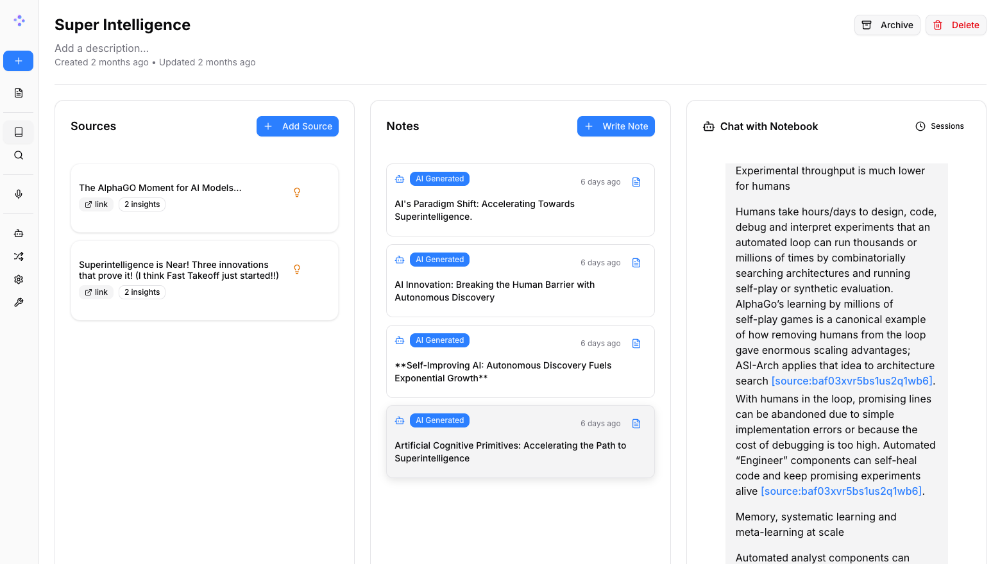
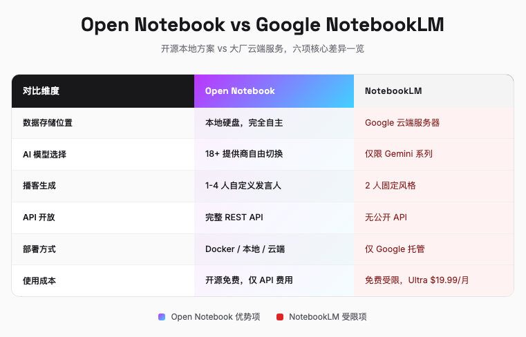
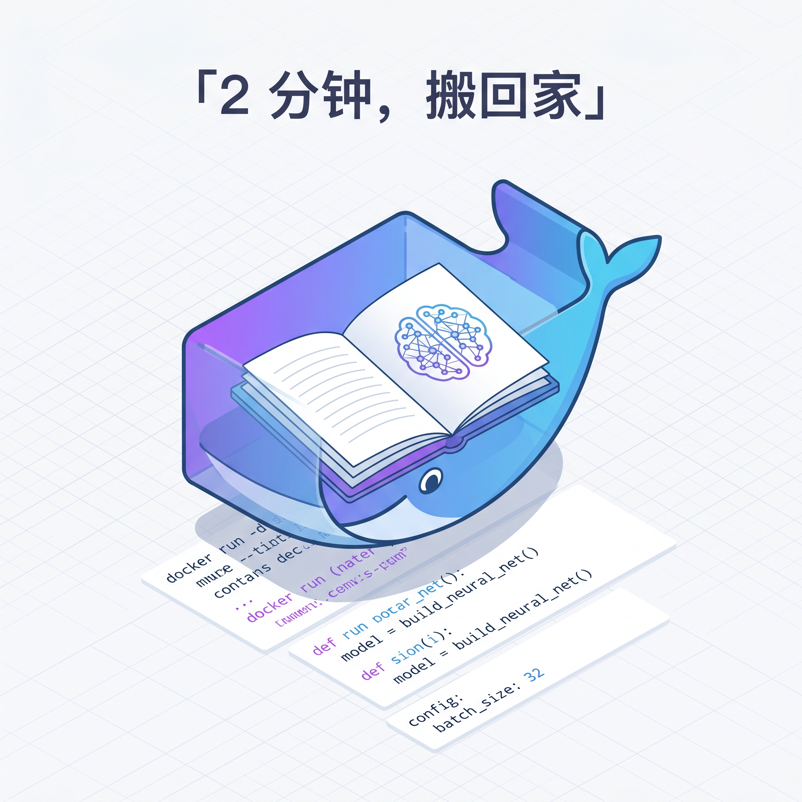
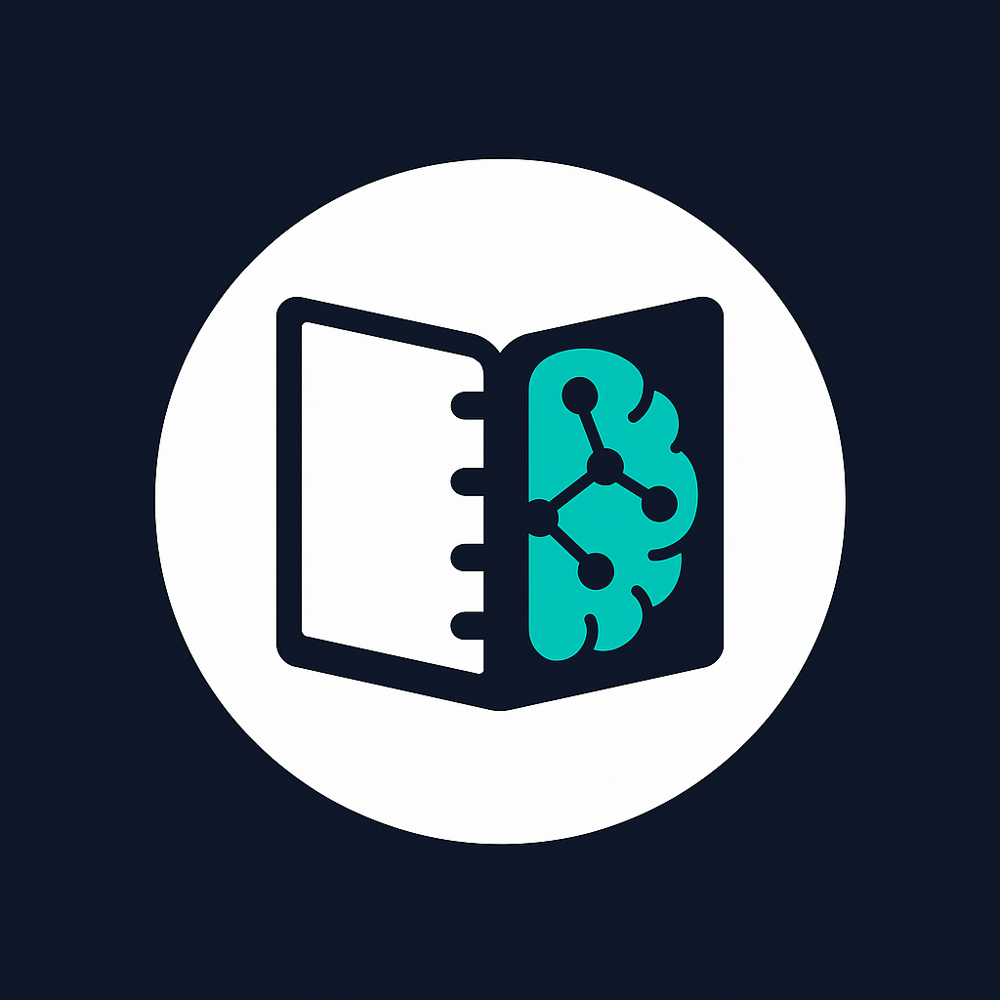

# 27K Star 开源工具叫板 NotebookLM：本地部署，数据归你

> 你试过把公司内部文档丢给 AI 总结吗，那感觉就像在陌生人面前打开你的日记本


---

## 一句话总结

Open Notebook 是 NotebookLM 的本地开源版，你的 PDF、笔记、聊天记录全存在自己电脑上，GitHub 27K+ 星，不要钱。

---

## 把笔记交给 Google 之前，先想想这件事

Google NotebookLM 刚出来的时候，我确实被惊艳到了。丢进去一份 PDF，它能给你生成摘要、提取要点、甚至用两个人聊天的方式做成播客。好用是真的好用。

但好用背后有个问题。我自己的文档，公司财报、体检报告、论文草稿、商业合同，什么都能往里丢，问题是，丢完以后它们就进了 Google 的服务器。隐私条款写得再漂亮，也改变不了这个事实。

更微妙的是，NotebookLM 的免费版有一些隐形的墙。最多 100 个笔记本，每本最多 50 个文件。而且笔记本之间是物理隔离的，你在「食谱」笔记本里的内容，没法和「体检单」笔记本联动。你问不了「根据我的体检结果，这几道菜能不能吃」这种问题。

这些限制不是 bug，是产品设计的选择。Google 要做的是让用户留在它的生态里，而不是让用户的知识真正流动起来。

这时候一个声音在 GitHub 上冒了出来。

---

## Open Notebook 是谁

Open Notebook 是一个由开发者 lfnovo 在 2024 年 10 月发起的开源项目。短短一年多，GitHub Stars 从 0 涨到了 27K+，增长曲线相当陡峭。它用 MIT 协议发布，意味着你可以随意 fork、修改、商用，不用看任何人的脸色。

它的定位很简单，一个隐私优先、多模型、100% 可本地部署的 NotebookLM 替代方案。



上图是 Open Notebook 的界面。三栏布局，左边是源文件（Sources），中间是笔记（Notes），右边是基于上下文和 AI 对话（Chat with Notebook）。整体风格和 NotebookLM 类似，上手没有学习成本。

但看起来相似的东西，运行方式可能完全不同。

---

## 不只是替代，而是超越

下面这张表把两者的核心差异摆在一起，一目了然。



这张表里有几个点值得展开说说。

先说最本质的，数据存在哪里。NotebookLM 的数据在 Google 云端，Open Notebook 的所有东西都落在本地，PDF、笔记、聊天记录全在你的硬盘上。没有网络也能运行，没网也能用。本体还完全免费，不需要订阅 Ultra（$19.99/月），只需要承担自己的 AI API 费用，或者用 Ollama 本地跑模型，一分钱不用花。

然后是模型的选择。NotebookLM 只能用 Google Gemini，没得选。Open Notebook 支持市面上主流的模型，OpenAI、Claude、DeepSeek、本地 Ollama 都能接。你可以用免费的 Groq 跑轻量任务，用 Claude 做深度分析，用本地模型处理敏感内容，按场景自由切换。它还把 REST API 全部开放出来，你可以把它接到自己的自动化工作流里，批量处理、定时任务、和其他工具联动。

最让我惊喜的是播客生成。NotebookLM 的 Audio Overview 是固定两个人对谈，风格没得改。Open Notebook 可以让你自己定几个人、什么性格、甚至用什么声音。一个人做学术讲座，两个人做访谈，四个人做圆桌辩论，都可以。声音可选 Google TTS、ElevenLabs，或者本地免费合成。

---

## Docker 两分钟，把知识库搬回家

部署 Open Notebook 比你想象的要简单。如果你电脑里已经装了 Docker，两分钟就能跑起来。

创建一个目录，在里面放一个 `docker-compose.yml` 文件，内容如下。

```yaml
services:
  surrealdb:
    image: surrealdb/surrealdb:v2
    command: start --log info --user root --pass root rocksdb:/mydata/mydatabase.db
    user: root
    ports:
      - "8000:8000"
    volumes:
      - ./surreal_data:/mydata
    restart: always

  open_notebook:
    image: lfnovo/open_notebook:v1-latest
    ports:
      - "8502:8502"
      - "5055:5055"
    environment:
      - OPEN_NOTEBOOK_ENCRYPTION_KEY=change-me-to-a-secret-string
      - SURREAL_URL=ws://surrealdb:8000/rpc
      - SURREAL_USER=root
      - SURREAL_PASSWORD=root
      - SURREAL_NAMESPACE=open_notebook
      - SURREAL_DATABASE=open_notebook
    volumes:
      - ./notebook_data:/app/data
    depends_on:
      - surrealdb
    restart: always
```

把 `OPEN_NOTEBOOK_ENCRYPTION_KEY` 改成你自己的密钥，然后运行。

```bash
docker compose up -d
```

等 15 到 20 秒，打开浏览器访问 `http://localhost:8502`，你就拥有了一个完全私有的 AI 知识库。

第一次使用需要配置 AI 提供商。点击 Settings → API Keys → Add Credential，选择你的提供商（OpenAI、Anthropic、Groq 等），填入 API key，然后 Test Connection → Discover Models → Register Models。三步搞定。

> 如果你还没有 API key，Groq 提供免费额度，足够日常轻度使用。

想要完全离线运行？没问题。在配置里选择 Ollama 作为提供商，前提是你已经本地拉好了模型，比如 `ollama run qwen3:32b`。这样整个链路从数据库存储到 AI 推理全部跑在你的机器上，零云端交互，零隐私泄露。



跑起来之后，有个坑我帮你踩过了。

---

## 一个实用的避坑技巧

Open Notebook 有一个细节需要注意。当你在 General Chat 里提问时，系统会对全库内容做向量检索然后组织回答。这个机制在处理几十页的长 PDF 时，偶尔会出现「检索偏离」，也就是 AI 引用了不相关的文档或者产生了幻觉。

解决办法很简单。阅读超长 PDF 时，不要直接在右侧 General Chat 里提问，而是点击该源文件，使用 Direct Source Chat 功能。这个模式会绕过全局检索，直接把单份文档喂给模型，输出更精确的引用和定位。

根据实际使用经验，这个细节在处理几十页以上的文档时区别很明显。

说完坑，说说我最喜欢的功能。

---

## 播客生成，从阅读到收听的消费跃迁

我觉得 Open Notebook 最有意思的功能不是聊天，而是播客生成。

想象一个场景。你有一份 50 页的行业报告，正常读下来需要一到两个小时，而且必须是专注的状态。但你可以把它丢进 Open Notebook，创建一个播客 episode，设定两个发言人，一个扮演行业专家，一个扮演提问的记者，语气设成「专业但易懂」。20 分钟后，你就得到了一段可以在通勤路上听的音频。

更妙的是，同一个研究素材可以生成多个不同风格的播客。给学生听的入门版、给同行听的深度版、给投资人听的精简版，换个 speaker profile 就行，一鱼多吃。

成本也很友好。主流 TTS 服务的价格从几毛钱到几美元不等，取决于音质和提供商。如果你在意隐私或者想省钱，本地 TTS 完全免费，只是速度稍慢。

这背后的逻辑是，阅读是主动消耗，需要整块时间和高度专注。收听是被动吸收，通勤、做饭、跑步的时候都能进行。同一个知识，换种消费方式，获取效率完全不同。



---

## 但它不完美

写到这里，有必要泼一盆冷水。Open Notebook 不是银弹，它有明确的适用边界。

先说门槛。这个项目没有云端 SaaS 版本，不会 Docker 命令行的普通用户几乎不可能自己跑起来。虽然文档写得不错，也有 AI 安装助手，但对非技术人群来说，这仍然是一道不小的门槛。

再说一个硬伤，它是单用户的。数据库没有做权限隔离，如果你想在公司里团队共享，或者做企业级部署，现在还不合适。

最后，手机上用起来不太行。没有原生 App，只能在浏览器里访问响应式页面。相比 Google 在移动端快速铺开的拍照上传、离线缓存播放，体验差距明显。

这些局限不是抱怨，是选择。Open Notebook 的团队优先做了隐私和开放，在易用性和团队协作上暂时让步。这种取舍是合理的，也是开源项目常见的演进路径。

---

## 写在最后

回看这篇文章的开头，我说把公司内部文档丢给 AI 总结，像在陌生人面前打开日记本。

Open Notebook 没有解决这个问题，它只是把陌生人请出了房间。AI 总结文档的便利还在，只是这次，日记本留在了你的书桌上。

开源项目从来不想打败谁，它只是站出来说，你也可以这么活。

---

欢迎关注我的公众号「Chyris Tech Note」，获取更多 AI 技术解读与实践分享。

