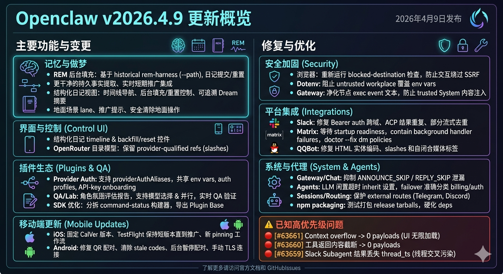

---

##  版本概览

**OpenClaw v2026.4.9** 正式发布！本次更新带来了 **5 项重大功能改进** 和 **20+ 个 BUG 修复**，涵盖安全加固、内存 dreaming 系统重构、移动端体验优化等多个维度。



---
## 🔥 核心亮点

### 1️⃣ 内存 Dreaming 系统全面升级

这是本次更新最重磅的功能！

**新增功能：**
- 🧠 **Grounded REM Backfill 通道**：支持历史 `rem-harness --path`，让旧日记可以重新流入 Dreams
- 📝 **结构化日记视图**：全新的 Control UI 界面，支持时间线导航、backfill/reset 控制
- 🔄 **Diary Commit/Reset 流程**：更清晰的可持久化事实提取流程
- ⚡ **实时短期记忆提升集成**：旧笔记可以无缝重播到梦境和持久记忆中

> 💡 **用户收益**：不再需要第二个内存栈，历史笔记也能参与 dreaming！

---

### 2️⃣ 安全加固大升级 🔒

本次更新修复了多个安全漏洞，建议**所有用户立即升级**！

| 安全问题 | 修复内容 | 影响等级 |
|---------|---------|---------|
| SSRF 绕过 | 交互驱动导航后重新检查被阻止的目的地 | 🔴 高 |
| .env 注入 | 阻止不受信任工作区的运行时控制环境变量 | 🔴 高 |
| 远程节点注入 | 标记远程 exec 事件为不可信，净化输出内容 | 🔴 高 |
| 插件冲突 | 防止不受信任插件与捆绑 provider auth 冲突 | 🟠 中 |
| 依赖漏洞 | 强制 `basic-ftp` 升级至 5.2.1 | 🟡 中 |

---

### 3️⃣ Android 配对体验修复

终于修复了困扰 Android 用户已久的配对问题！

**修复内容：**
- ✅ 新 QR 扫描时清除过期 setup-code 认证
- ✅ 从新鲜配对中引导 operator 和 node 会话
- ✅ 引导交接后优先使用存储的设备令牌
- ✅ 应用后台时暂停配对自动重试

> 🎯 **结果**：Android 扫描一次即可稳定配对！

---

### 4️⃣ Slack 图片附件加载修复

Slack 用户 rejoice！`url_private_download` 图片附件现在可以正常加载了。

**技术细节**：
- 保留同域 `files.slack.com` 重定向的 bearer 认证
- 跨域 Slack CDN 跳转时正确剥离认证信息

---

### 5️⃣ Matrix 网关稳定性提升

- 等待 Matrix 同步就绪后再标记启动成功
- 后台处理器失败不再导致整个网关崩溃
- 致命同步停止通过通道级重启处理

---

## 🐛 重点 BUG 修复清单

### 会话与聊天
- **修复**：快速切换会话时历史记录重载导致的不同步问题
- **修复**：`ANNOUNCE_SKIP` / `REPLY_SKIP` 控制令牌泄漏到用户界面
- **修复**：`NO_REPLY` 静默标记文本泄漏到用户可见回复
- **修复**：跨会话 announce 流量时保留外部路由

### 回复与医生工具
- **修复**：回复运行使用活动运行时快照
- **修复**：网关 OAuth 重新认证失败现在会向用户显示
- **修复**：`openclaw doctor` 现在会显示具体的重新认证命令

### Slack 集成
- **修复**：Slack ACP 块回复被正确处理为已送达输出
- **修复**：部分流式传输时的去重逻辑

### 其他修复
- **修复**：`/reset` 和 `/new` 清除自动回退模型覆盖
- **修复**：Ollama 模型支持 `/think` 非关闭级别时显示思考输出
- **修复**：QQBot 媒体标签解析（支持 HTML 实体编码）
- **修复**：Matrix doctor 迁移旧配置
- **修复**：npm 打包包含所有必需依赖

---

## ⚠️ 已知问题（最新 Issues）

在 2026.4.9 发布后，社区报告了以下新问题：

### 🔴 高优先级

1. **[#63661] Context overflow 产生 0 payloads**
   - UI 显示无限加载 spinner 而不是错误
   - 状态：待修复

2. **[#63660] 工具返回内容截断后产生空响应**
   - 影响工具调用体验
   - 状态：待修复

3. **[#63659] Slack Subagent 结果丢失 thread_ts**
   - DM assistant 线程中跨线程污染
   - 并发请求时出现问题
   - 状态：待修复

4. **[#63658] npm 包缺失 qa/scenarios/index.md**
   - 导致 completion cache 更新失败
   - 标签：`regression` `bug`
   - 状态：待修复

### 🟠 中优先级

5. **[#63657] 一次性 cron jobs 网关注重启后静默丢失**
   - 标签：`bug:behavior`
   - 状态：待修复

6. **[#63655] memory-lancedb: OpenAI SDK base64 编码破坏非 OpenAI embedding 提供商**
   - 状态：待修复

7. **[#63654] Qwen 3.6-plus 图像理解在 Coding Plan 端点被阻止**
   - 尽管模型支持 vision
   - 状态：待修复

8. **[#63652] memory status 报告 embeddings 不可用**
   - 即使 qmd status 健康
   - 状态：待修复

---

## 💡 更新建议

### 强烈建议升级 ⬆️

如果你是以下用户，请**立即升级**：

| 用户类型          | 原因            |
| ------------- | ------------- |
| 使用 Browser 功能 | SSRF 安全修复至关重要 |
| 使用多工作区 .env   | 防止环境变量注入攻击    |
| Android 用户    | 配对体验大幅改善      |
| Slack 用户      | 图片附件正常加载      |
| 使用远程节点        | 防止 exec 事件注入  |

### 升级命令

```bash
# 通过 npm
npm install -g openclaw@2026.4.9

# 或通过 npx
npx openclaw@latest

# macOS 用户可直接下载 DMG
# https://github.com/openclaw/openclaw/releases/tag/v2026.4.9
```

### 升级后检查

```bash
# 运行诊断工具
openclaw doctor

# 检查 OAuth 状态
openclaw auth status
```

### 暂缓升级的情况

如果你：
- 重度依赖 **Context overflow** 场景（等待 #63661 修复）
- 使用 **非 OpenAI embedding 提供商** + lancedb（等待 #63655 修复）
- 需要 **一次性 cron jobs** 持久化（等待 #63657 修复）

可以等待 **2026.4.10** 补丁版本。

---

## 🔮 未来展望

根据最新的 PR 和社区讨论，以下功能正在开发中：

- **可配置的 MEMORY.md 注入模式** + 每轮自动召回 (#63662)
- **手动会话注入刷新命令**（不重置转录）(#63648)

---

## 🔗 相关链接

- 📥 [下载页面](https://github.com/openclaw/openclaw/releases/tag/v2026.4.9)
- 🐛 [问题追踪](https://github.com/openclaw/openclaw/issues)
- 📖 [完整更新日志](https://github.com/openclaw/openclaw/blob/main/CHANGELOG.md)

---

> 💬 **你对这次更新有什么看法？欢迎在评论区讨论！**
