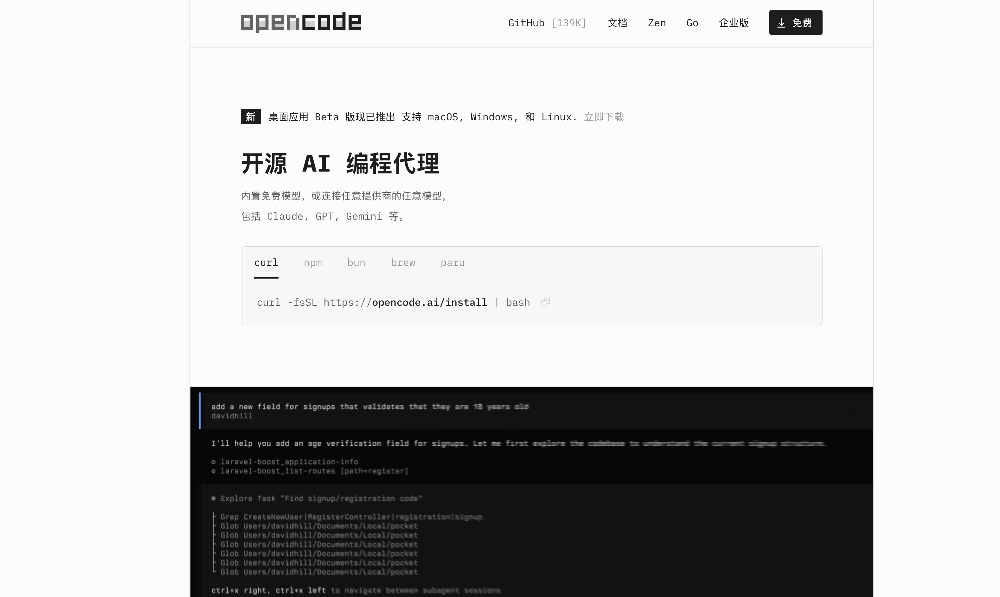

# OpenCode v1.4.0 来了！HTTP 代理、OTLP 可观测性、跳过权限确认，这次更新太硬核

> 140K Star 的开源 AI 编程助手 OpenCode 刚刚发布 v1.4.0，企业级能力全面补齐。



---

## 一句话总结

这次更新的核心关键词：**代理支持、可观测性、效率提升**。

对于在终端里用 OpenCode 写代码的开发者来说，这三个字组合在一起，意味着——你的 AI 编程工具终于能无缝跑在企业网络环境里了。

---

## 本次更新最值得关注的 5 件事

### 1. 完整的 HTTP 代理支持

终于来了！无论你身处公司内网、需要通过代理访问外网，还是使用自建代理服务，OpenCode 现在都能正确处理 HTTP 代理配置。

**这意味着国内开发者的网络痛点，终于被官方重视了。**

### 2. OTLP 可观测性导出

新增 OTLP（OpenTelemetry Protocol）可观测性支持。你可以将 OpenCode 的运行数据导出到 Grafana、Jaeger、Datadog 等可观测性平台，实时监控 AI Agent 的调用链、响应时间、错误率。

**这是从"好用"到"可信"的关键一步。**

对于团队管理来说，你终于能回答那个灵魂问题了："AI 编程到底帮我省了多少时间？"


### 3. `--dangerously-skip-permissions`：自动审批模式

```bash
opencode run --dangerously-skip-permissions
```

这条命令会自动批准所有未被明确拒绝的权限请求。对于 CI/CD 流水线、自动化脚本场景，这个功能堪称神器。

> ⚠️ 名字里的 "dangerously" 不是摆设，请在信任的环境中使用。


### 4. PDF 拖拽附件支持

在 TUI（终端界面）中，现在可以直接把 PDF 文件拖拽进来作为附件。需求文档、设计稿、技术规范——直接丢给 AI，让它帮你分析。


### 5. Desktop 子任务体验大升级

桌面版的子 Agent（Subagent）会话体验全面优化：

- 更清晰的标题命名
- 更直观的导航
- 实时的进度状态展示

---

## 其他值得注意的改进

| 改进项 | 说明 |
|--------|------|
| Alibaba 限流重试 | 阿里云模型遇到限流不再直接失败，而是自动重试 |
| OpenRouter 修复 | 修复了 OpenRouter 提供商的已知问题 |
| GitHub Copilot 推理级别对齐 | 修正了 Anthropic 模型的推理级别参数 |
| TypeScript LSP 内存优化 | 使用原生项目配置，显著降低内存占用 |
| 模型变体作用域 | 模型变体现在严格限定在所选模型范围内 |
| 桌面版自动接受权限移入设置 | 更规范的权限管理方式 |
| 桌面版附件显示完整文件名 | 告别被截断的文件名 |

---

## SDK 破坏性变更

⚠️ 本次更新包含 SDK 层面的破坏性变更。如果你基于 OpenCode SDK 做了二次开发，升级前请仔细阅读官方迁移指南。

---

## 如何升级

一行命令搞定：

```bash
curl -fsSL https://opencode.ai/install | bash
```

或者如果你用 Homebrew：

```bash
brew upgrade opencode
```

---

## 我的看法

v1.4.0 是一个偏向 **企业级基础设施** 的版本。HTTP 代理支持解决了网络环境兼容问题，OTLP 可观测性解决了团队管理需求，`--dangerously-skip-permissions` 解决了自动化场景的效率瓶颈。

这三个功能看似各自独立，但放在一起看，OpenCode 正在从一个"开发者个人工具"走向"团队可信赖的 AI 编程平台"。

再加上 140K Star、850+ 贡献者、每月 650 万活跃用户的社区规模，OpenCode 的迭代速度和质量都值得关注。

---

**相关链接：**

- GitHub 仓库：https://github.com/anomalyco/opencode
- 官方文档：https://opencode.ai/docs
- 完整更新日志：https://github.com/anomalyco/opencode/releases/tag/v1.4.0

---

*你用 OpenCode 了吗？最期待哪个功能？欢迎评论区聊聊。*
