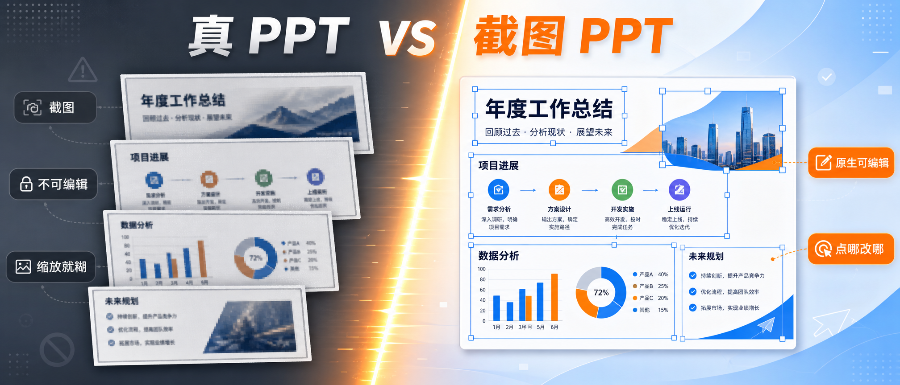
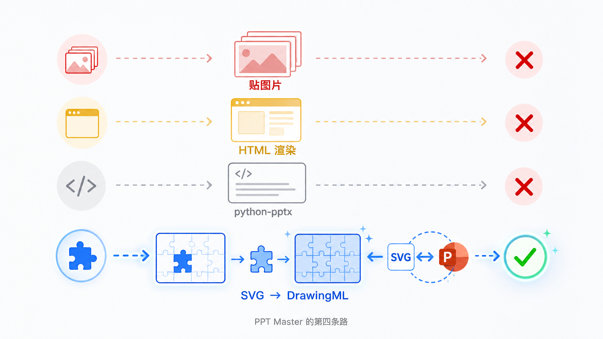
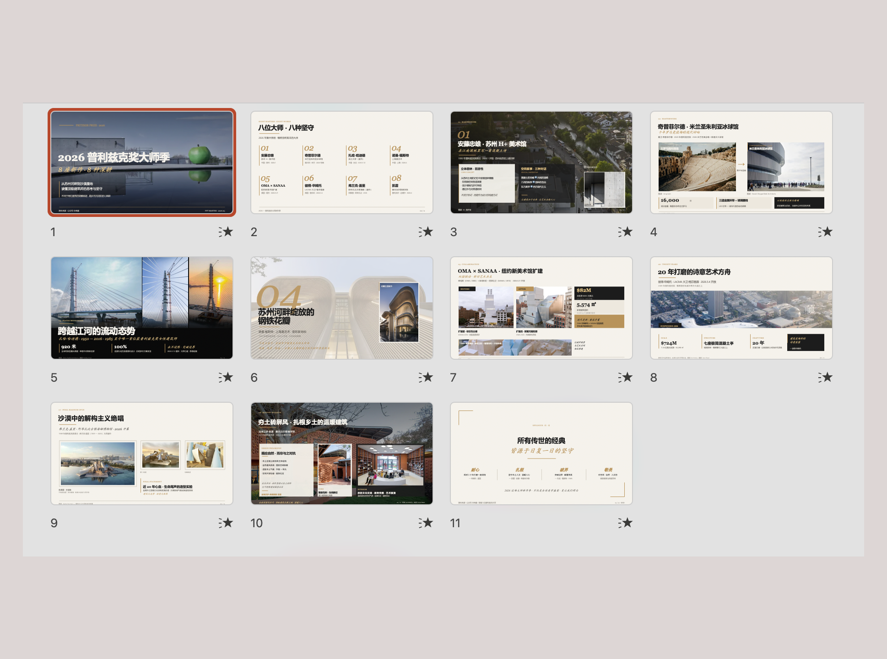
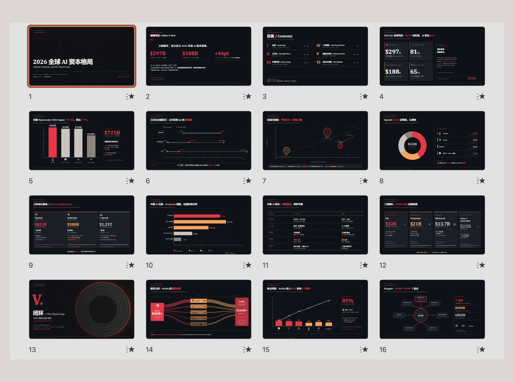
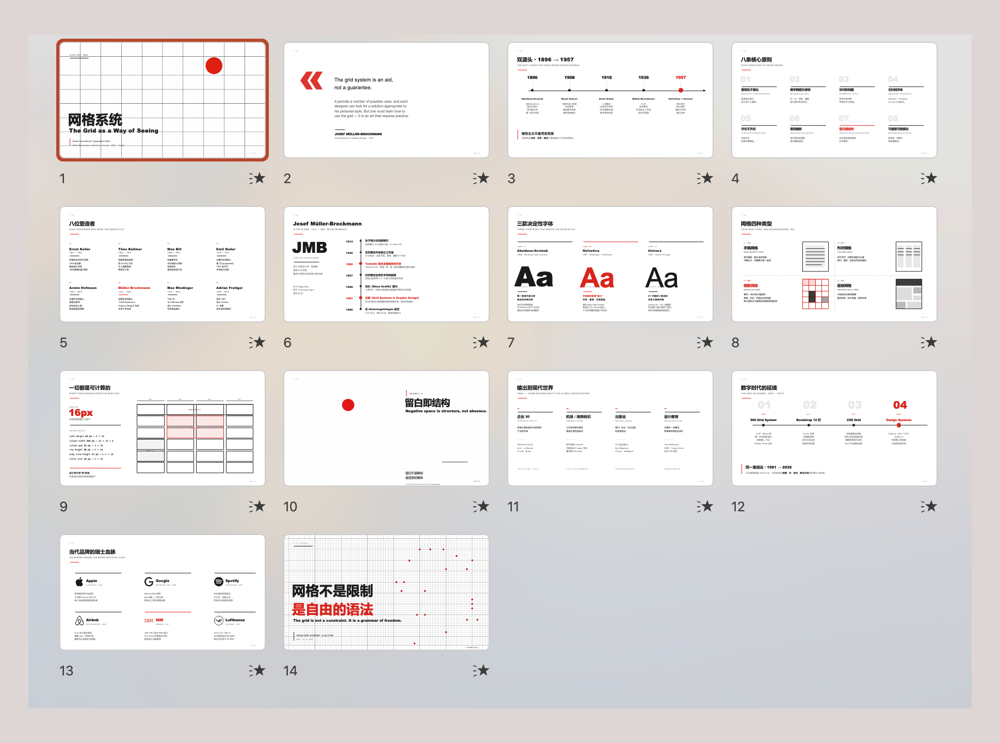
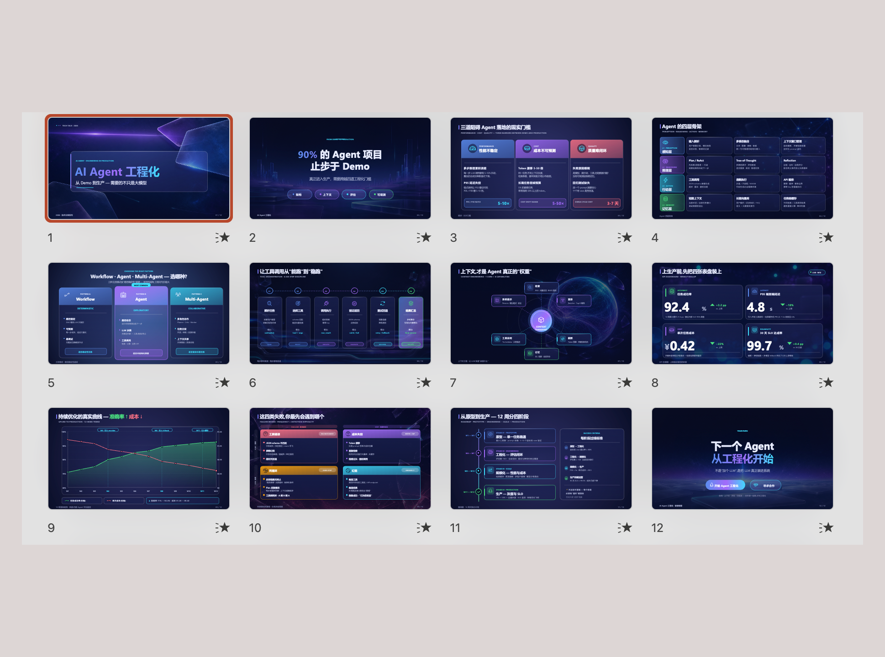
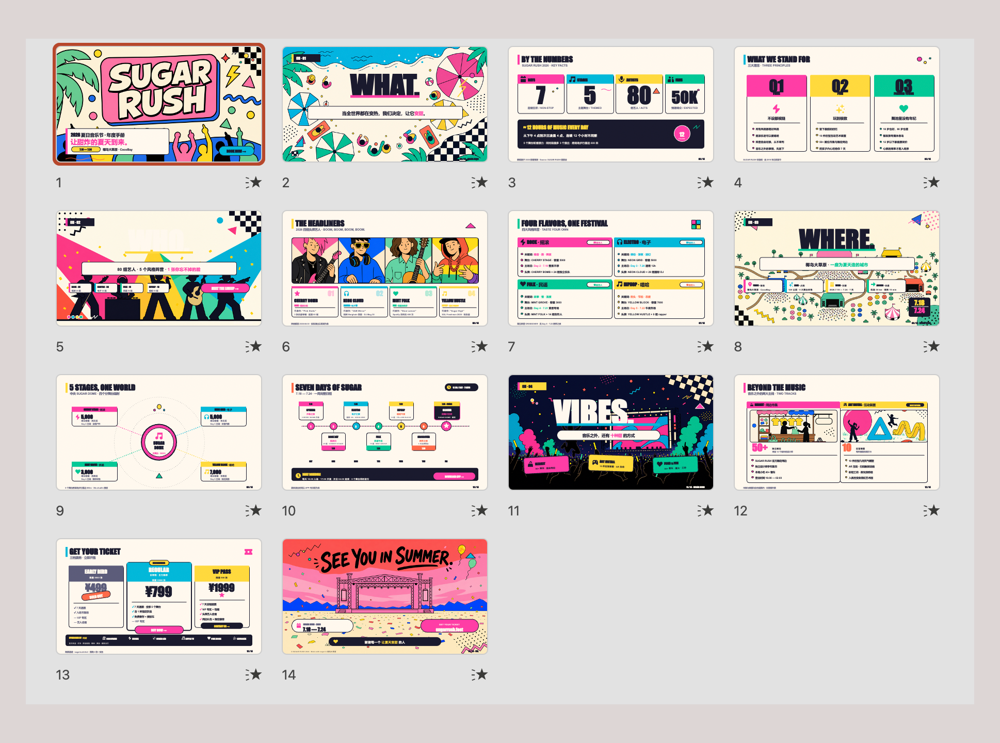
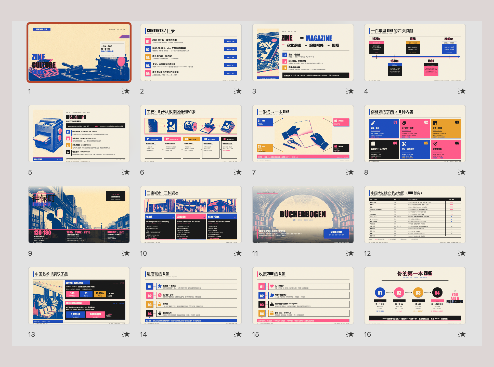
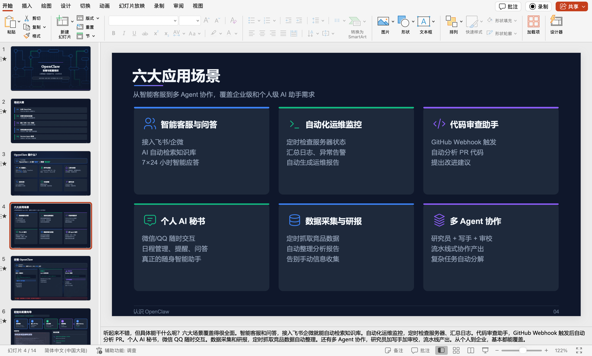
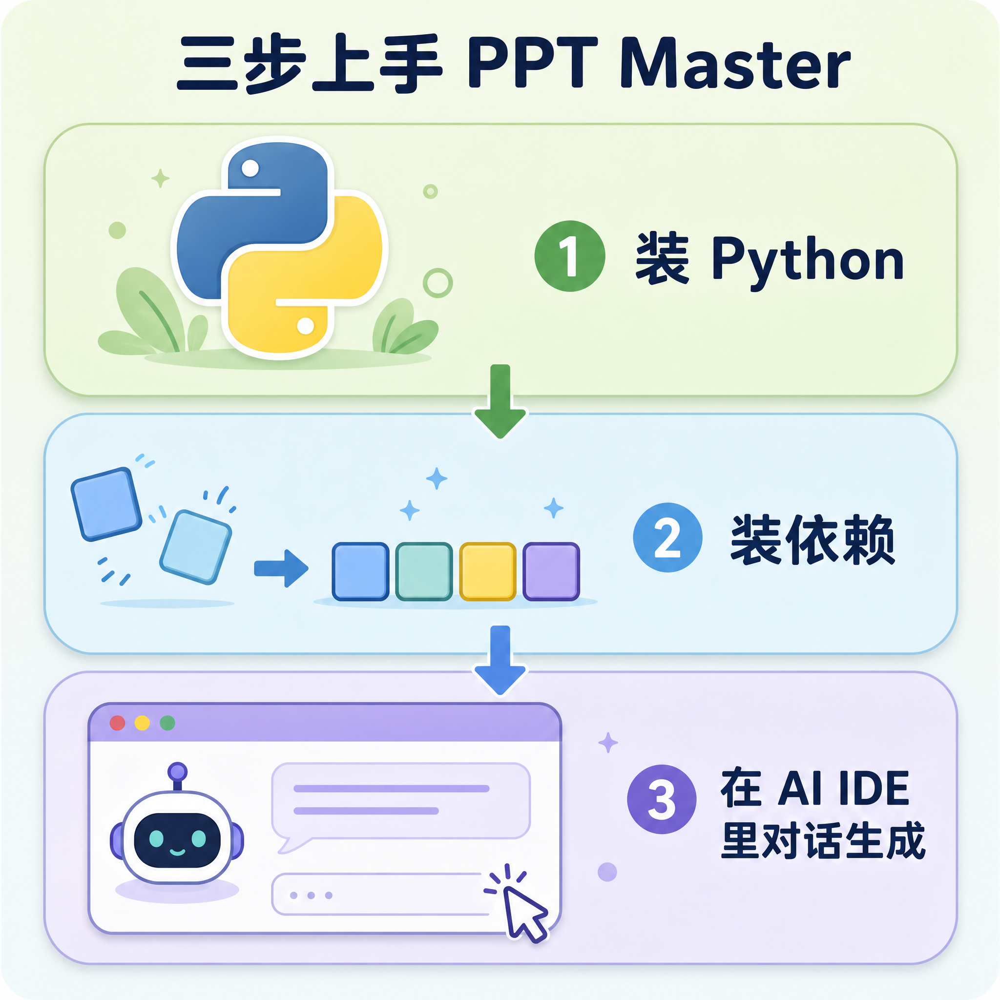

# 这个开源项目让 AI 生成了真 PPT，不是HTML

> 一个投融资从业者做的开源工具，用 SVG 当桥梁，让 AI 生成的每一页 PPT 都能点开就改。



---

最近我在 GitHub 上刷到一个项目，名叫 PPT Master，MIT 协议，纯 Python。它做的事情一句话就能说明白，用 AI 生成 PPT。但跟市面上大部分 AI PPT 工具不同的是，它生成的是**真 PPT**。

什么叫「真 PPT」？打开 PowerPoint，点一下文字能改，拖一下形状能挪，颜色字号都能调。不是一张张截图塞进 PPTX 里糊弄你。

这事儿听起来没什么，但如果你用过 Gamma、美图 AI PPT、WPS AI 这类工具，你会发现一个尴尬的现实，它们生成的东西要么是图片，要么导出 PPTX 后布局面目全非。PPT Master 的作者何雨果（Hugo He）大概也被这个问题烦透了，于是自己动手做了。

他是怎么做的？得先理解为什么现有的方案都不行。

---

## AI PPT 工具的三条老路，各有各的坑



市面上的 AI PPT 工具大致走了三条路，每条都有硬伤。

最常见的做法是**贴图片**。把每页渲染成一张高清图，然后打包成 PPTX。看起来精美，但文字不可选、颜色不可改、缩放就糊。本质上就是截图，不是演示文稿。你下载下来一看，每页就是一个大图文件。很多国产 AI PPT 工具走的就是这条路。

Gamma 走的是 **HTML 渲染**路线，在浏览器里做得确实好看。但 HTML 是文档流，PPT 是画布，两者对「页面」的理解根本不同。导出 PPTX 时布局走样、字体丢失，一个自动流动排列，一个要精确的坐标位置。

还有一条路是直接写代码生成。ChatGPT 内置的 PPT 功能就是这么干的，元素倒是可以编辑，但出来的东西谈不上排版，更别提设计感。AI 缺乏复杂设计的训练数据，只能做基础文本框加列表。

说到底，AI 擅长产出的东西（图片、HTML、简单代码），和 PowerPoint 真正需要的格式（DrawingML 矢量形状），不是同一种东西。

---

## PPT Master 的第四条路，SVG 当桥梁

PPT Master 走了一条不一样的路，让 AI 生成 SVG，再由后处理脚本将 SVG 转换为 DrawingML。

为什么选 SVG？因为它和 DrawingML 说到底是同一类东西。都是基于绝对坐标的矢量格式，矩形对应矩形，路径对应路径，渐变、阴影也一一对应。

举个例子。SVG 里的圆角矩形 `<rect rx="8">`，在 DrawingML 里就是 `<a:prstGeom prst="roundRect">`。概念完全对齐，翻译几乎是机械的。

整个流程分三步。我试下来，三步里最花时间的是第二步。

**先说内容理解**。你把 PDF、DOCX、网页、Markdown 等素材丢进去，AI 会先分析内容、规划页面结构，然后给出一套设计规范让你确认。这一步相当于跟设计师对需求。

确认之后就是**视觉生成**，AI 逐页生成 SVG 文件。这是最耗时的环节，因为它是一页一页串行生成的，不是一口气全出。好处是你可以在浏览器里实时看每一页出来，觉得哪页不对可以当场写批注让 AI 重做。

最后是**工程化转换**。后处理脚本把 SVG 转成 DrawingML，每个形状变成 PowerPoint 原生对象。这步很快，跑完就能拿到 `.pptx` 文件了。

你最终拿到的 `.pptx` 文件，格式上跟你自己在 PowerPoint 里手画的没区别。

---

## 它到底能做出什么

说了这么多原理，直接看效果。我翻了 PPT Master 在 GitHub 上的 6 个示例，全部是一次性生成，没有精修，风格跨度大到让我有点意外。



**杂志风**。建筑摄影加排版网格，冷静克制的编辑感。这像一份设计杂志的内页。



**财经数据风**。深色仪表盘、图表驱动、彭博社风格。柱状图和趋势线都是原生可编辑的矢量形状，不是贴上去的图片。



**瑞士风**。严格栅格、克制字体、红色点缀。平面设计经典的瑞士国际主义风格。



**毛玻璃 SaaS 风**。半透明叠层、渐变景深、产品 UI 感。科技产品发布会用这种风格不过分。



**孟菲斯波普风**和 **Risograph Zine 风**也各有特色，前者高饱和原色配几何图形，后者有双色印刷的手作质感。



这 6 个示例全部可以在项目的 GitHub Pages 上在线翻看，也可以下载 `.pptx` 文件在 PowerPoint 里打开验证。生成模型是 Claude Opus 4.7 加 gpt-image-2。

我自己也实测了一把，用 Claude Code 跑的，生成的 PPT 打开之后确实是逐元素可编辑的矢量形状，不是截图。



---

## 怎么上手



上手门槛不算高，我装了一遍大概十来分钟搞定，但也不是打开浏览器就能用。

**装 Python**。只需要 Python 3.10 以上版本，macOS 用 `brew install python`，Windows 从 python.org 下载安装时记得勾选「Add to PATH」。

**装依赖**。克隆仓库后跑一行命令就行：

```bash
pip install -r requirements.txt
```

**在 AI IDE 里对话**。PPT Master 本质上是一套工作流（skill），运行在 Claude Code、Cursor、VS Code Copilot 等任何具备 agent 能力的 IDE 里。你在对话窗口里说「用这份 PDF 做一份 PPT」，AI 就会按工作流自动跑完全流程。

输入格式几乎不挑，PDF、Markdown、甚至微信公众号文章链接都能吃进去。输出也不局限于 16:9，小红书 3:4、朋友圈 1:1、竖版 Story 9:16 都能做。

模型选择上，追求最佳效果用 Claude Opus 加 gpt-image-2 生图。如果想省点钱，Gemini 3.5 Flash 速度快，日常够用。PPT Master 本身免费开源，你唯一需要付费的就是 AI 模型的 API 调用费用。

---

## 什么时候该用，什么时候不该用

装好之后先别急着用，搞清楚它适合什么场景再动手。

如果你需要生成后还能在 PowerPoint 里继续编辑的 PPT，或者你的文档涉及敏感数据不想上传到第三方服务器，又或者你希望成本可控、不想被任何一家平台锁定，那 PPT Master 值得一试。

但如果你只是想打开浏览器秒出几张幻灯片，Gamma 和 Canva 更合适。如果你需要团队实时协作编辑，它也做不到。作者自己说得很坦率，「别指望一把就给你一份完美的成品 PPT。它真正的价值是帮你把大部分枯燥的活儿干掉，剩下的打磨交给你。」

---

## 一句话总结

说真的，这个项目让我改了对 AI PPT 的看法。SVG 转 DrawingML 这条路走得通，导出的每个元素都能点开就改，不是截图。

如果你经常做 PPT，又对市面上的 AI PPT 工具感到失望，值得一试。项目地址是 [github.com/hugohe3/ppt-master](https://github.com/hugohe3/ppt-master)，MIT 协议，免费开源。

欢迎关注我的公众号「Chyris Tech Note」，获取更多 AI 技术解读与实践分享。

