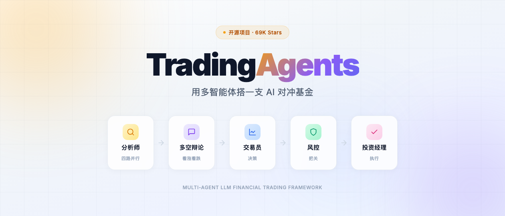
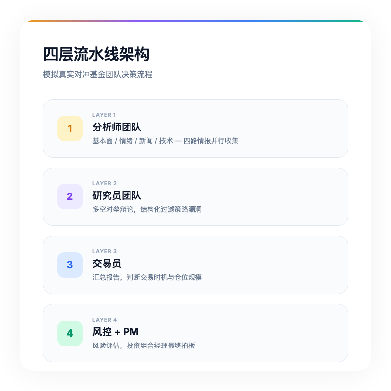
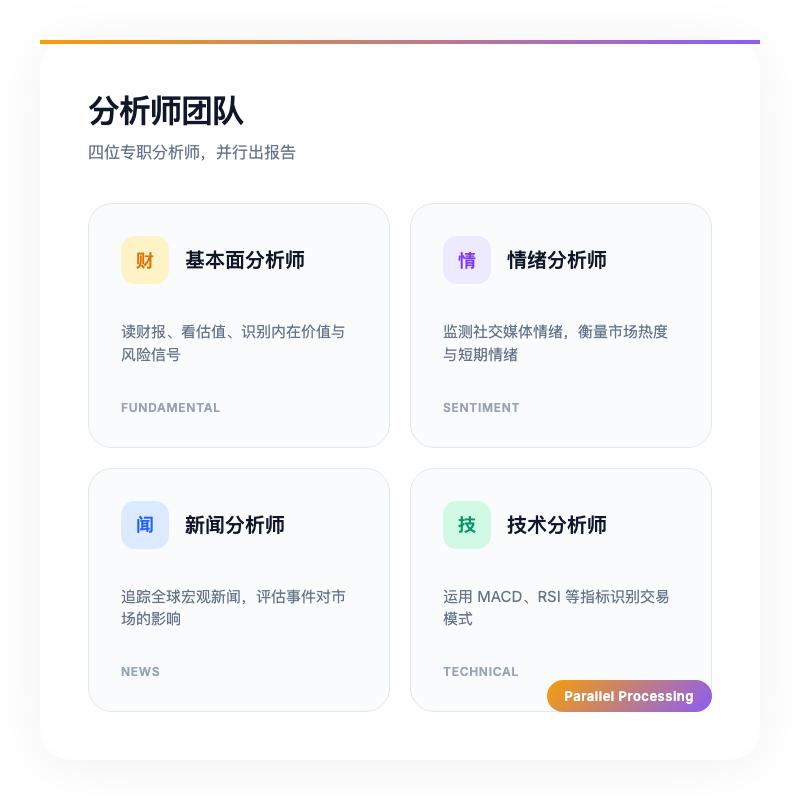
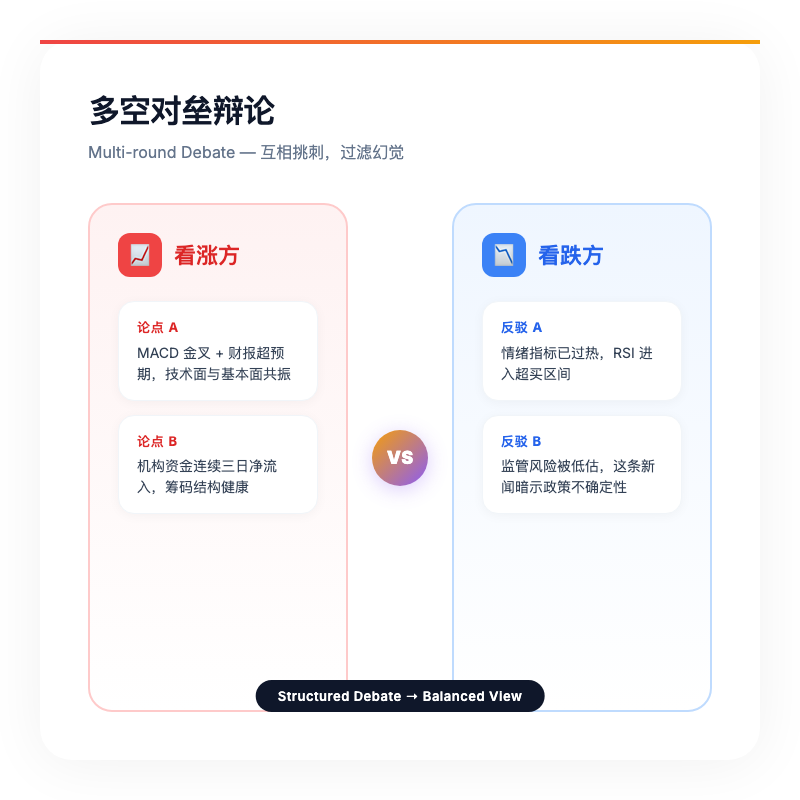
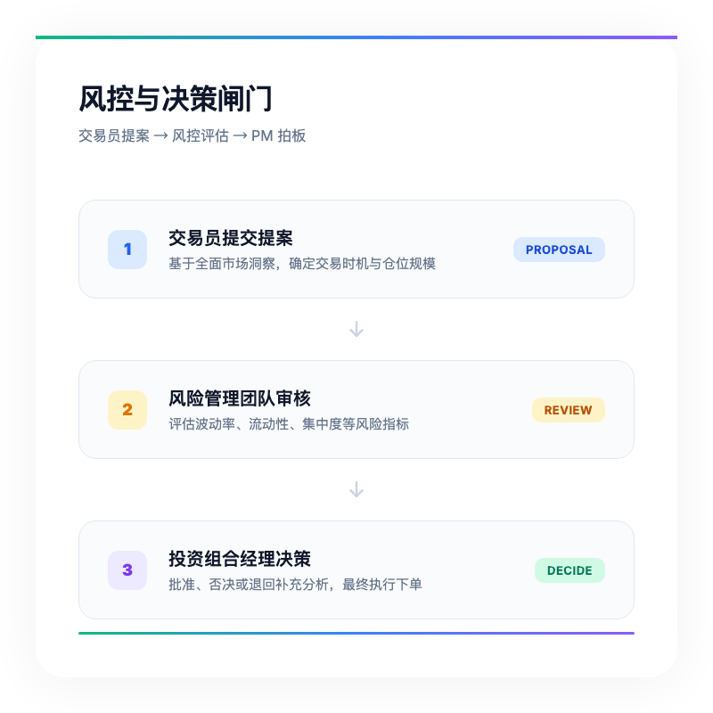

# GitHub 狂揽 69K Star！这个开源"AI对冲基金"，用多智能体复刻了顶级私募的投研体系

> 花 20 块钱调了一次 GPT-5，它自信满满告诉你"全仓买入"，结果第二天跌停。这真不是段子，我身边就有人这么干过。单一模型预测，幻觉率经常比收益率还高。



---

## 一句话总结

TradingAgents 的思路是这样的：不指望一个大模型帮你选股，而是让一群 AI "员工"搭个对冲基金团队，从分析师辩论到风控把关，走完整套专业投研流程。

---

## 为什么单一 AI 炒股不靠谱？

先泼盆冷水。

大模型炒股，头号问题就是幻觉。旧新闻当新消息，相关当因果，甚至能在 K 线图里脑补出根本不存在的形态。

更麻烦的是，它只给结论，不给过程。你问"为什么买 NVDA"，它编一套逻辑自洽的故事，但你永远不知道它有没有漏看一份刚发布的财报，或者一条突发监管新闻。

说白了，你请的不是投资顾问，是算命先生。话术专业，结果随缘。

对冲基金怎么决策？靠团队，不是靠一个人拍脑袋。

---

## TradingAgents：把对冲基金搬进代码里



最近 GitHub 上狂揽 69K Star 的项目 TradingAgents，Tauric Research 做的。近七万星标在金融开源圈什么概念？基本属于顶流。这东西不是 Demo，有 arXiv 论文（2412.20138），工程化也落地了。

核心理念就一句话：别让一个 AI 包揽全部，各干各的。

整个系统模仿了一家真实交易公司的组织架构，分四层：

| 层级 | 角色 | 职责 |
|------|------|------|
| 第一层 | 分析师团队 | 从基本面、情绪、新闻、技术四个维度收集情报 |
| 第二层 | 研究员团队 | 多空双方辩论，互相挑刺找漏洞 |
| 第三层 | 交易员 | 汇总报告，决定交易时机和仓位 |
| 第四层 | 风控 + PM | 评估风险，最终拍板下单或否决 |

> 这套流程华尔街私募每天都在走。TradingAgents 把它算法化了。

---

## 分析师团队：四路情报同时开工



第一层派出四个专职分析师，各看各的：

- 基本面分析师：读财报、看估值、找风险信号
- 情绪分析师：监测社交媒体情绪，判断市场热度
- 新闻分析师：追踪全球宏观新闻，评估事件冲击
- 技术分析师：看 MACD、RSI 这些经典指标

关键点在于他们是并行的。就像真正的投研部，宏观组和技术组同时干活，互不干扰，最后汇总。

---

## 研究员团队：多空对垒，互相拆台



我觉得这是整个框架里最妙的地方。

分析师的报告不会直接给交易员。它们先送到研究员团队，这里分看涨方和看跌方，两边拿着同一份报告，开始结构化辩论。

看涨方：MACD 金叉 + 财报超预期，这波必上。
看跌方：情绪指标已经过热，而且这条新闻暗示监管风险被低估。

多轮辩论之后，策略漏洞被过滤，极端观点被修正。这比单一模型自说自话要稳得多。毕竟连人类投资者都知道，决策前找个杠精朋友挑挑毛病，能少亏不少钱。

---

## 交易员与风控：最后一道闸门



辩论结果汇总到交易员，它判断买卖时机和仓位。但即便如此，也不能直接下单。

交易员提案先交给风险管理团队，评估市场波动率、流动性、集中度这些指标。最后投资组合经理（PM）拍板：批准、否决，或者打回去补分析。

这个设计很机构化。散户炒股靠直觉，机构靠流程。TradingAgents 把流程写成了代码。

---

## 技术栈：LangGraph + 全模型覆盖

工程层面也有不少亮点：

- 底层基于 LangGraph：投研流水线被建模成状态图，每个 Agent 是节点，数据流是边。模块化程度高，换模型、加节点都方便。
- 全模型兼容：GPT-5.4、Claude 4.6、DeepSeek V4、Gemini 3.1、Grok 4.x，甚至本地 Ollama，随你挑。
- 持久化决策日志：每次交易决策和结果会被记录，系统会复盘历史盈亏，调整后续策略。
- 断点续传（Checkpointing）：分析中途崩了，不用从头再来，从上一个节点恢复，省 Token 也省时间。

---

## 最小 Demo：5 行代码跑起来

理论讲完，上代码。TradingAgents 支持 Python 直接调用：

```python
from tradingagents.graph.trading_graph import TradingAgentsGraph
from tradingagents.default_config import DEFAULT_CONFIG

# 初始化（默认配置）
ta = TradingAgentsGraph(debug=True, config=DEFAULT_CONFIG.copy())

# 分析 NVDA 在 2026-01-15 的买卖决策
_, decision = ta.propagate("NVDA", "2026-01-15")
print(decision)
```

如果你想换模型、调整辩论轮数，改配置即可：

```python
config = DEFAULT_CONFIG.copy()
config["llm_provider"] = "deepseek"      # 切换提供商
config["deep_think_llm"] = "deepseek-chat"
config["max_debate_rounds"] = 3           # 多空辩论三轮

ta = TradingAgentsGraph(config=config)
```

CLI 也做得挺友好，一行命令进交互界面，选股票、选日期、选模型，全程可视化追踪每个 Agent 的思考过程。

```bash
git clone https://github.com/TauricResearch/TradingAgents.git
cd TradingAgents
pip install .
tradingagents
```

---

## 总结：未来是框架之间的博弈

我个人觉得 TradingAgents 最有趣的地方，不是它能不能赚钱，而是它展示了一种新思路：AI 在金融领域的应用，正从"单兵作战"往"组织协作"转。

一个模型再强，偏见和幻觉也跑不掉。但一群专业 Agent 互相制衡、层层把关，决策质量会接近人类机构投资者。而且它们不会累，不会情绪化，不会凌晨三点脑子一热全仓梭哈。

> 未来的交易，可能不再是人与人的博弈，而是不同 Agent 框架之间的博弈。

TradingAgents 开源了整套"AI 投研部"的模板。对研究者、量化开发者，或者单纯想了解机构决策流程的散户来说，都是份不错的参考。

---

**参考资料**
- TradingAgents GitHub: https://github.com/TauricResearch/TradingAgents
- 技术论文: https://arxiv.org/abs/2412.20138
