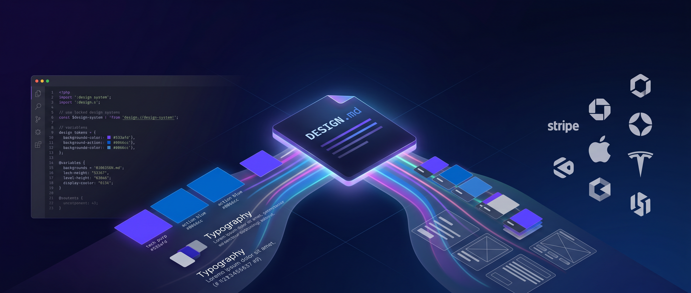
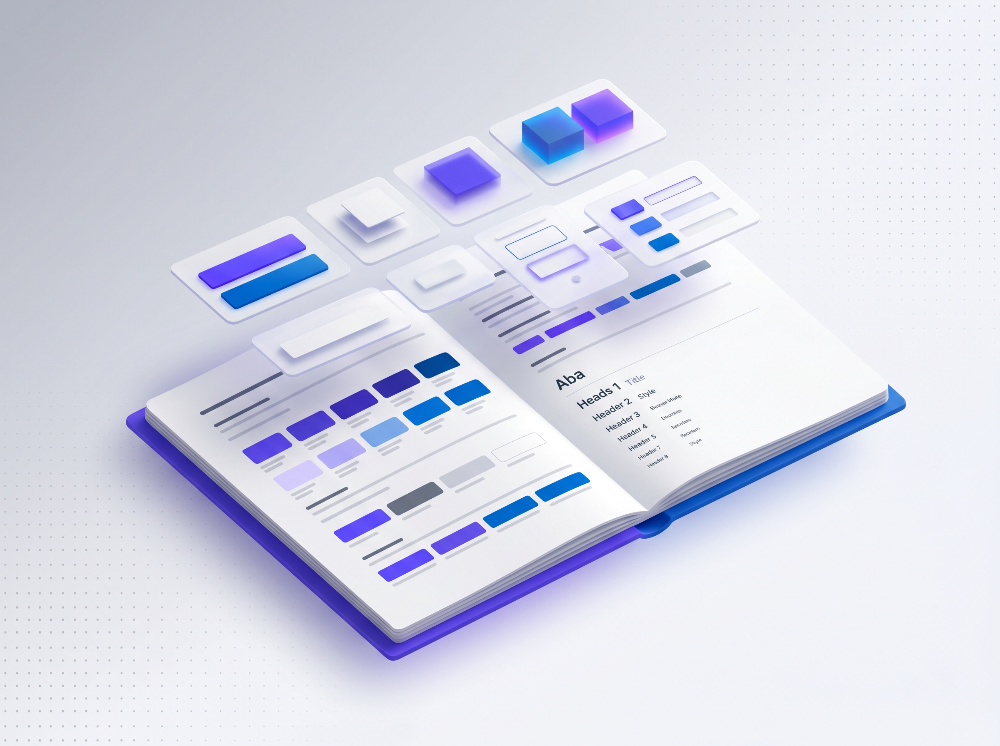
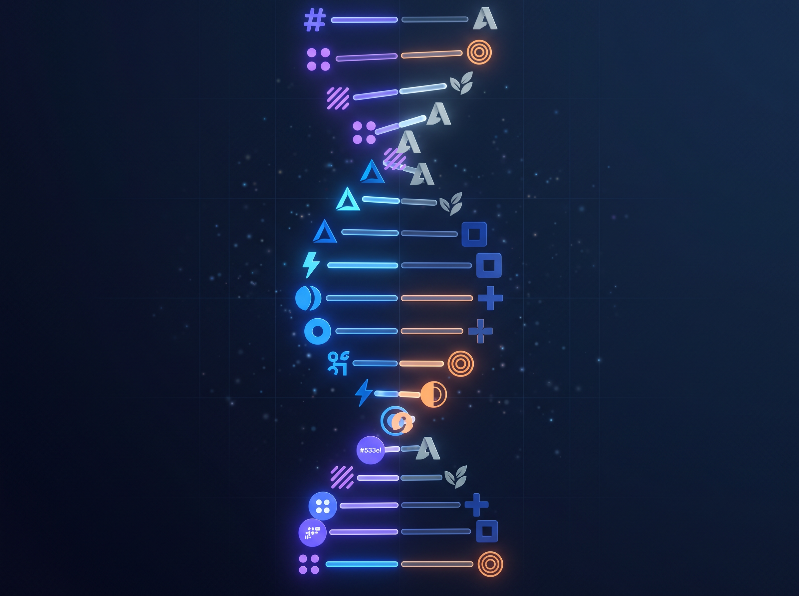
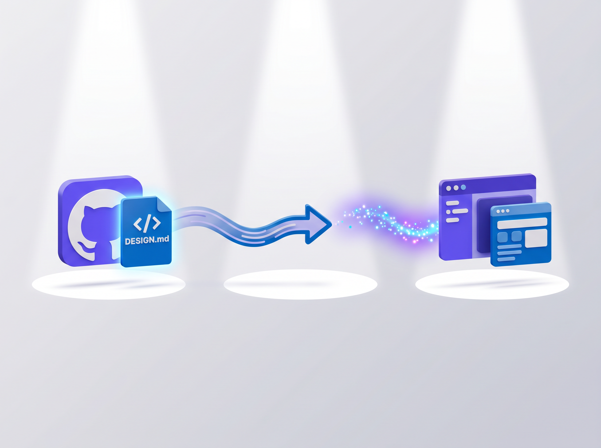

# GitHub 82K Star 的 DESIGN.md，让 Claude Code 一键还原任意网站风格

> 把 Apple 的设计语言塞进一个 Markdown 文件，AI 就能照着生成像素级还原的页面

---

你用 Claude Code 写了个 landing page。功能没问题，API 跑得通，响应式也做了。

但你盯着屏幕总觉得哪里不对劲。配色有点「随机」，间距有点「自由发挥」，按钮的圆角时大时小，字体用了三个不同的无衬线体但谁也不像谁。

代码是 AI 写的，审美也是 AI 的。但 AI 的审美，怎么说呢，有点像一个精通十种语言的翻译，每种语言都只学了初级课本。该有的词都有，但拼在一起就是缺了点味道。

Vibe Coding 火了快一年，AI 写代码的速度已经让人惊叹，但 UI 的一致性和精致度始终是短板。你可以用一句话让 Claude Code 写出一个完整的 CRUD 应用，但你很难用一句话让它理解「我想要 Stripe 那种感觉」。

什么是 Stripe 的感觉？是那种紫色调的渐变，是超细字重的大标题，是药丸形状的按钮，是间距精确到像素的网格布局。这些信息量太大了，塞不进一句 prompt 里。

直到有人把这些信息量塞进了一个 Markdown 文件。

---

## 一个 Markdown 文件，装下了整个设计系统

2026 年 3 月，Google 发布了一款叫 Stitch 的 AI 设计工具，同时提出了一个新概念，DESIGN.md。

思路很简单。既然程序员可以用 AGENTS.md 告诉 AI 怎么写代码，为什么不能用 DESIGN.md 告诉 AI 怎么做设计？

这两个文件的分工很清晰。**AGENTS.md 负责「怎么构建」**，技术栈、构建流程、代码规范。**DESIGN.md 负责「长什么样」**，配色方案、字体层级、按钮样式、间距规则、阴影系统、响应式断点。所有视觉语言都在这一个文件里定义清楚。

Markdown 是 LLM 最擅长阅读的格式，没有 JSON schema 需要解析，没有 Figma 导出插件需要装。把 DESIGN.md 放在项目根目录，任何 AI 编码工具或 Google Stitch 本身都能直接理解你的设计意图。

但写一份好的 DESIGN.md 并不容易。你需要精确测量目标网站的颜色值、字体规格、间距规律、组件状态，过程既枯燥又耗时。

于是有人把这件事做了，而且做得很彻底。

---

## 82K Star，73 个顶级品牌的设计 DNA

VoltAgent 团队创建了 awesome-design-md 项目，把 73 个全球知名品牌的设计系统逐个拆解，每家提炼成一份 DESIGN.md。项目 2026 年 3 月底上线，不到两个月 Star 就破了 82K，Fork 接近 1 万。

73 个品牌覆盖了互联网的半壁江山，从 Claude、Cursor 这样的 AI 和开发工具，到 Stripe、Coinbase 这样的金融科技，再到 Apple、Tesla、Nike、SpaceX 这样的消费品牌。每个品牌的设计系统被拆解成配色、字体、组件、布局、阴影等 9 个维度的完整描述。

听起来挺抽象？打开一份实际的 DESIGN.md 就明白了。

**Stripe 的文件里记着什么？** 主色 #533afd，一种偏冷的靛蓝色，配合渐变网格背景使用。字体用 Sohne 字体族，显示层级主要用 300 字重，这个数字在字体世界里属于「极细」，正是 Stripe 那种轻盈优雅视觉感的来源。按钮是药丸形状的，圆角 9999px。卡片有 12px 圆角和微妙的阴影层级。每个细节都有精确的数值，不是「大概这个颜色」「差不多这个大小」，而是 Hex 值、像素值、毫秒级的过渡动画时长。

换到 Apple，画风完全不同。整个官网被总结成一个「博物馆画廊」，主色只有一个 Action Blue #0066cc，字体是 SF Pro Display，标题用 56px / 600 字重，行高 1.07，字间距 -0.28px，精确地复现了 Apple 官网那种紧密有力的大标题效果。界面里几乎没有装饰性渐变，没有多余的阴影，所有的视觉重量由全幅的产品摄影承担。

Tesla 更极端。整个网站只有一种彩色，Electric Blue #3E6AE1，只用在「Order Now」按钮和少量促销文字上。没有渐变，没有阴影，没有装饰图案，一切视觉张力来自全屏的汽车摄影。

每个品牌的设计 DNA 确实独一无二。Stripe 的轻盈、Apple 的克制、Tesla 的暴力极简，靠感觉模仿不来，靠精确参数才能还原。DESIGN.md 做的事很简单，把这些参数写下来。

听起来很厉害，实际用起来有多简单？

---

## 复制，粘贴，开干

使用方式简单到不需要教程。

**第一步**，去 awesome-design-md 的 GitHub 仓库，找到你喜欢的品牌，打开对应的 DESIGN.md 文件。

**第二步**，把整个文件内容复制，粘贴到你项目的根目录，保存为 DESIGN.md。

**第三步**，告诉你的 AI 编码工具「按照 DESIGN.md 的设计系统来生成 UI」。

就这样。Claude Code、Cursor、Windsurf，任何支持读取项目文件的 AI 编码工具都能用。Google Stitch 原生支持 DESIGN.md 格式，直接导入即可。

来一个具体的场景。假设你正在做一个支付相关的产品页面，想参考 Stripe 的风格。把 Stripe 的 DESIGN.md 放进项目根目录，然后对 Claude Code 说「帮我做一个定价页面，参考 DESIGN.md 中的设计系统」。

Claude Code 会读取文件中的设计参数，从主色调到字重到圆角到间距，逐一对齐。生成的页面从配色到排版到组件细节都会高度还原 Stripe 的视觉风格。

每份 DESIGN.md 还附带 preview.html 和 preview-dark.html 两个可视化文件。用浏览器打开就能看到颜色色板、字体层级、按钮样式、卡片组件在亮色和暗色模式下的预览。不需要对照着原文猜 #533afd 到底是哪种紫色，看一眼色板就清楚了。

整个流程从「我想参考某个网站的风格」到「AI 输出精确匹配的 UI」，中间只隔了一次复制粘贴。

这个流程背后有一个有意思的趋势。

---

## Vibe Coding 的下半场是 Vibe Design

Vibe Coding 解决了「写代码」的问题，但真正决定产品能不能看的是 Vibe Design。

想想这个场景，设计师精心调好的 4px 圆角到代码里变成了 8px，品牌紫 #533afd 变成了随手选的 #6366f1。不是开发者不认真，是从 Figma 到代码，中间要经过 design tokens 定义、组件库同步、手动实现好几道工序，每一道都有损耗。

DESIGN.md 把这个流程压扁了。

不需要 Figma，不需要 design tokens 的 JSON 导出。一个 Markdown 文件就是全部的设计规范，AI 直接读取，直接生成。独立开发者和小团队要快速做出「像样 UI」，效率提升是数量级的。

awesome-design-md 里的 DESIGN.md 是对已有品牌设计的逆向工程，不是从零开始创造。好的设计仍然需要人类的审美判断和用户洞察。DESIGN.md 只是让这些决策可执行。

换个角度看，**DESIGN.md 是设计师和 AI 之间的沟通协议。** 设计师定义「应该长什么样」，AI 负责精确实现。

awesome-design-md 在不到两个月拿到 82K Star，说明了开发者的态度，Vibe Coding 的下一个瓶颈就是设计一致性，DESIGN.md 是目前最轻量的解法。

---

## 回到开头那个问题

回到你盯着那个 landing page 觉得「差点意思」的时刻。

你用一句「参考 Stripe 风格」来传递的信息量，还不如 Stripe 的 DESIGN.md 里一行 `#533afd` 来得精确。

73 个品牌的设计系统已经准备好了。项目文件夹里有了 AGENTS.md 和 DESIGN.md，就等于给 AI 配齐了「技术架构师」和「设计总监」。复制粘贴，开干就好。

---

欢迎关注我的公众号「Chyris Tech Note」，获取更多 AI 技术解读与实践分享。
