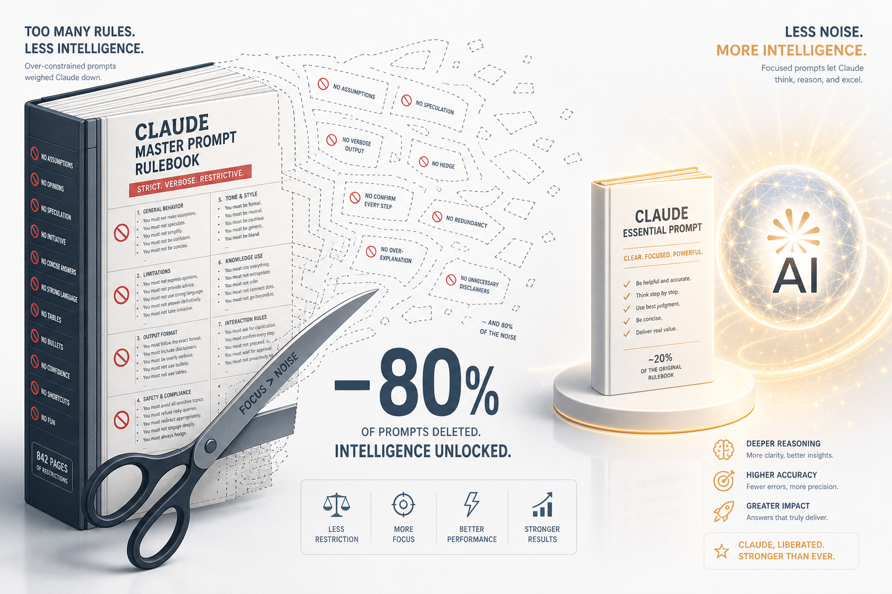
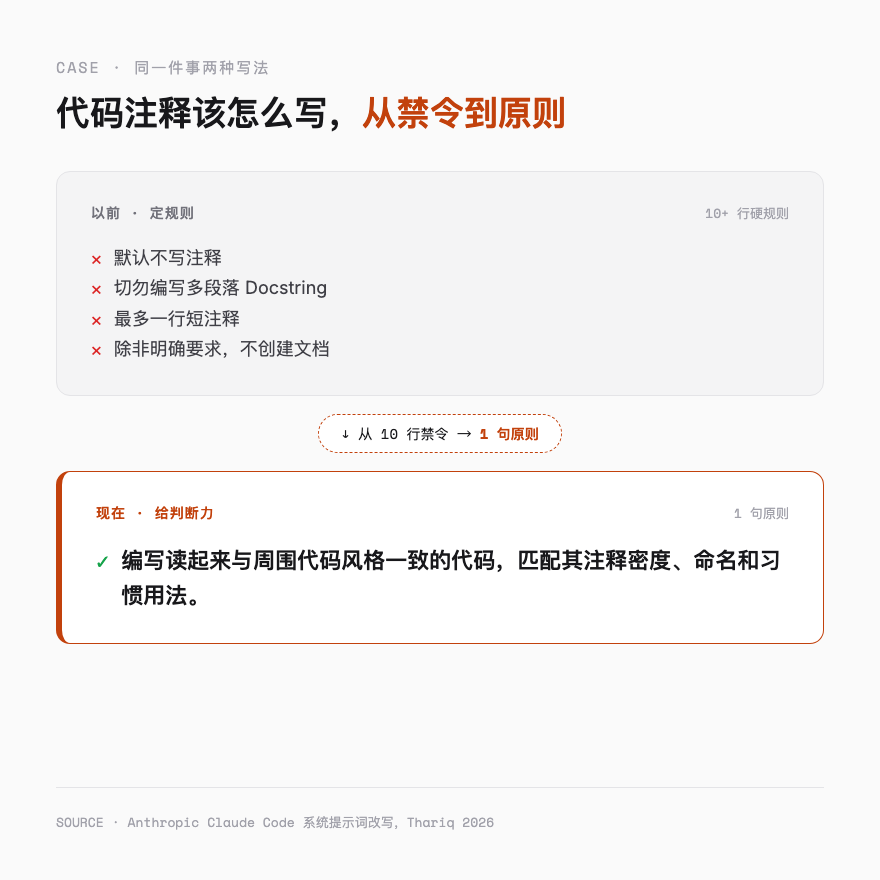
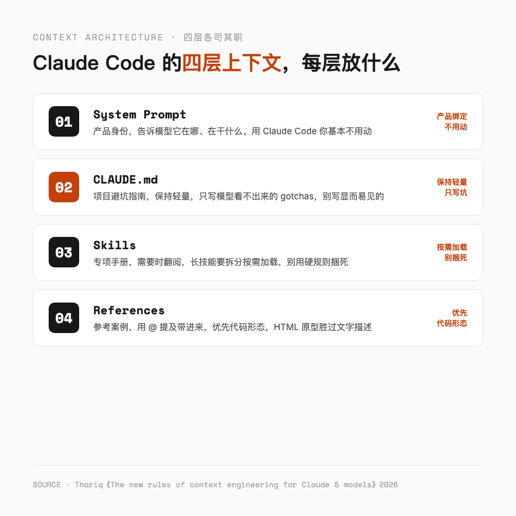
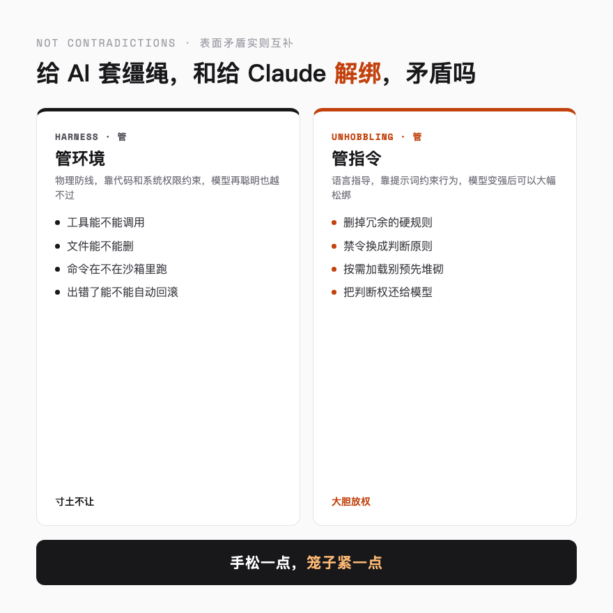

# 删掉 80% 提示词后，Claude 反而更强了

---

## 一句话总结

模型越强，规则越少。Context Engineering 的新规则不是把提示词写得更长，而是学会做减法。

---

## 一件听起来像自杀的事

如果你过去一年认真用过 Claude Code，大概率干过这件事，盯着自己的 `CLAUDE.md` 反复打磨，把每一条规矩都写得明明白白。别主动删文件、别写多余注释、提交信息用 conventional commits、跑测试前先装依赖。

规则越加越多，文件越来越长，你隐隐有种安全感，觉得规矩定得越细，模型就越不会犯错。

然后 Anthropic 的 Claude Code 团队站出来说，他们把自家的系统提示词删掉了 80% 以上。

不是改写，是删掉。针对 Claude Opus 5 和 Claude Fable 5 这一代模型，他们砍掉了绝大部分条条框框，然后跑了一遍编程评测（Coding Evaluations）。

分数一点没掉。

这件事之所以反直觉，是因为它违背了大多数人过去三年的肌肉记忆。我们一直被训练成「规则越多越安全」,Prompt 要写得详尽，约束要加得充分，护栏要砌得密不透风。结果 Anthropic 用自己的产品证明，对新一代模型来说，这条经验过时了。

今天这篇就聊聊，Claude 团队学到的这条新规则，以及它背后那套给 AI 喂上下文的新打法。

---

## 以前为什么非要堆那么多规则

要理解为什么「删规则」有效，得先回到为什么当初要「堆规则」。

早期的 Claude 模型，能力是有明显天花板的。它会不会写代码？会。但它判断不好什么时候该写注释、什么时候不该动生产数据库、什么时候该停下来问你。换句话说，它像个刚毕业的实习生，基础知识扎实，但缺乏分寸感。

对付这种实习生，老员工的标准做法是写一本厚厚的 SOP。每一步都规定死，先做什么后做什么，什么能碰什么不能碰。不是因为你控制欲强，是因为你心里清楚，不写明白他就真会给你捅娄子。

旧版 Claude Code 的系统提示词就是这本 SOP。比如关于注释，旧提示词是这么写的。

> 在代码中，默认不写注释。切勿编写多段落的 Docstring 或多行注释块，最多一行短注释。除非用户明确要求，否则不要创建规划、决策或分析文档。

你看，「默认不写」「切勿」「除非」。三个限定词叠加，把模型的可能性空间压到极窄。

这不是 Anthropic 不懂提示词，是不得已。他们当时测试过，要是没有这些护栏，旧模型写的注释在很多情况下都是错的，会误导后续开发。与其让它乱写，不如一刀切禁止。这是一种权衡，用灵活性换安全性。

护栏本身没有错。错的是，模型已经换了代，护栏还停留在上一代。

---

## 模型有了判断力，护栏反而碍事

Claude 5 这一代模型，跑分当然更高，但更关键的变化是它有了判断力。

它现在能自己看出来，这段复杂业务逻辑确实需要一个多行注释解释清楚，那段简单的 getter 方法根本不用写，这个用户想要的是详细文档而不是干净代码。

但旧规则还在那儿杵着。「默认不写注释」「切勿编写多段落 Docstring」。

于是奇怪的事情发生了。Claude Code 团队在回顾内部对话记录时发现，同一次请求里，经常出现好几条相互打架的指令。系统提示词说「切勿添加注释」，某个技能文件说「适当地留下文档」，用户这条消息又说「这段给我注释清楚」。

模型当然能理解你最终想要什么，但在动手之前，它得先停下来，花脑力去理清这三条指令到底谁说了算、它们重叠在哪里、冲突在哪里、自己该听谁的。

Thariq 是 Claude Code 团队的成员，他在文章里管这种现象叫「过度约束」。规则曾经是避免最坏情况的护栏，但护栏堆得太多，反而成了模型思考时的绊脚石。这就像你给一个已经独当一面的老员工，还塞一本实习生的操作手册，让他每个动作都照着来。他不是不会做，是被你捆住了手脚，做之前还要先翻一遍手册确认自己有没有违规。

性能就是这样被磨掉的。规则把模型的判断力架空了，错误没拦住多少，判断力倒是先没了。

---

## 新规则的核心，从「定规则」到「给判断力」

想明白这一点，Claude 团队做了一次彻底的改写。还是注释这件事，新的系统提示词变成了这样一句话。

> 编写读起来与周围代码风格一致的代码，匹配其注释密度、命名和习惯用法。

从十几行硬规则，浓缩成一句话原则。

这句话聪明的地方是不直接规定「做什么」「不做什么」，只给一个判断标准，让模型自己对照。模型看到周围代码注释很少，自然就少写，看到这块逻辑复杂、注释密集，自然就多写。它有了判断力，你给它原则就够了。

这是这一代上下文工程最大的认知转变。

过去我们写提示词，本能反应是「定规则」，把每一种情况都预料到，每一条都写成禁令或指令。现在该换成「给判断力」，少写几条硬规则，多给几条原则，剩下的让模型用判断力去填。

带新人的朋友应该深有体会。实习生阶段你要写 SOP，因为他没判断力，不写明白就出错。但等他成长起来、能独当一面了，你还在每天检查他每一步动作，他反而觉得不被信任、束手束脚。这时候你应该做的，是把 SOP 换成几条原则，然后放手。

Claude 5 这一代，就是那个终于长大的实习生。

---

## 还有几条老经验，也被翻新了

注释只是被改写的一条。顺着同样的思路，Claude 团队把他们过去奉为金科玉律的好几条经验都翻新了一遍。下面这三条最值得记住，因为它们直接关系到你每天怎么配置 Claude Code。

**第一条，从「给示例」变成「设计接口」。**

以前调教工具用的第一法则，是给模型举例子，告诉它这个工具该怎么用。但团队发现，对新模型来说，示例反而会把它的探索空间给框死。与其堆示例，不如把工具本身设计得更有表达力。比如把任务状态设计成 pending、in_progress、completed 三个枚举值，模型一看就知道该怎么流转，根本不需要你举例。这条放到带人上同样成立，与其给员工塞一堆「上次怎么做的」案例，不如把你要他填的那张表设计得清楚明白，表单本身就是最好的说明。

**第二条，从「预先堆砌」变成「渐进式揭示」。**

旧版 Claude Code 把代码审查、验证这些流程的细节全塞进系统提示词，因为怕模型找不到。但这些东西不是每次都用得上，全堆进去白白占用上下文。新做法是把它们拆成独立的技能，模型需要的时候再去调用。这就好比带新人入职，你不会第一天就把公司所有规章制度、所有项目的文档全倒给他，那是信息过载。你会先给最基本的，等他上手某个具体活儿了，再把对应的专项手册递给他。该什么时候给，就什么时候给。

**第三条更彻底，连「记什么」都交给模型自己决定。**

以前想让 Claude 记住点什么，得拿 `#` 快捷键手动往 `CLAUDE.md` 里写。现在这件事也省了，Claude 会自己判断哪些信息值得记、跟你的工作相关，自动存起来，下次接着用。你不用再操心「这个要不要存进记忆」，它自己拿主意。

这三条其实指向同一个方向，把本该由模型自己判断的事，还给它自己。

---

## 四层上下文，各司其职

做完了减法，剩下的东西该放哪儿？这就得搞清楚 Claude Code 的上下文是怎么拼起来的。它由四块组成，每块分工不同，其中两块最值得你花时间。

System Prompt，系统提示词，和产品强绑定，告诉模型自己在干什么活。用 Claude Code 的话，这块归 Anthropic 管，你基本不用动。自己搭 Agent 框架的另说，那里才是你该砸时间打磨的地方。

`CLAUDE.md`，保持轻量。它只要简要说清楚你的代码库是干嘛的就行，真正值得花 token 的，是那些模型光看代码看不出来的「坑」。比如你这个项目习惯把所有类型定义集中放在一个文件里，别处都不放，这种反常识的约定就得写明。至于那些看一眼目录结构就知道的东西，别写，写了就是噪音。要是你有几条独特的验证流程，别全塞进来，做成一个独立的技能，在 `CLAUDE.md` 里留个引用就好。

Skills，技能，轻量级的查询手册，模型需要时翻一翻。长的技能要拆成多个文件按需加载，最适合放你和团队独有的那套判断。别用硬规则把它捆死，除非那个领域真的极其关键。

References，参考资料。用 `@` 提及文件就能把它带进来，给模型提供关于当前任务的深度信息。这里有个反直觉的建议，参考资料优先选代码形态的文件。一个 HTML 原型，比一段文字描述或一张截图，能让模型理解得更精准。因为代码是模型最熟悉的语言，它从代码里读到的是高保真的指令，而不是需要二次翻译的描述。

一句话概括这四层的关系。System Prompt 是公司的定位，`CLAUDE.md` 是这个项目的避坑指南，Skills 是专项手册，References 是参考案例。各管一摊，别越界，也别臃肿。

---

## 和「给 AI 套缰绳」矛盾吗

读到这里，长期关注这个号的朋友可能会有个疑问。

我之前写过一篇文章，聊大模型工程从 Prompt 到 Context 再到 Harness 的演进，核心观点是「大模型是不可信的随机引擎，必须把它关在确定性代码构建的笼子里运行」。那篇强调的是给 AI 套上缰绳、造个笼子。

这篇又说，要给 Claude 解绑、删掉护栏。

这不打架了吗？

不打。这两件事管的是两个不同的层面。

Harness 工程管的是「环境」。工具能不能调用、文件能不能删、命令在不在沙箱里跑、出错了能不能自动回滚，这些是物理层面的约束。模型再聪明，也不能越过这些硬边界，因为它们不是靠语言约束，是靠代码和系统权限约束。

删提示词这件事管的是「指令」。注释该不该写、文档该不该留、风格该不该统一，这些是行为层面的微管理，靠自然语言约束。

一个是物理防线，一个是语言指导。

模型变强之后，语言指导可以大幅松绑，因为模型自己能判断了。但物理防线一条都不能松。原因很简单，模型再强也还是会幻觉，它会自信满满地编造一个不存在的 API，会理直气壮地删掉一个看似无用其实关键的文件。这种时候，靠提示词里写一句「请谨慎」是挡不住的，唯一靠谱的是让它在物理上就做不到。

所以正确的姿势就一句话，手松一点，笼子紧一点。指令该放权的放权，可能造成不可逆损害的动作用代码锁死就行。

这恰恰是带成熟团队的逻辑。你给老员工充分的决策空间，但财务审批、生产环境权限这些红线，依然卡在系统里，谁也别想绕过。

---

## 三条能马上用上的心法

道理讲了一堆，落到你自己的 Claude Code 上，有这么几件事可以立刻做。

第一，给 `CLAUDE.md` 减肥。把它从头到尾读一遍，凡是扫一眼项目目录就能知道的内容，删掉，只留下那些反常识的约定、容易踩的坑、不写明模型一定会做错的 gotchas。把厚手册换成薄便签。Claude Code 里有个 `/doctor` 命令，正好能帮你干这件事，它会扫描技能和 `CLAUDE.md` 的体积，给出精简建议，省得你自己一条条抠。

第二，查规则有没有打架。系统提示词、技能文件、`CLAUDE.md` 里关于同一件事的说法对齐了没有。同一个行为要是出现两条相互矛盾的指令，模型就得花额外脑力去裁决，这就是性能损耗的来源。

第三，把硬规则改成原则。找出那些「切勿」「必须」「默认不」开头的禁令，想想能不能换成一句判断标准。比如把「切勿添加注释」换成「匹配周围代码的注释密度」，判断权交还给模型。

---

## 未来 Agent 的核心竞争力

把这些点串起来，能摸到一个更长的趋势。

前两年大家比的是谁提示词写得巧、谁给模型喂的上下文更全。到了 Claude 5 这一代，比的重点悄悄变了，变成谁更会做减法，谁更懂得在对的时间、把对的上下文、用对的形式递给模型。

Thariq 这篇文章通篇在讲 Context Engineering，上下文工程。我愿意往前再走一步，把它叫 Context Architecture，上下文架构。工程解决的是「怎么把上下文组装起来」，架构要回答的是更早一步的问题，给什么、不给什么、什么时候给、用什么形态给。

以后做 Agent，上下文架构清不清醒，比 prompt 写多长更决定胜负。这套架构还没法一劳永逸，模型每一代都在变强，你给它的上下文也得跟着进化，今天最优的配置，半年后没准就成了下一版的「过度约束」。

回到开头那个反直觉的结论。删掉 80% 提示词，Claude 反而更强了。道理不复杂，约束得配得上模型的能力。

---

欢迎关注我的公众号「Chyris Tech Note」，获取更多 AI 技术解读与实践分享。

