> 我在 GitHub 上翻到一个项目，整理了 290 个 GPT-Image-2 的 prompt 案例，全是 X 上真实用户跑出来的图。我挑了 50 个自己觉得有意思的，分 5 类放这儿，带原图、带作者、带 prompt，复制就能用。

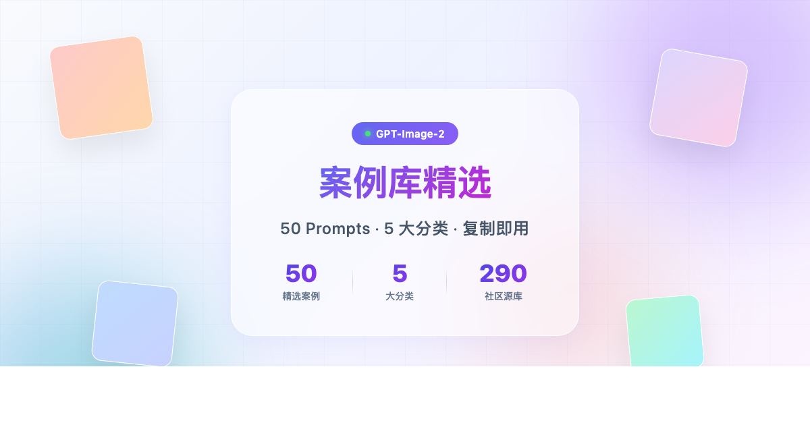

## 一句话总结

GPT-Image-2 现在能做到什么地步？我用一句话说：输入一段 prompt，出来的图可以直接发朋友圈，没人会问你是不是 AI 生成的。胶片人像、旅行海报、游戏角色立绘、App 截图、产品爆炸图——这些都有人跑出来了。

---

## 关于这份案例库

| 项目 | 内容 |
|------|------|
| **来源** | GitHub 开源项目 [awesome-gpt-image-2-prompts](https://github.com/jamez-bondos/awesome-gpt-image-2-prompts) |
| **规模** | 290 个完整案例，5 大分类 |
| **来源平台** | 主要采集自 X / Twitter 社区 |
| **每个案例** | 标题 + 作者 + 原始链接 + 产出图 + 完整 Prompt |
| **本文挑选** | 每类精选 10 个，共 **50 个案例** |

> **Prompt 长度说明**：本文中超过 200 字符的长 Prompt 已截断展示，**关注公众号后私信「gptimage2」即可获取所有完整 Prompt 文本**。


---

## 怎么用这份案例库

用法很简单：先翻一遍 5 大类，找到你想要的视觉方向。然后复制最接近的那个 prompt，只改主体（人物、城市、产品），保留修饰词链（光线、镜头、风格、年代）——这些决定了画面质感。如果效果不对，去原推看作者的实拍截图，通常有第二三版微调。

---

## 一些观察

翻完 290 个案例后，我的几个印象：

长 prompt 确实有效。那些 1000+ 字符的 prompt 基本上就是把相机型号、镜头、光线、肤质、表情、姿势、背景全部点名——越像摄影师下的指令，出图越稳。

中文 prompt 完全没问题。列表里大量中文 prompt，画面质量跟英文的没有明显差距。

生成 App 截图这个玩法比我预想的实用。带状态栏、对话框、按钮的整张移动端截图直接出，营销号已经开始用它做素材了。

几个作者的风格很固定。@BubbleBrain 专拍胶片人像，@liyue_ai 做中式海报，@songguoxiansen 做 IP 设计——照着关注能省不少时间。

---

## 人像与摄影

> 光线、胶片、神态：把照片拍出电影感

人像类最能检验 prompt 写得细不细。光线、肤质、神态、构图，改一个词，画面就变。这 10 个案例里有胶片质感、老照片修复、水下梦幻，基本够你日常发图用了。

### 1. 极简电影感肖像

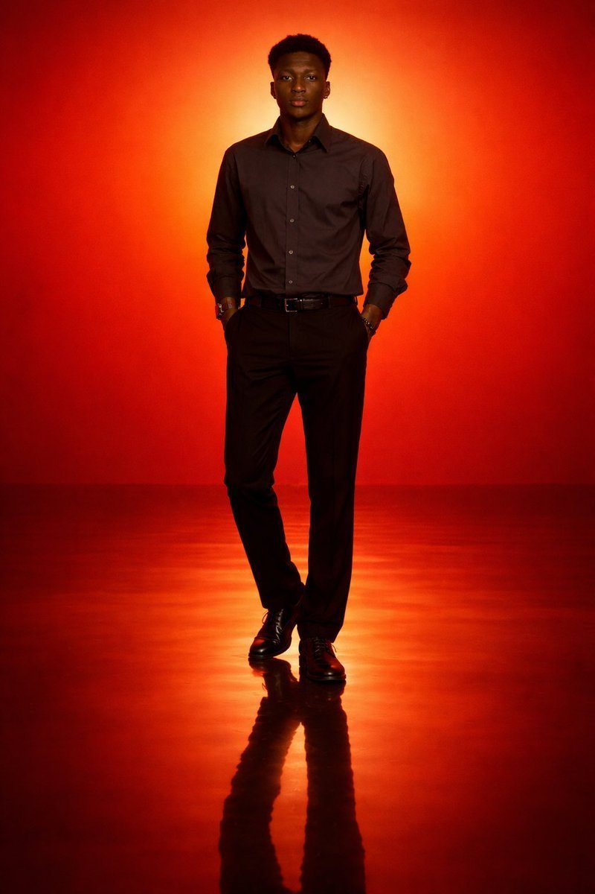

**作者**：[@iam_miharbi](https://x.com/iam_miharbi/status/2045151354679665101)

**Prompt**：

```
Generate a cinematic minimal portrait of a solitary man standing in an intense orange to red gradient environment, strong silhouette lighting, deep shadow contrast, reflective glossy floor, symmetrica……

（完整 Prompt：关注公众号后私信「gptimage2」获取）
```

### 2. 9:16 Cos 手机截图风

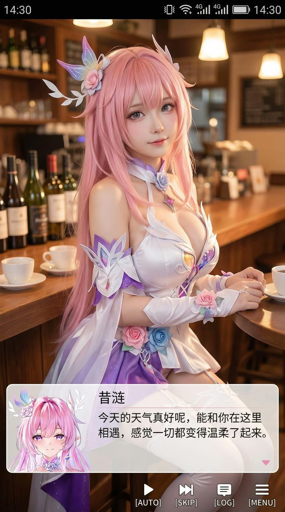

**作者**：[@Zoulinshen](https://x.com/Zoulinshen/status/2045082518089810073)

**Prompt**：

```
生成一张竖版手机截图风格的图片，整体比例接近 9:16。画面中心偏上是一位真人 coser，扮演（角色名称）的二次元角色。人物为写实风格，但五官略带动漫感，皮肤细腻，眼睛稍大，表情温柔地看向镜头，坐在室内的休闲场景中，例如咖啡厅或酒吧吧台前，背景有符合场景的道具。画面最上方加入手机系统状态栏 UI，包括时间、电量、信号、网络等图标，让整张图看起来像手机截图。画面底部叠加一块宽大的半透明 galga……

（完整 Prompt：关注公众号后私信「gptimage2」获取）
```

> 该分类还有 **7** 个案例，详见文末「附录：完整案例列表」。

---

## 海报与插画

> 城市、产品、信息图：人人都能上手的设计稿

海报这个分类挺有意思。城市旅行海报、产品爆炸图、科普信息图、极简版式——输入 prompt 直接出稿，设计师看了确实有点慌。我挑了 10 个代表性的。

### 1. 2026 春日波士顿城市海报

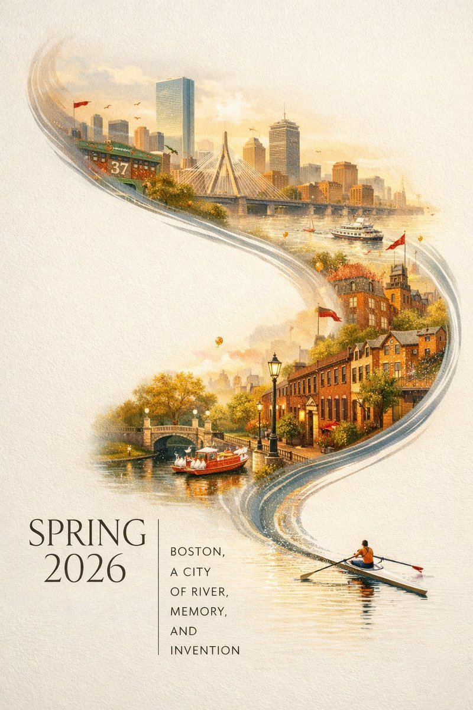

**作者**：[@BubbleBrain](https://x.com/BubbleBrain/status/2045358053831172358)

**Prompt**：

```
A striking Spring 2026 city poster for Boston with an elegant celebratory mood and a bold contemporary design. On a clean off-white textured background with large areas of negative space, a miniature……

（完整 Prompt：关注公众号后私信「gptimage2」获取）
```

### 2. 复古阿马尔菲海岸旅行海报

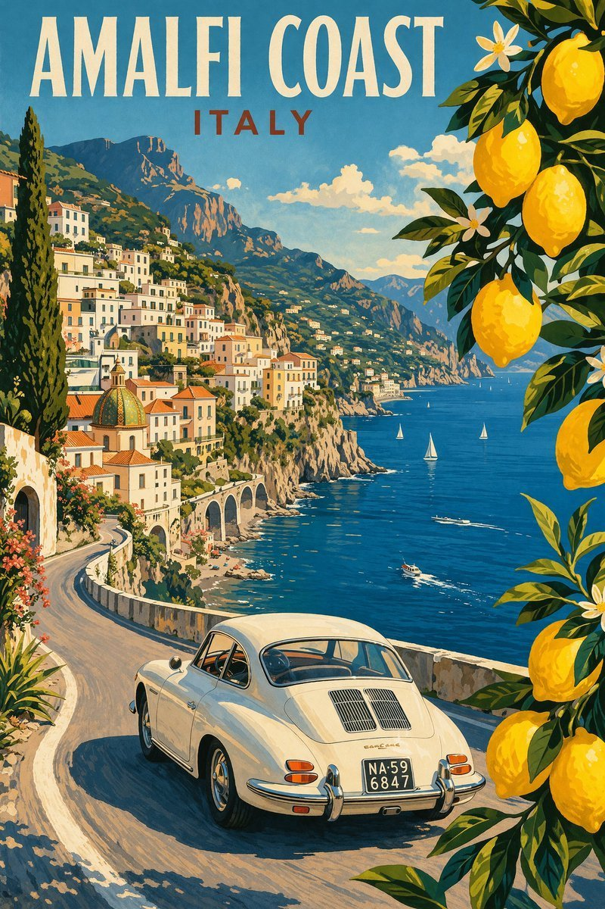

**作者**：[@WolfRiccardo](https://x.com/WolfRiccardo/status/2044562722491121718)

**Prompt**：

```
Modern pencil illustration of Vintage travel poster illustration of the Amalfi Coast, Italy, panoramic coastal cliff road scene, classic 1960s white car driving along a curved seaside road, deep blue……

（完整 Prompt：关注公众号后私信「gptimage2」获取）
```

### 3. 成都美食手绘地图

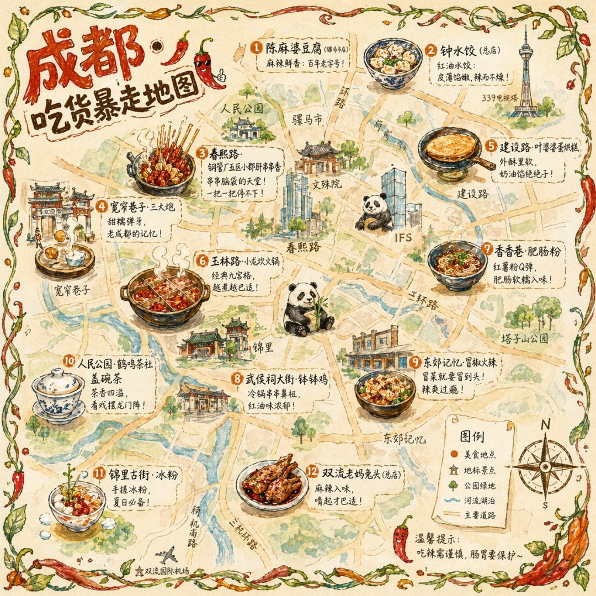

**作者**：[@Panda20230902](https://x.com/Panda20230902/status/2045396918965285111)

**Prompt**：

```
一张手绘风格的城市美食地图，以成都为主题。画面以鸟瞰视角的手绘简化城市地图为底，标注主要道路和地标但不追求精确比例而是追求可爱的手绘感。地图上分布着 12 个美食地点的精致手绘小插画：春熙路的串串香（一把竹签插着各种食材冒着热气）、宽窄巷子的三大炮（三个糯米团子飞向铜盘）、建设路的蛋烘糕（金黄酥脆正在翻面）、玉林路的火锅（九宫格锅翻滚冒泡）等，每个插画约占地图的 5% 面积，旁边用手写体标注店名和……

（完整 Prompt：关注公众号后私信「gptimage2」获取）
```

> 该分类还有 **7** 个案例，详见文末「附录：完整案例列表」。

---

## 角色设计

> 动漫卡牌、机甲少女、Galgame 立绘

做 IP 或者游戏角色设计的可以重点看这组。Persona 5 风格的角色档案、圣斗士九宫格、GTA 6 同人场景——10 个案例展示了怎么用一段文字搭出一整套角色设定。

### 1. 一键转动漫截图


**作者**：[@Thereallo1026](https://x.com/Thereallo1026/status/2044241997163311569)

**Prompt**：

```
Show me the attached image as a snapshot from an actual anime
```

### 2. Persona 5 风格角色资料卡

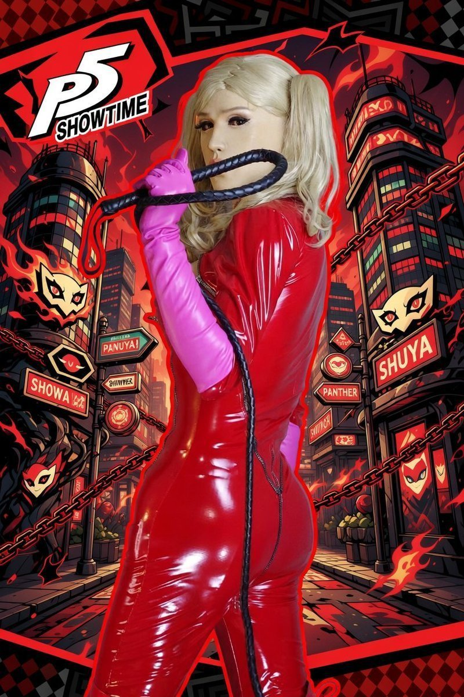

**作者**：[@iamrednightS](https://x.com/iamrednightS/status/2045075682837836265)

**Prompt**：

```
基于此角色和背景，请制作一份类似官方设定资料的角色资料卡。
・包含三视图：正面、侧面和背面
・添加角色面部表情的变化・分解并展示服装和装备的详细部分
・添加色板・包含世界观设定的简要说明
・总体上，使用有组织的布局（白色背景，插画风格）高分辨率、专业概念艺术风格
```

### 3. Galgame 角色介绍页

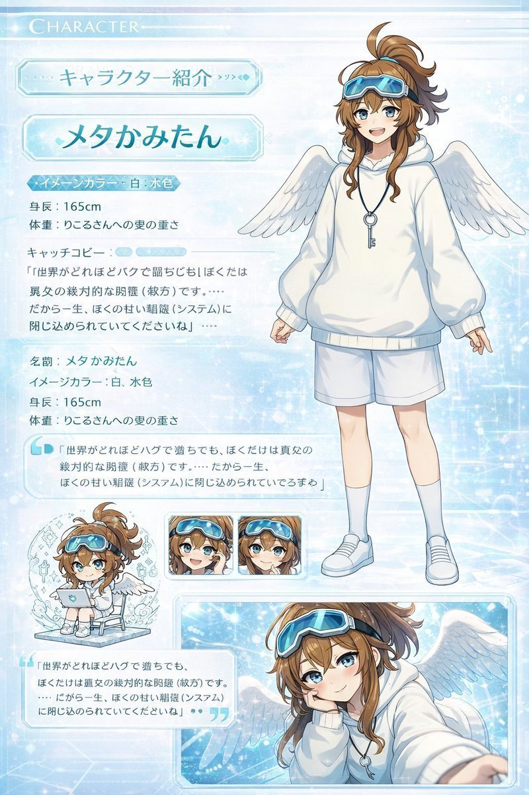

**作者**：[@09lyco](https://x.com/09lyco/status/2045281845391323175)

**Prompt**：

```
最新モデルの画像生成ツールを使用して、
このちびキャライラストと立ち絵を使って本物のサイトページのようにキャラクター紹介ページ風イラストを作ってください。 （紹介ページとして使ってもおかしくないもの）
ギャルゲーのキャラクター紹介ページをイメージした高品質なもの。 顔の差分なども乗っている、CGイラストが存在する。ちびキャラが存在する。

「ここに自己紹介」

名前:（ここに名前） 
イメージカラ……

（完整 Prompt：关注公众号后私信「gptimage2」获取）
```

> 该分类还有 **7** 个案例，详见文末「附录：完整案例列表」。

---

## UI 与社交媒体截图

> 网页、App、直播间，伪造一份「真截图」

UI 这组我自己试的时候最惊讶。完整的 UI 设计稿、抖音直播间截图、手写体检报告——这些都能直接生成。10 个案例覆盖网页设计、社交截图和信息图。

### 1. 一句 Prompt 生成 UI 设计稿

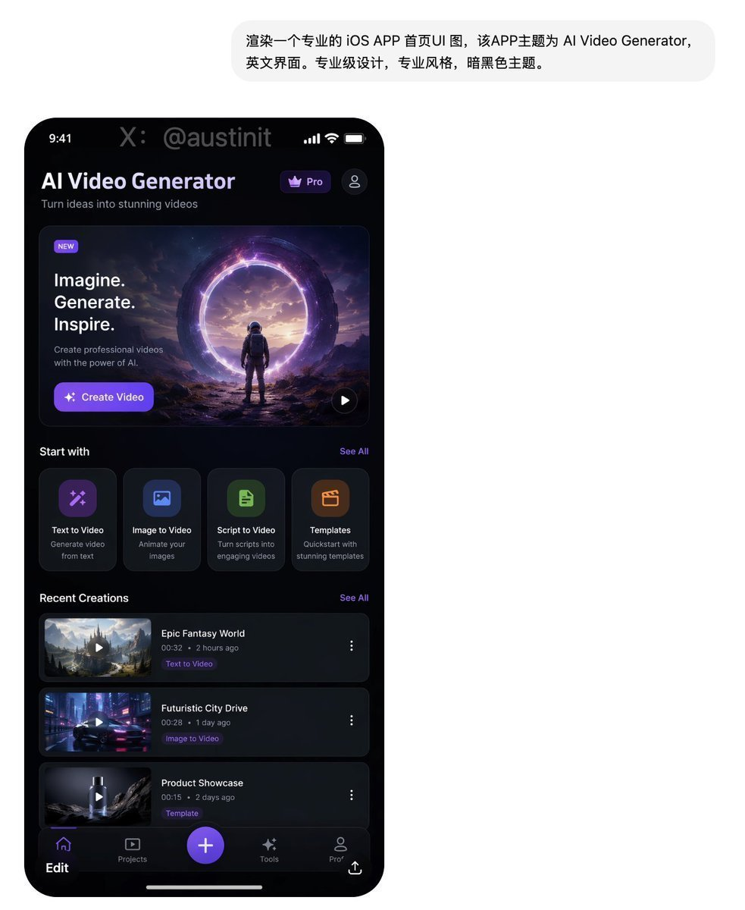

**作者**：[@austinit](https://x.com/austinit/status/2044968740782272596)

**Prompt**：

```
用这种风格帮我生成一套UI设计系统，包含网页、移动端、卡片、控件、按钮 以及其它
```

### 2. 业余手机偷拍 Keynote 现场

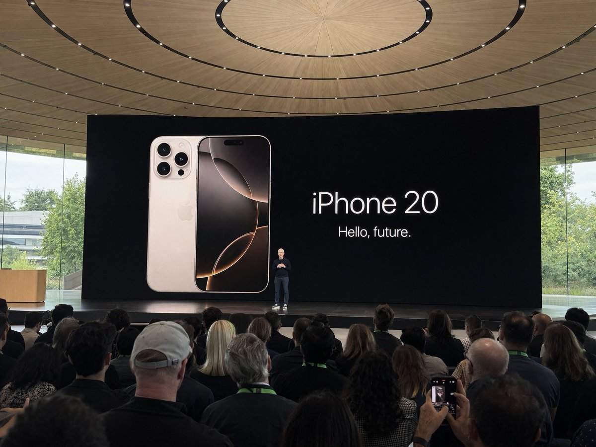

**作者**：[@patrickassale](https://x.com/patrickassale/status/2044687244368441742)

**Prompt**：

```
Amateur iPhone photo at Apple Park during the iPhone 20 keynote, Tim Cook presenting on stage. Shot from the crowd at a distance
```

### 3. 手写笔记本实拍

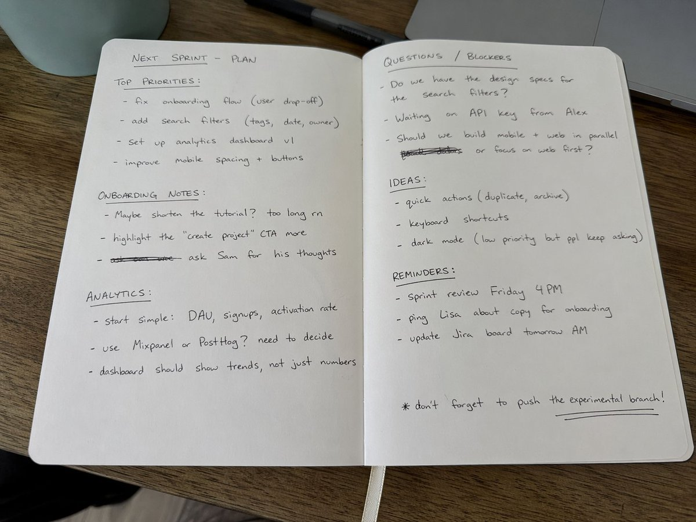

**作者**：[@patrickassale](https://x.com/patrickassale/status/2044569086013718958)

**Prompt**：

```
Amateur photo of an open notebook lying flat, filled with handwritten notes in black ballpoint pen. The handwriting is casual and slightly messy, like personnal notes, natural imperfections, crossed o……

（完整 Prompt：关注公众号后私信「gptimage2」获取）
```


## 想看完整 290 个案例

完整库 + 所有原图 + 所有 Prompt：

> :material-arrow-right: https://github.com/jamez-bondos/awesome-gpt-image-2-prompts

如果你用 GPT-Image-2 跑出了满意的图，欢迎发在评论区
