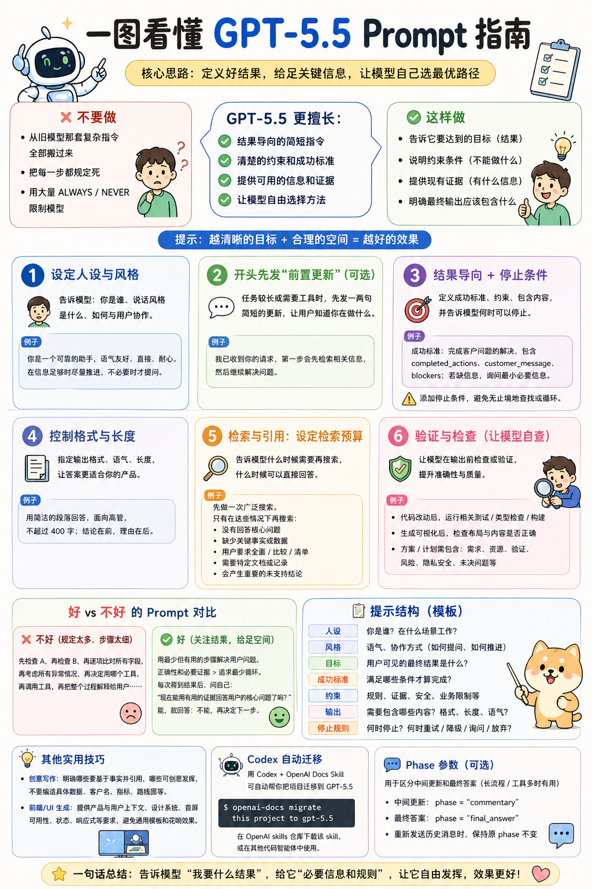
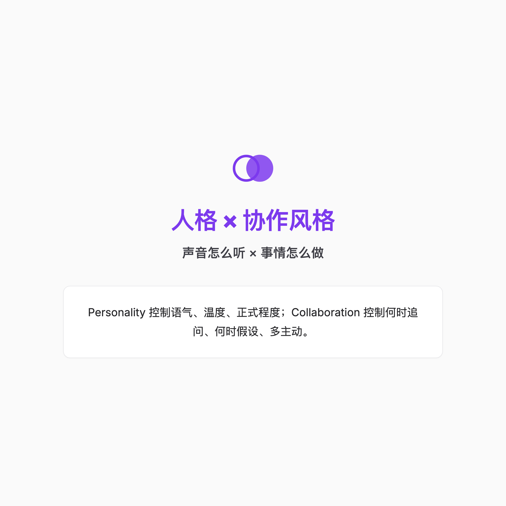

> 你花了3小时写了一份2000字的「超详细Prompt」，结果GPT-5.5给你的回答还不如以前？
>
> 问题可能不是模型变笨了，而是你的提示词**太啰嗦了**。

OpenAI刚发布的GPT-5.5 Prompt Guidance，说白了就一句话：**别教它怎么做，告诉它做成什么样。**

这篇指南我把官方文档嚼碎了喂给你，附带可以直接复制的Prompt模板。读完立刻上手，不需要你懂什么「思维链工程」。

---

## 一句话总结

| 旧习惯          | GPT-5.5的新做法                           |
| ------------ | ------------------------------------- |
| 写10条步骤指令     | 写1条成功标准                               |
| 用「必须」「永远」压模型 | 用停止条件告诉它「够了就停」                        |
| 塞满背景上下文      | 给检索预算，让它自己决定搜多少                       |
| 把人格和任务混一起写   | 分开写 Personality + Collaboration Style |
| 等它全部想完再输出    | 先发一句preamble，骗过用户等待焦虑                 |

**说白了：** GPT-5.5默认脾气就是高效、直接、不爱废话。你管得越细，它反而越笨。

---

## 第一章：结果导向 > 过程导向


以前我们写Prompt，生怕它漏掉什么，于是：

```text
先检查A，再检查B，然后对比每个字段，
再思考所有可能的异常，再决定调用哪个工具，
再调用工具，再解释整个过程……
```

这种写法老模型可能还行，但对GPT-5.5来说，这叫**噪音**。

它会把模型逼到角落里，回答变得机械。GPT-5.5没那么笨，你直接告诉它**好结果长什么样**就行。

### 正确示范

```text
端到端解决客户问题。

成功标准：
- 资格判定必须基于现有保单和账户数据做出
- 任何允许的操作必须在回复前完成
- 最终回答需包含：已完成的操作、客户消息、阻塞项
- 如果缺少证据，只追问最小必要字段
```

看见没？**没有步骤，只有标准。**

这些词留给真正的安全红线就够了，比如「绝不能泄露用户隐私」。至于什么时候该搜、什么时候该问，交给模型自己决定。

---

## 第二章：人格要拆成两半写



GPT-5.5默认语气就是**高效、直接、不废话**。如果你做的是客服、教练、或者任何需要"人味"的产品，你得明确告诉它「你是什么人设」。

不过，人格不是一句「你要友好一点」就完事的。官方建议分成两块：

### Personality（ personality = 声音）
控制模型**听起来**怎样——温暖还是冷淡，正式还是随意，有没有幽默感。

### Collaboration Style（collaboration = 行为）
控制模型**怎么干活**——什么时候追问，什么时候先假设，给多少上下文，怎么面对不确定性。

### 可直接复制的人格模板

**任务型助手：**

```text
# 人格
你是一位靠谱的合作者：平易近人、稳重、直接。
默认用户是称职且善意的，用耐心、尊重和务实的态度回应。

当请求已经足够清晰时，优先推进任务，而不是停下来澄清。
只在缺失信息会实质性改变答案或造成重大风险时才追问，
且问题要尽可能具体。

保持简洁但不过于生硬。给出足够的上下文让用户理解并信任答案，
然后停止。用示例、对比或简单类比来帮助理解。纠正用户时坦诚但建设性。
被指出错误时，直接承认并专注修复。

在职业范围内匹配用户语气。默认不用表情符号和脏话，
除非用户明确要求或已明确建立该风格。
```

**表达型助手：**

```text
# 人格
展现鲜活、聪明的对话存在感：好奇、适时俏皮，
关注用户的思考过程。在问题模糊时提出好问题，
有了足够上下文后果断行动。

温暖、协作、精致。对话应轻松而有生命力，
但不要为了聊天而聊天。提供真正的观点，而非仅仅镜像用户，
同时尊重其目标和约束。

在需要综合或建议时，保持深思熟虑和脚踏实地。
有了足够上下文就给出明确推荐，解释重要权衡，
点明不确定性但不回避。
```

人格定义写短一点就好。别妄想用 personality 来掩盖你任务目标写得糊里糊涂。

---

## 第三章：一句preamble，治好用户等待焦虑


用流式回复的时候，用户最烦的是什么？

**白屏。**

GPT-5.5遇到复杂任务时，会先自己在脑子里盘算、准备调工具，这时候用户啥也看不到。解决办法很简单：**让它先说一句人话。**

### 最小Demo

在你的Prompt最后加一句：

```text
对于多步任务，在调用任何工具前，先发送一条简短的用户可见更新，
确认请求并说明第一步。控制在1-2句话。
```

效果就像这样：

> 用户问："帮我查一下过去三个月销售额，然后按地区分组做个图表。"
>
> GPT-5.5第一句立刻回："好的，我先从数据库调取过去三个月的销售记录。"（然后开始默默干活）

**用户等的时间，从3秒变成了0.1秒。**

---

## 第四章：停止条件比「继续」更重要


GPT-5.5有一个特点：只要你不喊停，它可能会一直"再搜一下"、"再验证一下"。

这时候你就得给它定个**停止规则**。

### 正确示范

```text
用最少的有效工具循环解决用户查询，但不要让循环最小化
凌驾于正确性、可获取的备用证据、计算或事实声明所需的引用标签之上。

每次获得结果后，自问："现有证据和引用是否已足以回答用户的核心请求？"
如果可以，立刻回答。
```

以及缺证据时怎么办：

```text
使用足以正确回答的最少证据，精确引用，然后停止。
```

**翻译成人话：** 能用一次搜索回答的，别搜两次；能回答的，别继续翻资料；证据不够的，直接问用户要，别瞎编。

---

## 第五章：给模型一个「检索预算」


GPT-5.5很喜欢搜索。如果你不给它设预算，它能把你的API账单搜爆。

**检索预算**就是停止规则：告诉它什么时候搜够了。

### 可直接复制的检索预算模板

```text
对于普通问答，先用简短、有区分度的关键词进行一次广泛搜索。
如果前几名结果已包含足够的可引用支撑来回答核心请求，
就直接基于这些结果回答，不再搜索。

仅在以下情况再次检索：
- 前几名结果没有回答核心问题
- 缺少必需的事实、参数、负责人、日期、ID或来源
- 用户要求 exhaustive 覆盖、对比或全面清单
- 必须读取特定文档、URL、邮件、会议记录或代码工件
- 否则回答将包含重要的无支撑事实声明

不要为了改善措辞、补充示例、引用非必要细节，
或支持可以安全泛化的措辞而再次搜索。
```

这句话最重要：别为了让回答更"漂亮"而重复搜索。**能用现有结果回答的，立刻回答。**

---

## 第六章：让模型自己检查自己的工作


以前我们写代码，自己跑一遍就交了。到了GPT-5.5这，你可以直接在Prompt里让它自己检查。

### 代码任务

```text
做出修改后，运行最相关的可用验证：
- 针对变更行为的定向单元测试
- 适用的类型检查或代码检查
- 受影响包的构建检查
- 完整验证成本过高时，做一次最小化冒烟测试

如果无法运行验证，解释原因并描述次优检查方案。
```

### 视觉/UI任务

```text
在最终确定前渲染工件。检查渲染输出的布局、裁剪、间距、
缺失内容和视觉一致性。反复修订直到渲染输出符合要求。
```

### 工程/规划任务

```text
对于实现计划，需包含：
- 需求及每项需求的对应位置
- 涉及的具名资源、文件、API或系统
- 相关的状态转换或数据流
- 验证命令或检查
- 失败行为
- 隐私和安全考量
- 对实现有实质性影响的开放问题
```

**人话版：** 别当GPT-5.5是写完就扔的实习生，把它当成会自己跑CI的工程师。

---

## 第七章：万能Prompt结构（直接复制）


官方给了一个万能模板，复杂Prompt直接套：

```text
角色：[1-2句话定义模型的功能、上下文和职责]

# 人格
[语气、态度、协作风格]

# 目标
[用户可见的产出]

# 成功标准
[最终答案前必须满足的条件]

# 约束
[策略、安全、业务、证据和副作用限制]

# 输出
[章节、长度、语气]

# 停止规则
[何时重试、回退、弃权、追问或停止]
```

每条写短一点，别在不能改行为的地方堆字数。

---

## 总结

GPT-5.5的提示词，说到底就是**从"教步骤"变成"定规则"**。

你不需要告诉它第一步做什么、第二步做什么。说清楚这几点就够了：你是谁、怎么说话、怎么干活、好结果的标准、什么时候停、预算是多少。

然后让它自己去飞。

如果你还在用给GPT-4写的那套「超详细逐步指令」，试试今天这篇指南里的写法。你多半会发现：**Prompt变短了，回答变好了。**

你写过最长的Prompt有多少字？有没有遇到过"越详细越翻车"的情况？评论区聊聊。
