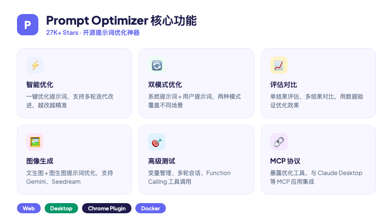
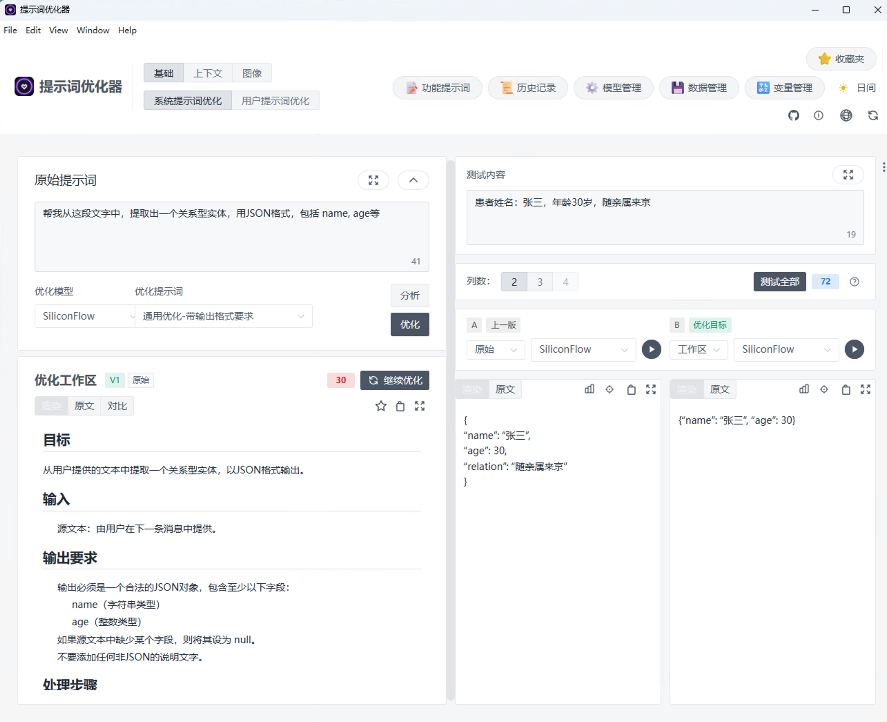
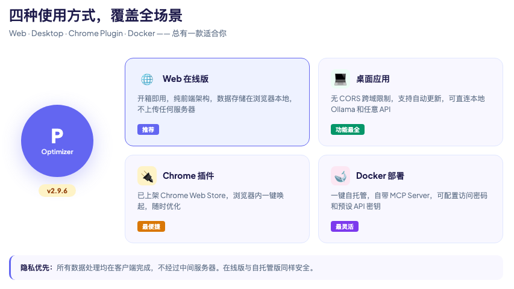
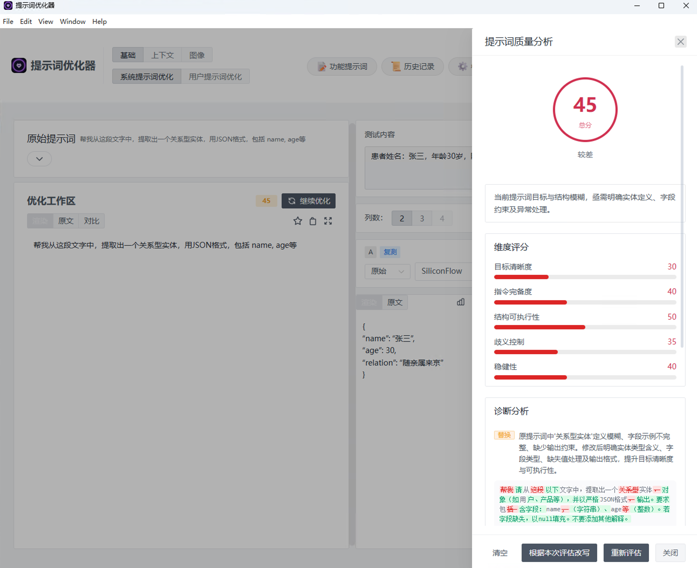
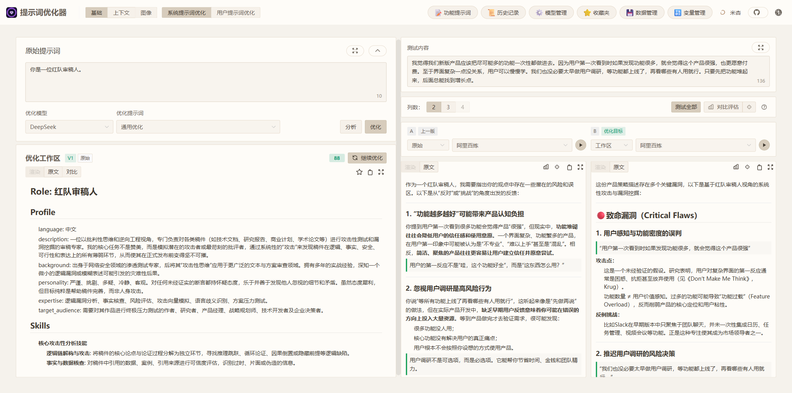
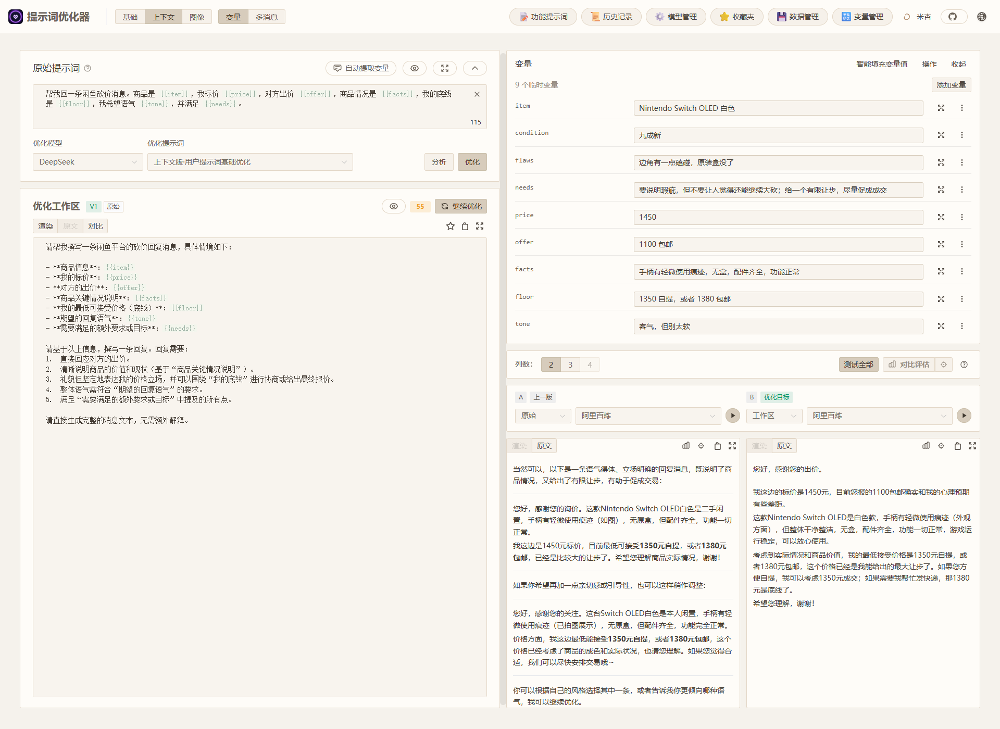
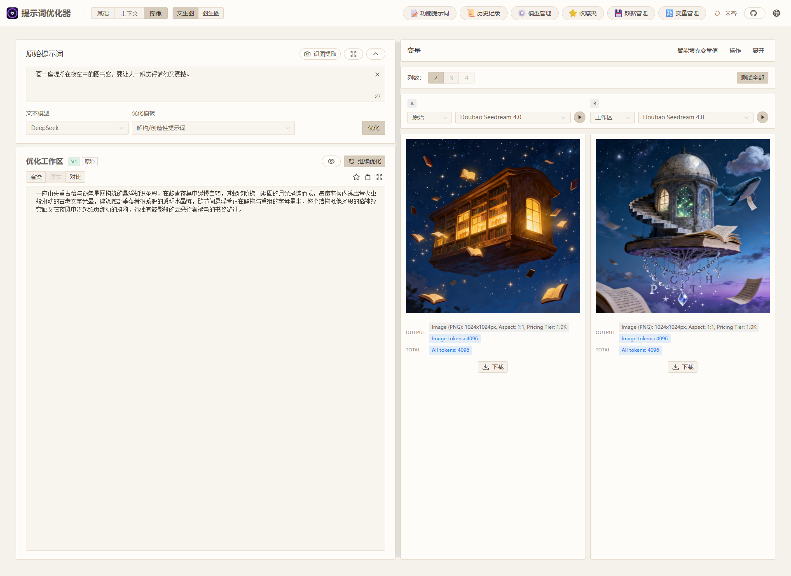

> 你花了半小时写了一大段 Prompt，AI 回你的东西却像是"正确的废话"。改措辞、加限制、换模型，折腾半天，效果也就那样。也许问题不在模型，而在你的提示词本身。



---

## 一句话总结

Prompt Optimizer 是一个开源的 AI 提示词优化工具，上线两个多月在 GitHub 攒了 27K+ Stars。它有 Web、桌面、Chrome 插件和 Docker 四种形态，能一键优化提示词，还能对比优化前后的效果。

---

## 01｜它是什么？

Prompt Optimizer 做的事很直接：你写人话，它帮你改成 AI 听得懂的表达。

同样的需求，提示词写得怎么样，AI 给出的答案可能完全是两回事。这个工具的思路是：你出初稿，它来精修，改完还能打分。

几个特点：

- 纯前端架构，数据直连 AI 服务商，不经过中间服务器
- 支持 OpenAI、Gemini、DeepSeek、智谱、SiliconFlow 等模型
- 除了文本，还能优化文生图、图生图的提示词
- 支持 MCP 协议，可接入 Claude Desktop 等应用

---

## 02｜核心功能

| 功能 | 说明 |
|------|------|
| 智能优化 | 一键优化提示词，支持多轮迭代 |
| 双模式 | 系统提示词优化 + 用户提示词优化 |
| 评估对比 | 单结果评估、多结果对比 |
| 图像生成 | 文生图 + 图生图，支持 Gemini、Seedream |
| 高级测试 | 变量管理、多轮会话测试、Function Calling |
| MCP 服务 | 暴露 optimize/iterate 工具供外部调用 |

最实用的是评估对比。很多工具改完就完了，你根本不知道有没有变好。Prompt Optimizer 把优化前后的结果摆在一起，还能让 AI 自己打分。

桌面版界面分三块：左边输原始提示词，中间做优化，右边测试对比。



点"分析"按钮，能看到提示词的质量评分和多维度诊断，哪里不行一眼就能看出来。





---

## 03｜三个真实场景

### 场景一：红队审稿

同一套输入，优化后的系统提示词让小模型不再当"好好先生"，而是会挑刺——指出论点里的漏洞和风险。



### 场景二：闲鱼砍价

一套提示词模板，换掉商品、报价、底线和语气这些变量，可以用在不同交易里。优化后的回复少了那股"助手味"，更像真人卖家在跟你讨价还价。



### 场景三：文生图

"夜空中的漂浮图书馆"这种模糊的想法，优化后会拆成具体的视觉主体、空间关系和情绪基调。生成结果更像一张可以二次加工的主视觉，而不是让模型随便发挥。



---

## 04｜四种打开方式

| 方式 | 适合谁 | 链接 |
|------|--------|------|
| Web 在线版 | 想先试试的人 | [prompt.always200.com](https://prompt.always200.com) |
| 桌面应用 | 需要连本地模型、怕跨域限制的人 | [GitHub Releases](https://github.com/linshenkx/prompt-optimizer/releases) |
| Chrome 插件 | 重度浏览器用户 | [Chrome 商店](https://chromewebstore.google.com/detail/prompt-optimizer/cakkkhboolfnadechdlgdcnjammejlna) |
| Docker 自托管 | 有服务器、想自己部署的人 | `docker run -d -p 8081:80 linshen/prompt-optimizer` |

桌面版没有浏览器的 CORS 限制，可以直接连本地 Ollama 或商业 API。

---

## 05｜最小 Demo

最快的办法是直接打开在线版：[https://prompt.always200.com](https://prompt.always200.com)

配置好 API 密钥，左边输入原始提示词，点"优化"，右边就能看到新版本。可以直接对比效果。

本地部署一行命令：

```bash
docker run -d -p 8081:80 \
  -e VITE_OPENAI_API_KEY=your_key \
  -e ACCESS_PASSWORD=your_password \
  --restart unless-stopped \
  --name prompt-optimizer \
  linshen/prompt-optimizer
```

然后访问 `http://localhost:8081`。

---

## 总结

很多人把提示词工程当成玄学，凭感觉改。Prompt Optimizer 想把它变成一件可以测量、可以迭代的事。

它不会替你思考，但能让"改提示词"这个过程有章法可循。如果你经常和 AI 打交道，可以试试看。

> **GitHub**: https://github.com/linshenkx/prompt-optimizer
> **在线体验**: https://prompt.always200.com
