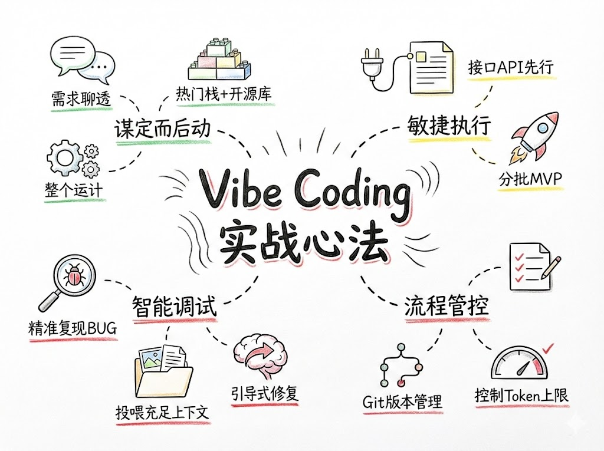

# 关于 Vibe Coding 的 10 条实战复盘



本文总结了在 Vibe Coding（AI 辅助编程）方面的实战经验，为开发者提供实用的参考指南。通过这些实践要点，可以更高效地与 AI 协作完成开发任务。

---

## 1. 需求聊透再动手

**避免返工的关键**。每个页面、功能、设计风格都要和 AI 充分讨论，让 AI 补全细节。

在开始编码前，确保需求已经完全明确：
- 与 AI 详细讨论功能细节
- 明确UI/UX设计要求
- 确认技术实现方案
- 避免模糊不清的需求导致后续返工

---

## 2. 锁定热门技术栈

**推荐技术栈**：Next.js + Supabase + TailwindCSS 等。

**原因**：热门技术栈在 AI 模型中训练数据最足，回答的准确度和代码质量是最高的。

**优势**：
- AI 对这些技术栈的理解更深入
- 代码生成质量更高
- 遇到问题时更容易获得准确解答
- 社区资源丰富，问题解决方案成熟

---

## 3. 接口先行

**每一个接口都要写独立的 API 文档**，接入代码前先用 AI 生成 cURL 测试，排除第三方不可控因素。

**最佳实践**：
- 先定义清晰的 API 接口文档
- 使用 AI 生成测试用例
- 通过 cURL 命令验证接口可用性
- 确保接口稳定后再进行前端开发
- 避免因第三方服务问题影响开发进度

---

## 4. 分批执行 MVP

**任务拆解**，先完成最小可行性版本。建议先 Mock 数据搞定前端，再逐个接入 API。

**执行策略**：
- 将大项目拆分为小的功能模块
- 先用 Mock 数据验证前端逻辑
- 逐个接入真实 API 接口
- 每个模块完成后进行测试验证
- 逐步完善功能，避免一次性开发过多内容

---

## 5. 善用开源库

**动手前先问 AI 有没有合适的轮子**，和 AI 讨论并确认开源库方案后，再在此基础上修改，大幅减少代码生成量和调试成本。

**操作步骤**：
1. 向 AI 询问相关开源库推荐
2. 评估开源库的成熟度和社区活跃度
3. 查看 GitHub 上的 Star 数和最近更新时间
4. 在开源库基础上进行定制化修改
5. 避免重复造轮子，提高开发效率

---

## 6. 版本管理意识

**完成一个独立功能就 Git Commit**，方便随时回滚，大胆实验。

**重要性**：
- 保持代码的版本历史清晰
- 出现问题时可以快速回滚
- 支持大胆的实验和探索
- 便于团队协作和代码审查

**建议**：
- 每个有意义的改动都及时提交
- 提交信息要清晰描述改动内容
- 重要节点创建标签（Tag）
- 定期推送远程备份

---

## 7. 精准复现 Bug

**报错信息给全**（页面、控制台、Network），清晰描述"正确逻辑 vs 错误现象"，无法解决时及时回滚换思路。

**Bug 报告要素**：
- **完整截图**：页面显示效果
- **控制台日志**：JavaScript 错误信息
- **Network 面板**：API 请求响应详情
- **期望行为**：正确的逻辑应该是什么样的
- **实际现象**：具体出现了什么问题

**解决策略**：
- 根据完整信息分析问题根因
- 尝试多种解决方案
- 无法解决时及时回滚到上一个稳定版本
- 换一种思路重新实现

---

## 8. 投喂充足上下文

**不要只发文字**，多发截图（UI参考）、文档（API字典）、示例代码。

**有效沟通要素**：
- **UI 截图**：展示期望的界面效果
- **API 文档**：完整的接口说明和数据结构
- **示例代码**：已有的代码片段或参考实现
- **项目结构**：当前代码的组织方式
- **相关链接**：参考文档或示例项目

**目的**：让 AI 充分理解上下文，提供更精准的解决方案。

---

## 9. 引导式修复

**让 AI 像人一样梳理逻辑**，在关键步骤输出日志排查。

**调试技巧**：
- 要求 AI 在关键位置添加日志输出
- 让 AI 分析代码执行流程
- 通过日志定位问题所在
- 逐步验证每个逻辑分支
- 确保修复方案的系统性和完整性

**示例引导语**：
```
"请在用户登录函数中添加详细的日志输出，帮助我们定位登录失败的具体原因。"
```

---

## 10. 控制 Token 上限

**每个独立任务新开一个标签页**，保持上下文纯净。

**上下文管理策略**：
- 不同功能模块使用独立的对话窗口
- 避免单一对话中累积过多无关信息
- 保持每个任务的上下文简洁明了
- 提高 AI 回答的准确性和相关性
- 避免历史对话干扰当前任务

**最佳实践**：
- 复杂项目按模块划分多个任务
- 每个任务开始时提供必要的背景信息
- 任务完成后开启新对话处理下一个功能

---

## 总结

Vibe Coding 不仅仅是使用 AI 写代码，更是一套完整的开发方法论。通过以上 10 条实践要点，可以：

- **提高开发效率**：避免返工，减少调试时间
- **保证代码质量**：采用成熟技术栈，善用开源方案
- **降低学习成本**：快速上手新技术和新工具
- **增强问题解决能力**：精准定位问题，快速找到解决方案

掌握这些实践要点，能让你在 AI 辅助编程的道路上走得更稳、更远。

---

**转载自**：https://m.okjike.com/originalPosts/69400a19a04168a24fe84e40
