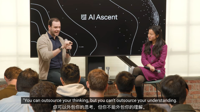
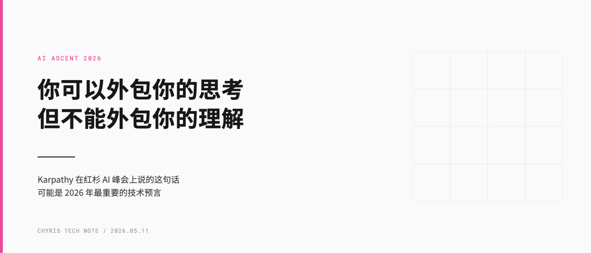
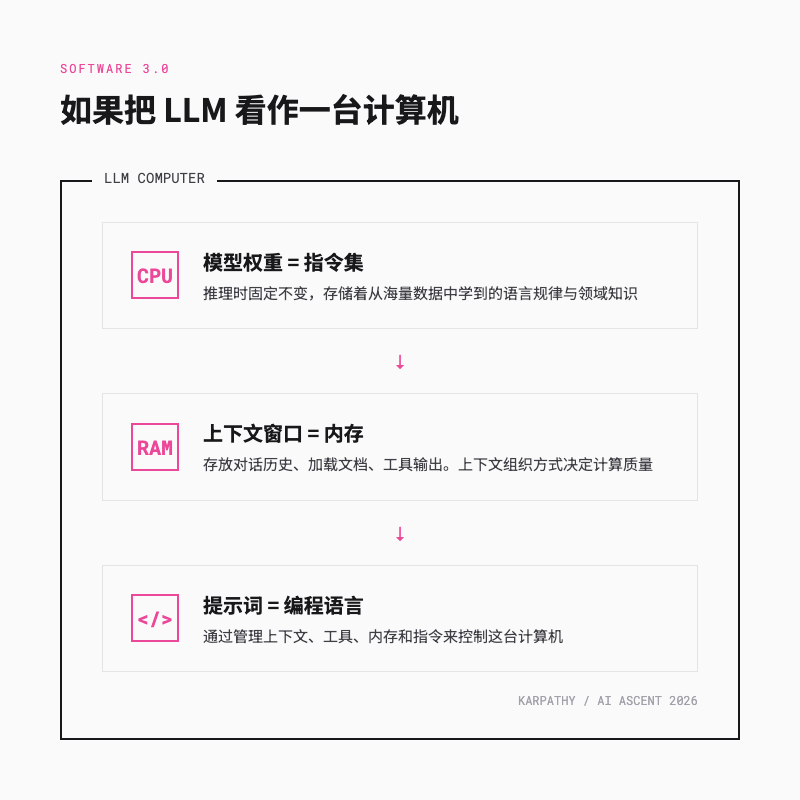
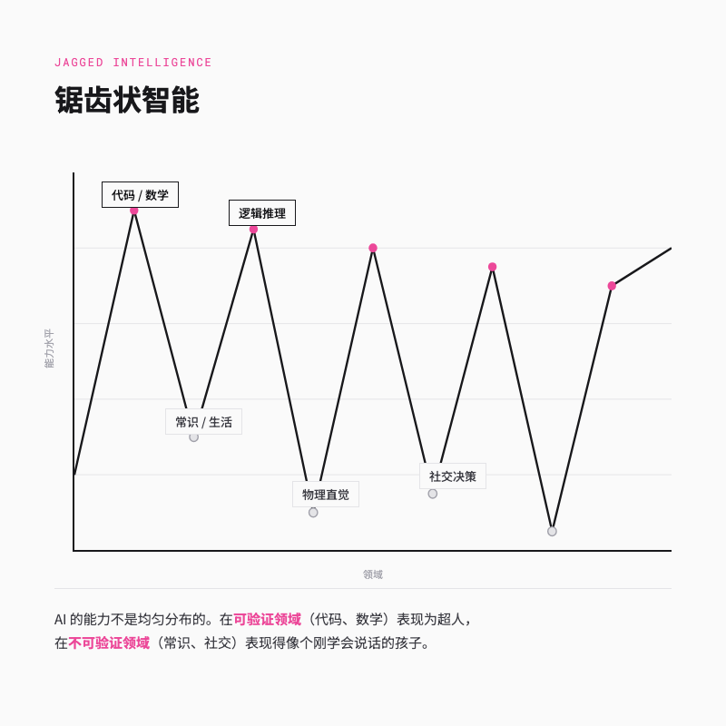
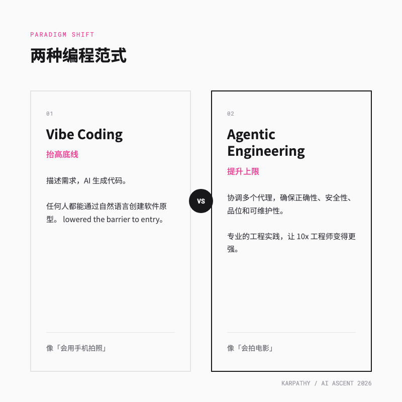

> 即使作为全球顶尖的程序员，我也从未像现在这样感到落后。Karpathy 原话

---

## 一句话总结

AI 正在外包我们的思考，但理解系统「为什么」这样设计的能力，反而成了这个时代最不可替代的竞争力。

---

## 第一部分，那个 12 月的夜晚

去年 12 月的一个晚上，Andrej Karpathy 坐在电脑前，做了一个实验。

他把一个复杂的子系统重构任务丢给了代理。不是那种「帮我改几行代码」的小任务，而是「重构这个模块，研究并集成这个新库，编写并修复测试套件」这种过去需要他亲自盯一整天的活。

过段时间他回去看，代码质量让他愣了一下。

**他想不起来上一次手动纠错是什么时候了。**

这就是 Karpathy 在 2026 年红杉 AI Ascent 大会上描述的「代理拐点」。一个写了十年代码、参与创办 OpenAI、亲手搭建过特斯拉自动驾驶系统的人，突然发现自己最拿手的技能，写代码，正在被重新定义。

听起来像是失业焦虑的前奏，对吧？但 Karpathy 的语气里没有恐慌，只有一种近乎兴奋的困惑。红杉的合伙人 Pat Grady 打了个比方，说现在的变化不是「更快的马」，而是「汽车的诞生」。Karpathy 深以为然，不是马跑得更慢了，而是交通工具本身的逻辑变了。

过去一年里，我们见证了 vibe coding 的爆火。描述需求，AI 生成代码，你看着结果点头或摇头。这很好玩，也很高效。但 Karpathy 说，2025 年 12 月发生了一个质变。之前的 AI 编程是「需要不断照看的半成品」，而现在的代理已经可以独立完成从 80% 到 100% 的最后那段路。

那段路，恰恰过去最累人的。

编译报错、依赖冲突、边界条件、测试失败……这些让程序员加班到深夜的脏活，现在代理可以自己读取错误信息、搜索文档、修改代码、重新运行，直到通过。

**编程的最小单位，从「写一行代码」变成了「管理一个宏观行动」。**

我自己最近就有类似的感受。不是不写代码了，是写的东西变了。

---

## 第二部分，Software 3.0 不是新版本号，是新物种

Karpathy 在峰会上正式提出了 Software 3.0 的概念。这是他早年 Software 2.0 的延续，但这次的变化比从手写代码到神经网络更大。

让我用一个类比来解释。如果你把大语言模型看作一台全新的计算机，它的架构大概是这样的

- **模型权重就是 CPU**。推理时它们是固定的，存储着模型从海量数据中学到的语言规律、逻辑模式和领域知识。你可以把它们理解为这台计算机的指令集。

- **上下文窗口就是内存**。这是 Software 3.0 最重要的杠杆。它存放着当前的对话历史、加载的文档、工具输出和工作状态。上下文的组织方式，直接决定了计算的质量。

而你怎么跟这台计算机沟通，就是 Software 3.0 里真正的技术活。

在 1.0 时代，你写显式指令。在 2.0 时代，你准备数据集。在 3.0 时代，你通过管理上下文、工具、内存和指令来控制这台计算机。

这个概念听起来有点抽象。Karpathy 举了个更狠的例子，叫 MenuGen。

最初，MenuGen 是一个传统的 Web 应用。你拍一张菜单照片，系统用 OCR 识别菜名，再调用 API 搜索菜品图片，最后用前端代码渲染出来。这一套下来，你需要写前端、搭后端、配数据库，一套完整的「脚手架」。

在 Software 3.0 的世界里，这整个应用「都不应该存在」。你直接把照片丢给一个多模态模型，说「帮我在菜单上标出每道菜的样子」，模型自己就搞定了。没有前端，没有后端，没有数据库。

**中间所有的软件层，消失了。**

神经网络直接从输入媒介跳到了输出媒介。不是 AI 写代码更快了，是很多代码本身变得没有必要了。

说实话，第一次听到这个例子的时候，我下意识检查了一下自己正在做的项目。有多少层代码，只是为了把一个信息从 A 格式转成 B 格式？有多少接口，其实只是一个「 if 手机端 else 桌面端」的分支？

如果模型可以直接理解意图并输出结果，这些中间层存在的意义是什么？

---

## 第三部分，AI 为什么能写 10 万行代码，却不会洗车

这里有一个特别反直觉的现象。

现在的 AI 可以重构一个 10 万行代码的代码库，优化算法、修复 Bug、提升性能。但你问它「我家离洗车店 50 米，我应该开车去还是走路去」，它可能会一本正经地建议你开车。

Karpathy 把这种现象叫做「锯齿状智能」。AI 的能力分布不是一条平滑上升的曲线，而是像锯齿一样，在某些领域是超人，在某些领域是智障。

他提出了一个「可验证性理论」来解释这件事

核心观点其实很简单。AI 在代码和数学上强，是因为这些领域有明确的「对」和「错」。编译器一秒就能告诉你答案，测试用例瞬间就能验证结果。这种即时反馈让实验室能够通过强化学习建立高效的奖励机制，模型在这些领域飞速进化。

但在洗车、做饭、人际交往这些领域，什么叫「对」？没有明确的反馈信号，模型就不知道该往哪个方向优化。所以它可能在某些常识问题上表现得像个刚学会说话的孩子。

Karpathy 用了两个词来形容这种区别，「动物」和「幽灵」。

动物，包括人类，是进化的产物。我们不需要被训练就知道火是烫的，因为小时候被烫过。我们不需要看书就知道高处危险，因为从树上掉下来过。这些知识不是从数据里学来的，是从身体里长出来的。

而 LLM 呢？它没被烫过。它只是读过很多关于「烫」的文本。它是从大数据中召唤出的统计幽灵，被数据分布和奖励函数塑造，而不是被物理规律锚定。没有内在动机，没有情绪，没有生命力。

**所以它在「不知道自己不知道什么」的时候，表现得特别自信。**

这个结论对从业者来说意味着什么？意味着在「可验证」的领域，比如代码、数学、结构化数据处理，你可以放心大胆地把任务交给代理。但在「不可验证」的领域，比如产品设计、用户体验、战略决策，人类的判断力仍然是不可替代的。

这也解释了为什么 Karpathy 强调「你可以外包你的思考，但不能外包你的理解」。代理可以替你执行大规模的重构和优化，这是思考过程。但你必须掌握系统的不变性和全局架构，这是理解过程。

如果一个工程师无法解释为什么代理选择了某种设计，那么他就不再是系统的设计者，而成了系统的隐患。

---

## 第四部分，工程师的新角色，从写手到导演

既然代理可以写代码了，那程序员还剩下什么价值？

这是我在听完 Karpathy 分享后反复问自己的问题。他的回答出乎意料地具体。

**未来的工程师不是不写代码了，是写的东西变了。**

以前你写的是 `if-else` 和 `for` 循环，现在你写的是规范文档、审查标准和架构决策。以前你的产出是代码行数，现在你的产出是「一组代理协同工作的正确性」。

Karpathy 区分了两个概念

- **Vibe Coding** 旨在「抬高底线」。它让几乎任何人都能通过自然语言描述来创建软件原型。这很好，它降低了创造力的门槛。
- **Agentic Engineering** 则是「提升上限」的专业学科。它是协调多个可能有误的代理，同时确保系统正确性、安全性、品位和可维护性的工程实践。

两者的区别，就像「会用手机拍照」和「会拍电影」的区别。每个人都可以拍一张照片，但导演需要理解镜头语言、叙事节奏和观众心理。

这里有一个特别值得警惕的陷阱。很多企业现在面临的问题是，开发者用 AI 产生了海量代码，但这些代码表面上看起来整洁、命名规范，实际上可能缺失边缘情况处理、异常路径或安全边界。Karpathy 把这种代码叫做 slop，垃圾代码。

当代码生成的成本趋向于零，人类的「品位」和「判断力」反而成了最稀缺的资源。顶尖工程师的价值不再体现在编写 100 行代码的速度上，而体现在指导 100 个代理并行工作的协调能力，以及识别代理产出中那些细微但致命的结构性错误的能力。

红杉资本的合伙人 Sonya Huang 在峰会上宣布 2026 年为「代理之年」。她说模型、工具和线束这三件套齐了。我听到这的时候其实有点恍惚，去年还在讨论 vibe coding，今年就直接 AGI 了？

但仔细想想，她说得没错。现在的代理能连续跑几个小时不出岔子，能操作复杂的工业软件，甚至还能记住你上周跟它说过什么。模型从「预测下一个字」进化到「长期规划与纠错」，工具从「简单的 API 调用」进化到「全功能的终端与浏览器访问」，线束从「简单的系统提示」进化到「复杂的 Agentic 状态机与内存管理」。

这个判断听起来激进，但仔细想想，代理确实已经能独立完成端到端的复杂任务了。这不是 hype，是功能层面的现实。

**AGI 已经以代理的形式抵达了。**

当然，这里说的是功能性 AGI。代理可以完成任务，但它不理解为什么这个任务重要。它可以执行，但它不拥有意图。

这就是为什么理解力不可外包。你可以让代理写 10 万行代码，但如果你不理解系统的架构，你就不知道那 10 万行代码里埋着什么雷。

---

## 第五部分，我的三个实践建议

听完 Karpathy 的分享，我整理了三条对自己最有启发的实践建议。

**第一条，也是最核心的一条，刻意保留「手动画图」的能力。**

不是真的拿笔画，而是强迫自己从第一性原理去理解系统的每一层。代理可以替你查 API 文档、找最佳实践、生成代码片段，但如果你不知道内存是怎么分配的、请求是怎么路由的、数据是怎么持久化的，你就无法判断代理给出的方案是否合理。

Karpathy 现在搞了个教育机构 Eureka Labs，核心理念挺有意思的，他说别让学生背语法了，教他们怎么当「代理导演」。但我个人觉得，完全不管基础也不行，你总得知道什么是 SQL 注入，才能在 AI 给你写了个「看起来完美」的登录系统时，发现它其实是个筛子。基础逻辑训练不是过时了，而是变成了「最后一道防线」的能力。

**第二条，把审查代理的输出当作核心工作。**

以前我们审查同事的代码，现在我们要审查代理的代码。但审查代理的代码和审查人类的代码是不同的。人类会犯错，但通常是有模式的、可预测的。代理的错可能更隐蔽，因为它生成的代码表面上一丝不苟，命名规范、格式整洁，但底层逻辑可能有结构性缺陷。

Karpathy 建议企业采用「对抗式面试」来评估工程师。给候选人一个大型项目，允许使用代理工具，然后部署另一个代理去攻击候选人构建的系统。重点考核的不是写代码的速度，而是分解任务的能力、编写规范的能力、审查的严谨度，以及在代理产生幻觉时进行干预的敏锐度。

**第三条，在「可验证」的领域大胆用，在「不可验证」的领域保持谨慎。**

代码编译通不通过、测试跑不跑得通、数学证明对不对，这些是可验证的。代理在这些领域已经超越了绝大多数人类工程师。

但产品设计好不好、用户体验顺不顺、商业策略对不对，这些是不可验证的。至少目前没有自动化的验证机制。所以红杉资本在峰会上提到 AI 正在入侵全球 10 万亿美元的服务市场时，我觉得得加个注脚，这里的「可扩展」只适用于可验证的部分。

以法律行业为例，美国法律服务市场约 4000 亿美元，几乎等同于整个全球软件行业的产值。过去律师使用 Word 写合同，现在 AI 代理可以直接进行合同谈判、起草诉状和尽职调查。服务不再按人力小时计费，而是按 Token 计费。

但合同条款是否合法、谈判策略是否最优、诉讼风险如何评估，这些仍然需要人类的判断。Token 再便宜，也买不来一个律师对案件的整体理解和策略把握。

---

## 总结

Karpathy 说自己感到落后，但说这句话的人并没有真的落后。

恰恰相反，他的价值从未如此重要。在一个工具可以外包思考的时代，真正稀缺的不是执行能力，而是理解能力。

Pat Grady 说现在的变化不是「更快的马」，而是「汽车的诞生」。这句话放在总结里看，比开头更有分量。马没有消失，只是骑马的人需要学会开车了。

所以下次你把一个复杂任务丢给 AI 然后去睡觉的时候，记得第二天早上多问一句，它为什么这么改？

去拥抱工具的力量，但永远不要放弃对系统首要原理的掌握。

你可以外包你的思考，但不能外包你的理解。

---

欢迎关注我的公众号「Chyris Tech Note」，获取更多 AI 技术解读与实践分享。
