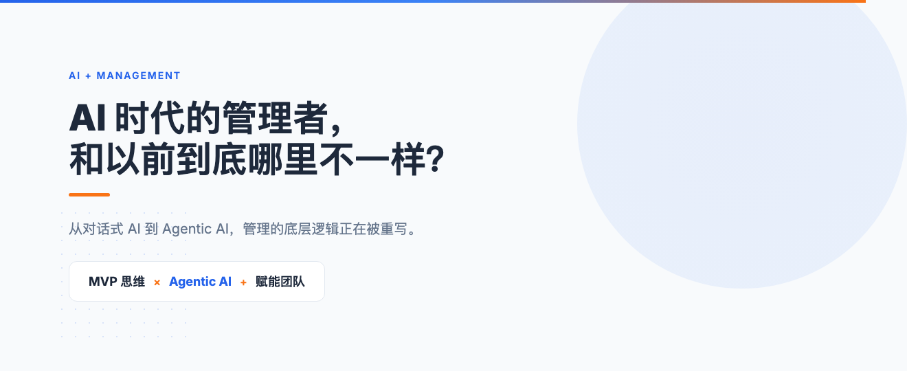
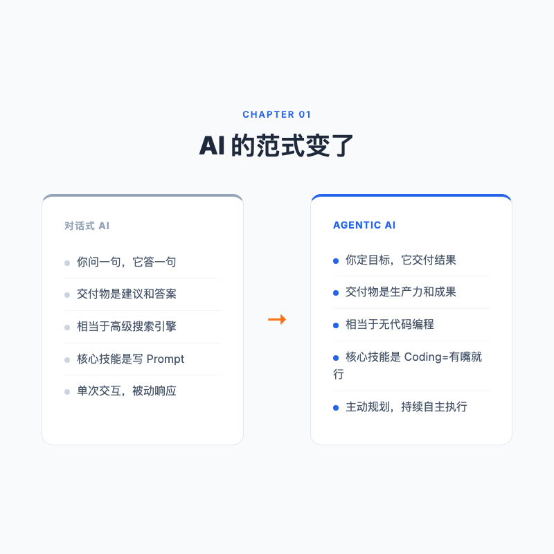
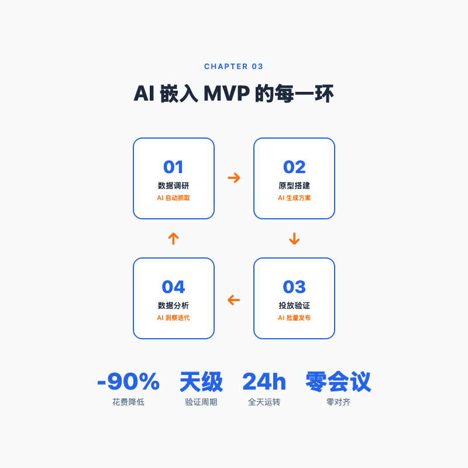
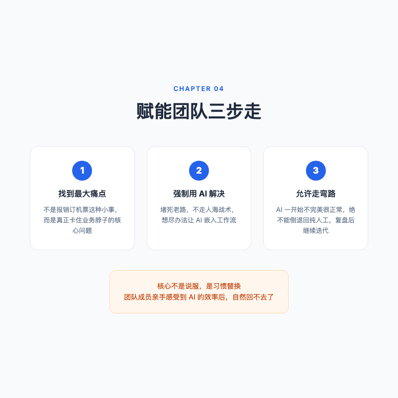
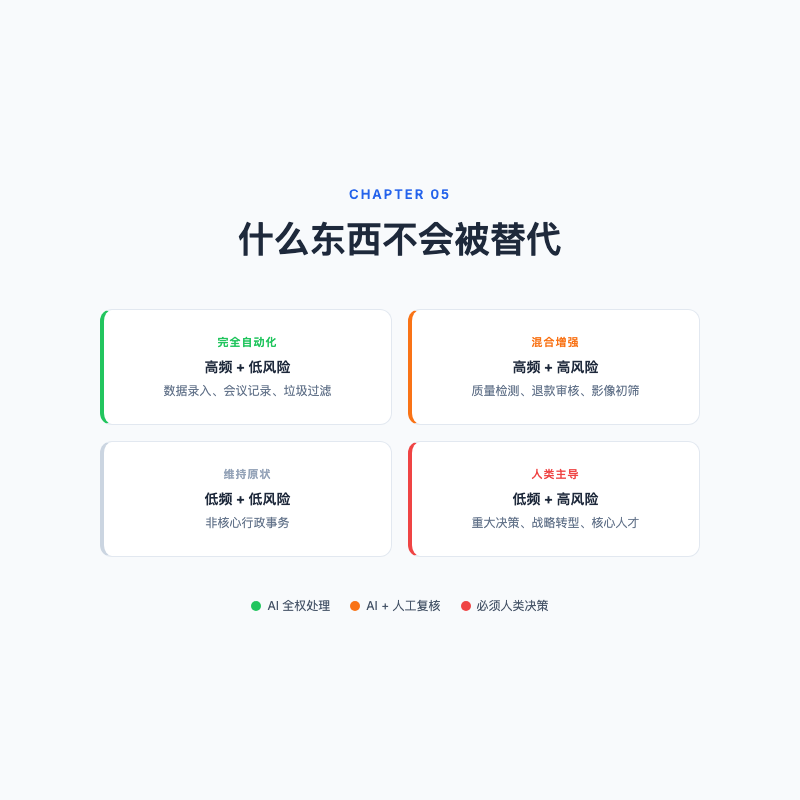
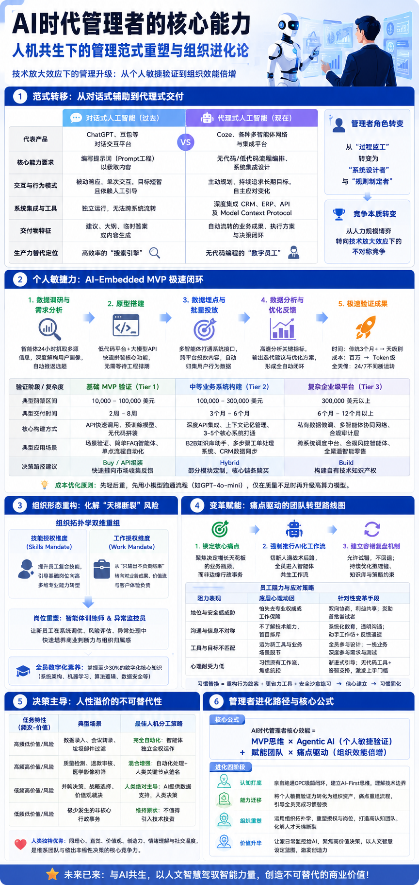

# AI 时代的管理者，和以前到底哪里不一样？

> 同样的业务问题，传统管理者花 3 个月、100 万、开一轮又一轮的会去验证，AI 时代的管理者用 3 天、几百块 token 费、一个人就能跑完闭环。

---

## 同一个问题，两种解法

先说一个真实的场景。

你是一家公司的业务负责人，发现了一个潜在的客户需求。你觉得这事儿有搞头，想验证一下。

在传统模式下，你的下一步是什么？

拉个会，把相关同事叫到一起，讲清楚背景。大家七嘴八舌讨论一圈，有人说方案 A，有人说方案 B，谁也说服不了谁。约了下周再聊。下周聊完，终于定了方向。然后去找研发排期，研发说最近资源紧，下个月能排上。等原型做出来，又过了两个月。上线测试，发现用户根本不买单。

3 个月过去了，100 万花掉了。验证了一个错误假设。

这不是虚构的。**即便一家公司认同 MVP 思维，在没有 AI 赋能的条件下，这套流程依然又慢又贵。** 讨论周期长、开发成本高、协调沟通消耗大，每多一个环节就多一层摩擦力。说实话，我自己就经历过这种循环，开会、对齐、排期、等结果，最后发现验证了一个谁都不想要的假设。

现在换个解法。

你打开 Coze，对着它说了一段话，你记着每天早上 8 点，按我给你的标准去抓全网最热的职场选题，推送 100 条给我筛选。

这不是搜索，这是一个智能体在帮你干活。它每天早上准时推送，你只需要花 15 分钟挑出最有价值的几条。

然后你再起一个 Agent，把调研结果丢给它，按照这些数据，帮我做几个内容原型出来，每个原型侧重验证一个关键假设，你帮我评估哪个假设验证成本最低、价值最大，直接开跑。

原型跑出来之后，再起一个 Agent 负责发布和数据回收。10 个账号一口气铺出去。数据回来了，Agent 帮你分析完播率、前 5 秒留存、评论情绪、有没有新的需求可以挖。

整个过程没开会，没对齐，没处理情绪。一次都没有。

**同一个问题，两种解法。差距不在智商，在工具。**

说来说去其实就一件事，**MVP 思维加上能自己干活的 Agentic AI，管理者自己先跑通，再教会团队。** 我后面说的所有东西，都是这句话的展开。

---

## AI 的范式变了，管理怎么可能不变

我是去年自己发现的。之前我也在认真学 Prompt Engineering，觉得把问题问准就是核心技能。后来用了 Manus，又试了 Coze 的新版，我才意识到，不需要了。

**Agentic AI**，Agentic 来自 agent，智能体。它和过去那种「你问它答」的对话式 AI 最大的区别在于，**它不再给你建议，而是直接给你结果。** 你跟它说你想要什么，它自己想办法、调用工具、跑流程。

以前 Coze 叫扣子编程，定位是无代码搭建工作流。现在你打开它手机端，slogan 变成了「你的工作满配助手」。从工具变成了员工。同样的事也正在更多产品上发生，它们不是在跟你聊天，它们在替你干活。

那一刻我脑子里冒出来的不是「AI 好厉害」，是「我之前等研发排期都在等啥」。

这个转变有一个被低估的影响。**在对话式 AI 时代，核心技能是写 Prompt，在 Agentic AI 时代，核心技能变成了 Coding。** 但这个 Coding 不是写 Python，不是学框架，而是用自然语言描述需求让 AI 去执行。一句话概括，有嘴就行。

编程的成本趋近于零。

这意味着什么？以前那些「等研发排期」「预算不够」「技术实现不了」的借口，在大部分场景下已经站不住脚了。管理者面对的问题不再是「能不能做」，而是「你知不知道可以这么做」。

但还有一个不变的东西。

不管是对话式 AI 还是 Agentic AI，有一件事始终没变，**AI 不是在替代人，AI 是在放大人。** 你用 AI，你的能力被放大。你不用，你的能力原地踏步。放大之后产生的不对称竞争，才是淘汰发生的真正原因。

不是 AI 把你淘汰了，是会用 AI 的同行把你淘汰了。

这一点放在管理场景下尤其要命。因为管理者的产出本来就不是「自己干了多少活」，而是「团队产出了什么结果」。如果你的管理方式还停留在人盯人、开会对齐、层层汇报的层面，而隔壁团队已经在用 Agent 搭数字员工、一个人跑通全链路，这个差距会以周为单位扩大。

---

## MVP 思维没错，但你的跑法太慢了

说到这，得聊一个被说烂了的概念，MVP。

不是篮球那个 MVP，是 Minimum Viable Product，最小可实现性产品。核心逻辑一句话就能讲清楚，提出假设 → 制造最小原型 → 投入验证 → 收集数据 → 修正假设 → 下一轮。

这个方法论本身没问题。问题出在执行成本上。

一个循环跑下来，2 到 3 个月算快的，预算少说几十万。部门之间的协同摩擦，每个人理解偏差导致的对齐会议，做完之后效果不好复盘甩锅，**这些「人的摩擦力」，才是 MVP 快不起来的真正原因。**

MVP 像健身卡，大家都办了，真正天天练的人没几个。不是方法论错了，是你的跑法太慢了。

---

## 把 AI 塞进 MVP 的每一环

现在换个角度想这个问题。如果把 MVP 循环拆成四步，每一步都用 Agentic AI 重新做一遍，会发生什么？

先说数据调研。以前做问卷、翻报告、拉数据、开访谈会，一个人两周打底。现在建一个智能体，告诉它每天早上 8 点按你定义的标准去全网抓数据，竞品动态、用户反馈、行业趋势。它自动推送，你只需要筛选。更进一步的，你可以让它直接帮你做用户画像的深度分析，分析评论区情绪，识别未被满足的需求。

你不是在搜信息，你是在指挥一个 24 小时不睡觉的研究助理。我第一次用 Coze 跑通这个流程的时候，说实话，有点上瘾。不是因为 AI 有多聪明，是因为我终于不用等了。

再说原型搭建。以前得等研发排期。现在你对着另一个智能体说，前面那个 Agent 已经把调研做完了，你按照它的结论，帮我生成几个原型方案。每个原型验证一个关键假设，你帮我判断哪个验证成本最低、见效最快，你先跑那个。

这里的关键不是让它画原型图，是让它帮你做决策和执行。它不光出方案，它直接开始干活。

投放和数据回收这一步更直接。以前要协调运营排期、渠道沟通、数据埋点开发。现在 Agent 直接打通 API，批量发布，自动埋点，数据实时回传。24 小时连轴转，不需要排班，不需要交接，不需要安抚情绪。

最后是数据分析与迭代。以前数据多了人看不过来，看完了也找不到洞察。现在 AI 处理这些数据太容易了。完播率、转化率、评论情绪、新需求提取，它不只给你报表，它给你下一步应该做什么的建议。然后新一轮的假设、原型、验证自动启动。

这就是 **AI-Embedded MVP 闭环**。**花费从几十万降到几百块 token 费，周期从 3 个月压到几天，零会议，零对齐，零甩锅。**

还有一个好处。因为不需要懂代码，管理者可以亲自下场跑这个循环。你不是在看团队的周报，你是在亲手做实验。这种手感是看任何汇报都获得不了的。

---

## 从一个人到一支团队

管理者自己跑通了这个闭环之后，下一步才是真正关键的地方，你怎么让你的团队也具备这个能力？

自己一个人爽不是管理。把一群人也带进 AI 的工作流里，才是管理者的分水岭。

哈佛商业评论总结过一个三步方法论，我带团队的时候照着走过一遍，确实管用。

**第一步，找到业务中最大的痛点。**

注意，不是报销、订机票这种边角料的事。你拿这些事推 AI，团队会觉得「携程也能订，为什么要学新工具？」我一开始也犯过这个错，推了一个自动排会议室的 Agent，没人用。

必须是真正卡住业务脖子的痛点。比如「我们怎么能在全网 50 个账号上日更，每天精准触达目标客户？」这种问题才有足够强的动力倒逼团队走出舒适区。

**第二步，强制用 AI 来解决。**

这是最反人性的一步。人的本能是走老路，遇到问题加人、加预算、加班。管理者的任务就是堵死这条路。

不是「你们能不能试试用 AI」，而是「这个事我们不走人海战术，必须用 AI 嵌入流程来解决」。听起来有点强硬，但转型期就是需要这种决心，你得让团队知道，老路已经封了。

**第三步，允许走弯路，绝不倒退。**

AI 方案一开始大概率不完美。bug 多、token 烧了没产出、产出质量不稳定，这些都会出现。团队的反弹也会随之而来，「我就说还是人工靠谱吧。」

我经历过这个时刻。团队做过一个自动生成短视频的 Agent 工作流，第一周产出的内容质量惨不忍睹，播放量个位数。有人提议不如回去手工剪。我当时确实动摇了一秒，但咬住了。我们花了一个下午复盘，prompt 不够精准，智能体之间的衔接逻辑有问题，埋点位置不对。调完第二周再跑，数据翻了 10 倍。

一旦你退回到纯人工方式，信任就断了，下次再推更难。扛住，然后复盘。

这三步走完之后，会发生一个质变。团队不再把 AI 当成玩具或噱头，而是把它当成日常生产力的一部分。这个转变叫**习惯替换**。

习惯替换不是靠说服完成的，是靠体验完成的。当团队成员亲手感受到 Agent 在秒级处理数据、自动生成方案、批量发布内容之后，他们自然不会再想回到手工时代。不是「AI 真好用所以我要用」，而是「回不去了」。

---

## 什么东西不会被替代

写到这里，可能会有人觉得这是一篇「AI 万能论」。不是。

当然，说了这么多 AI 能干的事，你可能会问，那管理者还剩什么？

管理者身上有些东西，Agent 永远替代不了。

我自己有个简单的标尺。

这事儿天天发生，搞砸了也无所谓，数据录入、会议记录、垃圾过滤这类，让 Agent 全干，人的精力花在上面不值。

天天发生但搞砸会出事，质量检测、退款审核、影像初筛这类，Agent 干大头，人在关键节点盯一眼。

不常发生但搞砸了要命，重大决策、战略方向、核心人才这类，Agent 帮你把材料备齐，把各种可能性推演一遍，但最后那一下，必须你自己来。

**不常发生但搞砸了要命的决策，是管理者最后的、也是最重要的护城河。**

为什么？因为 AI 是一个基于历史数据训练的关联性推理引擎。它在「已有答案」的领域极其强大，但在「没有答案」的领域毫无办法。

面对没有历史先例的战略决策，在冲突的价值观之间取舍，用一句话给一个团队定未来三年的方向，这些时候没有数据能告诉你答案。靠的不是最优解，是直觉、同理心、道德判断和在不确定中做选择的勇气。

**这些东西，才是最稀缺也最值钱的能力。**

还有一件事。在组织变革期间，团队的焦虑和抵触是真实的。AI 普及在提高效率的同时，也在淘汰一些基础性岗位。员工的恐惧不是矫情。

这时候，一个管理者表现出来的倾听、坦诚和对团队心理安全感的维护，是任何智能体都做不了的。AI 可以给你最合理的方案，但它不能给你温度。

优秀的管理者会做一件事，把日常的经营监控、绩效初核、流程审批这些监控式的工作让渡给 AI，然后把省出来的时间用在真正需要「人」的地方。辅导团队、激发创造力、在关键时刻做出那个谁都不敢拍板的决定。

---

## 总结

回到开头那个对比。传统管理者和 AI 时代管理者，不是两类人，而是同一个人的两种状态。

区别在于，你有没有亲自跑通那条 MVP × Agentic AI 的闭环。

**AI 时代管理者的核心公式，拆开来看就两件事。** 第一，用 MVP 思维加上 Agentic AI 这个杠杆，把自己的验证成本和时间压到最低，形成不对称竞争优势。第二，把这个能力复制给团队，不是靠说教，而是靠痛点驱动、习惯替换和复盘迭代。

技术把执行成本不断推向零。剩下那些算不出来的东西，判断力、同理心、在不确定中拍板的勇气，反倒成了最贵的。

欢迎关注我的公众号「Chyris Tech Note」，我会持续分享 AI 技术解读与实践思考。
