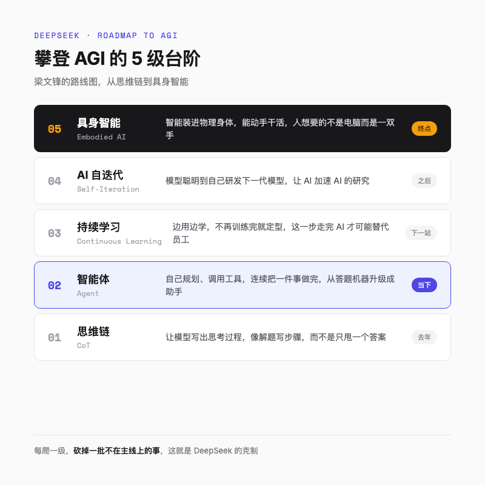
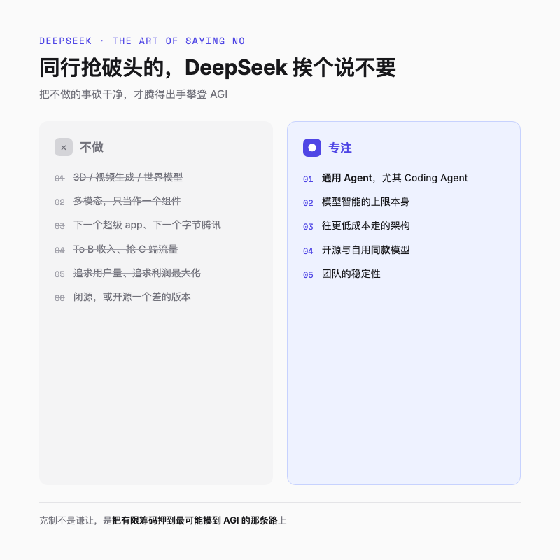

# 52 条语录，读懂 DeepSeek 通向 AGI 的 5 级台阶

---

过去一个月，这场四小时会议的整理内容在圈子里流传开来。

主角是 DeepSeek 的创始人梁文锋，对着投资人，整整讲了四个小时。整理出来的话一共 52 条，是后来多方收集拼出来的，部分措辞跟原话可能略有出入，但意思都在。

我把这 52 条从头读到尾，发现一件奇怪的事。

整场会议出现频率最高的字，是一个「不」。

不赚不合理的利润，不追求用户量，不闭源，不做 3D 和视频生成，不做世界模型，不做下一个超级 app。在别家大模型公司忙着抢 Chatbot、抢 To B 收入、抢着上市的当口，DeepSeek 几乎把同行最在意的东西，挨个说了一遍不要。

一家刚完成新一轮融资的 AI 公司，对着投资人，不谈怎么赚钱，倒先列了一长串「不做」的清单。

梁文锋自己给了答案。

> 后面还有西瓜，前面的可能都是芝麻。

芝麻不要，是因为他要留着肚子吃西瓜。这句话，后来成了我读这 52 条语录的钥匙。

---

## 一句话总结

克制不是 DeepSeek 的谦让。**它是这家公司攀登 AGI 的方式。**

---

## 楼梯的尽头是 AGI

要理解 DeepSeek 为什么能把那么多东西说不要，得先看清楚他们到底要去哪。

梁文锋把这件事讲得很直白，实现 AGI，就像爬楼梯。

> 去年的阶梯是 CoT，今年的阶梯就是 Agent。在 Agent 之后要解决的问题就是持续学习。

这五个词，挨个说一遍。

CoT，思维链。让模型把思考过程一步步写出来，而不是直接甩一个答案。好比做数学题，写出解题步骤，而不是只填一个最终答案。

Agent，智能体。如果说 CoT 是让模型学会「想」，那 Agent 就是让模型学会「做」。它不再只是回答问题，而是能自己规划、调用工具、连续把一件事做完。从「答题机器」升级成「能干活的助手」。

持续学习。模型在用的过程中不断吸收新东西，而不是训练完就定型。梁文锋说，AI 现在不缺品味和直觉，缺的就是这个。这件事人天生就会，边做边学，但现在的模型做不到，你得把所有上下文一次性喂给它。同一件事，人做一遍就长记性了，模型却每次都得从头教，所以 AI 还替代不了员工。他把持续学习看得很重，重到放话，下一代模型必须有了这个能力，才配叫下一代模型。

AI 自迭代。模型聪明到自己能研发下一代模型，让 AI 去加速 AI 的研究，这是持续学习之后的关键一跃。梁文锋把它看得很重，重到几乎有些浪漫，他说这可能会来到一个渐进的奇点，模型可以完成人类能做的所有事情，包括开发更前沿的人工智能模型。走到那一步，才算摸到楼梯的顶。

具身智能。智能装进一个物理身体里，能动手干活。他说，智能的终点可能都是具身，因为一个正常人想要的不是一台电脑，而是能替他干活的一双手。走到这一步，才算摸到楼梯的顶。

我读到这串台阶顺序时，反而没那么紧张了。因为每一步都很具体，连接下来一年该干什么都有答案。

清楚了去哪，再看每级台阶上他丢掉了什么。

多模态对 C 端产品很重要，但他说那只是一个组件，不是智能本身。3D、视频生成、世界模型也一样，跟智能的上限没太大关系，不在主线上。

现阶段他认定的台阶，是 Agent。具体说，是全力做通用的 Agent，尤其 Coding Agent。金融、医疗这些垂直 Agent，优先级靠后。

**第一层克制，只走主线。** 凡是不直接抬升智能上限的事，不管外面多热闹，都不做。

---

## 满地芝麻，他要的是西瓜

如果说砍掉多模态和视频，是因为不在主线上，那么不碰产品和流量，就更反直觉了。

因为做产品、做超级 app，恰恰是 AI 公司当下最赚钱的两条路。

梁文锋也不否认。他说，产品是通往 AGI 路上要经过的台阶，但不需要花太多心思去做 C 端、B 端产品。站在技术高位上做低一级的产品，他管这个叫降维打击。意思是，以 DeepSeek 的技术能力，回头去做一个 C 端 app 是轻松的，轻松到有点浪费。但现在不是收益最大化的时候。**产品是 AGI 路上的副产物。**

至于做下一个字节、下一个腾讯，他说，「完全没有这样的想法。」

这话放在今年听，格外刺耳。去年全行业抢 Chatbot、抢 C 端流量，今年轮到抢 To B 收入。DeepSeek 偏偏两边都不抢。公司内部真正关心的，是 AGI 的路线图，是下一步技术怎么突破。

去年春节 DeepSeek 火了一把，梁文锋淡淡一句，「不在我们的剧本里」。

他自己总结出一条近乎玄学的规律。最想得到的东西得不到，没那么在意的反而容易得到。

流量、收入、估值的故事，同行抢破头，他全让了出去。理由还是那句，后面有西瓜。

---

## 便宜是结果，开源是让利

DeepSeek 最出圈的两件事，一是便宜，二是开源。这两个词看起来像营销策略，但梁文锋的解释完全在另一个维度上。

先说便宜。

> 低成本是一个结果。

这句话很关键。DeepSeek 的模型一直在架构上往更低成本走，降价不是促销，是技术选择的副产品。梁文锋还点出更深的一层逻辑，成本越低，越能承担更大的模型。这背后有个现实背景，算力是紧缺的。卡就那么多，谁的计算效率高，谁就能用同样的卡训出更大的模型。大公司可以靠堆资源解决，DeepSeek 没这个命，所以把成本效率放在第一位。

他说，大模型竞争最终的差距会体现在三个方面，成本、时间、用户体验。**成本排在第一位。** 同样质量的服务，你能以什么成本提供。第二是时间，早几个月晚几个月结果不同。用户体验有粘性，但不本质。这个排序值得停下来看一眼，成本在体验前面，跟绝大多数做 C 端产品的公司的直觉是反的。

至于定价，DeepSeek 只赚一个合理的利润，不是利润最大化的定价。有一款模型一开始担心需求太大，价格定得偏高，后来降到原来的四分之一。梁文锋说，降价那天公司群里很多人欢呼，因为这就是把模型用心做好的目的，让大家都用得起。

开源这件事，比便宜更让人想不通。

在大多数软件公司眼里，开源等于把市场拱手让人。梁文锋却说，要把 AI 在商业上做成，开源是有好处的。这听起来违反直觉，他的解释是一个历史观。AI 这件事足够大，最终可能占掉人类社会 GDP 的百分之十。谁想独占这个利益，就一定被历史抛弃。

DeepSeek 给出去的开源模型，和自己部署的，一模一样。不会有「开源一个差的、自己留个好版」的小动作。他也不担心别人拿去部署来竞争，理由很冷静。创业公司太小没力量做，大公司又很难组织起来，这是属于「我们这个规模的公司」的甜区。

开源和低价，对内换员工成就感和组织凝聚力，对外换同行和用户的好感。他说，开源和低价让员工觉得有成就感，这很好理解。你做了一个很厉害的东西，希望它被很多人用，而不是锁在抽屉里标高价。有一款模型一开始担心需求太大，价格定得偏高，后来降到原来的四分之一，降价那天公司群里很多人欢呼。不是因为收入少了高兴，而是觉得模型用心做好的目的终于兑现了，能让大家都用得起。这种情绪本身，就是组织凝聚力的一部分。代价是放弃超额利润，换回来的，是做成 AGI 的概率。

---

## 留住能爬楼梯的人

前面三层克制，是对产品和市场说的。第四层，是对内说的。

这一层，也是 52 条语录里少有的不留余地的地方。绝大多数时候他用词浅白、留有余地，唯独在团队这件事上，他忽然锋利起来。

> 只要能够保持团队的稳定性，我一定能做成 AGI。就这么简单。

「就这么简单」四个字，是整场会议里最重的一句。换句话说，在梁文锋眼里，DeepSeek 唯一不能输的，是人。

为了保住团队，他做了一连串反常规的选择。

对外不树敌。不愿跟任何大厂或小厂成为对手，反过来愿意给他们赋能，甚至公开说愿意帮阿里、智谱、月之暗面做得更好。逻辑也实在，不树敌，自己的生存环境就更好。

对内一半一半。梁文锋特意给「做正事」划了条线，正事最好别占掉员工一半的时间。剩下的一半是从下而上的，员工不被安排，想研究什么就研究什么，没有前置要求。做研究需要松弛，所以公司一般不太加班。再加上非常聚焦，产品很多不完善也不去补，他把这叫做一种克制的文化。

驱动方式上，DeepSeek 是愿景驱动，不是 KPI 驱动。愿景甚至不是写在墙上的标语，而是在做事的方法和对待世界的态度里。他提到杰克·韦尔奇，说二十年前在管理上最崇拜的就是这位 GE 前 CEO，现在回头看，他说的大部分东西可能都不对了，但有一点说对了，一个公司最重要的是愿景。

这一节我最喜欢的一句，是他对自己团队的形容。

> 我们就是一群非常平凡的人。我喜欢的叙事是「一群平凡的人做出了不平凡的事」，而不是「一群天才做出了不平凡的事」。

**第四层克制，用松弛和善意留住人。** 不加班、不树敌、不靠 KPI，这些在别的公司看来是「不够狠」的做法，在 DeepSeek 这里，恰恰是保住那群能爬楼梯的人的方式。

---

## 克制是一种战略

四层克制讲完，可以回到最开始那个问题了。

一家刚完成融资的 AI 公司，为什么对着投资人，把同行最在意的东西挨个说不要。

梁文锋的答案，整场会议里反复出现。克制是 DeepSeek 愿景的一部分，不是装饰。AGI 是收益最大的事，其他事情有精力就做，没精力就不做。AI 这件事太大，利益也太大，只要能做成，随便分一点就非常大。而**你越克制，就越有可能做成这件事。** 他说得很坦然，除了愿景，DeepSeek 并没有非常多其他的优势。两年前成立这家公司的时候，没多少钱，没多少卡，没什么知名度，也没什么号召力。但他不觉得这是劣势。人才几乎没有差距，国内并不缺人才。算力差距倒是真实的，所以 DeepSeek 的打法是用几分之一的算力把差距缩得更短。他相信最终模厂会收敛，不需要那么多人做大模型，可能两家大公司加两家小公司就够了，剩下的人只做应用。DeepSeek 想成为那几家之一。

也正因为手里牌不多，每打出一张「不」，都是在把有限的筹码，押到最有可能摸到 AGI 的那条路上。开源和低价让员工有成就感、让同行高兴，定价上不追求收入最高，产品上不抢流量，组织上不加班不树敌。这些看起来散落在各处的让步，拧成一股，指向同一个方向，增加做成 AGI 的概率。

回到那句西瓜和芝麻。

攀登 AGI 的楼梯又长又陡，DeepSeek 一路走，一路把台阶旁掉落的芝麻让给别人。不抢流量，不抢利润，不抢上市的故事。因为楼梯尽头那颗西瓜足够大，大到只要能爬到顶，随便分一点利益就不得了。

梁文锋最后那句话，像一句提前写好的判词。

> 如果你的愿景是拿得多，你就先输了。

克制不是一种美德，是一种战略。它是这家自称「没有非常多其他优势」的公司，给自己换来的，那张通往 AGI 的入场券。

---

欢迎关注我的公众号「Chyris Tech Note」，获取更多 AI 技术解读与实践分享。

