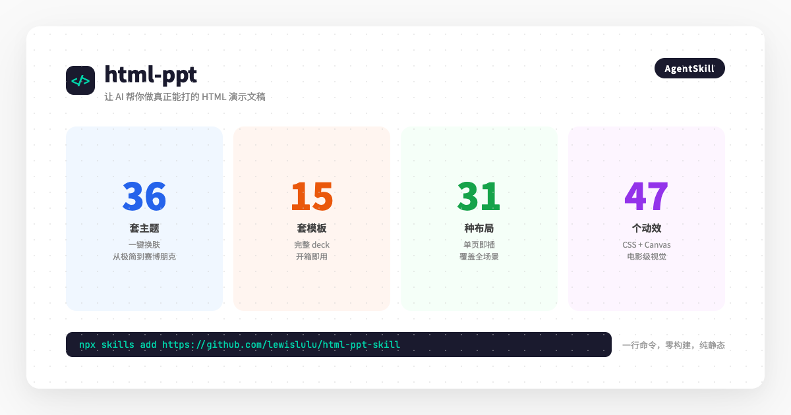
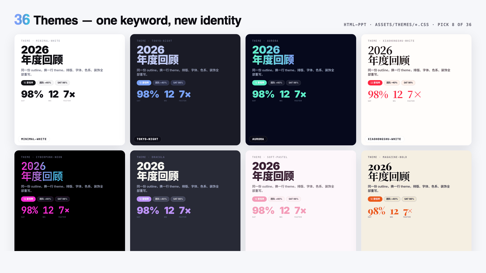
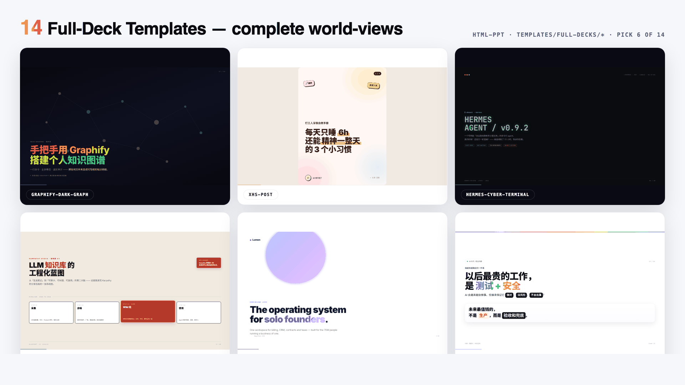
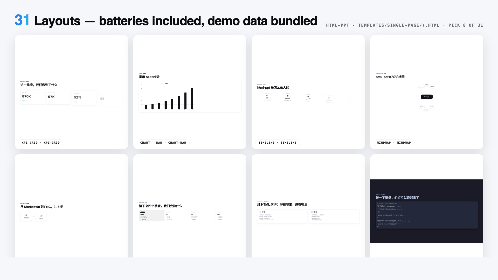
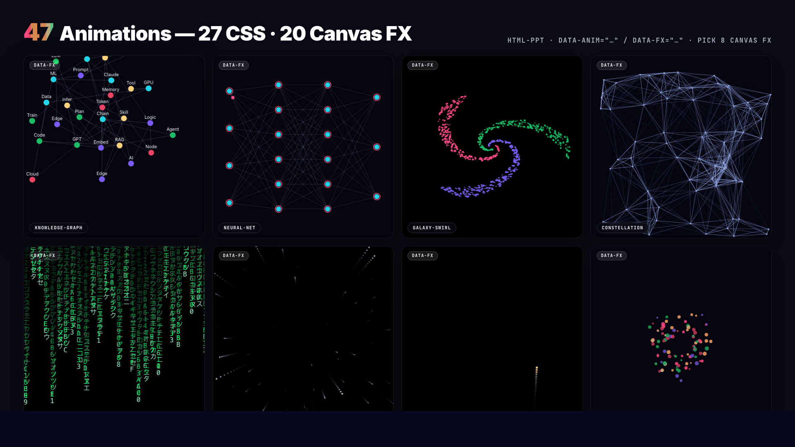
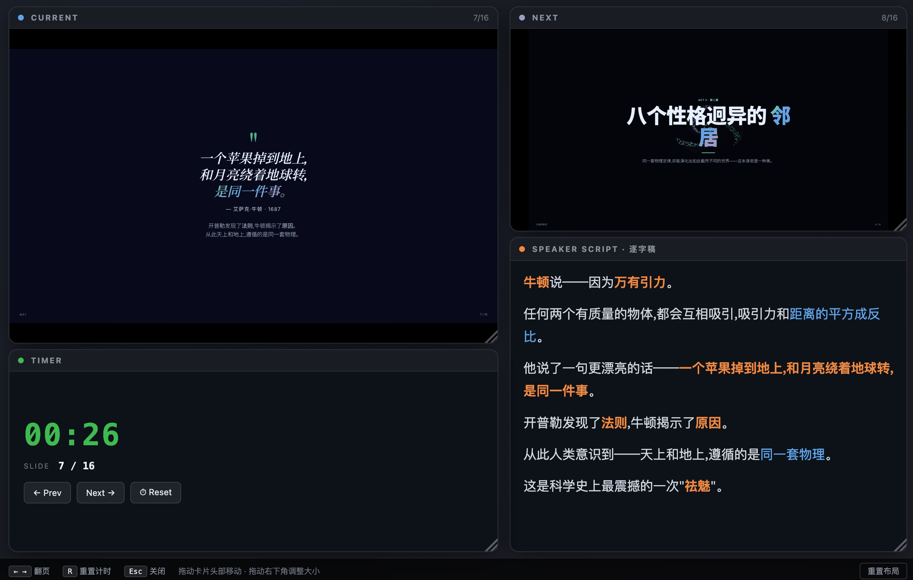

> 周五下午五点，产品经理甩过来一份 20 页的 outline，说"下周一要对外分享"。你盯着空荡荡的 PowerPoint，第 N 次思考：为什么做 PPT 这么耗时？——如果你也有这种绝望，今天这个项目可能是来救你的。



---

## 一句话总结

**html-ppt-skill 是一个开源的 AgentSkill，它把"做 PPT"变成了一句话的事。** 36 套主题、15 套完整模板、31 种布局、47 个动效，全部纯静态 HTML/CSS/JS，无需构建工具。对 AI 说"做一份技术分享 slides"，就能拿到一份可以直接打开、键盘翻页、甚至带演讲者模式的精美演示文稿。

---

## 01 它是什么？一句话装好的"AI 幻灯片工厂"

html-ppt-skill 的核心定位很清晰：**让任何支持 AgentSkill 的 AI（Claude Code / Cursor / Codex / OpenClaw 等）都能生成专业级 HTML 演示文稿。**

安装只需要一行命令：

```bash
npx skills add https://github.com/lewislulu/html-ppt-skill
```

装好之后，你对 AI 说的话可能是：

- "做一份 8 页的技术分享 slides，用 cyberpunk 主题"
- "把这段 outline 变成投资人 pitch deck"
- "做一个小红书图文，9 张，白底柔和风"
- "做一份带演讲者模式的产品分享，我想要有逐字稿"

AI 会直接输出一份完整的 `.html` 文件，双击就能在浏览器里打开，键盘翻页、全屏、主题切换，全部原生支持。

---

## 02 36 套主题：从极简白底到赛博朋克，一键换肤

这是我最惊喜的部分。项目内置了 **36 套精心设计的主题**，覆盖几乎所有使用场景：



**部分主题一览：**

| 主题名 | 风格 | 适用场景 |
|---|---|---|
| `minimal-white` | 极简白底 | 通用 / 学术 |
| `tokyo-night` | 暗色霓虹 | 技术分享 |
| `cyberpunk-neon` | 赛博朋克 | 产品发布 / 黑客风 |
| `xiaohongshu-white` | 小红书白底杂志风 | 社交媒体图文 |
| `pitch-deck-vc` | 投资人 pitch 风 | 融资路演 |
| `glassmorphism` | 毛玻璃质感 | 设计感展示 |
| `academic-paper` | 学术排版 | 论文答辩 / 学术报告 |
| `bauhaus` | 包豪斯几何 | 设计类分享 |

换主题只需要改一行 `<link>`，整份 deck 的颜色、字体、间距、阴影会全部同步更新。背后是一套 **Token 驱动的设计系统**，所有视觉决策都收敛在 CSS 变量里。

> 作者在 `templates/theme-showcase.html` 里做了完整的主题预览 gallery，每个主题用独立 iframe 渲染，避免样式互相污染。

---

## 03 15 套模板 + 31 种布局：拖拽即用的"乐高积木"

如果说主题是"皮肤"，那模板和布局就是"骨架"。

### 15 套完整 deck 模板



其中 **8 套是从真实项目提炼的视觉语言**：小红书白底杂志风、暗底力导向知识图谱、蓝图架构图风、终端 cyberpunk 风、紫色渐变卡、警示风、柔和马卡龙图文、方向键极简风。

另外 **7 套是通用场景脚手架**：投资人 pitch、产品发布会、技术分享、周报、小红书图文（9 页 3:4 比例）、教学模块、**演讲者模式专用模板**。

### 31 种单页布局



cover（封面）· toc（目录）· section-divider（章节分隔）· bullets（要点）· two-column（双栏）· three-column（三栏）· big-quote（大引用）· stat-highlight（数据高亮）· kpi-grid（KPI 网格）· table（表格）· code（代码块）· diff（代码对比）· terminal（终端）· flow-diagram（流程图）· timeline（时间线）· roadmap（路线图）· mindmap（思维导图）· comparison（对比）· pros-cons（优缺点）· chart-bar/bar-line/pie/radar（图表）· arch-diagram（架构图）· process-steps（流程步骤）· cta（行动号召）· thanks（致谢）……

每个布局都带真实示例数据，复制粘贴进你的 deck 就能直接看到效果。

---

## 04 47 个动效：从轻盈淡入到电影级 Canvas 特效



**27 个 CSS 动画（轻量、流畅）：**

fade-up（淡入上浮）· rise-in（升起）· zoom-pop（缩放弹出）· blur-in（模糊渐入）· glitch-in（故障风）· typewriter（打字机）· neon-glow（霓虹光晕）· shimmer-sweep（流光）· gradient-flow（渐变流动）· stagger-list（列表错开入场）· counter-up（数字滚动）· path-draw（路径绘制）· card-flip-3d（3D 翻牌）· cube-rotate-3d（3D 立方体旋转）……

**20 个 Canvas FX（电影级视觉）：**

particle-burst（粒子爆发）· confetti-cannon（彩带）· firework（烟花）· starfield（星空）· matrix-rain（代码雨）· knowledge-graph（力导向知识图谱）· neural-net（神经网络脉冲）· constellation（星座连线）· orbit-ring（轨道环）· galaxy-swirl（星系漩涡）· data-stream（数据流）· gradient-blob（渐变 blob）……

每一个 Canvas FX 都是手写的独立模块，进入 slide 时由 `fx-runtime.js` 自动初始化，离开时自动清理。

---

## 05 演讲者模式：按 S 键，弹出你的"提词器"

这是让我觉得"作者真的懂演讲"的功能。



在任何 deck 里按 **S 键**，会弹出一个独立的演讲者窗口，包含 **4 个可拖拽、可调整大小的磁吸卡片**：

- **CURRENT** — 当前页像素级预览（iframe 加载同一文件，颜色排版 100% 一致）
- **NEXT** — 下一页预览
- **SPEAKER SCRIPT** — 逐字稿（大字体，可滚动）
- **TIMER** — 计时器 + 页码 + 翻页控制

两个窗口通过 `BroadcastChannel` 双向同步翻页，**零闪烁、不重新加载**。

作者甚至为逐字稿制定了 **3 条铁律**：

1. **不是讲稿，是提示信号** — 关键词加粗，过渡句独立成段
2. **每页 150–300 字** — 约 2–3 分钟/页的节奏
3. **用口语，不用书面语** — "因此"→"所以"，"该方案"→"这个方案"

`presenter-mode-reveal` 模板里每一页都带完整的示例逐字稿，拿来就能参考。

---

## 06 零构建、纯静态：没有 webpack，没有 npm run dev

这是我选择推荐它的另一个重要原因。**整个项目纯静态 HTML/CSS/JS**，没有构建步骤，没有依赖地狱。

- 只有 webfont、highlight.js、chart.js 走 CDN（可选）
- 双击 `.html` 文件就能在浏览器打开
- `./scripts/render.sh` 用 headless Chrome 直接导出 PNG
- 任何一个静态托管（GitHub Pages / Vercel / Cloudflare）都能直接部署

对于"只是想快速出一份好看 slides"的人来说，这种**没有心智负担**的体验太重要了。

---

## 07 适用场景：谁该用这个？

| 场景 | 推荐主题/模板 |
|---|---|
| 技术分享 / 内部培训 | `tokyo-night`、`terminal-green`、`tech-sharing` |
| 产品发布会 / Demo Day | `cyberpunk-neon`、`product-launch` |
| 投资人 Pitch | `pitch-deck-vc`、`swiss-grid`、`pitch-deck` |
| 小红书 / 社交媒体图文 | `xiaohongshu-white`、`xhs-post`、`soft-pastel` |
| 学术汇报 / 论文答辩 | `academic-paper`、`editorial-serif`、`minimal-white` |
| 周报 / 数据汇报 | `corporate-clean`、`weekly-report` |

---

## 总结：值得一试

html-ppt-skill 不是一个"替代 PowerPoint"的工具，它是一个**把 PPT 制作从"体力劳动"变成"对话"**的桥梁。

如果你经常需要：
- 快速产出技术分享 slides
- 让 AI 帮你把 outline 变成可演示的 deck
- 做一份带演讲者模式、带逐字稿的正式分享
- 生成小红书风格的图文卡片

那这个项目值得你花 5 分钟装一下，再花 10 分钟试一个 deck。

> **:material-link: GitHub 地址**：https://github.com/lewislulu/html-ppt-skill
> **安装命令**：`npx skills add https://github.com/lewislulu/html-ppt-skill`

---

*以上就是关于 html-ppt-skill 的全部介绍。你平时用什么工具做 PPT？欢迎在评论区聊聊。*
