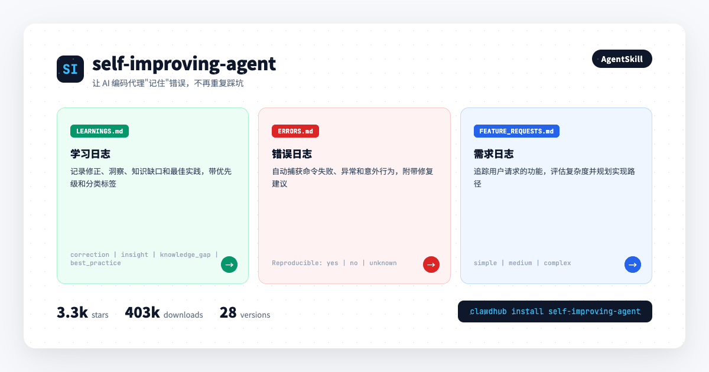
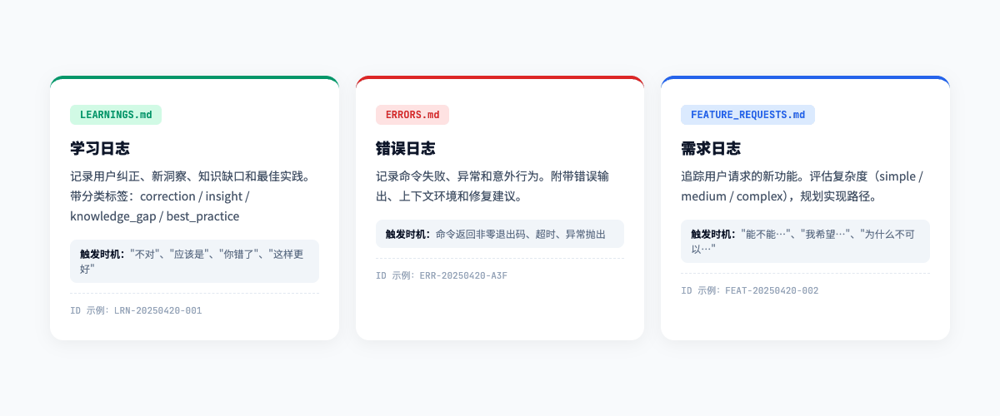
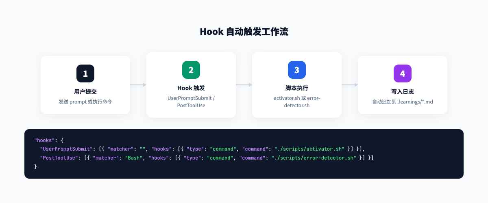
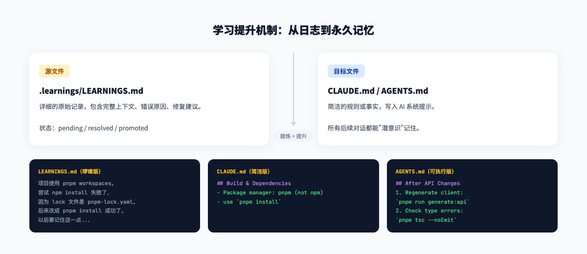
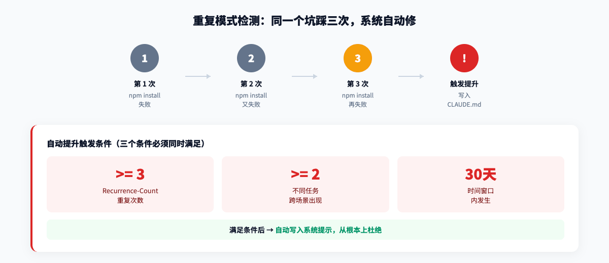
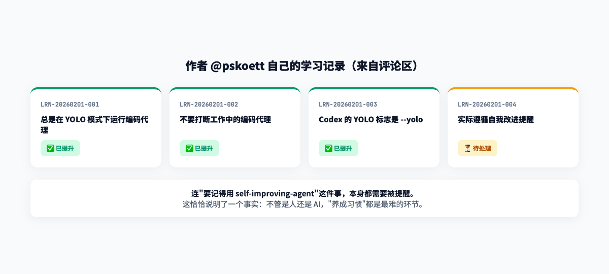
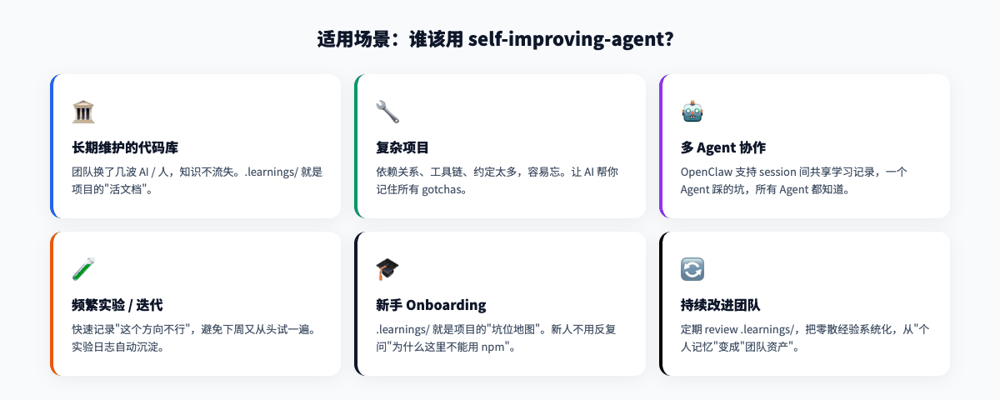

# 你的 Claude code为什么总是重复犯错？这个开源 Skill 让它学会"记笔记"

> 你让 Claude Code 把项目从 npm 迁移到 pnpm，它兴冲冲地跑了一个 `npm install`，然后报错。你纠正它之后，三天后换了一个任务，它又来了个 `npm install`。——如果你也被这种"金鱼记忆"搞到崩溃，今天这个项目就是专门治这个的。



---

## 一句话总结

**self-improving-agent 是一个让 AI 编码代理"学会记笔记"的开源 AgentSkill。** 它自动把错误、修正和需求记录到结构化的 Markdown 文件里，好的经验还会被提升到项目记忆中。装好之后，你的 AI 不再每次都从零开始——它会记得三天前那个 `npm install` 的教训。

目前已经有 **3.3k stars**、**403k 次下载**、**28 个版本**，5 天前还在更新。

---

## 01 它做了什么？给 AI 配了一个"错题本"

self-improving-agent 的核心很简单：**在项目中创建一个 `.learnings/` 目录，里面放三个 Markdown 文件，每次 AI 犯错或被纠正时，自动往里面写一条记录。**

这三个文件分别是：

| 文件 | 记录什么 | 什么时候写 |
|---|---|---|
| `LEARNINGS.md` | 修正、洞察、知识缺口、最佳实践 | 用户说"不对"、"应该是"、"你错了" |
| `ERRORS.md` | 命令失败、异常、意外行为 | 命令返回非零退出码、超时、报错 |
| `FEATURE_REQUESTS.md` | 用户请求的新功能 | 用户说"能不能…"、"我希望…" |

每条记录都有统一的结构化格式：

```markdown
## [LRN-20250420-001] correction

**Logged**: 2025-04-20T14:32:00Z
**Priority**: high
**Status**: pending
**Area**: config

### Summary
项目使用 pnpm workspaces，不能用 npm install

### Details
npm install 会失败，因为 lock 文件是 pnpm-lock.yaml，
必须使用 pnpm install

### Suggested Action
以后涉及依赖安装时，先检查 lock 文件类型

### Metadata
- Source: user_feedback
- Related Files: pnpm-lock.yaml
- Tags: pnpm, npm, dependency
```

看到没？不是随便写一句"记住用 pnpm"，而是**带时间戳、优先级、状态、区域分类、修复建议**的完整记录。未来的 AI 代理读到这条，能在 5 秒内理解发生了什么、该怎么避免。



---

## 02 Hook 自动触发：不用你提醒，它自己记

最妙的是，这个 Skill 支持 **Hook 自动触发**，不用你每次都手动说"记下来"。

**基础配置**（Claude Code / Codex）：

在 `.claude/settings.json` 里加一段：

```json
{
  "hooks": {
    "UserPromptSubmit": [{
      "matcher": "",
      "hooks": [{
        "type": "command",
        "command": "./skills/self-improvement/scripts/activator.sh"
      }]
    }]
  }
}
```

这意味着：**每轮对话提交后**，脚本会自动在 AI 的上下文里注入一个提醒——"嘿，回头看看有没有值得记录的学习或错误"。

**进阶配置**（加上错误自动检测）：

```json
{
  "hooks": {
    "UserPromptSubmit": [{...}],
    "PostToolUse": [{
      "matcher": "Bash",
      "hooks": [{
        "type": "command",
        "command": "./skills/self-improvement/scripts/error-detector.sh"
      }]
    }]
  }
}
```

这条的意思是：**每次 Bash 命令执行后**，如果检测到非零退出码或错误模式，自动触发记录到 `ERRORS.md`。

> 注意：错误检测 Hook 是可选的，因为它需要读取命令输出。作者建议先用基础的 activator-only 配置，确认安全后再开启错误检测。



---

## 03 好学习，要"升职"：从日志到项目记忆

记录只是第一步。真正有价值的是**提升机制**——当日志里的某条经验被反复验证、证明对项目有广泛适用性时，就把它从 `.learnings/` **提升**到项目的永久记忆中。

| 提升目标 | 放什么 |
|---|---|
| `CLAUDE.md` | 项目事实、约定、gotchas（所有 Claude 交互都用得上） |
| `AGENTS.md` | 工作流、工具使用模式、自动化规则 |
| `.github/copilot-instructions.md` | GitHub Copilot 的上下文和约定 |
| `SOUL.md`（OpenClaw） | 行为准则、沟通风格、个性原则 |
| `TOOLS.md`（OpenClaw） | 工具能力、集成技巧、坑 |

举个例子：

**原始学习记录**（啰嗦版）：

> 项目使用 pnpm workspaces。有一次我尝试用 npm install 安装依赖但失败了，因为 lock 文件是 pnpm-lock.yaml。后来我改成了 pnpm install，就成功了。以后要记住这一点。

**提升到 CLAUDE.md 后**（简洁版）：

```markdown
## Build & Dependencies
- Package manager: pnpm (not npm) - use `pnpm install`
```

**提升到 AGENTS.md 后**（可执行版）：

```markdown
## After API Changes
1. Regenerate client: `pnpm run generate:api`
2. Check for type errors: `pnpm tsc --noEmit`
```

提升后的内容会出现在 AI 的**系统提示**里，成为它每次对话的"潜意识"。



---

## 04 重复模式检测：同一个坑踩三次，系统自动修

这是我觉得最聪明的设计。Skill 引入了 **Pattern-Key** 和 **Recurrence-Count** 两个字段来追踪重复问题：

- 当你记录一条类似的问题时，先搜索 `.learnings/` 看是否已有相同 Pattern-Key
- 如果找到了，递增 `Recurrence-Count`，更新 `Last-Seen`
- 如果 **Recurrence-Count >= 3**，且**跨了至少 2 个不同任务**，且**发生在 30 天内**——**自动提升到系统提示**

也就是说，AI 不会无限容忍你反复踩同一个坑。第三次之后，它会主动把这个规则写进 `CLAUDE.md`，从根本上杜绝。

这背后的逻辑很清晰：**重复出现的问题往往不是偶然失误，而是系统性缺失**——要么缺文档，要么缺自动化，要么架构有问题。



---

## 05 技能提取：好模式变成可复用的 Skill

当某个学习记录足够有价值、足够通用时，还可以把它**提取成独立的 Skill**，让其他项目也能用。

提取条件（满足任意一条即可）：
- 有 2+ 个 See Also 链接（重复出现）
- 状态为 resolved 且有可行修复方案
- 需要实际调试才能发现的非显然问题
- 跨项目通用的知识
- 用户主动说"把这个保存为 skill"

作者甚至提供了提取脚本：

```bash
./skills/self-improvement/scripts/extract-skill.sh skill-name --dry-run
./skills/self-improvement/scripts/extract-skill.sh skill-name
```

从"一次教训"到"一个可复用组件"——这才是真正的**知识沉淀**。

---

## 06 作者自己的学习记录：连"记笔记"本身也需要被提醒

这个项目最有说服力的证据，是**作者自己就在用它**，而且公开分享了自己的学习日志。

他在评论区晒出了 4 条记录：

1. **LRN-20260201-001** — 总是用 YOLO 模式运行编码代理 :material-check: **已提升**
2. **LRN-20260201-002** — 不要打断工作中的编码代理 :material-check: **已提升**
3. **LRN-20260201-003** — Codex 的 YOLO 标志是 `--yolo` :material-check: **已提升**
4. **LRN-20260201-004** — **实际遵循自我改进提醒** ⏳ **待处理**

第四条太真实了——**连"要记得用 self-improving-agent"这件事， itself 都需要被提醒**。这恰恰说明了这个问题的普遍性：不管是人还是 AI，"养成习惯"都是最难的环节。



---

## 07 和 simplify-and-harden 配合：从"记录"到"进化"

作者还推荐把这个 Skill 和 **simplify-and-harden** 配合使用。

`simplify-and-harden` 会定期分析代码，找出可以简化或加固的模式，生成 `learning_loop.candidates`。self-improving-agent 可以自动读取这些候选，用 Pattern-Key 去重，符合规则的就提升到系统提示里。

简单说：**一个负责"发现问题"，一个负责"记住问题"，合在一起就是一个闭环的持续改进系统。**

---

## 08 适用场景：谁该用这个？

| 场景 | 为什么需要 |
|---|---|
| 长期维护的代码库 | 团队换了几波 AI / 人，知识不流失 |
| 复杂项目 | 依赖关系、工具链、约定太多，容易忘 |
| 多 Agent 协作 | OpenClaw 的 session 间共享学习记录 |
| 频繁实验/迭代 | 快速记录"这个方向不行"，避免重复尝试 |
| 新手 onboarding | `.learnings/` 就是项目的"坑位地图" |



---

## 09 快速安装

**OpenClaw（推荐）：**

```bash
clawdhub install self-improving-agent
```

**手动安装（Claude Code / Codex / 其他 Agent）：**

```bash
git clone https://github.com/peterskoett/self-improving-agent.git
```

然后在项目根目录创建 `.learnings/` 和三个 Markdown 文件（首次使用时 Skill 会自动创建）。

---

## 总结：值得每一个用 AI 写代码的人尝试

self-improving-agent 不是一个炫技的工具，它解决的是一个**非常基础但极其重要的问题**：AI 编码代理的"金鱼记忆"。

它的设计哲学很简单——

- **犯错不可怕，重复犯错才可怕**
- **记录不是目的，沉淀才是**
- **好的经验要从"日志"变成"本能"**

如果你每天都在用 Claude Code、Cursor、Codex 或 OpenClaw 写代码，花 5 分钟装一下这个 Skill，再花 1 个下午养成"让 AI 记笔记"的习惯。一个月之后回头看，你会惊讶于 `.learnings/` 里积累了多少本会被遗忘的智慧。

> **:material-link: ClawHub 地址**：https://clawhub.ai/pskoett/self-improving-agent
> **安装命令**：`clawdhub install self-improving-agent`
> **GitHub 源码**：https://github.com/peterskoett/self-improving-agent

---

*以上就是关于 self-improving-agent 的全部介绍。你的 AI 编码助手有没有反复犯过同样的错误？欢迎在评论区聊聊。*
