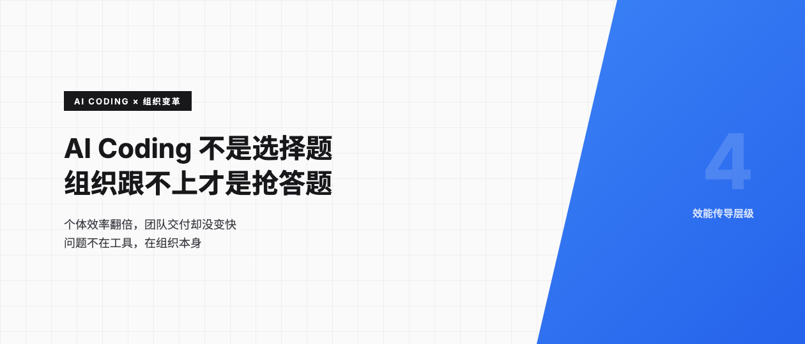
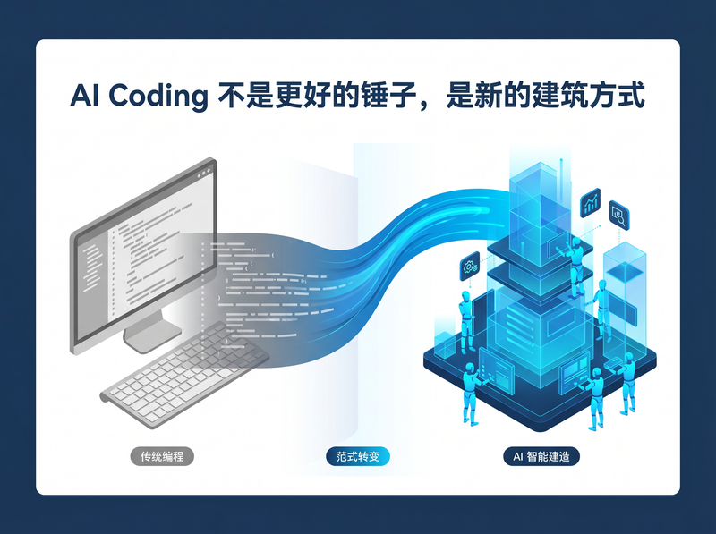
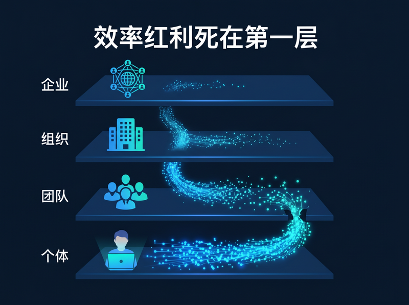
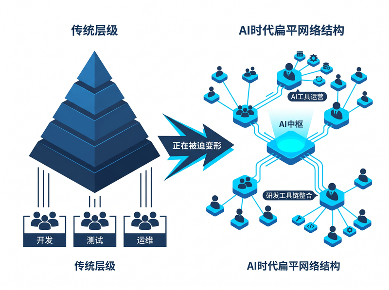
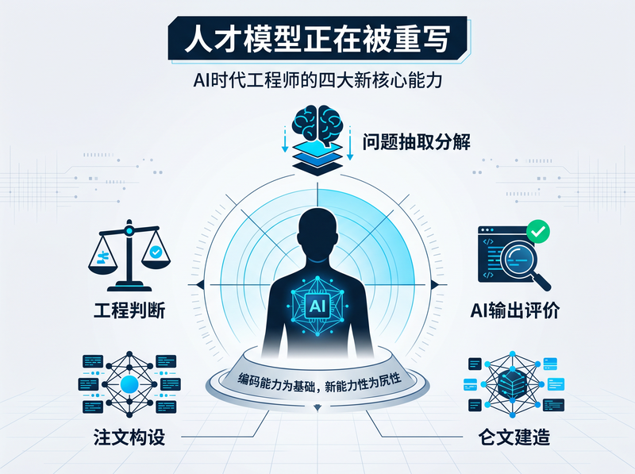
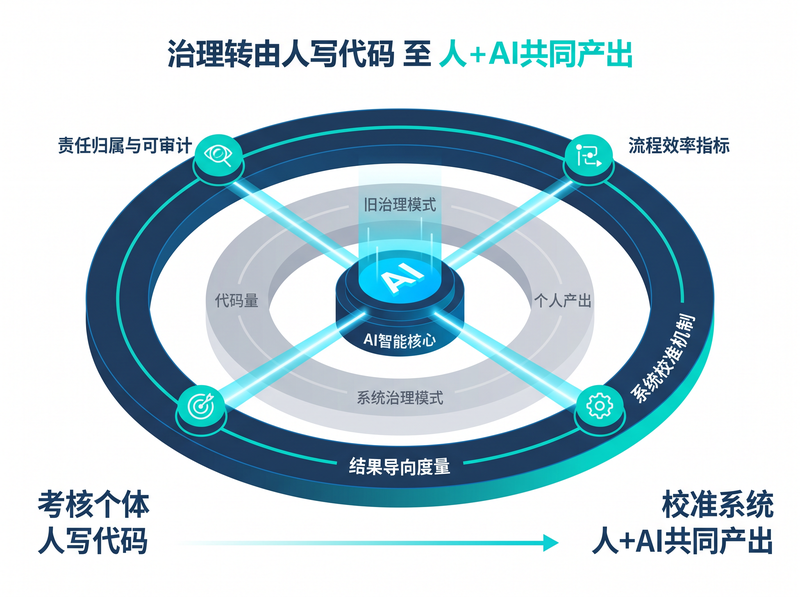
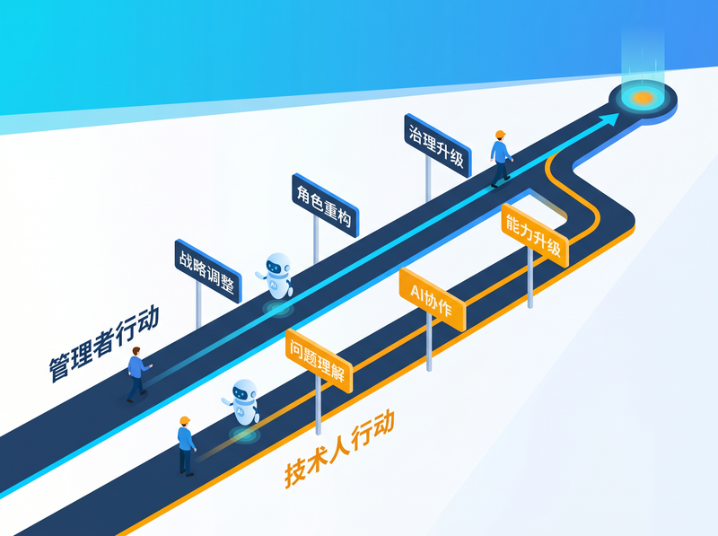

# AI Coding 不是选择题，组织跟不上才是抢答题

> 当个体效率的提升无法传导到组织层面，问题就不在工具，而在组织本身。

---

最近看到一个有意思的现象。好几家全面接入 AI Coding 的团队，工程师普遍反馈效率提升明显，代码补全、模板生成、接口对接这些过去要半天搞定的活儿，现在一两个小时就能完成。但去看 sprint velocity，几乎没变化。交付节奏没加快，业务方也没觉得产品迭代更快了。

**个体变快了，组织没变快。**

TRAE 企业版技术负责人姜育恒写了一篇长文，系统拆解了这个现象。读完我发现，问题出在组织层面。AI Coding 改变的不只是工程师写代码的速度，而是软件的「生产方式」本身，企业 IT 部门的组织结构、人才模型和治理机制都得跟着变。

---

## AI Coding 不是更好的锤子，是新的建筑方式

很多人把 AI Coding 理解成「升级版 IDE」，就像从手动螺丝刀换成了电动螺丝刀。说实话，这个类比不够用。

从 GitHub Copilot 开启 AI 代码生成的探索，到 Cursor、TRAE 等新一代 AI IDE 的爆发式普及，AI Coding 的演进速度已经远超行业预期。这些工具不再只是辅助你写代码，而是逐步渗透到需求分析、架构设计、编码实现、测试验证与持续交付的全流程中。

这是换了一套生产方式。

拐点不是突然来的。大模型的长上下文和多模态能力突破了一个关键瓶颈，模型终于能读懂需求了。产品形态也在快速迭代，新一代 Agent 普遍采用「规划 - 执行」的分层架构，强模型负责拆解任务和关键决策，轻量模型负责快速生成和落地。而在组织端，开发者从「试试看」转向了深度依赖，在部分企业中，AI Coding 已经开始进入「自动开分支 - 提交代码 - 创建合并请求」的交付闭环，人类角色逐步收敛为 Review 和质量把控者。

当模型能力、产品形态和组织端需求同时到位，拐点就来了。

---

## 个人变快了，组织为什么没跟上？

理解这个怪象需要一个框架。

最底层是个体。认知负担下降，重复性工作减少，代码产量提高。AI Coding 在这个层面的价值立竿见影，也是最容易感知到的。

往上一层是团队。当多个个体的能力被正确吸收进协作中，变化才开始显现。需求迭代周期缩短，功能交付速度提升，Code Review 等协作环节耗时下降。效率不再只是个人变快，而是协作带来的效率损耗系统性下降。

再到组织层。只有当团队层面的改善被规模化复制，业务迭代速度才会真正变快，更多试错机会才会出现。

最顶层是企业。当研发组织能够稳定、快速地响应变化，IT 部门从成本中心转变为战略加速器，技术能力直接参与塑造企业发展节奏。

现实中，大部分企业的效率红利死在了第一层到第二层之间。工程师开发速度确实快了，但需求吞吐、交付节奏和整体业务迭代效率并未同步改善。

为什么传导不上去？

一个常见的情况是，个体变快了，但协作方式和决策机制还停在旧模式。工程师更快地写出代码，然后更快地进入等待 Review、等待联调、等待发布审批的队列。就像一个人开车再快，红绿灯系统不优化，整体通行效率不会提升。

另一个问题是指标体系停留在个人层面。成功的定义是「谁用得多」，而不是「组织是否变快」。团队为了把 AI 代码采纳率做高，生成了大量低价值代码，反而忽略了 AI 真正应该解决的问题。

还有一种情况是 AI 被当外挂而非运行机制的一部分。AI Coding 被当作个人效率工具，没有被纳入组织运行系统，效率无法沉淀。每次换人、换项目，之前的经验就清零了。

组织还没有准备好吸收这种新的生产方式。

---

## 组织结构在被迫变形

过去几十年，企业 IT 组织的结构设计建立在一个稳定的逻辑之上，人是核心生产力，代码主要由人直接产出。研发能力的规模化，依赖工程师数量的增长和个人经验的积累。为了在规模扩张的同时保持可控性，组织普遍采用「职能分工 + 层级管理」的结构，拆分中台、产品、研发、测试、运维等角色，通过流程和制度进行协同。

这个结构在代码主要由人完成的阶段是合理的。

AI Coding 在拆这个台。

一方面，个体工程师可覆盖的问题范围显著扩大。在 AI 辅助下，一名工程师不再局限于单一职能，可以在需求理解、方案设计、代码实现、测试验证等多个环节连续推进，原本需要跨角色协作的任务被压缩到个体层面完成。另一方面，工具开始承担部分原本由组织结构承担的「协作」职能。编码规范、模板约束、静态检查、代码审查，甚至知识传递与经验复用，不再完全依赖人工协作，而是被内嵌进工具链之中。

协作没有消失，但承载方式变了，从「人对人」转向「人对工具、人对系统」。

这个变化已经开始在组织形态上显现。团队单元在变小，但能力密度在提高，不再以覆盖完整职能链条为目标，而是以「少量全栈个体 + AI 增强工具支持」的方式完成端到端交付。中间管理与协调层被压缩或角色重构，管理职责从任务拆分与进度跟踪，转向帮助团队把工具和方法用出最大效果。与此同时，一些新角色开始出现，比如 AI 工具运营（负责 AI Coding 工具在组织内的引入、推广与治理）和研发工具链整合负责人（负责将外部 AI 能力深度集成进既有研发工具链与流程，使 AI 从个人工具转变为可规模化的组织能力）。

运行机制也在同步变化。大量研发活动被前移到个人阶段完成，工程师可以在正式进入协作流程之前完成更充分的需求理解和方案推演。关键决策点从「事后 Review」转向「事前约束」，部分原本依赖评审流程来发现的问题，通过规则、模板、约束等方式被提前嵌入到工作过程中。

工具正在变成组织治理的一部分，而不再只是外挂的效率插件。

---

## 人才模型正在被重写

落到每个人头上的是什么呢？

在传统 IT 组织中，编码能力是最重要也最稀缺的资源。业务复杂度的提升，主要通过增加工程师数量、提高高阶工程师占比、细化分工来应对。经验被视为高度依赖时间沉淀的能力，写得越久、见得越多，能力自然提升。

AI Coding 的引入，首先冲击的就是这个判断。

大量确定性、可模式化的编码需求被系统性削减。原型开发、前端交互、标准接口甚至一些复杂逻辑的实现，不再需要大量人力投入。编码本身逐渐从稀缺技能变成了可被工具接管的基础能力。

单个工程师所能覆盖的问题空间显著扩大。在 AI 辅助下，工程师可以同时推进需求理解、方案生成、代码实现与效果验证工作，原本需要多人协作完成的任务被压缩到更少个体完成。

更微妙但更重要的变化在于，初级与资深工程师之间的产能差距开始发生结构性变化。差距不再主要体现在写代码速度上，而更多体现在对业务的理解、与 AI 的协作能力、技术方案的判断能力等方面。

那么新的能力分水岭是什么？

最核心的一条是问题抽象与拆解能力。你能不能把一个模糊的业务需求拆解成 AI 可以理解和执行的任务，直接决定了 AI 输出的质量。其次是对 AI 输出的评估与校验能力，不是 AI 写得快就好，而是你能不能在 30 秒内判断出这段代码有没有坑。再往上走，上下文构建与知识利用能力和工程与系统判断力，一个决定了 AI 的输入质量，一个决定了你能不能在复杂约束下做出取舍并承担结果。

初级工程师的成长路径也在变化。过去新人往往通过大量重复性编码任务完成技能积累，在实践中逐步建立对系统与工程流程的理解。但在 AI Coding 普及之后，这些「练手型任务」正在被快速自动化。新人如果只是更频繁地调用 AI，并不会自然获得同等的能力提升。

企业需要重新设计初级工程师的成长路径，从「写更多代码」转向「理解问题、验证结果、掌握工程上下文」。

对于资深工程师以及架构、平台、技术负责人等角色，能力重点进一步从「个人实现」转向「系统设计、复杂决策与组织杠杆」。资深不再等同于 Coding 的时长和资历，而是在 AI 参与的生产体系中能最大程度发挥工具的价值。

这些能力无法通过简单的代码量、缺陷率等传统指标衡量。如果组织仍然以代码产出量或需求交付数量作为核心评价指标，不仅无法识别和激励真正的贡献，甚至可能抑制对新生产方式的积极尝试。晋升体系与绩效评估方式必须同步调整。

---

## 治理和度量的底层逻辑在变

当 AI 参与软件生产，治理体系必须随之扩展。治理的对象不再只是代码本身，而是人 + AI 共同完成的产出。

一个绕不开的问题是责任归属。当 AI 生成的代码引发缺陷或事故，责任该怎么界定？如果治理规则仍然假设所有代码均由人类直接编写，实际运行中必然出现模糊地带。AI 生成代码的过程也需要具备可审计性与可回溯性，生成依据、上下文来源、规则约束，都需要被纳入治理视野。除了传统的编码规范，Prompt 设计、上下文注入方式、工具调用权限等，开始成为新的治理要素。

没有清晰治理边界的 AI Coding，短期可能提效，长期一定出问题。

度量方面，很多企业引入 AI Coding 后的第一反应是看「AI 生成代码采纳率」或「生成代码占比」。但姜育恒的建议是，早期阶段别盯着这些指标。

AI 的价值很多时候不在于它写了多少代码，而在于它有没有真的让研发过程更顺畅。减少卡点、减少重复劳动、把交付链路里的时间压缩下来，这些才是真正值得关注的。早期看什么？需求是不是交付得更快了？Bug 修复是不是更及时了？PR 从开始到合入的周期有没有缩短？

有意思的是，有研究显示初级开发者用 AI 的频率更高，但没获得显著的生产力提升。资深开发者用得少，产出提升反而更明显。用得多不等于收益大，关键是你有没有经验去判断 AI 给你的东西对不对。

在通过具体案例证明 AI Coding 在执行层面能够提效之后，再去关注反映效能是否成功传导的指标。从个体层面的代码采纳率，到团队层面的迭代周期，再到组织层面的业务迭代速度，这些指标共同构成了一条完整的传导链路。

度量是为了帮组织校准系统，判断哪些调整有效，哪些只是局部优化。

---

## 现在能做什么？

管理者最先要做的，是把 AI Coding 从「个人工具」升级为「组织实验」。别等成熟方案，挑一个真实项目，让 AI Coding 全程参与，观察哪些环节在变、哪些角色的工作方式在迁移、哪些既有流程开始不适配。围绕实践结果调整组织运行方式，比选工具重要得多。角色权重也需要重新分配，工程师从主要编码者向任务定义者、方案审查者与结果验证者迁移，Tech Lead 和架构师的角色重要性被放大。治理规则从「人写代码」升级为「人 + AI 共同产出」的框架，同时关注工程架构和知识质量的建设，这两样才是 AI Coding 效果的天花板。

对技术人来说，最实际的一步是重新审视自己的时间分配。如果过去 80% 的时间在写代码，试着把比例倒过来，把更多精力放在理解业务需求、评估 AI 输出、构建上下文上。你的价值不在于能不能写出这段代码，而在于能不能判断这段代码对不对、该不该这么写、放在这个系统里会不会出问题。

协作的承载方式正在从「人对人」转向「人对工具、人对系统」。这个转变会波及 IT 部门的每一个人，从 CTO 到刚入职的新人。谁的团队先跑通「个人变快 → 组织变快」这条路，谁就先拿到下一轮竞争的入场券。

欢迎关注我的公众号「Chyris Tech Note」，获取更多 AI 技术解读与实践分享。
