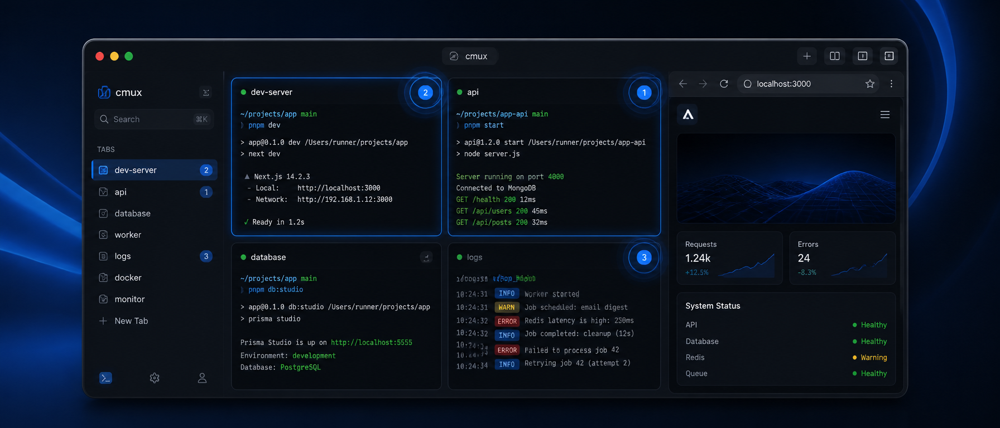
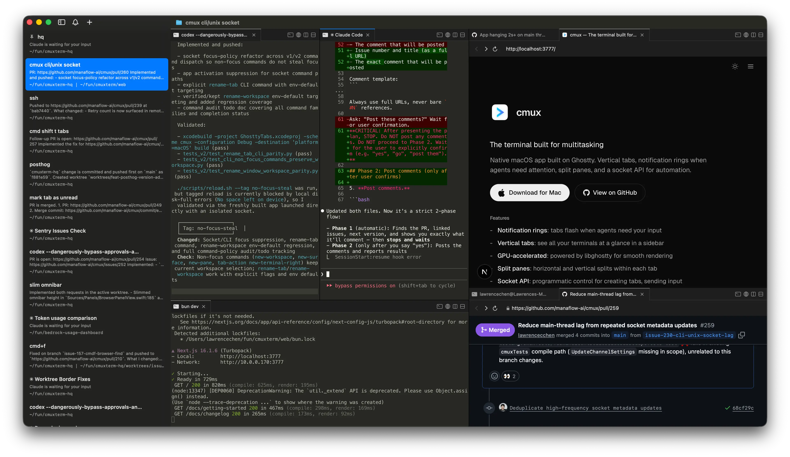
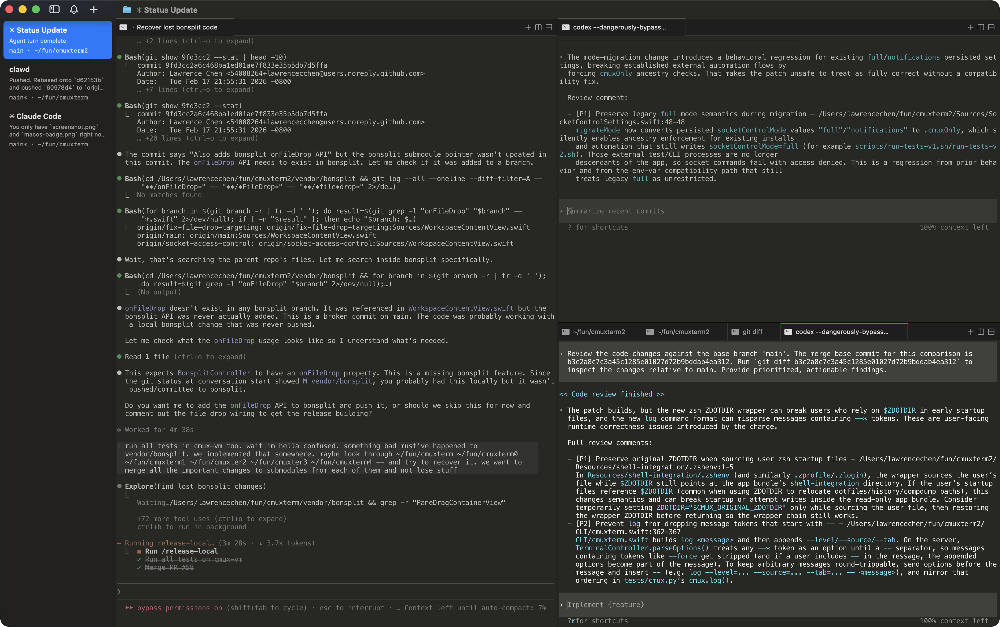
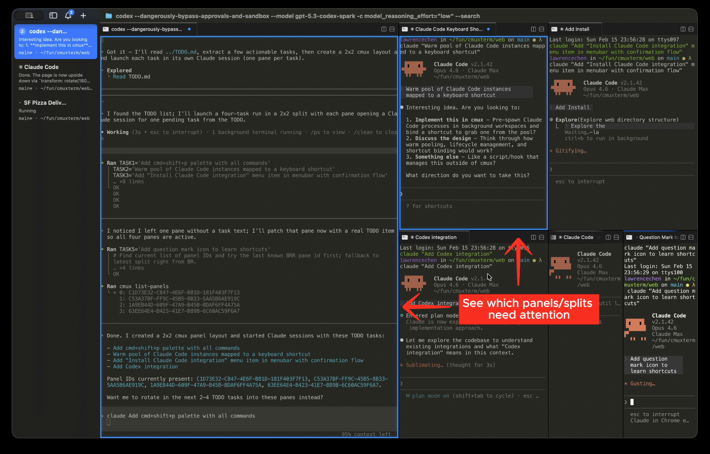
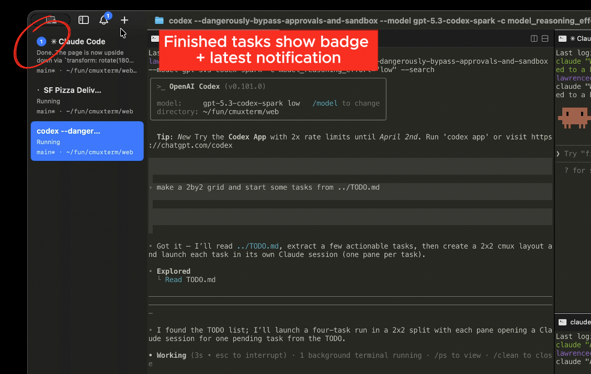
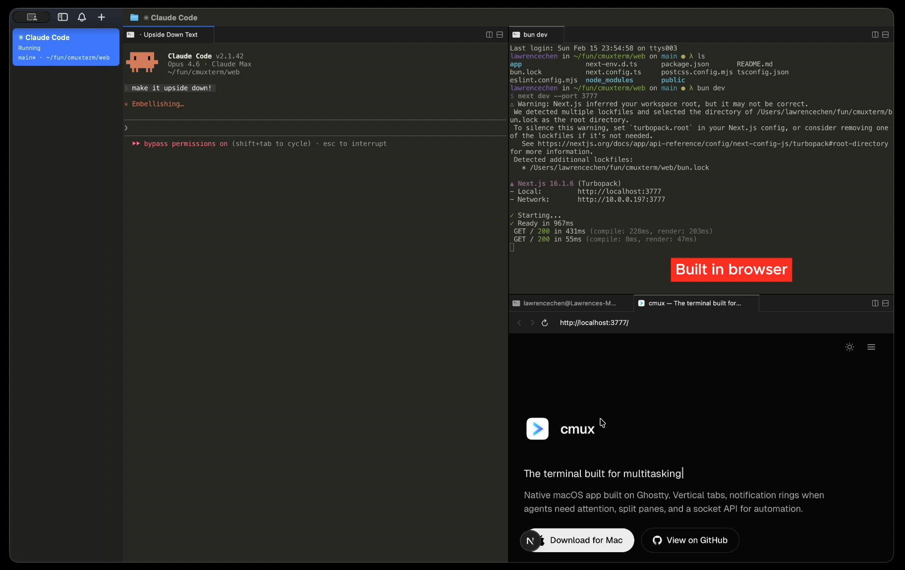
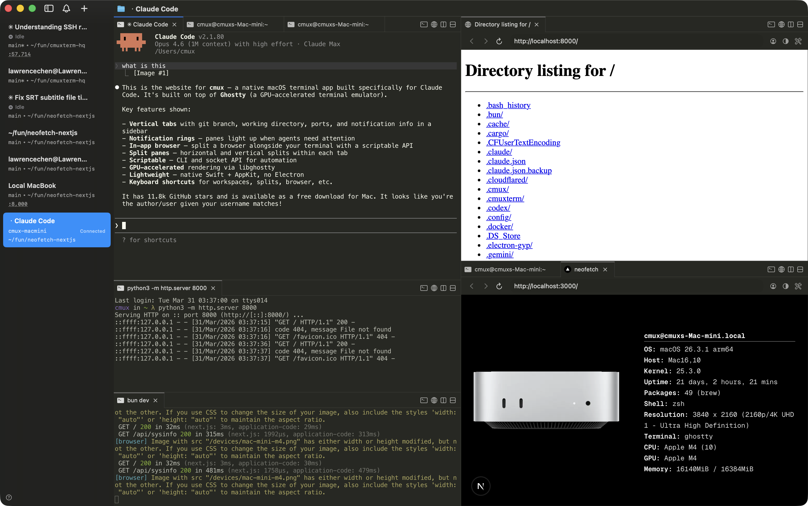
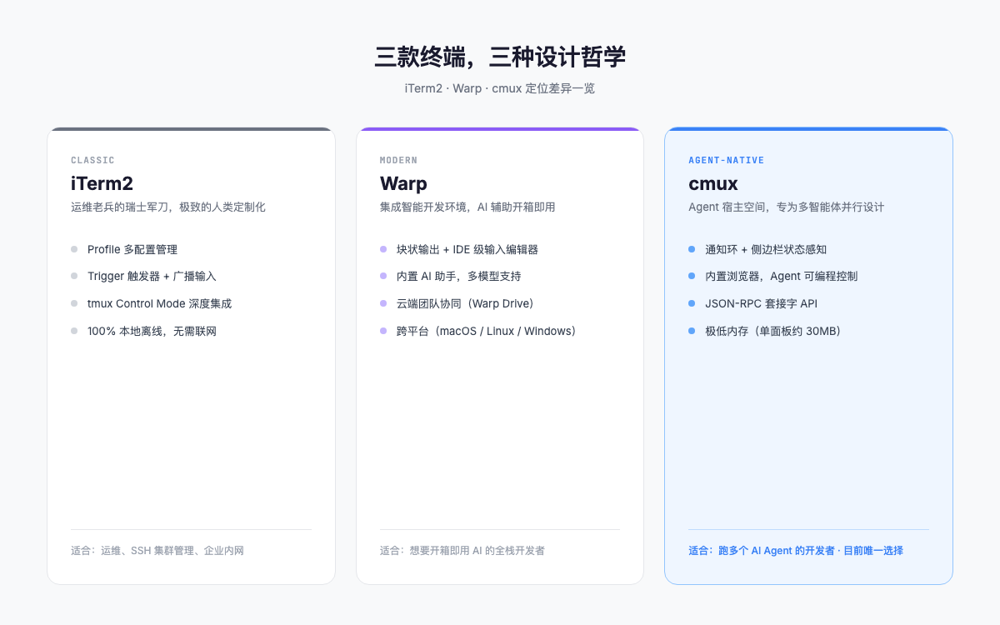

> 我同时开了 3 个 Claude Code，窗口切换切到怀疑人生。直到我遇见了 cmux。



---

## 一个真实的痛点

最近我的工作流变成了这样，开一个 Claude Code 写前端，开一个改后端 API，再开一个跑测试。

三个 Agent 并行推进，效率确实上去了。但终端窗口也变成了灾难现场。

iTerm2 里三个 tab 来回切，不知道哪个 Agent 在等我输入，哪个还在干活。macOS 系统通知倒是一个接一个弹，但标题全都是「Claude is waiting for your input」，根本分不清是哪个工作区在叫我。

更崩溃的是，Agent 写完代码想在浏览器里看效果，我得手动切到 Chrome，输 localhost:3000，看一眼不对，再切回终端改 prompt。这一来一回，思路断了，Agent 的上下文也凉了。

这就是我越来越强烈的感受，传统终端是给人设计的，当屏幕上有好几个 Agent 在同时跑的时候，它就彻底失灵了。

---

## cmux 是什么

cmux 是 Manaflow AI 团队做的一个终端复用器，基于 Ghostty 渲染引擎，跑在 macOS 上。开源项目，GitHub 上已经快 20K Star。

简单说就是，市面上唯一一个专门为 AI 编程智能体设计的终端。

cmux 不跑模型，不补全代码，甚至不算一个 AI 工具。它做的事情更底层，给你的 Agent 提供一个结构化的工作空间，让你知道每个 Agent 在干什么、哪个在等你。





这种设计哲学很对胃口。它就是把终端的底层能力直接暴露出来，你想用 Claude Code 也好，用 Aider 也好，用 Codex 也好，cmux 都能托得住。

---

## 四个核心特性

### 通知环：一眼看出谁在等你

这是我用下来最先感受到的功能。

当一个 Agent 需要你输入的时候，对应的终端面板边缘会亮起一圈**蓝色光环**。同时，左侧边栏的工作区标签上会出现未读徽标。

不用来回切 tab 猜哪个 Agent 在等你。按 `Cmd+Shift+U`，焦点直接跳到最新一个等待输入的面板。



听起来不起眼，但用习惯了真的回不去。之前用 iTerm2 跑多个 Agent，我只能把系统通知一个个点开看。现在侧边栏一眼扫过去就知道谁在等我，谁还在干活。

侧边栏还能显示 Git 分支和监听端口。这两个信息我之前每次都要手动查，现在一眼就看到了。



### 浏览器分屏：不用切 Chrome 了

cmux 在终端窗口里直接嵌入了一个浏览器面板，基于 macOS 原生的 WebKit 引擎。

Agent 写完代码，启动了本地开发服务器，它可以直接在 cmux 里的浏览器面板打开 localhost:3000，看到渲染效果。你也能同时在旁边看到 Agent 在浏览器里做了什么。



而且这个浏览器是可编程的。它暴露了一套从 agent-browser 项目移植过来的 API，Agent 可以自己打开页面、点按钮、填表单，甚至保持登录状态。

做全栈开发的应该懂这种感觉。Agent 写完前端代码，自动打开浏览器验证，发现布局不对，直接回到终端改 prompt。整个过程不用离开 cmux。

### 套接字 API：让 Agent 自己管面板

假设你有一个「经理 Agent」负责拆分任务，三个「工人 Agent」分别执行。经理 Agent 需要实时知道每个工人的进度，必要时向特定的工人发送新指令。

cmux 在本地启动一个 Unix 域套接字，通过 JSON-RPC 协议，Agent 可以自动创建新的分屏、在指定面板里输入命令、读取另一个面板的屏幕输出。

cmux 启动 shell 时会自动注入环境变量，告诉运行在里面的工具，你当前处于哪个工作区的哪个面板。这意味着任何运行在 cmux 里的工具都能感知到自己的位置。

套接字连接默认只允许 cmux 的后代进程，也可以开启自动化模式允许同用户下的任意进程连接，或者用密码模式做鉴权。

### SSH 到远程机器，浏览器也能用

`cmux ssh user@remote` 一行命令就能连到远程服务器，自动创建一个独立工作区。有意思的是，内置的浏览器面板也能走远程网络，直接在 cmux 里打开远程的 localhost 地址。



你甚至可以把本地图片拖进远程终端面板，cmux 会自动通过 scp 上传。对于经常要连远程服务器调试的开发者来说，不用再在终端和浏览器之间来回切了。

### 内存只有 iTerm2 的四分之一

cmux 的渲染层用了 Ghostty 引擎，用 Zig 和 Swift 写的，没有 Electron 那套。

据实测，单个终端面板大约只占 30MB 内存，开三个面板也就在 90MB 左右。相比之下，iTerm2 单个面板就要 120MB，Warp 因为块状管理和内置模型，内存常驻开销更大。

跑 Agent 已经够吃内存了，终端不应该再跟 Agent 抢资源。

---

## 和 iTerm2、Warp 的定位差异



如果你只管一台服务器，iTerm2 够用。如果你在跑多个 Agent，cmux 是目前唯一的选择。

**iTerm2** 是运维老兵的瑞士军刀。Profile 管理、Trigger 触发器、tmux Control Mode、广播输入，这些功能在管理 SSH 集群和企业内网环境的场景下依然无可替代。但它确实不是为 AI Agent 设计的。

**Warp** 走的是另一条路，把终端改造成一个「集成智能开发环境」。块状输出、IDE 级的输入编辑器、云端团队协同、内置 AI 助手。2026 年初已全面开源客户端代码。如果你想要开箱即用的 AI 辅助，Warp 很舒服。但强制登录、数据上云、输入编辑器与传统 shell 工具（fzf、zoxide 等）的兼容冲突，也让不少人望而却步。

**cmux** 的定位最精准，只解决一个问题，怎么让多个 Agent 在同一个终端里跑得井井有条。

不过目前 cmux 只支持 macOS 14.0 以上，没有 Linux 和 Windows 版本。主题和插件生态也还在初期。

实际使用中，我推荐 **tmux + cmux 混编**。tmux 管理长生命周期的后台任务（编译、数据库迁移、SSH 会话），cmux 作为外层窗口管理器，专门承载 Agent 工作区。各管各的，互不干扰。

---

## 上手指南

安装很简单，Homebrew 两行搞定。

```bash
brew tap manaflow-ai/cmux
brew install --cask cmux
```

或者直接去 [GitHub Releases 页面](https://github.com/manaflow-ai/cmux/releases/latest/download/cmux-macos.dmg)下载 DMG。

启动后的第一步，建议先跑一个 Claude Code 试试。当 Agent 需要你确认的时候，注意观察面板边缘的蓝色光环和侧边栏的未读标记。按 `Cmd+Shift+U` 快速跳转到等待中的面板。

想体验浏览器分屏的话，侧边栏点「+」可以新建一个浏览器面板，直接输入 localhost 地址就能看到本地服务的效果。

如果你想深入折腾套接字 API，可以参考 cmux 官方文档里的 JSON-RPC 端点列表，通过 Unix 域套接字调用。

---

## 写在最后

用了两周 cmux，我最大的感受是，终端终于不再是 AI 编程里的短板了。

如果你的工作流里已经有两三个 Agent 在并行，试试 cmux，回不去的。

欢迎关注我的公众号「Chyris Tech Note」，获取更多 AI 技术解读与实践分享。
