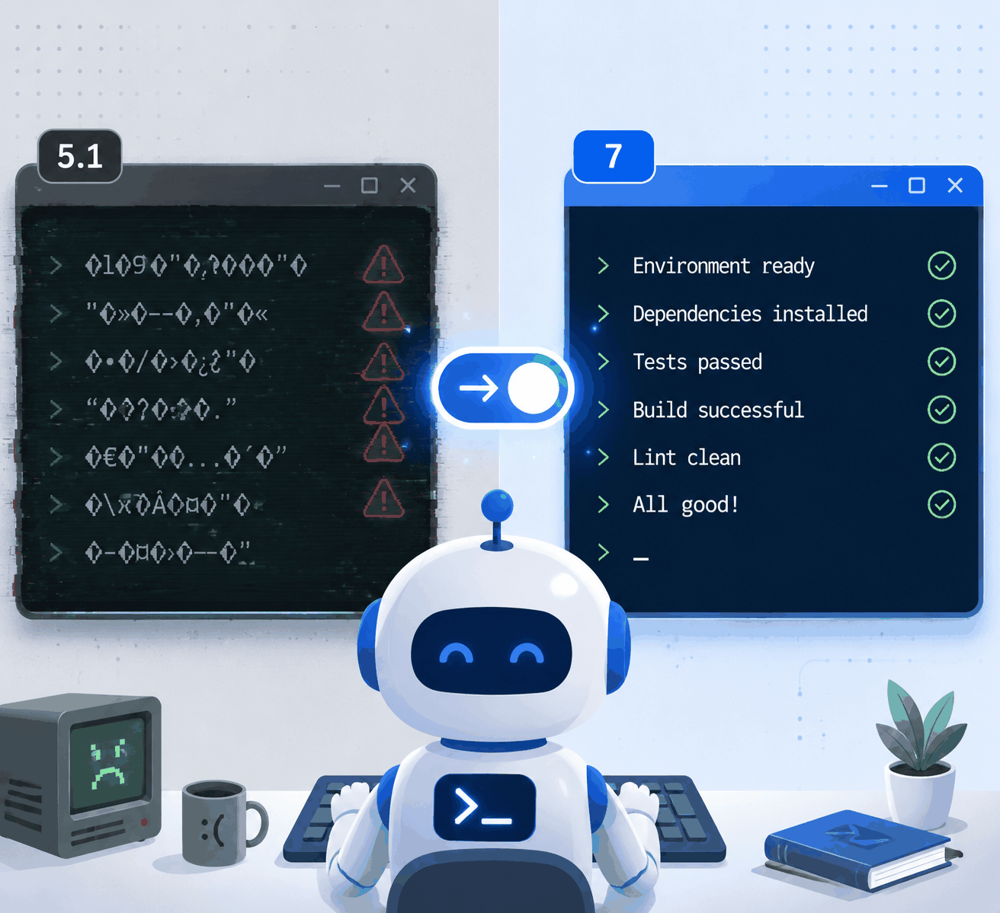
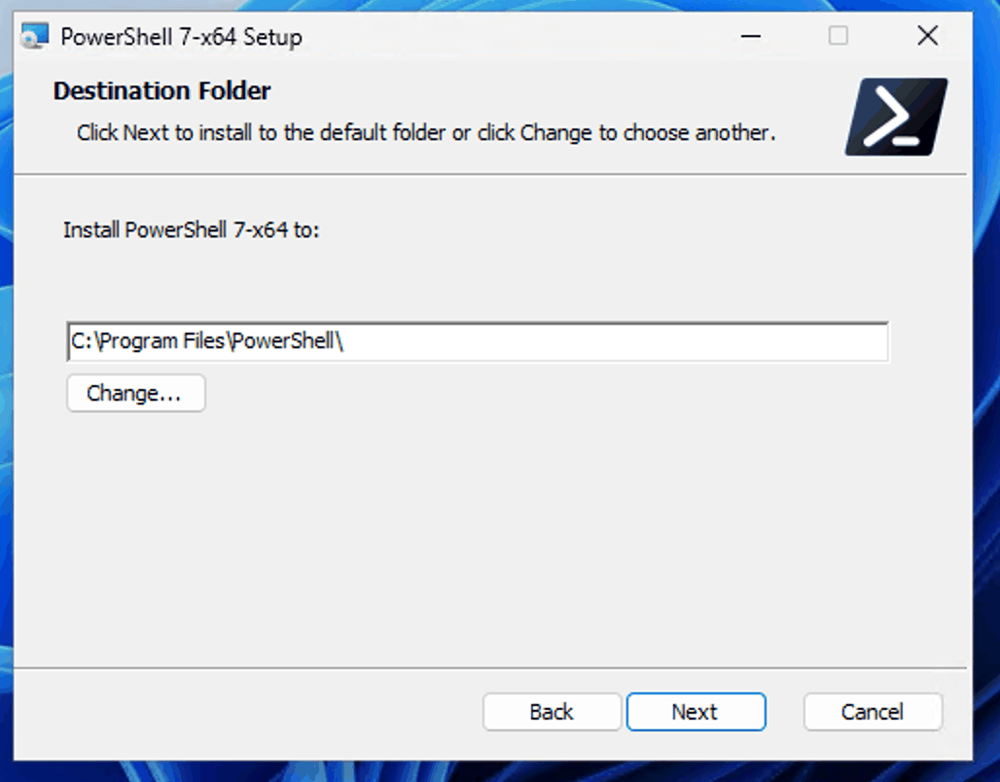
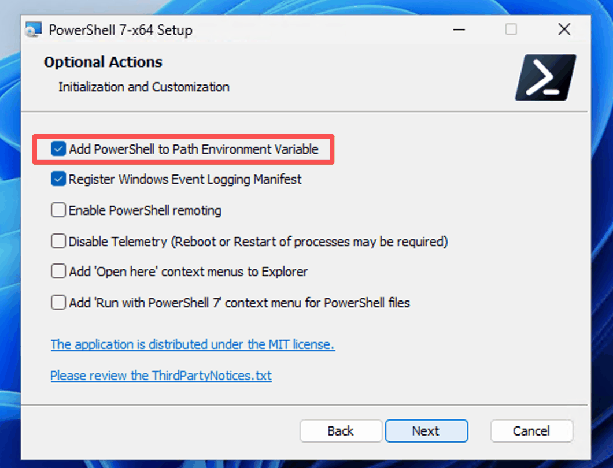
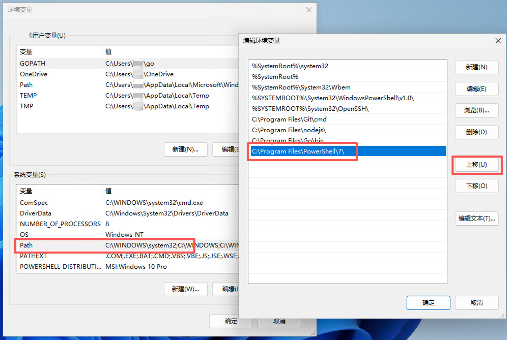
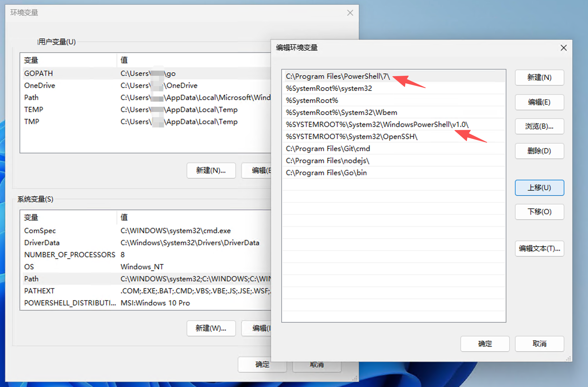
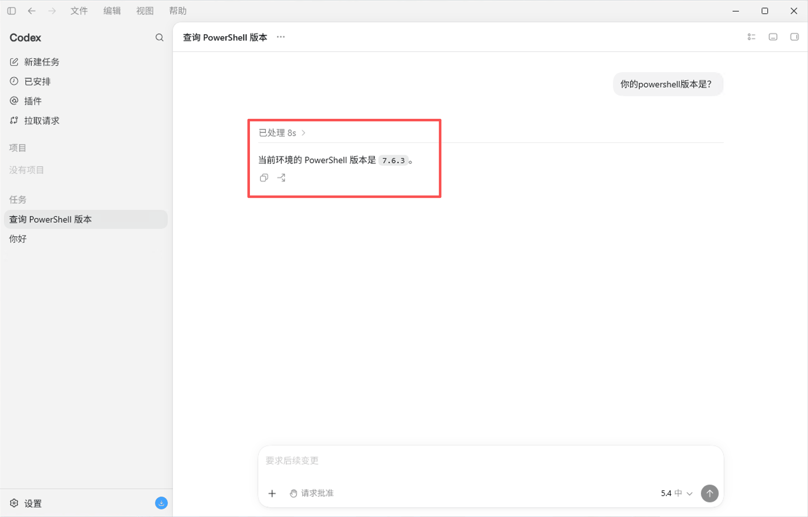

# 让 Codex 在 Windows 上默认使用 PowerShell 7

> 解决中文路径、引号解析、语法兼容等问题，提高 Codex 本地任务成功率。



---

## 前言

在 Windows 上用 Codex 做本地开发时，如果你经常遇到：

- 中文路径或中文输出乱码/异常
- 命令里带引号、JSON、正则时解析失败
- 明明 PowerShell 7 支持的写法，Codex 执行时却报错
- 同样命令手动跑正常，Codex 调用就不稳定

那么大概率是因为 **Codex 默认启动的是 Windows 自带的 PowerShell 5.1**，而不是 PowerShell 7。


你可以在 Codex 里执行下面命令确认当前 shell 版本：

```powershell
Get-Process -Id $PID | Select-Object Id, ProcessName, Path
$PSVersionTable.PSVersion
```

如果输出类似：

```text
ProcessName: powershell
Path:        C:\WINDOWS\System32\WindowsPowerShell\v1.0\powershell.exe
PSVersion:   5.1.x
```

就说明需要手动切换到 PowerShell 7。

---

## 步骤一：安装 PowerShell 7（MSI 版）

推荐使用 MSI 版本，路径稳定，也更容易控制环境变量。

### 方式 A：用 WinGet 安装 MSI 版（需要代理打开TUN模式）

```powershell
winget install --id Microsoft.PowerShell --source winget --installer-type wix
```

> 实测 WinGet 安装的 MSI 版**默认会勾选“Add PowerShell to PATH”**，但加进去的位置通常在 PowerShell 5.1 下面，所以后面还需要手动置顶。

### 方式 B：手动下载 MSI 安装包

如果 WinGet 不方便，也可以去微软官方文档下载 MSI 包：

> https://learn.microsoft.com/zh-cn/powershell/scripting/install/install-powershell-on-windows?view=powershell-7.6#msi

---

## 步骤二：安装时保持默认路径并勾选 Add PowerShell to PATH

安装向导中，默认路径通常是：

```text
C:\Program Files\PowerShell\
```



下一步的 **Optional Actions** 中，确保勾选：

> **Add PowerShell to Path Environment Variable**



这一步会把 `C:\Program Files\PowerShell\7\` 加入系统 `Path`，但如前面所说，它往往排在 PowerShell 5.1 的下面，所以还需要下一步手动调整顺序。

---

## 步骤三：把 PowerShell 7 路径置顶

### 为什么必须置顶？

Windows PowerShell 5.1 的系统路径是：

```text
%SYSTEMROOT%\System32\WindowsPowerShell\v1.0\
```

如果 `C:\Program Files\PowerShell\7\` 排在它下面，Codex 仍然可能优先找到 `powershell.exe`，继续调用 5.1。

### 操作方法

打开系统环境变量编辑界面：

```text
系统属性 -> 高级 -> 环境变量 -> 系统变量 -> Path -> 编辑
```

找到 `C:\Program Files\PowerShell\7\`，选中后点击**上移**，把它排到 `WindowsPowerShell\v1.0\` 的上面。



调整完成后，顺序应该是：

```text
C:\Program Files\PowerShell\7\
...
%SYSTEMROOT%\System32\WindowsPowerShell\v1.0\
```



点击确定保存。

---

## 步骤四：重启 Codex

修改系统 `Path` 后，**已经运行的 Codex 进程不会自动刷新环境变量**，必须完整退出并重新打开 Codex。

重启后可以直接问 Codex：

```text
你的 PowerShell 版本是？
```

如果看到 **7.x**，说明已经切换成功。



---

## 更完整的验证命令

> **注意：以下命令需要在 Codex 的输入框里执行，而不是在 Windows 自带的终端或 VS Code 终端里执行。**
>
> 外部终端（如 Windows Terminal）的默认配置可能还是 Windows PowerShell 5.1，那是终端自己的默认配置文件，和 Codex 无关。

如果想确认 Codex 当前进程确实是 `pwsh`，可以执行：

```powershell
Get-Process -Id $PID | Select-Object Id, ProcessName, Path
$PSVersionTable.PSVersion
$PSHOME
```

期望看到：

```text
ProcessName: pwsh
Path:        C:\Program Files\PowerShell\7\pwsh.exe
PSVersion:   7.x
```

再执行：

```powershell
Get-Command powershell, pwsh -ErrorAction SilentlyContinue |
  Select-Object Name, CommandType, Source, Path |
  Format-List
```

正常情况下会显示：

```text
powershell.exe -> C:\WINDOWS\System32\WindowsPowerShell\v1.0\powershell.exe
pwsh.exe       -> C:\Program Files\PowerShell\7\pwsh.exe
```

这说明：

- `pwsh` 可以调用 PowerShell 7
- `powershell` 仍是系统自带的 5.1
- Codex 当前默认 shell 已经进入了 PowerShell 7

---

## 为什么不建议用 shell_path 配置

Codex 的配置文件一般在：

```text
C:\Users\<用户名>\.codex\config.toml
```

有人尝试写：

```toml
shell_path = "C:\\Program Files\\PowerShell\\7\\pwsh.exe"
```

但实测这个配置**不能让本地命令通道稳定切到 PowerShell 7**。而且 OpenAI 官方 Codex 配置参考里也没有把 `shell_path` 列为公开配置项。

所以最可靠的方式还是：

1. 安装 PowerShell 7
2. 把 `pwsh.exe` 所在目录加入系统 Path，并排在 PowerShell 5 之上
3. 重启 Codex
4. 用命令确认当前进程是 `pwsh`

---

## 常见问题

### 1. 已经加了 Path，Codex 为什么还是找不到 pwsh？

最常见原因：**Codex 没重启**。

可以先检查系统 Path：

```powershell
[Environment]::GetEnvironmentVariable('Path', 'Machine') -split ';' |
  Where-Object { $_ -match 'PowerShell' }
```

再检查当前进程 Path：

```powershell
$env:Path -split ';' |
  Where-Object { $_ -match 'PowerShell' }
```

如果系统 Path 有 PowerShell 7，但当前进程 Path 没有，重启 Codex 即可。

### 2. 改 PSModulePath 有用吗？

**没用**。启动 `pwsh.exe` 看的是 `Path`，不是 `PSModulePath`。

`PSModulePath` 是用来搜索 PowerShell 模块的，比如 `Import-Module`，它不会决定启动 PowerShell 5 还是 7。

### 3. 切换后还会遇到中文或引号问题吗？

会**明显减少**，但不能保证 100% 消失。

PowerShell 7 对 UTF-8、现代命令行行为、跨平台兼容性更好，中文输出和脚本兼容性会稳定很多。

但复杂命令仍可能经过多层解析：

```text
Codex -> PowerShell 7 -> 外部程序 -> 程序自己的参数解析
```

下面这些场景仍要注意：

- JSON 参数
- 正则表达式
- 中文路径
- 多层嵌套引号
- `node -e`
- `python -c`
- `cmd /c`
- `bash -lc`

遇到复杂命令时，建议使用**脚本文件**、**参数数组**或 **here-string**，减少一行命令里的引号嵌套。

---

## 最终效果

配置完成后，Codex 执行本地 shell 命令时，默认环境会变成：

```text
PowerShell 7.x
C:\Program Files\PowerShell\7\pwsh.exe
```

这能明显降低 Windows PowerShell 5.1 带来的编码、中文路径、引号解析和语法兼容问题，Codex 的任务成功率和 token 利用率都会高很多。

---

## 参考资料

- Microsoft PowerShell 7 Windows 安装文档：https://learn.microsoft.com/en-us/powershell/scripting/install/install-powershell-on-windows
- PowerShell 环境变量说明：https://learn.microsoft.com/en-us/powershell/module/microsoft.powershell.core/about/about_environment_provider
- PSModulePath 说明：https://learn.microsoft.com/en-us/powershell/module/microsoft.powershell.core/about/about_psmodulepath
- Codex 配置基础：https://developers.openai.com/codex/config-basic
- Codex 配置参考：https://developers.openai.com/codex/config-reference
