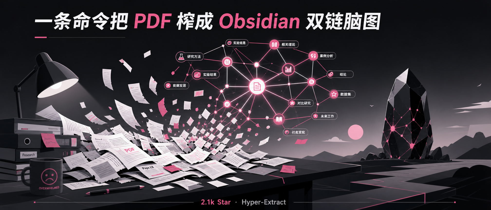
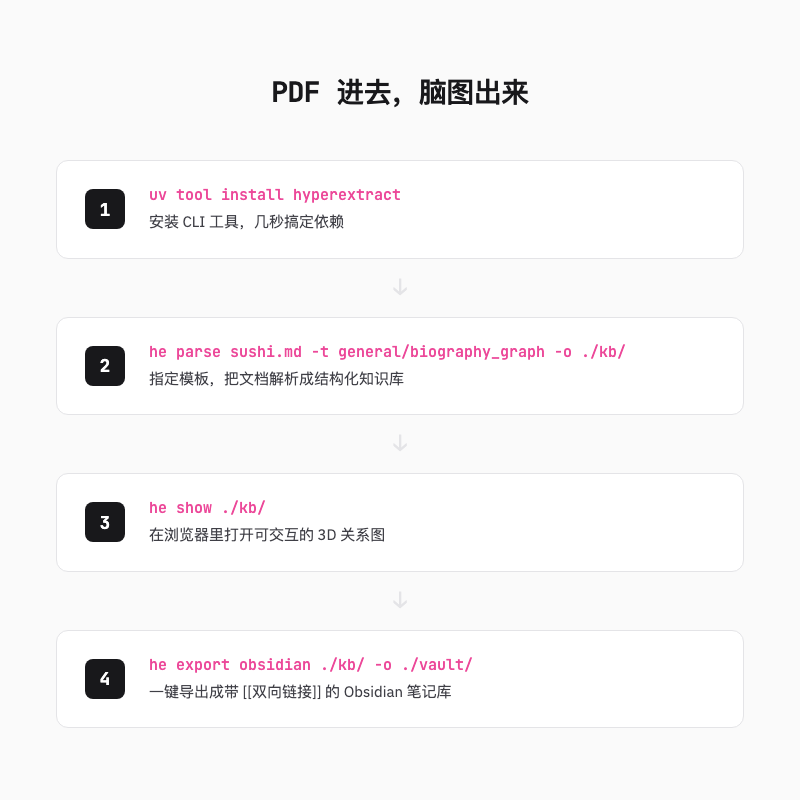
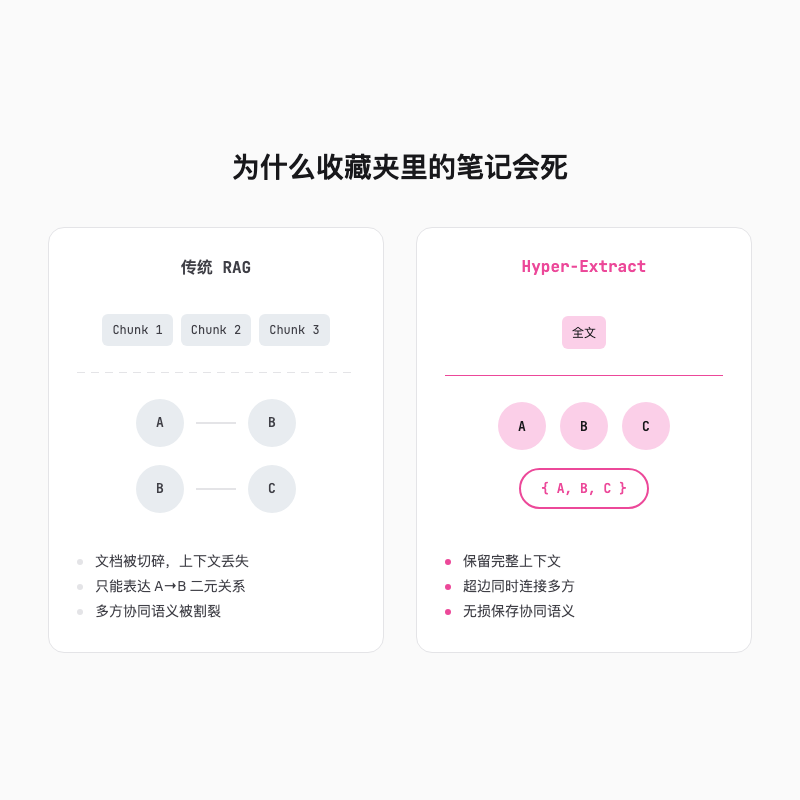
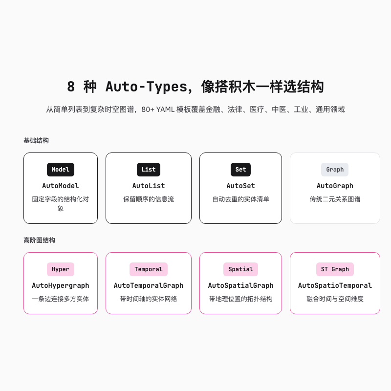
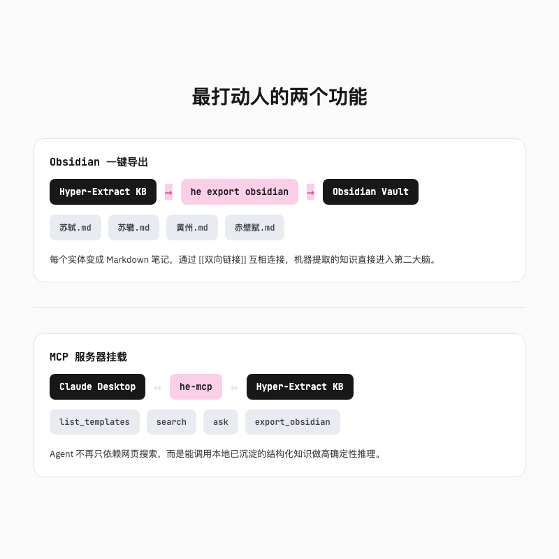

# 读完就忘的论文有救了，一条命令把 PDF 榨成 Obsidian 双链脑图

> 读完论文最怕的不是没看懂，是看完后笔记像一盘散沙。收藏了 100 篇 PDF，却连苏轼到底有几个兄弟都记不住。



---

## 先说结论

我一开始以为 Hyper-Extract 跟别的提取工具差不多，就是跑得快一点。真正让我愿意继续用的是它处理复杂关系的方式。

它不是简单地把文档切碎再拼接，而是用「超图」把多方关系一起存下来。一份合伙协议里的三个人、一碗方剂里的几味药，它都能完整保留关系。最后还能一键导出成 Obsidian 里带 [[双向链接]] 的笔记库。

---

## 一、PDF 进去，脑图出来

我以前处理一篇 20 页的论文，流程大概是这样的。

先通读一遍，边读边划线。读到第二遍，觉得刚才划的线都不太重要。第三遍开始复制粘贴，把重点丢进 Obsidian。最后的结果通常是，Obsidian 里多了一篇名为「某论文笔记」的孤儿文件，和其他笔记之间几乎没有连接。

三个月后我彻底忘了自己读过这篇论文。

直到我试了一下 Hyper-Extract。装它只需要一行命令。

```bash
uv tool install hyperextract
```

配好 API Key 之后，对项目自带的苏轼示例跑了一次解析。

```bash
he parse examples/zh/sushi.md -t general/biography_graph -o ./sushi_kb/ -l zh
```

然后打开可视化。

```bash
he show ./sushi_kb/
```

浏览器里弹出了一张 3D 关系图。苏轼、苏辙、苏洵、王安石、欧阳修这些人不再是简历上干巴巴的名字，而是连在一起的节点。点击任意一个节点，相关的人物、作品、地点信息会展开。

那种感觉有点像，你以前读的是一份 Word 简历，现在读的是一张活生生的人脉地图。



---

## 二、为什么收藏夹里的笔记会死

兴奋完之后我开始想，为什么以前读论文从来没有这种感觉。

问题大概率出在传统的 RAG 流程上。你把一篇长文档切成很多小块，然后问 AI 问题。AI 根据向量相似度找回最相关的几块，拼在一起回答。听起来合理，但实际用起来经常出问题。

切块会割裂上下文。一段关于「苏轼被贬黄州」的描写，可能前半段讲政治背景，后半段讲创作心态。如果一刀切成两半，AI 检索到的只是碎片，回答自然片面。

更隐蔽的问题是，传统知识图谱只能表达二元关系，也就是 A 和 B 之间的关系。比如「苏轼 → 写诗 → 赤壁赋」。

但真实世界很多关系不是二元的。

一份商业合伙协议，是投资方 A、技术方 B、运营方 C 三方在特定时间共同签署的。一碗中药方剂，是黄芪、当归、川芎几味药按特定比例一起起效。如果硬要把这些三元甚至多元关系拆成 A-B、B-C、A-C 三条边，那份「三方共同签署」的整体语义就丢了。

全家福拆成三张双人照，人都在，但「这是一家人」那个味儿没了。



---

## 三、超图到底是什么

超图只是 Hyper-Extract 的底层思路。真正用起来，你会发现它把知识形态抽象成了 8 种积木。

普通图谱的边只能连两个点。超图的边可以一次连一群。三个人合伙开公司，就像三个人围着一口锅。普通图谱非要拍三张照片，一张 A 和 B，一张 B 和 C，一张 A 和 C。超图直接拍一张三人同框的照片，关系一目了然。

中药配伍更是如此。黄芪补气，当归养血，川芎活血，三味药在一起才有「气血双补」的整体效果。单独拆开来讨论每一对药材，根本无法解释为什么这个方子有效。

Hyper-Extract 把这种高阶关系看得很重。它不仅能提取「谁和谁有关」，还能保留「哪些人、哪些事、哪些地点共同构成了一个事件」。

这个方向有学术背景支撑。项目的主导者是清华大学软件学院 iMoonLab 的冯一凡博士，团队在超图计算和知识驱动 AI 方向做了不少工作。论文里的数据我记不太清了，但提升幅度很明显，不是那种只活在实验室里的漂亮概念。


---

## 四、8 种数据结构，80 多个模板

听起来很抽象，但用起来其实只需要选形状。

Hyper-Extract 把常见知识形态抽象成了 8 种强类型数据结构。官方文档里把它们叫 Model、List、Set、Graph、Hypergraph、Temporal Graph、Spatial Graph 和 Spatio-Temporal Graph，也常被统称为 Auto-Types。名字有点长，你不用全记。

对普通用户来说，最常用的是前面几种。

Model 适合提取固定字段的对象，比如一份财报摘要。List 适合保留顺序的信息，比如事件发展时间线。Set 适合做去重和聚合，比如从 50 篇文章里提取核心概念并合并同义词。

后面几种是图结构。Graph 是普通知识图谱，Hypergraph 是超图，Temporal Graph 带时间轴，Spatial Graph 带地理位置，Spatio-Temporal Graph 同时带上时间和地点。坦白说，最后几种我还没全都深度用过，但能感觉到它们在处理复杂文档时的潜力。

这 8 种结构像一套乐高。你不需要懂背后的算法，只需要选对积木形状。

更让人省心的是模板系统。项目在 `templates/presets` 里内置了 80 多个 YAML 模板，覆盖金融、法律、医疗、中医、工业和通用领域。

想提取人物关系，用 `general/biography_graph`。想分析财报，用 `finance/earnings_graph`。想处理中医方剂，用 `tcm/formula_hypergraph`。每个模板都是一个预先写好的提取方案，你只需要指定类型，不需要自己设计 prompt。

对于不是程序员的人来说，这一点非常关键。它把「怎么让 AI 理解我的文档」这个问题，变成了「我的文档像哪种模板」。



---

## 五、最打动人的两个功能

用过 Hyper-Extract 之后，有两个功能让我印象特别深。

一个是 **Obsidian 一键导出**。

```bash
he export obsidian ./sushi_kb/ -o ./sushi_vault/
```

跑完这条命令，你会得到一个标准的 Obsidian 知识库。每个实体都变成了一篇 Markdown 笔记，笔记之间用 Obsidian 原生的 [[双向链接]] 互相连接。

这意味着，机器帮你读了一遍文档，生成了一张关系网，然后直接把这张网织进了你的第二大脑。你可以像浏览自己的笔记一样浏览 AI 提取出来的知识，还能继续往里面补充自己的想法。

另一个功能是 **MCP 服务器**。

Hyper-Extract 提供了 `he-mcp`，可以通过 Anthropic 力推的 Model Context Protocol 协议，把本地知识库暴露给 Claude Desktop、Cursor、VS Code 等 AI 编辑器或 Agent。

换句话说，以后你在 Claude Code 里写代码、查资料的时候，可以直接问它「我本地那个苏轼知识库里，苏轼和黄州有什么关系」。Agent 不再只依赖网页搜索，而是能调用你亲手喂进去、已经结构化的本地知识。

你的知识库终于成了 Agent 的「长期记忆」，不用每次聊天都从头解释。



---

## 六、最小 demo 与上手建议

光说不练没意义，下面是真正跑一遍的流程。

安装。我这边因为 uv 版本比较新，一步就过了。

```bash
uv tool install hyperextract
```

初始化 API Key。目前支持 OpenAI、Anthropic Claude、阿里云百炼，也可以用本地 vLLM。

```bash
he config init -k YOUR_OPENAI_API_KEY
```

跑一个自带示例。

```bash
he parse examples/zh/sushi.md -t general/biography_graph -o ./sushi_kb/ -l zh
he show ./sushi_kb/
he export obsidian ./sushi_kb/ -o ./sushi_vault/
```

整个流程跑下来，在 uv 和 API Key 已经准备好的前提下，我第一次大概花了不到十分钟。最花时间的是等 API 返回结果，不是配置环境。`he show` 第一次没自动打开浏览器，我手动复制了地址才看到图，还以为卡死了。

如果你也遇到类似情况，不用慌，复制 `http://127.0.0.1` 开头的地址到浏览器就行。

如果你担心数据出境，可以本地部署 Qwen3.5-9B 加 bge-m3，通过 vLLM 跑。项目 README 里给了完整的示例代码，这里就不贴了。

对普通用户来说，我的建议是先从人物关系和论文图谱入手。这两类文档结构清晰，模板成熟，最容易看出 Hyper-Extract 和传统笔记方式的差别。

---

## 总结

Hyper-Extract 没有改变阅读这件事本身，但它改变了「读完后怎么办」。

过去我们读论文、读财报、读合同，读完后留下的是一堆高亮和便签。它们彼此孤立，过段时间就和没读过一样。Hyper-Extract 提供了一种把阅读成果结构化的方式，不是简单切块，而是尽量理解人、事、物之间的真实关系。

现在它最让我上瘾的是 Obsidian 导出。MCP 功能我也只是浅尝了一下，但已经能想象到以后的用法。如果 Agent 能稳定调用本地沉淀下来的知识结构，那我们和 AI 协作的方式确实会变。

当然，它现在还年轻，GitHub 上只能算起步。但我愿意给它一个关注，因为至少它解决了一个我真实遇到的问题。

读完的文档，不该死在收藏夹里。

---

欢迎关注我的公众号「Chyris Tech Note」，获取更多 AI 技术解读与实践分享。
