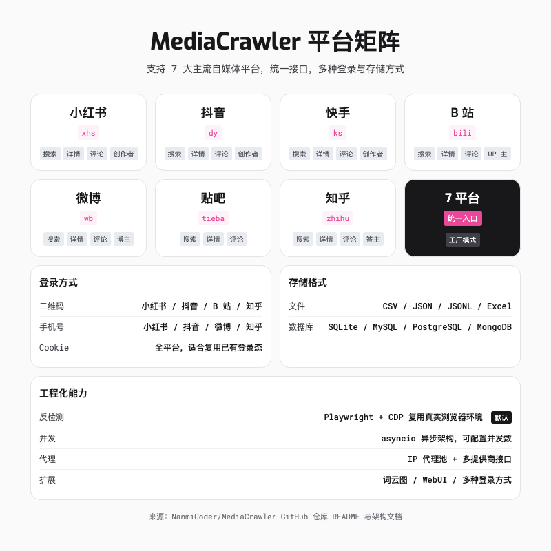
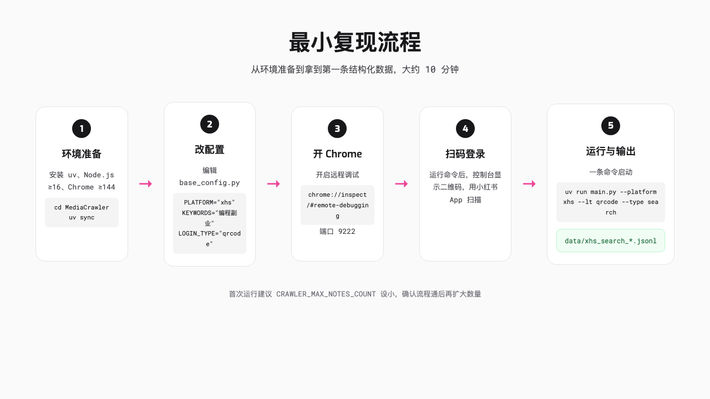
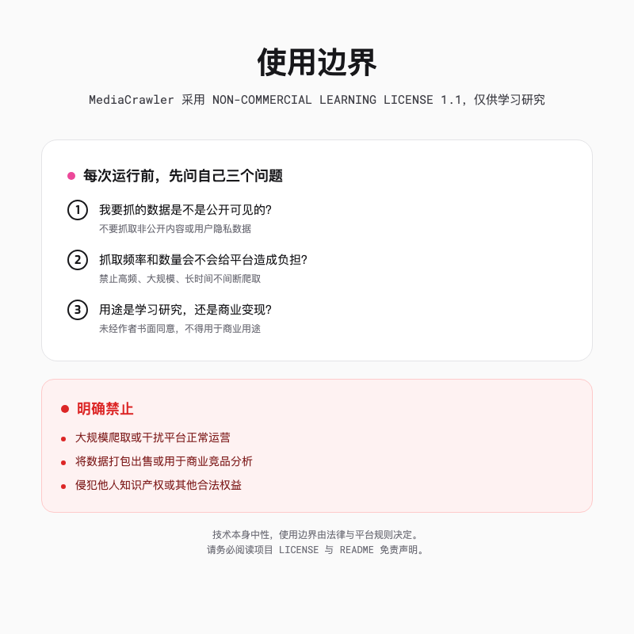

# 不用 JS 逆向，用你手里的 Chrome 就能抓小红书

> **声明**：本文介绍的 MediaCrawler 仅供学习研究使用，不得用于商业用途、大规模爬取或任何违法行为。项目采用 NON-COMMERCIAL LEARNING LICENSE 1.1，请遵守目标平台规则与相关法律法规。

> 如果你也曾在深夜手动刷小红书整理选题，复制标题、粘贴点赞数、再一张一张截图，这篇就是写给你的。


---

## 一句话总结

MediaCrawler 的思路挺直接，它用 Playwright 和 CDP 蹭你 Chrome 里现成的登录态，7 个平台的数据，装好依赖、开个 Chrome、扫个码就能抓。它适合学习和小批量研究，**不适合也不允许商业采集**。

---

## 一、MediaCrawler 是什么

它本质上是个帮你抓自媒体数据的工具，支持小红书、抖音、快手、B 站、微博、百度贴吧、知乎 7 个平台。每个平台都能做关键词搜索、指定帖子详情、二级评论、创作者主页，还能选登录方式和存储格式。



和传统爬虫最大的区别是，它**不教你 JS 逆向**。你不用去扣某个平台的加密 sign、不用研究接口签名算法、不用抓包分析 protobuf。它的思路是，**直接控制你电脑上的 Chrome 浏览器**，让浏览器帮你完成登录、签名、请求这一系列动作。

说白了，你会改配置、会跑命令，就能拿到结构化的搜索结果和评论数据。

---

## 二、环境准备，先把坑踩完

MediaCrawler 的依赖不算复杂，但有几个前置条件必须一次到位，否则后面会反复报错。

我第一次跑的时候卡了半小时，后来发现是 Chrome 版本太旧。建议你先确认 Chrome 版本 ≥ 144，其他依赖反而没那么挑。

**需要准备的东西**

- Python 3.11（项目用 uv 管理依赖，强烈推荐）
- Node.js ≥ 16（部分平台签名需要 JS 运行时）
- Google Chrome 或 Edge，版本 ≥ 144
- 稳定的网络环境

**安装步骤**

```bash
# 1. 进入项目目录
cd MediaCrawler

# 2. 用 uv 安装依赖
uv sync
```

如果你还没装 uv，去 Astral 官方文档按系统装一个。它比 pip 快，依赖解析也更稳。uv 装好后，上面的 `uv sync` 会自动把 Python 版本和包都拉齐。

**我卡了半小时的地方，Chrome 远程调试没开**

MediaCrawler 默认用 CDP 模式连接你已有的浏览器。你需要在 Chrome 地址栏输入下面这串地址，然后勾选「Allow remote debugging for this browser instance」。

```
chrome://inspect/#remote-debugging
```

看到页面显示 `Server running at: 127.0.0.1:9222`，才算就绪。

这一步很关键。因为 MediaCrawler 不是启动一个干净的「机器人浏览器」，而是连上你正在用的 Chrome。你的登录态、Cookie、甚至某些扩展都能继承过去，平台那边看起来就像一个正常用户在浏览。

**我踩过的几个坑**

最蠢的是 uv 没装好的时候硬跑 `uv sync`，报错之后才去 Astral 官网下载。还有 Chrome 远程调试的确认对话框，默认只等 60 秒，我去倒水回来它就超时了，只能重新跑一遍。另外 Node.js 版本低于 16 的话，爬抖音和知乎的签名脚本可能会跑不动，升级一下就能解决。

---

## 三、最小复现，从小红书关键词开始

我强烈建议第一次跑用小红书做测试。它的登录流程最直观，二维码一扫就能进去。

**先改配置**

打开 `config/base_config.py`，关注这几行。

```python
PLATFORM = "xhs"
KEYWORDS = "编程副业,编程兼职"
LOGIN_TYPE = "qrcode"
CRAWLER_TYPE = "search"
CRAWLER_MAX_NOTES_COUNT = 15
ENABLE_GET_COMMENTS = True
ENABLE_CDP_MODE = True
SAVE_DATA_OPTION = "jsonl"
```

这里的 `KEYWORDS` 用英文逗号分隔多个关键词。`CRAWLER_MAX_NOTES_COUNT` 控制抓多少条，第一次跑建议设小一点，比如 15，确认流程通了再改。

**然后跑命令**

```bash
uv run main.py --platform xhs --lt qrcode --type search
```

命令跑起来后，Chrome 会弹出一个确认对话框，问你是否允许远程调试，点「接受」。然后控制台会显示二维码，打开小红书 App 扫一下登录。

**看输出**

如果一切顺利，几十秒后你会在 `data/` 目录下看到类似 `xhs_search_*.jsonl` 的文件。

每一行都是一个 JSON 对象，包含笔记标题、正文、点赞数、评论数、作者信息等字段。如果你开了评论抓取，还会生成对应的评论文件。

这就是最小复现的全部流程，开 Chrome 远程调试、改几行配置、扫个码、跑一条命令。



**一条数据长什么样**

默认的 JSONL 输出大概长这样，字段已经比较完整，可以直接导入 Pandas 或者导入数据库做进一步分析。

```json
{
  "note_id": "66xxxxxx",
  "title": "程序员做副业的 5 个方向",
  "desc": "分享一下我过去几年试过的副业...",
  "liked_count": 1234,
  "collected_count": 567,
  "comment_count": 89,
  "share_count": 45,
  "user_id": "abc123",
  "nickname": " tech 小王"
}
```

如果你开了评论抓取，还会得到对应的评论文件。评论里通常包含评论内容、点赞数、子评论数、评论者昵称等字段。做情绪分析或者选题挖掘时，这些往往比正文更有用。

---

## 四、为什么它能做到这么低门槛

以前抓小红书这类平台，最烦的就是那个 sign 参数。你根本不知道它怎么算出来的，抓包一看全是加密字段。后端收到请求后，会先校验这个 sign，错了就返回 403 或者直接给你一段空白。

传统做法有两种。一种是硬刚，把前端 JS 里的签名算法抠出来，用 Python 复刻一遍。这条路很折磨，因为代码通常被混淆过，变量名全是 a、b、c，还会加时间戳、设备指纹、随机数。另一种是绕过，直接上浏览器执行 JS，让平台自己算好 sign，你只管拿结果。

MediaCrawler 选了后者，但做得更聪明。

它用 Playwright 连到你的 Chrome，在页面上下文里直接执行 JS 表达式，拿到签名参数。因为浏览器里本来就有完整的页面环境，平台那边看起来，这跟你自己手动翻页没什么区别。风控很难区分。

它主要靠两个 trick。第一个是 CDP，全称 Chrome DevTools Protocol，MediaCrawler 通过它连上你本地已经登录过的 Chrome，复用你的 Cookie、本地存储、甚至浏览器指纹，这比启动一个全新浏览器自然得多。第二个更直接，它不需要你破解 sign 算法，只要在页面环境里调用平台自己的 JS 函数，把签名参数读出来就行，项目 libs 目录下的 `douyin.js` 和 `zhihu.js` 就是干这个的。

所以 MediaCrawler 没跟风控硬碰硬，只是**借了浏览器这个壳子，把自己伪装成普通用户**。

---

## 五、不只是小红书

跑通小红书之后，换平台几乎只需要改两个地方。

```python
PLATFORM = "dy"        # dy / ks / bili / wb / tieba / zhihu
KEYWORDS = "AI 工具,Agent"
```

然后重新运行命令。

```bash
uv run main.py --platform dy --lt qrcode --type search
```

不同平台的登录方式略有差异。小红书支持二维码、手机号、Cookie 三种；抖音有时候扫码后还会弹手机号验证，需要你在浏览器里手动点一下；我试下来，知乎和 B 站用二维码最稳。

**存储格式也可以换**

默认是 JSONL，每行一个 JSON 对象，追加写入性能最好。如果你要直接做数据分析，可以改成 Excel。

```bash
uv run main.py --platform xhs --lt qrcode --type search --save_data_option excel
```

或者用 SQLite，本地就能跑，不需要装 MySQL。

```bash
uv run main.py --init_db sqlite
uv run main.py --platform xhs --lt qrcode --type search --save_data_option sqlite
```

**存储格式怎么选**

我常用的是 JSONL 和 Excel。JSONL 每行一个 JSON 对象，追加写入快，适合丢给 Python 做后续处理。Excel 适合直接给非技术人员看，或者做透视表。SQLite、MySQL、PostgreSQL、MongoDB 也都支持，数据量大或者要持久化查询的时候再考虑。

**还有一些进阶能力**

- IP 代理池，在 `config/base_config.py` 里开启 `ENABLE_IP_PROXY`
- 词云图，把评论里的高频词可视化出来
- WebUI，如果你不想敲命令，可以运行 `uv run python -m api.main`，或者 `uv run uvicorn api.main:app --port 8080`，在网页上操作

不过这些对入门来说都是锦上添花。先把关键词搜索跑通，就已经能节省大量时间了。

---

## 六、合规边界，写在动手之前

MediaCrawler 的项目 LICENSE 是 NON-COMMERCIAL LEARNING LICENSE 1.1，明确写了三点。

1. 仅限学习和研究目的
2. 不得用于大规模爬取或干扰平台运营
3. 未经作者书面同意，不得用于商业用途

README 里也贴出了爬虫违法违规案例的链接。这不是吓唬人，只是在说，技术本身是中性的，但使用技术的边界由法律和平台规则决定。

我的建议是，**每次运行前先问自己三个问题**。

- 你要抓的数据是不是公开可见的？
- 你的抓取频率和数量会不会给平台服务器造成负担？
- 你拿这些数据是用来学习研究，还是商用变现？

如果第三个问题的答案是后者，请直接关掉这个项目。



---

## 七、什么时候用它，什么时候不用

它适合做选题调研，批量看某个关键词下的高互动笔记；也适合写行业观察，统计某类内容的评论区情绪；还适合学习爬虫工程化，看一个真实项目怎么组织代码、分层、处理登录和存储。

但有几个红线别碰。非公开内容、用户隐私、高频大规模抓取、把数据打包出售或用于商业竞品分析，这些都不行。另外，至少先把免责声明读一遍。

---

## 八、从代码结构里能学到什么

MediaCrawler 不只是一个能跑的工具，它的代码组织也挺有意思。我印象最深的是三层设计。

第一层是入口和工厂。`main.py` 解析完命令行参数后，交给 `CrawlerFactory` 创建对应平台的爬虫实例。新增平台时只要在这里注册一下，不需要改主流程。

第二层是存储层的解耦。`AbstractStore` 定义了统一接口，`StoreFactory` 根据配置决定输出到 CSV、JSONL、Excel 还是数据库。这意味着你换输出格式时，基本不用去改爬虫本身的逻辑。

第三层是基础设施的封装。浏览器管理、代理池、登录、缓存都被拆成了独立模块。CDP 浏览器控制、滑块验证、异步文件写入这些脏活累活，都不散落在业务代码里。

这种分层让新增一个平台变得相对简单。你只要实现 Crawler、Client、Login 三个核心类，再加一套对应的存储实现，就能跑起来。对于想学习工程化爬虫的人来说，这比看零散脚本要系统得多。

**我常用的三个调参**

- `CRAWLER_MAX_NOTES_COUNT`，控制本次抓多少条笔记，测试时设 15，正式跑可以设 100 或更高
- `MAX_CONCURRENCY_NUM`，并发数，默认是 1，网络稳定可以适当提高，但别调太高，容易触发风控
- `CRAWLER_MAX_SLEEP_SEC`，两次请求之间的最大间隔，默认 2 秒，低调一点可以设 3 到 5 秒

这些参数都在 `config/base_config.py` 里，注释是中文的，改起来没什么门槛。

---

## 九、跑不通的时候怎么办

任何爬虫项目，第一次跑通之前的调试时间，往往比写代码还长。MediaCrawler 也不例外。

我的经验是，先把 `HEADLESS` 设成 `False`，让浏览器窗口显示出来。这样你能看到它到底卡在登录页、二维码页，还是搜索页。很多问题看一眼页面就知道了。

如果程序直接报错，优先检查三件事。第一，Chrome 远程调试是否真的开了，端口是不是 9222。第二，登录态有没有过期，尤其是用 Cookie 登录的时候。第三，`CRAWLER_MAX_NOTES_COUNT` 不要一上来就设很大，先跑 5 到 10 条验证流程。

另外，`uv run main.py --help` 里能看到所有支持的命令行参数。有时候问题不是配置错了，而是参数组合不支持，比如某些平台当前只支持二维码登录。

跑通一次之后，建议把 `SAVE_LOGIN_STATE` 保持为 `True`，这样下次会复用之前的登录态，不用每次都扫码。

---

## 十、我现在是怎么用它做选题的

跑通之后，我的 workflow 基本固定下来了。

第一步，确定关键词。比如我想写「AI 编程副业」，我会把相关词拆成一组，「编程副业」「编程兼职」「AI 接单」「自由开发者」，一次跑完。

第二步，设一个小数量，先跑 50 条左右看数据质量。主要是看标题和评论里有没有我没想到的切入点。

第三步，把 JSONL 转成 Excel，按点赞数和评论数排序，挑出一批高互动笔记，再手动点进去看正文和评论区。

第四步，写分析文章。这个时候我已经不是从零开始翻小红书，而是带着一组已经被验证过的话题去写。

评论数据往往比笔记本身更有价值。比如「AI 编程副业」这个选题，高赞笔记的标题可能都差不多，但评论区里会暴露真正的焦虑，副业收入不稳定、接单渠道难找、怕被割韭菜。这些情绪点，才是文章能不能打动读者的关键。

整个过程中，MediaCrawler 只负责第一步的「脏活」，后面的判断、归纳、写作还是人来做。我觉得这才是它正确的使用方式，机器做收集，人做思考。

---

MediaCrawler 最大的价值不是「能抓多少数据」，而是**把抓数据这件事从「需要精通逆向」降到了「会改配置、会跑命令」**。

它借你 Chrome 的壳子，让平台以为就是个普通用户在翻页。对我来说，它最大的意义是让我从手动复制粘贴的深夜劳动里解放出来。现在我做选题分析，第一步不再是打开小红书手动翻页，而是改几行配置跑一条命令。剩下的时间，用来想这篇文章到底该写什么。

技术本来就该干这种脏活累活，但别拿它去干越界的事。

---

欢迎关注我的公众号「Chyris Tech Note」，获取更多 AI 技术解读与实践分享。
