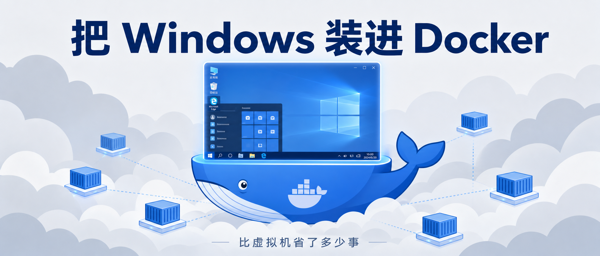
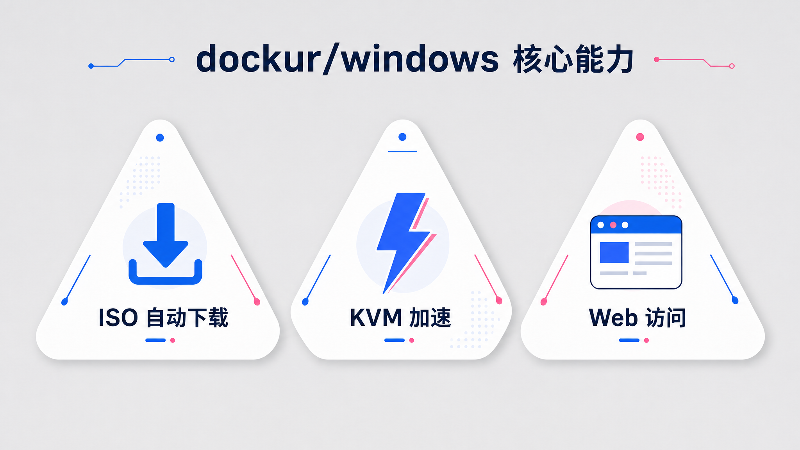
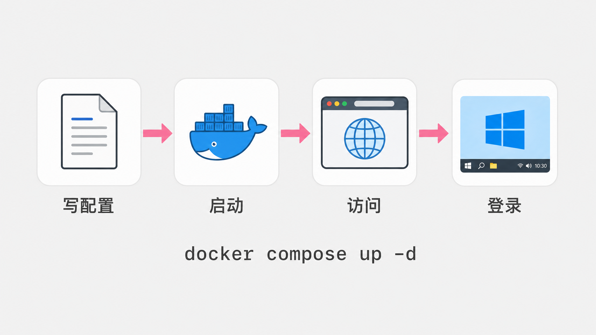

# 把 Windows 装进 Docker，比虚拟机省了多少事

> 临时需要一个 Windows 环境，装虚拟机太沉，租云主机太慢，有没有一种办法，能让 Windows 像起一个 nginx 容器一样简单？



---

## 一句话总结

dockur/windows 的做法是，把 Windows 塞进一个 Docker 容器，自动下载镜像、自动装好系统、浏览器打开就能用。简单说，它把「装虚拟机」变成了一条命令。

---

## 一个被虚拟机折磨过的夜晚

很多人都有过这种时刻。

电脑上跑着 Linux，临时要签一个只能用 Windows 版的电子合同客户端。或者前端同事扔过来一个只在 IE 里复现的 bug，而你手边只有 MacBook。再或者 CI 流水线里某个步骤必须在 Windows PowerShell 里跑。

第一反应是装虚拟机。打开 VirtualBox，找 ISO，配内存硬盘，装系统，装增强工具，重启三次。两个小时过去，你终于看见了 Windows 桌面，而原本只想用五分钟的那个软件，现在显得有点讽刺。

云服务也行，但开一台 Windows 云主机，按时间计费，用完还得记得关。对于「临时用一下」这个需求，它太重了。

dockur/windows 想解决的就是这件事。既然 Docker 能跑数据库、跑 nginx、跑一整套微服务，那为什么不能让 Docker 也跑一个 Windows 桌面？

---

## 它到底做了什么

dockur/windows 是 GitHub 上的一个开源项目，镜像名是 `dockurr/windows`，已经拿到了 **5.2 万 Star**。它基于 QEMU/KVM，把 Windows 的启动、安装、访问全部封装进了一个容器。

你不需要自己准备 ISO，也不需要盯着安装向导点下一步。给 `VERSION=11`，它就会自动下载对应的 Windows 11 镜像，然后在容器里完成无人值守安装。

装完之后，打开浏览器访问 `http://127.0.0.1:8006`，就能看到 Windows 桌面。整个过程和 `docker compose up` 没什么本质区别。



它最省事的地方有三处。不用自己找 ISO，项目内置了下载器，支持从 Windows 11 到 Windows XP、从 Server 2025 到 Server 2003 的多个版本。性能上靠 **KVM 加速**，容器直接调用宿主机的 `/dev/kvm`，不是纯软件模拟那种幻灯片。访问也方便，内置了 **Web 查看器**，开箱即用，安装阶段看进度、日常简单操作都不用配 **RDP**。

---

## 最小 demo，从 compose 到桌面

最简配置摆出来是这样的。

```yaml
services:
  windows:
    image: dockurr/windows
    container_name: windows
    environment:
      VERSION: "11"
    devices:
      - /dev/kvm
      - /dev/net/tun
    cap_add:
      - NET_ADMIN
    ports:
      - 8006:8006
      - 3389:3389/tcp
      - 3389:3389/udp
    volumes:
      - ./windows:/storage
    restart: always
    stop_grace_period: 2m
```

保存成 `compose.yml`，然后运行。

```bash
docker compose up -d
```

`docker compose up -d` 之后，第一次启动会下载 Windows 11 镜像并自动安装，时间取决于网速和硬盘。之后容器会记住这个状态，再次启动直接进入桌面。

等日志里看到安装完成的提示，打开浏览器访问 `http://127.0.0.1:8006`，就会看到一个完整的 Windows 11 桌面。

默认用户名是 **`Docker`**，密码是 **`admin`**。登录之后，这就是一个正常的 Windows 11，可以装软件、改设置、跑程序，和一台普通电脑没什么两样。

如果你不想本地装 Docker，项目也支持 GitHub Codespaces，点一下按钮就能在浏览器里启动预配置环境。还有一个叫 WinBoat 的图形化安装工具，给不喜欢命令行的人准备。



---

## 版本选择，比想象中更细

如果你以为只有 Windows 11 和 Windows 10 两个选项，那就小看了这个项目。

它的版本代码覆盖了大量场景。日常用选 `11`，就是 Windows 11 Pro，体积 7.9 GB。想轻量一点选 `11l`，LTSC 长期服务版，只有 4.7 GB。测老软件兼容性可以选 `10l` 甚至 `xp`，后者只有 0.6 GB。服务器方向从 `2025` 到 `2003` 都有，对应不同年代的 Windows Server。

如果你手里有自己的 ISO，也可以不用它的自动下载。把 ISO 挂载到 `/boot.iso`，项目会跳过下载直接用你的镜像。你也可以直接传一个 ISO 的下载 URL 给 `VERSION`。

---

## 改配置就是改几行环境变量

默认配置给 Windows 分配了 **2 个 CPU 核心**、**4 GB 内存**和 **64 GB 磁盘**。如果只是临时打开一个小工具，这已经够用。但如果你想跑重型软件或者多开浏览器，改起来也只是一行环境变量。

```yaml
environment:
  RAM_SIZE: "8G"
  CPU_CORES: "4"
  DISK_SIZE: "256G"
```

`DISK_SIZE` 不仅能扩容新盘，还能把已有磁盘扩容到更大容量。扩容后只需要在 Windows 的磁盘管理里把未分配空间合并进分区即可。

语言默认是英文，但可以通过 `LANGUAGE` 指定中文。

```yaml
environment:
  LANGUAGE: "Chinese"
```

用户名和密码也能自定义。

```yaml
environment:
  USERNAME: "bill"
  PASSWORD: "gates"
```

这些配置都不需要你去修改 Windows 内部设置，而是在容器启动前就定好。批量创建相同环境时，不用每台都点一遍安装向导。

---

## 宿主机和容器里的 Windows 怎么传文件

容器和宿主机之间默认有一个共享文件夹。启动后，Windows 桌面上会出现一个 `Shared` 文件夹，对应宿主机上你挂载的目录。

```yaml
volumes:
  - ./shared:/shared
```

把文件放进宿主机的 `./shared`，Windows 里立刻就能看到。反过来也一样。这比在虚拟机里插 U 盘、开 SMB 共享要直接得多。

项目通过内置的文件共享机制，把宿主机目录映射为 Windows 桌面上的 `Shared` 文件夹。如果你想共用更复杂的目录结构，也可以把其他路径挂到 `/storage` 子目录里。只是要注意，别把宿主机的根目录无脑挂进去。

---

## 只看网页不够，还可以这么玩

浏览器访问适合安装阶段和简单操作，但画质一般，也没有音频和剪贴板同步。它的价值是让你不用装任何客户端就能先看到桌面。真要长期用，建议换 RDP。

Windows 容器会把 3389 端口暴露出来，任何微软远程桌面客户端都能连。Android、iOS、Linux 的 FreeRDP、Windows 自带的 `mstsc`，都可以。连上去之后，体验和一台普通 Windows 远程主机差不多，音频和剪贴板也能正常工作。

RDP 的登录信息就是容器启动时配好的用户名和密码。默认是 `Docker` / `admin`，如果你改了 `USERNAME` 和 `PASSWORD`，就用改后的值。

如果你希望 Windows 像一台独立电脑一样出现在局域网里，可以配 macvlan。容器会通过 DHCP 向路由器要一个独立 IP，和物理机平起平坐。缺点是这个模式下宿主机本身访问不到容器 IP，需要再建一个 macvlan 接口做绕行。

更硬核的玩法还包括 USB 直通、多磁盘、自定义 ISO、安装后自动执行脚本。

```yaml
volumes:
  - ./example.iso:/boot.iso
```

挂载一个本地 ISO，`VERSION` 就会被忽略，直接走你指定的镜像。

```yaml
volumes:
  - ./scripts:/oem
```

把 `install.bat` 放进 `./scripts`，Windows 安装收尾阶段会自动执行它。用来批量预装软件很方便。比如你要给团队发一个带 Chrome、Git 和 VS Code 的标准开发环境，可以写进这个脚本，每次起容器都自动装好。


---

## 它不能替代虚拟机

传统虚拟机、云主机、容器化 Windows，这三种方案各有各的用处。

如果你需要一台长期稳定、能快照克隆、能接复杂外设的 Windows，传统虚拟机更合适。代价是重，每次启动都要等一阵，维护也是完整操作系统的工作量。

如果你需要公网访问或者团队协作，云主机开箱即用，但按时间计费。本地临时测一下的话，网络延迟和费用都不太友好。

dockur/windows 瞄准的是「本地、临时、可抛」的场景。配置写在 YAML 里，启动和容器一样快，用完 `docker compose down` 就能删掉。你牺牲了一些灵活性和性能上限，换来的是极低的启动成本。

这三种方案不是互相替代的关系。就像你不会用 Docker 去替代物理服务器一样，dockur/windows 也不是为了替代 VMware 或者 Hyper-V。它解决的是那个「临时用一下」的灰色地带。

---

## 第一次启动为什么慢

第一次启动比较慢，是很多人踩到的第一个坑。你以为 `docker compose up -d` 之后立刻就能看到桌面，结果它在那里下载 ISO、跑安装脚本，可能要等十几分钟。

这其实是正常的。打开它的 Dockerfile 就会发现，它其实就是 QEMU 加一套自动化脚本。基础镜像 `qemux/qemu` 提供虚拟化环境，再加上 Samba、wimtools、cabextract 这些工具处理 Windows 镜像和文件共享，virtio 驱动提升磁盘网络性能。启动脚本放在 `/run/` 目录下，`entry.sh` 是入口。

容器启动时暴露两个端口，8006 给 Web 查看器，3389 给 RDP。`/storage` 卷持久化 Windows 磁盘镜像，所以第一次装完之后，后续启动就快多了。

---

## Kubernetes 上也能跑

如果你觉得单机不过瘾，它甚至还提供了 Kubernetes 部署示例。思路和在单机上差不多，只是把存储换成 PersistentVolumeClaim，把 `/dev/kvm` 以 `hostPath` 形式挂进容器，通常还需要 `privileged: true`。

这意味着你可以在私有 Kubernetes 集群里批量提供 Windows 桌面或者 Windows 测试节点。对想把 Windows 环境纳入现有容器编排体系的团队来说，这是个有意思的用法。但生产环境部署前，安全和权限边界要仔细评估。

---

## 它能用在哪

dockur/windows 不是替代你主力机的方案。它的价值在于 **临时、可抛、自动化**。

前端开发可以用它跑旧版 IE 或 Edge，验证兼容性 bug，测完容器一删就干净。某些只有 Windows 版的政府、银行、企业客户端，又不需要天天用，起个容器办完事就关掉。

CI 环境也有用武之地。如果你的 CI 跑在 Linux 上，但某个构建或测试步骤必须在 Windows 里执行，可以动态拉起一个 Windows 容器。

还有一种情况，就是隔离沙盒。下载了一个来历不明的 Windows 软件，不想装在自己电脑上，可以扔进容器里运行。用完连同容器一起删掉，宿主机不会留下任何痕迹。

不过它也有边界。如果你需要一台长期运行、性能敏感、或者有复杂外设要求的 Windows 工作站，传统虚拟机或者物理机仍然更合适。容器化 Windows 的优势是轻量和可抛，而不是极致性能。


---

## 不是万能药，这些坑要注意

dockur/windows 依赖宿主机 KVM。根据项目兼容性表，Linux（Docker CLI / Podman）和 Windows 11（Docker CLI、Docker Desktop、Podman）都能跑。Docker Desktop on Linux、Windows 10 和 macOS 不支持，Intel Mac 和 Apple Silicon Mac 都一样。

如果你需要 ARM64 版本的 Windows，要用同一个作者维护的 `dockur/windows-arm` 项目。但宿主机仍然必须是支持 KVM 的 Linux ARM64，macOS 不行。

云端 VPS 大部分也不支持嵌套虚拟化，所以别指望直接在阿里云、AWS 的入门级实例上跑。

检查 KVM 支持的命令很简单。

```bash
sudo apt install cpu-checker
sudo kvm-ok
```

如果提示不支持，先检查 BIOS 里是否开启了 Intel VT-x 或 AMD SVM。

**USB 直通要特别小心。** README 里用大段警告说明，如果在 Windows 安装完成前把 USB 存储设备挂进去，可能会导致安装失败，甚至把 U 盘当成系统盘格式化。第一次启动时务必保持 USB 设备断开。

**权限问题。** 如果 `kvm-ok` 显示支持但容器仍然报找不到 KVM 设备，可以尝试在 compose 文件里加上 `privileged: true`，或者用 `sudo` 运行 docker 命令来排除权限干扰。

网络方面，默认是桥接模式，容器和宿主机共享 IP。如果你希望容器拥有独立 IP，macvlan 是个选择，但要记得同时配置 DHCP 和设备访问规则。初学者建议先用默认模式把桌面跑起来，再逐步尝试更复杂的网络。

另外，这个项目只提供开源编排代码和自动下载流程，不包含 Windows 授权。README 里明确说明，它使用的是微软提供的通用试用密钥。用于个人学习、测试没问题，但商业生产环境需要你自己解决授权问题。

---

## 容器化的 Windows，意味着什么

dockur/windows 真正有趣的地方，是把 Windows 塞进容器之后，还能用同一套 Docker 工具链来管理它。

版本靠环境变量，配置写在 YAML 里，状态挂在 volume 上，不想用了 `docker compose down` 直接删掉。这和传统虚拟机那种「装完一台就少动它」的用法完全不同。

它也不追求把所有事情都做完美。浏览器查看器画质一般，RDP 需要你自己配，macvlan 有网络限制。但它把最常见路径上的麻烦降到了最低，让「临时用一下 Windows」不再是一件需要郑重其事的事。

---

## 总结

dockur/windows 没有改变 Windows 本身，但把它从一台需要郑重其事去维护的机器，变成了一个可以随时拉起来、用完就扔的容器。

它把一个原本需要几个小时搭建的虚拟机环境，压缩成了一条 `docker compose up`。你不需要再为了一次性需求去维护一台完整的 Windows 机器，也不需要为了一次测试去云厂商那里开实例。

它最舒服的用法，是临时需要一个 Windows 环境的时候，把它当成可编程、可丢弃的资源。遇到这种场景，装虚拟机这件事突然变得有点多余。
