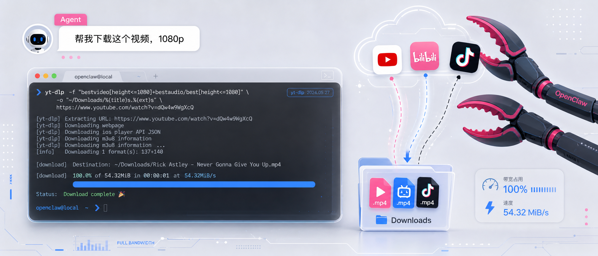
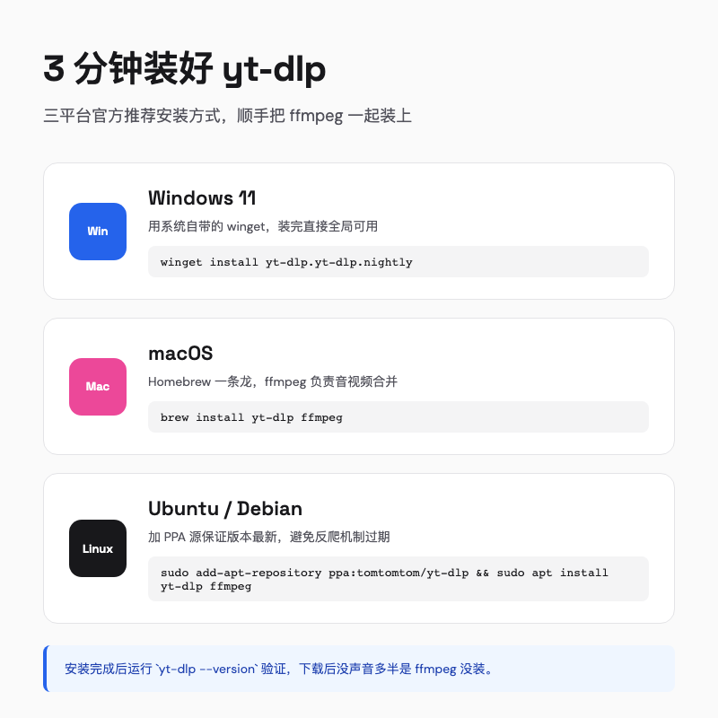
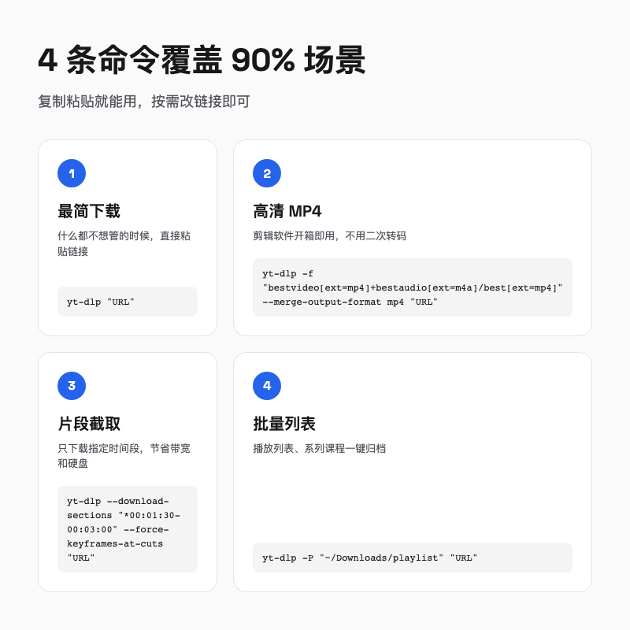
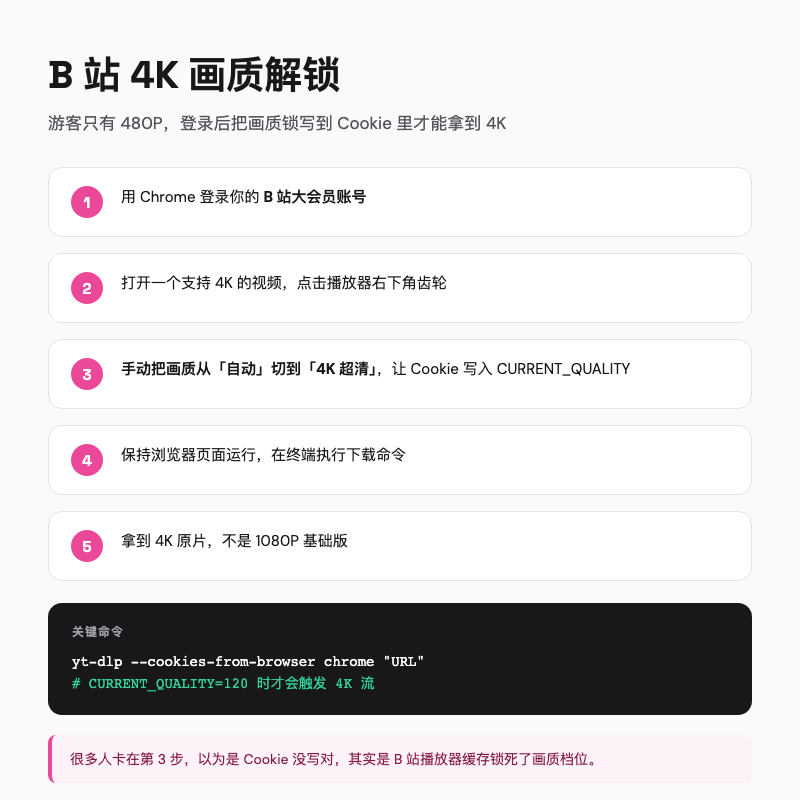
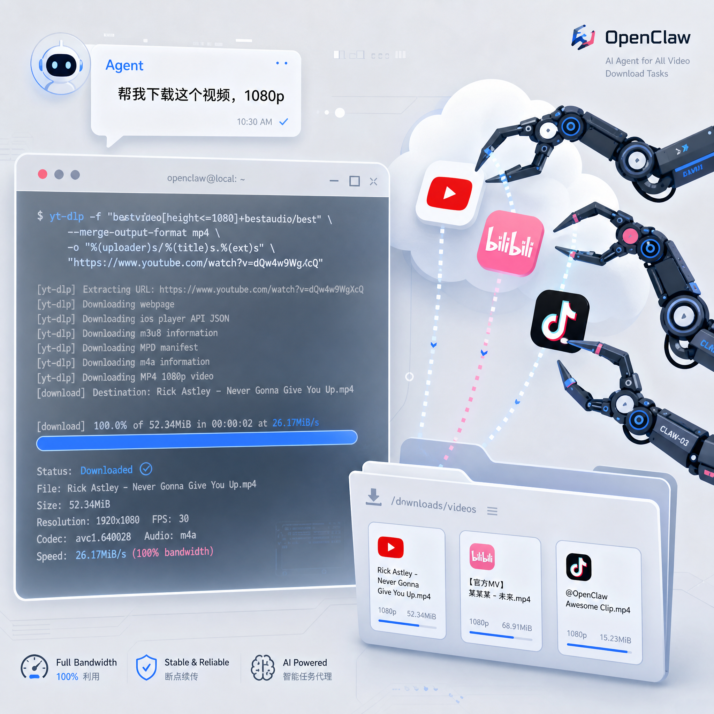
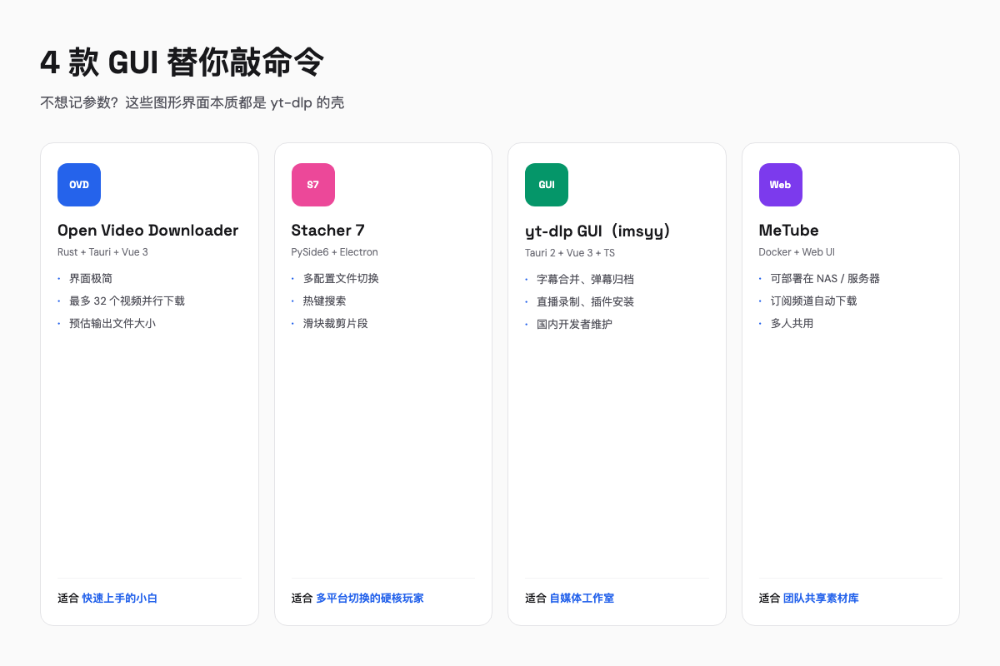

---

## 一句话总结

yt-dlp 是个免费开源的命令行下载器，能绕过限速、下载高清原片。再配一个 Agent，你连命令都不用记，说一声「帮我下这个视频」就行。

---

## 01 被下载器 PUA 过的人，都懂这个画面

我先描述一个场景，你看看熟不熟悉。

你打开一个网页下载工具，粘贴链接，点击开始。弹窗来了，问你要不要「安全助手」。你小心翼翼取消勾选，进度条走到 30%，速度突然掉到几十 kB。页面上浮现一行红字，「当前线路拥挤，VIP 通道空闲」。

你咬咬牙点了关闭，换另一个工具。结果它偷偷在后台安装浏览器，桌面多出三个你根本没见过的图标。

这不是某个软件的毛病，几乎所有网页下载器都这么干。先免费把你骗进来，再限速逼你掏钱，最后装上一堆垃圾让你删都删不干净，只能忍着。

直到有一天，我在一个技术论坛看到有人发了一张命令行截图。

> yt-dlp "https://www.bilibili.com/video/BVxxxxxx"

屏幕里没有任何弹窗，没有任何广告，进度条以 MB/s 为单位往前走。那人配文说，「宽带终于跑满了」。

我当时的反应是，这不就是一个命令行版的下载器吗？能好用到哪去？

我半信半疑地复制了那条命令，粘贴了一个 YouTube 链接。结果它自己挑了最高画质，音频视频合并成一个 MP4，安静地躺在了下载文件夹里。没有会员弹窗，没有捆绑软件，甚至没有延迟。

三周后，我电脑上所有的网页下载器都进了回收站。

---

## 02 yt-dlp 到底是什么

yt-dlp 是 youtube-dl 的一个活跃分支。

youtube-dl 是开源世界里最有名的命令行视频下载工具，支持上千个网站。后来老项目维护乏力，更新跟不上平台变化。2021 年，社区 fork 出了 yt-dlp，把这个坑位重新接了过来。

你可以把它理解成一个「视频链接解析器 + 下载器」的组合。你把任意一个视频链接丢给它，它会自动分析页面，找出真正的视频流地址，然后帮你下载下来。

它支持的网站非常多。YouTube、B 站这些主流平台不用说，有些冷门的学习网站和新闻站点也能处理。官方文档里列了上千个，我反正没看完。

我留下它，主要是图三样东西。第一，没有商业软件的套路，不弹广告、不逼注册、不捆绑安装。第二，能跑满带宽，我在 300M 宽带上能稳定在 30MB/s，不像某些工具故意限速逼你买会员。第三，下载的是原片，说 4K 就是 4K，不会偷偷压缩成 720P。

> 有人可能会问，命令行是不是很难？我的体验是，日常下载只需要复制粘贴一条命令。难的是第一次安装，而第一次安装只需要三分钟。

---

## 03 三分钟装好它

yt-dlp 的安装方式有很多种。作为普通用户，我建议直接用最省事的那一种。

### Windows

如果你用 Windows 11，直接打开终端或者 PowerShell。

```bash
winget install --id yt-dlp.yt-dlp.nightly -e
```

winget 是 Windows 自带的包管理器，装完之后 yt-dlp 会自动加到环境变量里，你在任何地方都能直接调用。

### macOS

macOS 用户用 Homebrew。

```bash
brew install yt-dlp ffmpeg
```

这里的 FFmpeg 是一个音视频处理工具。yt-dlp 下载完视频和音频后，需要 FFmpeg 把它们合并成一个完整的文件。强烈建议一起装上。

### Linux

Ubuntu 和 Debian 用户可以添加一个专门的 PPA 源，保证版本是最新的。

```bash
sudo add-apt-repository ppa:tomtomtom/yt-dlp
sudo apt update && sudo apt install yt-dlp ffmpeg
```

Arch Linux 更简单。

```bash
sudo pacman -Syu yt-dlp ffmpeg
```

装完之后，在终端输入 `yt-dlp --version`，看到版本号就说明成功了。



> 安装环节最常被卡住的一步，是 FFmpeg 没装或者路径不对。如果你下载完发现只有视频没有声音，或者文件打不开，大概率是这个原因。

---

## 04 几条我最常用的命令

yt-dlp 的参数非常多，但日常使用中，我反复用的其实就这几条。

**最省事的一条，粘贴链接就跑。**

```bash
yt-dlp "https://www.youtube.com/watch?v=xxxxx"
```

它会下载最高质量的音视频合并文件，保存到当前目录。想先试试水，用它就够了。

**Premiere 不认 MKV？强制输出 MP4。**

```bash
yt-dlp -f "bestvideo[ext=mp4]+bestaudio[ext=m4a]/best[ext=mp4]" --merge-output-format mp4 "URL"
```

Premiere 和剪映对 MKV、WebM 支持一般，用这个可以避免二次转码。

**只想要中间那段，别下整集。**

```bash
yt-dlp --download-sections "*00:01:30-00:03:00" --force-keyframes-at-cuts "URL"
```

比如只保留 1 分 30 秒到 3 分钟之间的部分，它只向服务器请求这一段数据。`--force-keyframes-at-cuts` 会强制在剪切点重新编码关键帧，否则开头容易黑屏或者音画不同步。

**一口气下完整个播放列表。**

```bash
yt-dlp -P "~/Downloads/playlist" "https://www.youtube.com/playlist?list=xxxxx"
```

`-P` 指定保存目录，播放列表里有多少视频，它就一个个帮你下完。



> 我的建议是，把这几条命令复制到笔记软件里。需要用到的时候，改一下链接就能跑。命令行工具的好处是越用越熟，但第一次不需要全部学会。

再说两个我自己的小习惯。一是用 `-o` 参数统一命名格式，比如 `%\(upload_date\)s_%\(title\)s.%\(ext\)s`，下载下来的文件自动带上上传日期和标题，归档时不用猜这是哪个视频。二是做二次创作时顺手加上 `--write-subs --sub-langs zh-CN,en`，把字幕一起下来，后期省很多事。

如果你经常反复用同一套参数，还可以写进配置文件 `~/.config/yt-dlp/config`，以后每次运行都会自动带上。我的配置里常驻这三行：

```bash
--output "~/Downloads/%\(upload_date\)s_%\(title\)s.%\(ext\)s"
--merge-output-format mp4
--write-subs
```

这样我日常使用就只需要粘贴链接，别的都不用管。

---

## 05 B 站 4K 解锁实战

国内创作者最常用的平台之一是 B 站。但 B 站有一个很恶心的限制，游客状态下，服务器只给你 360P 或者 480P 的流。想看 1080P 甚至 4K，必须证明你是登录状态，而且是大会员。

yt-dlp 可以帮你把浏览器的登录状态借过来。

### 最简单的方案

```bash
yt-dlp --cookies-from-browser chrome "https://www.bilibili.com/video/BV1SJcfzqER6"
```

`--cookies-from-browser chrome` 的意思是让 yt-dlp 读取你当前打开的 Chrome 浏览器里的 Cookie。只要你在 B 站是登录状态，它就能拿到你的大会员凭证。

如果你不确定 yt-dlp 到底能拿到哪些画质，可以先运行 `--list-formats` 查看当前链接支持的所有格式。看到 `1080P 高码率` 或者 `4K 超清` 在列表里，说明凭证有效。

如果你用 Edge，就把 chrome 换成 edge。Firefox、Safari 也支持。

### 如果担心隐私

你也可以先把 Cookie 导出成一个文件。

```bash
yt-dlp --cookies bilibili_cookies.txt "https://www.bilibili.com/video/BV1SJcfzqER6"
```

这个文件是标准的 Netscape Cookie 格式，很多浏览器扩展都能导出。

### 一个很容易踩的坑

很多人按照这个步骤做了，发现下载的依然是 1080P 基础版，而不是网页上看到的 4K。

根据我的实测经验，这通常和 B 站播放器的本地状态有关。浏览器里播放视频时，播放器会根据你的画质设置往 Cookie 里写一个代表期望清晰度的值。如果你之前设置的是「自动」或者「1080P」，服务器可能只给你下发对应档位的流。

我的解决办法是，打开 B 站，登录你的大会员账号，随便找一个支持 4K 的视频。把鼠标悬停在播放器右下角的齿轮图标上，手动把画质从「自动」切换到「4K 超清」。

这一步会让浏览器把画质期望更新到最高档位。保持这个页面开着，再重新执行上面的下载命令，往往就能得到 4K 原片。



> 我第一次操作时卡在这里整整半小时，一直以为是自己 Cookie 没写对。后来发现，问题可能根本不是 Cookie，而是 B 站播放器的状态。这个细节，任何官方文档都不会告诉你。

---

## 06 让 Agent 替我跑 yt-dlp

B 站的画质问题解决之后，我又遇到了新的烦恼。每次要下十几个视频，复制链接、打开终端、改命令、等下载、检查文件，三步能搞定的活儿，硬是被拆解成十几个小动作。

这种时候，我会让 Agent 替我做。

OpenClaw 是一个开源的个人 AI 助手平台，可以部署在自己的设备上。它支持 Telegram、Slack、Discord、iMessage 等渠道。核心能力是通过「skills」扩展功能，每个 skill 就是一个封装好的工具。

yt-dlp 被社区封装成了 OpenClaw 的 skill。安装方式如下。

```bash
openclaw skill install yt-dlp-downloader-skill
```

或者通过 ClawHub 用 npx。

```bash
npx clawhub install yt-dlp-downloader-skill
```

装好之后，你不需要再手动写命令，直接跟 Agent 对话就行。

比如你给 Agent 发一条消息。

> 帮我下载这个 YouTube 视频，1080p，MP4 格式。

Agent 会自动解析链接，调用 yt-dlp，选择对应画质，然后把文件保存到指定目录。你不需要记参数，不需要担心格式，甚至连终端都可以不用打开。

再比如你要收集一个系列课程。

> 把这个播放列表里的前 10 个视频都下载下来，放到我的素材库文件夹。

Agent 会自己处理播放列表解析、批量下载、目录归档。你要做的只是等它完成后看一眼结果。



> 这里的关键不是 OpenClaw 有多神奇，而是它把 yt-dlp 的能力自然语言化了。你不需要懂命令行，只需要说清楚你要什么。

### 更复杂的自动化场景

如果你有自己的服务器或者 NAS，还可以把这套流程做得更重一些。

比如配置一个定时任务，让 Agent 每天凌晨检查某个 YouTube 频道的更新，自动下载新视频，重命名为统一格式，再推送一条消息告诉你完成了。我自己没用到这么重，但听一个做播客剪辑的朋友说，他已经用这个办法把素材收集时间从每天半小时压缩到了五分钟。

或者做一个 RSS + Agent 的联动工作流，你订阅的播客一有更新，Agent 就用 yt-dlp 下载音频，转录成文字稿，再发送到你的笔记软件里。

说白了，**yt-dlp 只管搬，Agent 决定什么时候搬、搬哪些、搬到哪里去。**

---

## 07 不想敲命令？我试过这几个 GUI

我知道很多人看到命令行就头疼。没关系，开源社区已经给 yt-dlp 做了不少图形界面，本质都是「你在前面点按钮，它在后面帮你调用 yt-dlp」。

**Open Video Downloader** 是我最早试的。Rust + Tauri 写的，界面干净，批量下载很方便。适合刚入门、只想快速上手的人。

**Stacher** 更偏向专业玩家。它可以保存多套配置文件，不同平台、不同清晰度之间一键切换。我经常要在 YouTube 和 B 站之间切换，这个功能省了不少事。

如果你是国内自媒体创作者，我更推荐 **imsyy 的 yt-dlp GUI**。国内开发者维护，Tauri 2 框架很轻量，字幕合并、弹幕归档、直播录制这些功能都内置了。

**MeTube** 适合有服务器或者 NAS 的人。它是个 Web 界面，可以部署在私有云上，多人共用，还能设置订阅频道自动下载。



> 我的建议是，如果你只是偶尔下几个视频，用 Open Video Downloader 或者 imsyy 的 GUI 就够了。如果你每天都要处理大量素材，再考虑命令行或者 Agent 自动化。

---

## 08 它不是什么万能药

写到这里，我觉得有必要泼一点冷水。

yt-dlp 虽然很强大，但它不是专门为国内用户优化的商业软件。有些国内平台的反爬机制更新很快，可能你今天能用，下周就需要更新版本。它的 nightly 版本更新频率很高，遇到问题先尝试 `yt-dlp -U` 更新一下。

另外，它下载的是平台的原始音视频流。这意味着，如果平台本身对清晰度做了限制，比如非会员只能看 480P，那 yt-dlp 也只能拿到 480P。它不能凭空变出你没有权限的内容。

还有一个现实问题，命令行工具的学习曲线是真实存在的。虽然日常只需要几条命令，但第一次遇到报错时，你需要会看终端输出的提示，或者去 GitHub Issues 里搜索类似问题。我的经验是，yt-dlp 的报错信息通常写得很清楚，它甚至会直接告诉你「请更新到最新版本」或者「需要安装 FFmpeg」。

Agent 能解决一部分这个问题，因为它替你封装了命令。但 Agent 也不是万能的，它有时候会误解你的意图，或者在复杂参数上犯错。关键任务仍然建议你自己检查一遍。

> 它适合愿意花半小时学习的人，不适合希望一切都有人帮你点好的用户。如果你属于后者，前面提到的 GUI 版本会更友好。

---

## 总结

回到开头那个场景。

那天晚上，小李终于不用再和弹窗、限速、捆绑软件作斗争。他打开终端，粘贴链接，按下回车。进度条以 MB/s 往前走，屏幕安安静静，没有任何打扰。

后来他发现，自己连这一步都可以省掉。他每天睡前把要下载的链接丢给 Agent，第二天早上素材已经在文件夹里排好队。

这种体验，不是因为他买了更贵的会员。他只是换了一个更对的工具，又顺手把它放进了自动化的工作流里。

yt-dlp 给我的感受很朴素。视频平台越做越复杂，但总有人写一些免费工具，让你想下什么就下什么，不用看广告脸色。Agent 让这件事变得更自然，你不需要记住命令，只需要说清楚你要什么。

如果你也被网页下载器折磨过，我建议你做一件最小的事，今天就把它装起来，复制一条命令，下载一个你想要的视频。

可能三分钟之后，你就回不去了。

欢迎关注我的公众号「Chyris Tech Note」，获取更多 AI 技术解读与实践分享。
